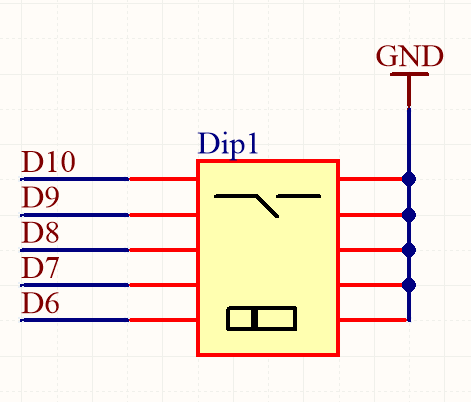
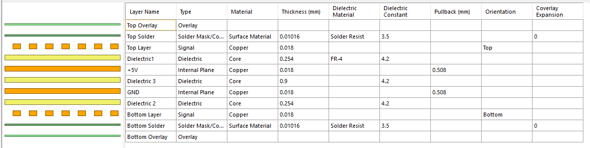
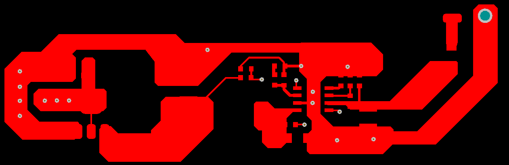

 
  

 

  

 

---

# Модуль аналоговых входов LAI1118

Пояснительная записка на печатную плату

---

## Оглавление

- [1. Общие сведения о плате](#1-общие-сведения-о-плате)

 - [1.1. Технические характеристики](#11-технические-характеристики)

- [2. Общая аппаратная архитектура](#2-общая-аппаратная-архитектура)

  - [2.1. Карта функциональных блоков](#21-карта-функциональных-блоков)
  - [2.2. Связи между силовыми и сигнальными доменами](#22-связи-между-силовыми-и-сигнальными-доменами)
  - [2.3. Общая карта внешних интерфейсов](#23-общая-карта-внешних-интерфейсов)
  - [2.4. Разъёмы и физическое выведение интерфейсов](#24-разъёмы-и-физическое-выведение-интерфейсов)

- [3. Питание, локальные напряжения и резервирование времени](#3-питание-локальные-напряжения-и-резервирование-времени)

  - [3.1. Структура узла питания](#31-структура-узла-питания)
  - [3.2. Входной участок и защита](#32-входной-участок-и-защита)
  - [3.3. Импульсный понижающий преобразователь `U2` `TPS54331`](#33-импульсный-понижающий-преобразователь-u2-tps54331)
  - [3.4. Промежуточная шина `.LDO_In`](#34-промежуточная-шина-ldo_in)
  - [3.5. Линейный стабилизатор `U3` `LM1117MPX-5.0` и шина `+5V`](#35-линейный-стабилизатор-u3-lm1117mpx-50-и-шина-5v)
  - [3.6. Инженерный смысл выбранной архитектуры](#36-инженерный-смысл-выбранной-архитектуры)
  - [3.7. Встроенные функции и защитные механизмы](#37-встроенные-функции-и-защитные-механизмы)

- [4. Процессорное ядро и базовая аппаратная обвязка](#4-процессорное-ядро-и-базовая-аппаратная-обвязка)

  - [4.1. Центральный микроконтроллер](#41-центральный-микроконтроллер)
  - [4.2. Тактирование, сброс и сервисные цепи](#42-тактирование-сброс-и-сервисные-цепи)
  - [4.3. Локальная логика обслуживания процессорного узла](#43-локальная-логика-обслуживания-процессорного-узла)

- [5. Интерфейс `X2X`](#5-интерфейс-x2x)

  - [5.1. Назначение и общая структура узла](#51-назначение-и-общая-структура-узла)
  - [5.2. Линейный трансивер и логика управления](#52-линейный-трансивер-и-логика-управления)
  - [5.3. Защитный контур линии `A+` / `A-`](#53-защитный-контур-линии-a--a-)
  - [5.4. Аппаратная адресация модуля](#54-аппаратная-адресация-модуля)
  - [5.5. Инженерный смысл реализации](#55-инженерный-смысл-реализации)

- [6. Аналоговые входы и входной тракт](#6-аналоговые-входы-и-входной-тракт)

  - [6.1. Назначение и место входного узла в архитектуре платы](#61-назначение-и-место-входного-узла-в-архитектуре-платы)
  - [6.2. Аппаратная реализация одного входного канала](#62-аппаратная-реализация-одного-входного-канала)
  - [6.3. Преобразование измерений и цифровой интерфейс узла](#63-преобразование-измерений-и-цифровой-интерфейс-узла)
  - [6.4. Инженерный смысл реализации и диагностически значимые особенности](#64-инженерный-смысл-реализации-и-диагностически-значимые-особенности)

- [7. Защита линий и устойчивость к аварийным воздействиям](#7-защита-линий-и-устойчивость-к-аварийным-воздействиям)

  - [7.1. Защита по питанию](#71-защита-по-питанию)
  - [7.2. Защита каналов аналогового ввода](#72-защита-каналов-аналогового-ввода)
  - [7.3. Защита интерфейса `X2X`](#73-защита-интерфейса-x2x)
  - [7.4. Инженерный смысл защитной архитектуры](#74-инженерный-смысл-защитной-архитектуры)

- [8. Стек слоёв и топологическая логика платы](#8-стек-слоёв-и-топологическая-логика-платы)

  - [8.1. Последовательность слоёв](#81-последовательность-слоёв)
  - [8.2. Функциональная логика стека](#82-функциональная-логика-стека)
  - [8.3. Значение стека для узла питания](#83-значение-стека-для-узла-питания)
  - [8.4. Значение стека для интерфейса `X2X`](#84-значение-стека-для-интерфейса-x2x)
  - [8.5. Инженерный смысл выбранного стека](#85-инженерный-смысл-выбранного-стека)

---

## 1. Общие сведения о плате

Плата `LAI1118` предназначена для модуля аналоговых входов линейки `Lorentz`, выполненного в пластиковом корпусе для установки на `DIN`-рейку. Модуль предназначен для приёма и измерения внешних аналоговых сигналов напряжения диапазона `0 ... 10 В` и токовых сигналов диапазона `0 ... 20 мА` и выполняет роль адресного периферийного узла аналогового ввода в составе распределённой архитектуры `Lorentz`.  

Основная функция платы состоит в обслуживании `8` аналоговых входов. Обмен данными и питание модуля организованы через последовательную шину `RS485`, по которой модуль подключается к процессорному модулю `IGAS LCP`. В сетевой структуре устройство работает как подчинённый адресный узел, поэтому для штатной эксплуатации должно иметь уникальный адрес в общей линии связи. 

Функционально модуль предоставляет `8` входных каналов с программным выбором режима измерения напряжения или тока. Входной тракт построен как многоканальный узел аналогового ввода с общим нулём, согласованием уровня, фильтрацией и локальной защитой каждой входной линии. Внутри платы внешние сигналы преобразуются во внутренний цифровой домен с разрешением `16 бит`, после чего передаются в процессорный узел для последующей обработки. 

По совокупности функций `LAI1118` не является вычислительным или коммуникационным центром системы, а представляет собой специализированный модуль аналогового ввода, ориентированный на вынос полевого аналогового интерфейса из центрального контроллера в отдельный адресный блок. Такое разделение упрощает масштабирование системы, позволяет распределять измерительные каналы вдоль объекта и сохранять единый принцип связи с центральным модулем по `RS485`. 

Конструктивно и архитектурно плата предназначена для работы в составе модульной сети `Lorentz`, где процессорный модуль выполняет функции ведущего устройства, а `LAI1118` — функции удалённого входного расширения. Допустимая протяжённость линии связи до мастер-сети составляет до `1000 м`, что позволяет использовать модуль не только в компактных шкафах автоматики, но и в распределённых системах с выносом датчиков и аналоговых сигналов на значительное расстояние от центрального контроллера. 

---

### 1.1. Технические характеристики

Основные технические характеристики платы приведены в таблицах ниже. Значения приведены по руководству по эксплуатации `LAI1118`. 

| Параметр                      | Значение                                |
| ----------------------------- | --------------------------------------- |
| Назначение платы         | Плата аналоговых входов                |
| Количество аналоговых входов  | `8`                                     |
| Тип входов                    | Аналоговые `0 ... 10 В` / `0 ... 20 мА` |
| Поддержка индикации состояния | Да                                      |
| Поддержка диагностики         | Да                                      |

---

| Параметр                  | Значение                                           |
| ------------------------- | -------------------------------------------------- |
| Входные параметры         | `8` аналоговых входов `0 ... 10 В` / `0 ... 20 мА` |
| Индикация состояния       | Статус входа, состояние питания					 |
| Индикация входов          | Да, светодиодный индикатор                         |
| Потребление на шине `X2X` | `0.5 Вт`                                           |

---

| Параметр                         | Значение                                                |
| -------------------------------- | ------------------------------------------------------- |
| Тип входа                        | Вход с общим нулём                                      |
| Конфигурация входов              | Программный выбор режима: измерение тока или напряжения |
| Максимальное напряжение на входе | `30 В` пост. тока                                       |
| Формат выхода                    | `Int/float`                                                   |
| Максимальный ток на входе        | `40 мА`                                                 |
| Фильтр, частота среза            | `1 кГц`                                                 |
| Изоляция между входами           | `500 В`                                                 |

---

| Параметр                                      | Значение                          |
| --------------------------------------------- | --------------------------------- |
| Скорость измерения                            | `200 изм/с на 1 канал`          |
| Максимальная длина линии связи                | До `1000 м`                       |
| Интерфейс связи с процессорным модулем        | `RS485`                           |
| Режим работы интерфейса                       | `slave`                           |
| Адресация модуля                              | Требуется уникальный адрес в сети |
| Максимальное количество модулей на одной шине | `128`                             |

---

| Параметр                          | Значение             |
| --------------------------------- | -------------------- |
| Монтаж в горизонтальном положении | Да                   |
| Монтаж в вертикальном положении   | Да                   |
| Температура эксплуатации          | От `0` до `+50 °C` |
| Температура хранения              | От `-40` до `+85 °C` |

---

| Параметр | Значение |
| -------- | -------- |
| Высота   | `118 мм` |
| Ширина   | `45 мм`  |
| Глубина  | `126 мм` |

---

## 2. Общая аппаратная архитектура

---

### 2.1. Карта функциональных блоков

Модуль построен вокруг локального процессорного узла, выполняющего функции адресного контроллера аналоговых входов, обмена по внутренней шине и обслуживания сервисных цепей. Вычислительная часть реализована на микроконтроллере `ATmega328P` с внешним тактированием `16.0 MHz`. Этот узел не является коммуникационным центром всей системы, а обслуживает прикладную логику конкретного периферийного модуля: считывает аппаратную конфигурацию, принимает результаты измерения входных каналов, поддерживает локальную индикацию и взаимодействует с внешней шиной `X2X`. Модуль `LAI1118` предназначен для работы с `8` аналоговыми входами, поддерживает измерение сигналов `0 ... 10 В` и `0 ... 20 мА`, работает по `RS485` как адресный узел и имеет разрешение `16 bit`. 

| Функциональный блок          | Состав                                                                                                                             | Назначение                                                                                                                                                                  |
| ---------------------------- | ---------------------------------------------------------------------------------------------------------------------------------- | --------------------------------------------------------------------------------------------------------------------------------------------------------------------------- |
| Локальный процессорный узел  | микроконтроллер `ATmega328P-AU`, внешнее тактирование `16.0 MHz`, цепи `RESET`, линии `MOSI`, `MISO`, `SCK`, переключатель адреса  | Выполнение прикладной логики модуля, чтение адреса, опрос аналогового входного узла, формирование служебных сигналов и обслуживание сервисных цепей                         |
| Подсистема питания           | вход `+24V`, предохранитель `F3`, диод Шоттки `D2`, `U2`, `U3`, шины `.LDO_In`, `+5V`                                              | Приём внешнего питания, входная защита, понижение и локальная стабилизация питания внутренних узлов                                                                         |
| Коммуникационная подсистема  | интерфейс `X2X`, трансивер `U1`, сигналы `485_RX`, `485_TX`, `485_TX_EN`, линии `A+`, `A-`                                         | Связь модуля с внешней последовательной шиной и обмен с ведущим устройством системы                                                                                         |
| Подсистема аналоговых входов | каналы `AI1`...`AI8`, входные пары `AI+` / `AI-`, узлы выбора режима ток / напряжение, `ADC`, служебные сигналы внутреннего обмена | Приём внешних аналоговых сигналов `0 ... 10 В` и `0 ... 20 мА`, выбор режима измерения, защита входов, фильтрация и передача результатов преобразования в процессорный узел |
| Диагностическая подсистема   | локальная индикация питания, шины `X2X` и состояний входов                                                                         | Локальный контроль состояния модуля, коммуникационного канала и входных линий без доступа к внутренним цепям                                                                |

---

---

Архитектура модуля разделяет обработку логики, измерительный входной тракт, питание и шинный обмен на отдельные аппаратные блоки. Процессорный узел принимает данные от входной подсистемы, обслуживает адресный переключатель, управляет служебными сигналами считывания и формирует внутреннюю логику работы модуля. Входная часть тем самым отделена от вычислительного домена: внешние аналоговые сигналы сначала проходят через собственные входные ячейки, узлы выбора режима измерения и аналого-цифрового преобразования, а уже затем поступают в микроконтроллер.

Подсистема питания также построена как отдельный домен. Внешнее питание поступает на вход `+24V`, проходит через входные защитные элементы и далее подаётся на понижающий каскад `U2` с последующей линейной стабилизацией на `U3`. В результате внутри платы формируется локальная шина `+5V`, от которой питаются процессорный узел, логика индикации, интерфейсные цепи и цифровая часть входного измерительного тракта.

Коммуникационная часть сведена к одной выделенной линии `X2X`. На физическом уровне эта линия выполнена через отдельный трансивер и защитный контур, поэтому модуль аппаратно представляет собой адресный периферийный узел с единственным внешним каналом обмена и локальной функцией многоканального аналогового ввода. Адресная конфигурация задаётся аппаратно через переключатель адреса, что позволяет включать несколько одинаковых модулей в одну систему без изменения базовой схемотехники.

По совокупности функций плата `LAI` является не универсальным контроллером, а специализированным модулем аналоговых входов. Она объединяет локальный вычислительный узел, входной силовой тракт питания, интерфейс шины `X2X`, `8`-канальный входной фронтенд и набор средств локальной диагностики. Такая архитектура делает модуль законченным адресным блоком аналогового ввода, рассчитанным на работу в составе общей системы `Lorentz`. Основные характеристики модуля как узла аналогового ввода подтверждаются руководством по эксплуатации. 

---

### 2.2. Связи между силовыми и сигнальными доменами

Силовой тракт начинается от внешнего входа `+24V`, который используется как источник питания самого модуля. Внутри платы этот домен проходит через предохранитель `F3` и диод Шоттки `D2`, после чего поступает на понижающий преобразователь `U2`, затем на промежуточную шину `.LDO_In` и далее через `U3` формирует локальную шину `+5V`. Таким образом, входное питание не раздаётся по плате напрямую: внутри модуля выделяется внешний домен `24 В` и отдельный низковольтный домен `+5V`.

Шина `+5V` обслуживает цифровую и интерфейсную часть модуля, а также внутренний измерительный тракт. От неё питаются микроконтроллер, узлы аналого-цифрового преобразования, логика выбора режима измерения, адресный узел, локальная индикация и линейный интерфейс `X2X`. Такое разделение означает, что вычислительная часть и входной измерительный тракт работают в собственном низковольтном домене, независимо от внешних уровней на аналоговых входах.

Сигнальная архитектура в данной плате построена по доменному принципу как связка одного внешнего шинного канала и одного многоканального входного домена. Линия `X2X` приходит на плату как дифференциальная пара `A+` и `A-`, проходит через предохранители `F1`, `F2` и защитный узел `TVS1`, `TVS3`, `TVS4`, после чего подаётся на линейный интерфейс `U1`. Только после этого сигналы преобразуются в локальные логические линии `485_RX`, `485_TX` и `485_TX_EN`, связанные с микроконтроллером. Следовательно, внешний коммуникационный домен не соединён с микроконтроллером напрямую: между кабельной линией и вычислительной логикой находится собственный линейный и защитный узел.

Входной домен отделён от процессорного узла собственной схемой согласования, защиты и преобразования. Внешние линии `AI1`...`AI8` сначала проходят через индивидуальные входные ячейки, где выполняются защита, фильтрация и выбор режима измерения ток / напряжение. После этого сигналы поступают в `ADC`, а затем передаются в микроконтроллер через внутренние служебные линии. Таким образом, внешний аналоговый домен и логика `+5V` связаны не напрямую, а через промежуточный входной фронтенд и узел аналого-цифрового преобразования.

Защитные элементы расположены именно на границах этих доменов. На силовом вводе такую границу образуют `F3` и `D2`. На коммуникационной линии `X2X` роль границы выполняют `F1`, `F2` и `TVS1`...`TVS4`. На линиях аналогового ввода эту функцию выполняют индивидуальные входные защитные элементы, последовательные резисторы, узлы выбора режима и локальные `RC`-цепи. За счёт этого аварийные режимы внешнего питания, кабельной линии и полевых входов не входят в вычислительный домен без промежуточного защитного или согласующего барьера. Для `LAI1118` это принципиально, так как модуль должен корректно работать с режимами измерения напряжения и тока и выдерживать входные уровни до `30 В` и ток до `40 мА`. 

---

### 2.3. Общая карта внешних интерфейсов

Внешние интерфейсы модуля сгруппированы по назначению и режиму работы. Внешняя архитектура `LAI` сведена к одной комбинированной шине связи и питания, группе аналоговых входов и локальному сервисному интерфейсу процессорного узла.

| Группа интерфейсов     | Каналы                                     | Основные характеристики                                                                                                             | Физическое подключение                                              |
| ---------------------- | ------------------------------------------ | ----------------------------------------------------------------------------------------------------------------------------------- | ------------------------------------------------------------------- |
| `X2X` и питание модуля | один комбинированный канал связи и питания | последовательный обмен с процессорным модулем по линии `RS-485`, адресная работа модуля, длина линии до `1000 м` от мастер-сети     | общий внешний разъём шины `X2X` с линиями `A+`, `A-`, `GND`, `+24V` |
| Аналоговые входы       | `8` каналов                                | приём внешних сигналов `0 ... 10 В` и `0 ... 20 мА`, программный выбор режима измерения, фильтрация и преобразование в цифровой вид | входные клеммы аналоговых каналов `AI1`...`AI8`                     |
| Сервисный интерфейс    | один локальный сервисный порт              | внутрисхемное программирование и сервисный доступ к микроконтроллеру                                                                | сервисные линии `MOSI`, `MISO`, `SCK`, `RESET`, `+5V`, `GND`        |

Коммуникационный домен в этой плате аппаратно минимален. Внешний интерфейс `X2X` объединяет питание модуля, общий провод и дифференциальную пару шины. Далее эта линия поступает на отдельный линейный узел `U1`, после чего связывается с локальной логикой микроконтроллера через сигналы `485_RX`, `485_TX` и `485_TX_EN`. Это означает, что внешняя карта интерфейсов строится не вокруг множества независимых портов, а вокруг одного выделенного системного канала, через который модуль получает питание и обменивается данными с ведущим устройством.

Основную прикладную функциональность модуля образует входной домен. На плате реализованы `8` аналоговых входов, каждый из которых принимает внешний сигнал напряжения или тока, проходит через защитно-согласующую ячейку и затем участвует в аналого-цифровом преобразовании. Следовательно, карта внешних интерфейсов у `LAI` ориентирована не на разнообразие каналов обмена или силовой коммутации, а на сочетание одного шинного интерфейса управления и группы измерительных каналов полевого уровня.

Отдельной категорией остаётся сервисный интерфейс микроконтроллера. Он не относится к штатным полевым подключениям модуля, но образует внешний доступ к процессорному узлу для прошивки и низкоуровневого обслуживания. Таким образом, полная карта внешних интерфейсов `LAI` включает три уровня: комбинированный шинно-силовой ввод `X2X`, группу аналоговых входов и локальный сервисный интерфейс процессорного узла.

---

### 2.4. Разъёмы и физическое выведение интерфейсов

Физическое выведение интерфейсов в модуле `LAI` выполнено через отдельные монтажные точки, каждая из которых соответствует своей функциональной группе. Внешняя архитектура платы сведена к трём основным категориям: комбинированный разъём питания и шины `X2X`, группа клемм аналоговых входов и локальный сервисный интерфейс программирования. Дополнительно на плату выведен отдельный переключатель аппаратной конфигурации.

| Разъём / элемент                   | Исполнение                | Выводимые сигналы                                    | Назначение                                                                  |
| ---------------------------------- | ------------------------- | ---------------------------------------------------- | --------------------------------------------------------------------------- |
| Входная группа аналоговых сигналов | входные клеммы            | каналы `AI1`...`AI8`, входы режима напряжения / тока | Физическое подключение внешних аналоговых сигналов к входному тракту модуля |
| Разъём шины `X2X`                  | входной клеммный разъём   | `A+`, `A-`, `GND`, `+24V`                            | Подключение шины `X2X` и внешнего питания модуля                            |
| Сервисный интерфейс                | сервисный штыревой разъём | `MOSI`, `MISO`, `SCK`, `RESET`, `+5V`, `GND`         | Внутрисхемное программирование и сервисный доступ к процессорному узлу      |
| Переключатель адреса               | `DIP`-переключатель       | линии аппаратной конфигурации                        | Аппаратное задание адреса или конфигурации модуля в общей шине              |

Группа входных клемм образует основной внешний функциональный интерфейс платы. Через неё на модуль поступают независимые аналоговые сигналы полевого уровня. Эти линии относятся к внешнему измерительному домену и далее обрабатываются индивидуальными ячейками защиты, выбора режима и преобразования. Такое построение делает модуль законченным входным блоком, в котором логическая часть и шина обмена остаются внутри низковольтного домена, а наружу выведены только полевые аналоговые входы и системный канал связи.

Разъём шины `X2X` реализует внешний интерфейс модуля как объединённую точку подключения связи и питания. На него одновременно выведены дифференциальная пара `A+ / A-`, общий провод `GND` и входная шина `+24V`. Таким образом, этот разъём является не только коммуникационной, но и силовой точкой входа модуля. Внутри платы именно от него начинается как линейный тракт `X2X`, так и входной силовой тракт, далее формирующий внутренний домен `+5V`.

Сервисный интерфейс оформляет отдельную точку доступа к процессорному узлу. На него выведены линии `MOSI`, `MISO`, `SCK` и `RESET`, а также питание `+5V` и земля. Этот интерфейс не участвует в штатной работе модуля с внешними входными сигналами и не относится к полевым соединениям. Его роль состоит в прошивке, перепрограммировании и низкоуровневом обслуживании микроконтроллера без демонтажа платы.

Отдельным физически выведенным элементом является переключатель аппаратной конфигурации. В аппаратной архитектуре он не является разъёмом в обычном смысле, но выполняет ту же функцию внешнего пользовательского взаимодействия: через него задаётся аппаратная конфигурация модуля. Для адресного узла `RS485/X2X` это принципиально, поскольку модуль должен иметь уникальное положение в общей сети без изменения базовой схемотехники и без обращения к сервисному интерфейсу.

Физическое выведение интерфейсов в этой плате полностью подчинено роли модуля как адресного узла аналогового ввода: один разъём объединяет питание и шинную связь, отдельная группа клемм принимает полевые аналоговые сигналы, а сервисный интерфейс и адресный переключатель обеспечивают локальное обслуживание и конфигурирование. Руководство по эксплуатации прямо указывает на `8` аналоговых входов, работу по `RS485`, уникальную адресацию и длину линии до `1000 м`. 

---

---
нном низковольтном домене, независимо от внешних уровней на аналоговых входах.

Сигнальная архитектура в данной плате построена по доменному принципу как связка одного внешнего шинного канала и одного многоканального аналогового входного домена. Линия X2X приходит на плату как дифференциальная пара A+ и A-, проходит через предохранители F1, F2 и защитный узел TVS1, TVS3, TVS4, после чего подаётся на линейный интерфейс U1. Только после этого сигналы преобразуются во внутренние логические линии 485_RX, 485_TX и 485_TX_EN, связанные с процессорным узлом. Следовательно, внешний коммуникационный домен не соединён с микроконтроллером напрямую: между кабельной линией и вычислительной логикой находится собственный линейный и защитный узел.

Входной домен отделён от процессорного узла собственной схемой согласования, защиты и преобразования. Внешние линии AI1+...AI8- сначала проходят через индивидуальные защитно-согласующие ячейки, включающие ограничительные резисторы, стабилитроны D3...D10, ключевые элементы T1...T8 и локальные RC-цепи. После этого сигналы поступают в АЦП U4 и U6, где преобразуются в цифровой вид, а затем передаются в микроконтроллер для дальнейшей обработки. Таким образом, внешний аналоговый домен и логика +5V связаны не напрямую, а через промежуточный входной фронтенд и узел аналого-цифрового преобразования.

Защитные элементы расположены именно на границах этих доменов. На силовом вводе такую границу образуют F3, TVS2 и D2. На коммуникационной линии X2X роль границы выполняют F1, F2 и TVS1...TVS4. На линиях аналогового ввода эту функцию выполняют индивидуальные ограничительные резисторы, стабилитроны, ключевые элементы и локальные RC-цепи. За счёт этого аварийные режимы внешнего питания, кабельной линии и полевых аналоговых входов не входят в вычислительный домен без промежуточного защитного или согласующего барьера.

---

### 2.3. Общая карта внешних интерфейсов

Внешние интерфейсы модуля сгруппированы по назначению и режиму работы. Внешняя архитектура LAI сведена к одной комбинированной шине связи и питания, группе аналоговых входов и локальному сервисному интерфейсу процессорного узла.

Группа интерфейсовКаналыОсновные характеристикиФизическое подключениеX2X и питание модуляодин комбинированный канал связи и питанияпоследовательный обмен с процессорным модулем по линии RS-485, адресная работа модуля, длина линии до 1000 м от мастер-сетиобщий внешний разъём шины X2X с линиями A+, A-, GND, +24VАналоговые входы8 каналовприём внешних сигналов 0 ... 10 V и 0 ... 20 mA, программный выбор режима измерения, фильтрация и аналого-цифровое преобразованиевходные клеммы AI1+...AI8-Сервисный интерфейсодин локальный сервисный портвнутрисхемное программирование и сервисный доступ к микроконтроллерусервисные линии MOSI, MISO, SCK, RESET, +5V, GND

Коммуникационный домен в этой плате аппаратно минимален. Внешний интерфейс X2X объединяет питание модуля, общий провод и дифференциальную пару шины. Далее эта линия поступает на отдельный линейный узел U1, после чего связывается с локальной логикой процессорного узла через сигналы 485_RX, 485_TX и 485_TX_EN. Это означает, что внешняя карта интерфейсов строится не вокруг множества независимых портов, а вокруг одного выделенного системного канала, через который модуль получает питание и обменивается данными с ведущим устройством.

Основную прикладную функциональность модуля образует входной домен. На плате реализованы 8 аналоговых входов, каждый из которых принимает внешний сигнал напряжения или тока, проходит через защитно-согласующую ячейку, затем через узел выбора режима измерения и далее участвует в аналого-цифровом преобразовании с разрешением 16 бит. Следовательно, карта внешних интерфейсов у LAI ориентирована не на разнообразие каналов обмена или силовой коммутации, а на сочетание одного шинного интерфейса управления и группы измерительных каналов полевого уровня.

Отдельной категорией остаётся сервисный интерфейс микроконтроллера. Он не относится к штатным полевым подключениям модуля, но образует внешний доступ к процессорному узлу для прошивки и низкоуровневого обслуживания. Таким образом, полная карта внешних интерфейсов LAI включает три уровня: комбинированный шинно-силовой ввод X2X, группу аналоговых входов AI1+...AI8- и локальный сервисный интерфейс процессорного узла.

---

### 2.4. Разъёмы и физическое выведение интерфейсов

Физическое выведение интерфейсов в модуле LAI выполнено через отдельные монтажные точки, каждая из которых соответствует своей функциональной группе. Внешняя архитектура платы сведена к трём основным категориям: комбинированный разъём питания и шины X2X, группа клемм аналоговых входов и локальный сервисный интерфейс программирования. Дополнительно на плату выведен отдельный переключатель аппаратной конфигурации Dip1.

Разъём / элементИсполнениеВыводимые сигналыНазначениеВходная группа аналоговых сигналоввходные клеммыAI1+...AI8-Физическое подключение внешних аналоговых сигналов к входному тракту модуляРазъём шины X2Xвходной клеммный разъёмA+, A-, GND, +24VПодключение шины X2X и внешнего питания модуляСервисный интерфейссервисный штыревой разъём PL1MOSI, MISO, SCK, RESET, +5V, GNDВнутрисхемное программирование и сервисный доступ к процессорному узлуDip1DIP-переключательлинии аппаратной конфигурации модуляАппаратное задание адреса или конфигурации модуля в общей шине

Группа входных клемм образует основной внешний функциональный интерфейс платы. Через неё на модуль поступают 8 независимых аналоговых каналов. Эти линии относятся к внешнему измерительному домену и далее обрабатываются индивидуальными ячейками защиты, выбора режима и аналого-цифрового преобразования. Такое построение делает модуль законченным входным блоком, в котором логическая часть и шина обмена остаются внутри низковольтного домена, а наружу выведены только полевые аналоговые входы и системный канал связи.

Разъём шины X2X реализует внешний интерфейс модуля как объединённую точку подключения связи и питания. На него одновременно выведены дифференциальная пара A+/A-, общий провод GND и входная шина +24V. Таким образом, этот разъём является не только коммуникационной, но и силовой точкой входа модуля. Внутри платы именно от него начинается как линейный тракт X2X, так и входной силовой тракт, далее формирующий внутренний домен +5V.

Сервисный интерфейс оформляет отдельную точку доступа к процессорному узлу. На него выведены линии MOSI, MISO, SCK и RESET, а также питание +5V и земля. Этот интерфейс не участвует в штатной работе модуля с внешними аналоговыми сигналами и не относится к полевым соединениям. Его роль состоит в прошивке, перепрограммировании и низкоуровневом обслуживании микроконтроллера без демонтажа платы.

Отдельным физически выведенным элементом является Dip1. В аппаратной архитектуре он не является разъёмом в обычном смысле, но выполняет ту же функцию внешнего пользовательского взаимодействия: через него задаётся аппаратная конфигурация модуля. Для адресного узла RS485/X2X это принципиально, поскольку модуль должен иметь уникальное положение в общей сети без изменения базовой схемотехники и без обращения к сервисному интерфейсу.

Физическое выведение интерфейсов в этой плате полностью подчинено роли модуля как адресного узла аналогового ввода: один разъём объединяет питание и шинную связь, отдельная группа клемм принимает полевые аналоговые сигналы, а сервисный интерфейс и Dip1 обеспечивают локальное обслуживание и конфигурирование.

---

## 3. Питание, локальные напряжения и резервирование времени

---

### 3.1. Структура узла питания

Питание модуля подаётся на входную шину `+24V` и далее проходит через входной защитный участок, после чего используется как исходный силовой домен платы и как источник для понижающего преобразования.

Основная схема питания построена по двухкаскадной архитектуре. Импульсный понижающий преобразователь `U2` `TPS54331` формирует промежуточную шину `.LDO_In`, а линейный стабилизатор `U3` `LM1117MPX-5.0` формирует итоговую шину `+5V`.

Такая структура разделяет входной силовой домен и питание логической и измерительной части. Основное понижение напряжения выполняется импульсным каскадом, а линейный стабилизатор завершает формирование шины `+5V` и дополнительно ослабляет остаточную пульсацию.

---

### 3.2. Входной участок и защита

На входе силового узла установлен самовосстанавливающийся предохранитель `F3` с током удержания `100 mA`. Этот элемент ограничивает аварийный ток на вводе и защищает внутренние цепи модуля от длительного токового перегруза.

После предохранителя включён диод Шоттки `D2` `B360A-13-F`. Он формирует последовательную входную защиту и отделяет внутренний силовой домен платы от внешней линии питания.

На входе импульсного преобразователя установлены конденсаторы `C8` `10 µF` и `C9` `100 nF`. Этот узел выполняет локальную фильтрацию входной линии, снижает высокочастотную составляющую входного тока и уменьшает амплитуду импульсных помех, связанных с работой преобразователя.

---

### 3.3. Импульсный понижающий преобразователь `U2` `TPS54331`

Основной каскад понижения напряжения реализован на микросхеме `U2` `TPS54331`. Это понижающий импульсный преобразователь с интегрированным верхним `MOSFET`, рассчитанный на входное напряжение до `28 V` и выходной ток до `3 A`. Микросхема работает на фиксированной частоте переключения `570 kHz` и использует управление по току.

Силовая часть узла построена по классической схеме понижающего преобразователя. Внутренний ключ микросхемы переключает узел `PH`, диод Шоттки `D1` `B360A-13-F` формирует токовый путь в фазе выключения ключа, а силовой дроссель `L1` `33 µH` вместе с выходным конденсатором `C7` `47 µF` образует выходной `LC`-фильтр. После этого фильтра формируется промежуточная шина `.LDO_In`.

Конденсатор `C6` `100 nF`, включённый между выводами `BOOT` и `PH`, образует bootstrap-цепь драйвера верхнего ключа. Этот конденсатор обеспечивает питание встроенного драйвера `MOSFET` и является обязательной частью силового каскада на `TPS54331`.

Запуск преобразователя по входному напряжению задаётся цепью `R7` `47 kΩ` и `R8` `10 kΩ`, подключённой к выводу `EN`. Эта цепь формирует порог включения и определяет момент запуска преобразователя при появлении напряжения на входной шине.

Конденсатор `C11` `10 nF`, подключённый к выводу `SS`, задаёт режим плавного пуска. За счёт этого напряжение на выходе нарастает контролируемо, без резкого броска тока при заряде выходной ёмкости и входа следующего каскада.

Цепь `R9` `10 kΩ`, `C10` `18 pF` и `C12` `10 nF`, подключённая к выводу `Comp`, формирует частотную коррекцию петли регулирования. Эта цепь определяет устойчивость преобразователя и его реакцию на изменение нагрузки и входного напряжения.

Выходное напряжение импульсного каскада задаётся делителем `R6` `10 kΩ` и `R10` `1.4 kΩ`, подключённым к выводу `VSENSE`. Этот делитель определяет уровень шины `.LDO_In`, от которой далее питается линейный стабилизатор `U3`.

---

### 3.4. Промежуточная шина `.LDO_In`

Шина `.LDO_In` является выходом импульсного преобразователя `U2` и одновременно входом линейного стабилизатора `U3`.

На этой линии установлен выходной конденсатор `C7` `47 µF`, который вместе с дросселем `L1` завершает выходной фильтр импульсного преобразователя. Здесь же расположен делитель `R6` и `R10`, формирующий сигнал обратной связи для `TPS54331`.

Дополнительно на шине `.LDO_In` установлен двунаправленный `TVS`-диод `TVS2` `SM6T12CA`. Этот элемент ограничивает импульсные перенапряжения на промежуточной шине и снижает риск передачи переходных выбросов на вход линейного стабилизатора и подключённую нагрузку.

---

### 3.5. Линейный стабилизатор `U3` `LM1117MPX-5.0` и шина `+5V`

Окончательное формирование низковольтного питания выполняет микросхема `U3` `LM1117MPX-5.0`. Это линейный стабилизатор с фиксированным выходным напряжением `5 V` и выходным током до `800 mA`, питающийся от промежуточной шины `.LDO_In`.

На выходе линейного стабилизатора установлены конденсаторы `C13` `100 nF` и `C14` `22 µF`. Такое сочетание обеспечивает высокочастотное шунтирование и необходимую выходную ёмкость для устойчивой работы стабилизатора и локальной нагрузки.

Линейный каскад выполняет две функции. Он формирует итоговую шину `+5V` и дополнительно подавляет остаточную пульсацию, остающуюся после импульсного каскада. В результате логическое и измерительное питание модуля отделяется от высокочастотных процессов, протекающих в силовой части импульсного преобразователя.

---

### 3.6. Инженерный смысл выбранной архитектуры

Источник питания модуля построен по двухкаскадной схеме `buck + LDO`. Такое решение переносит основную мощность рассеяния на более эффективный импульсный каскад `TPS54331` и снижает тепловую нагрузку на линейный стабилизатор `LM1117MPX-5.0`.

Промежуточная шина `.LDO_In` используется как буферный уровень между входной линией `+24V` и логической шиной `+5V`. За счёт этого уменьшается рассеиваемая мощность в линейном стабилизаторе, а выходная шина `+5V` получает более низкий уровень пульсаций и более предсказуемое поведение при изменении нагрузки.

Такое построение соответствует роли модуля `LAI`, в котором основной внешний силовой домен остаётся на уровне `24 V`, а вычислительная, интерфейсная и измерительная логика питается от собственного локально сформированного низковольтного домена. Модуль при этом обслуживает `8` аналоговых входов с режимами измерения `0 ... 10 В` и `0 ... 20 мА`. 

---

### 3.7. Встроенные функции и защитные механизмы

Импульсный преобразователь `TPS54331` реализует фиксированную частоту переключения `570 kHz`, управление по току, внешний плавный пуск, программируемый порог включения по входному напряжению и встроенные механизмы защиты.

Внутренние защитные функции включают ограничение тока по каждому циклу переключения, снижение частоты при перегрузке и коротком замыкании, защиту от перенапряжения на выходе и тепловое отключение. Эти механизмы работают совместно с внешними элементами входной и выходной защиты схемы.

В результате узел питания сочетает несколько уровней защиты:

* входную токовую защиту на предохранителе `F3`
* последовательную входную развязку на диоде Шоттки `D2`
* ограничение выбросов на промежуточной шине через `TVS2`
* встроенные защитные функции импульсного преобразователя `TPS54331`

⚠️ **Предупреждение:**
Качество работы импульсного каскада определяется не только параметрами микросхемы `TPS54331`, но и внешними элементами `D1`, `L1`, `C7`, `C6`, `R9`, `C10`, `C11`, `C12`, а также топологией силового контура на печатной плате. Для этого узла критично компактное размещение силовой петли, bootstrap-цепи, цепи плавного пуска и цепи обратной связи.

ℹ️ **Информация:**
Шина `+5V` формируется собственной двухкаскадной системой преобразования на `TPS54331` и `LM1117MPX-5.0`, а промежуточный домен `.LDO_In` используется как локальный буферный уровень между входным `24 V` и питанием логической и измерительной части платы.

---

## 4. Процессорное ядро и базовая аппаратная обвязка

---

### 4.1. Центральный микроконтроллер

Центральным вычислительным и управляющим узлом платы является микроконтроллер `ATmega328P-AU`. Это `8-bit AVR`-микроконтроллер, работающий как локальный контроллер модуля аналоговых входов `LAI`. Он обслуживает обмен по линии `RS-485`, считывает аппаратную конфигурацию модуля, управляет локальной индикацией и формирует служебные сигналы, связанные с обработкой входного аналогового домена. Сам модуль `LAI1118` предназначен для работы с `8` аналоговыми входами, измерения сигналов `0 ... 10 V` и `0 ... 20 mA`, а также передачи результатов измерения по последовательной шине `RS485`. 

Процессорный узел этой платы не является центральным контроллером всей системы. Его роль ограничена локальной логикой самого модуля `LAI`: адресацией, сервисным доступом, обменом по шине и обслуживанием внутренних линий, связанных с подсистемой аналоговых входов и индикации.

С микроконтроллером связаны основные внутренние сигналы платы. Последовательный канал обмена используется для связи с линейным интерфейсом `RS-485`. Отдельные служебные линии используются для управления внутренней логикой аналогового фронтенда, считывания результатов измерения, обслуживания индикации и чтения аппаратной конфигурации модуля.

Линии `MOSI`, `MISO`, `SCK` и `RESET` выведены в сервисный интерфейс программирования и обслуживания микроконтроллера.

Аппаратная конфигурация модуля задаётся через переключатель `SW1`. Его линии подключены к выводам порта `C`. В этой реализации часть линий порта используется как цифровые конфигурационные входы чтения аппаратного адреса или режима модуля.

Питание микроконтроллера выполнено от шины `+5V`. Выводы питания подключены к общему низковольтному домену платы, а выводы земли объединены с общим доменом `GND`. Само измерение внешних аналоговых сигналов выполняется не внутренним `ADC` микроконтроллера, а отдельным входным измерительным трактом с разрешением `16 bit`, после чего результаты передаются в процессорный узел для дальнейшей обработки. 

Для данного процессорного узла практическое значение имеют следующие возможности `ATmega328P-AU`:

| Параметр                    | Значение                                                               |
| --------------------------- | ---------------------------------------------------------------------- |
| Архитектура                 | `8-bit AVR`                                                            |
| Тактовая частота            | до `20 MHz` при питании `4.5...5.5 V`                                  |
| Flash-память                | `32 KB`                                                                |
| SRAM                        | `2 KB`                                                                 |
| EEPROM                      | `1 KB`                                                                 |
| Последовательные интерфейсы | `USART`, `SPI`, `TWI`                                                  |
| Таймеры                     | `2 × 8-bit`, `1 × 16-bit`                                              |
| Аналоговый блок             | `10-bit ADC`, аналоговый компаратор                                    |
| Системные функции           | `Power-on Reset`, `Brown-out Detection`, `Watchdog Timer`, sleep modes |

Такой набор ресурсов соответствует роли `ATmega328P-AU` как локального контроллера адресного модуля аналоговых входов. Микроконтроллер объединяет в одном узле вычислительное ядро, энергонезависимую и оперативную память, системные механизмы запуска и контроля питания, последовательный обмен, сервисный интерфейс и универсальные линии ввода-вывода. Для данной платы этого достаточно, чтобы реализовать адресацию, обмен, локальную индикацию и обслуживание входной подсистемы аналогового ввода.

---

### 4.2. Тактирование, сброс и сервисные цепи

Тактирование процессорного узла выполнено на внешнем кварцевом резонаторе `XTL1` `16.0 MHz`, подключённом к выводам `XTAL1` и `XTAL2` микроконтроллера `ATmega328P-AU`. Обвязка генератора собрана на конденсаторах `C4` и `C5`, подключённых от каждого вывода резонатора к земле.

В этой реализации используется внешний источник системного тактирования, а не внутренний `RC`-генератор микроконтроллера. Внешний резонатор задаёт воспроизводимую частоту работы процессорного узла и обеспечивает стабильную временную базу для `USART`, внутренних машин состояний, служебных последовательных сигналов и сервисных задержек прошивки. При питании от шины `+5V` частота `16.0 MHz` находится в штатном рабочем диапазоне `ATmega328P-AU`.

Линия аппаратного сброса заведена на вывод `RESET`. Подтяжка к шине `+5V` выполнена резистором `R2` `10 kΩ`, а конденсатор `C2` `100 nF`, подключённый от `RESET` к земле, формирует внешнюю `RC`-цепь начального удержания. Такая обвязка удерживает линию сброса в определённом состоянии, уменьшает чувствительность входа `RESET` к кратковременным помеховым воздействиям и стабилизирует запуск микроконтроллера при включении питания.

Внешняя цепь `R2–C2` работает совместно со встроенными системными механизмами `ATmega328P-AU`: `Power-on Reset`, `Brown-out Detection` и `Watchdog Timer`. В результате процессорный узел использует комбинированную схему надзора: внутренние средства микроконтроллера обеспечивают базовый контроль запуска и питания, а внешняя пассивная цепь стабилизирует вход `RESET` на уровне самой платы.

К сервисным цепям процессорного узла относятся линии `MOSI`, `MISO`, `SCK` и `RESET`, выведенные из микроконтроллера для программирования и обслуживания. Такое включение формирует стандартный `AVR ISP`-интерфейс и позволяет выполнять программирование, перепрограммирование и сервисный доступ к микроконтроллеру.

Линия `RESET` используется одновременно как вход аппаратного сброса микроконтроллера и как часть интерфейса программирования. Аналогично линии `MOSI`, `MISO` и `SCK` являются одновременно рабочими выводами интерфейса `SPI` и сервисными линиями `ISP`. Поэтому узел тактирования, сброса и программирования должен рассматриваться как единая базовая обвязка процессорного ядра, определяющая корректный запуск и обслуживаемость платы.

⚠️ **Предупреждение:**
Для этого узла критично компактное размещение резонатора `XTL1` и конденсаторов `C4`, `C5` у выводов `XTAL1` и `XTAL2`, а также короткое подключение цепи `R2–C2` к выводу `RESET`. Геометрия этих соединений напрямую влияет на устойчивость запуска и надёжность тактирования.

---

### 4.3. Локальная логика обслуживания процессорного узла

Базовая аппаратная обвязка процессорного узла построена на едином локальном домене `+5V/GND` и компактном наборе конфигурационных, сервисных и индикаторных цепей. Здесь отсутствует сложное разбиение питания на отдельные домены ядра, резервного питания или системного времени. Питание вычислительной части и обслуживающей логики подаётся от общей шины `+5V`, а все опорные цепи сведены к общему домену `GND`.

Локальная обслуживающая логика сосредоточена вокруг четырёх функций:

* задание аппаратной конфигурации модуля через `SW1`;
* локальная индикация и связанные с ней служебные сигналы;
* сервисный доступ по `ISP`;
* формирование внутренних линий, обслуживающих аналоговый входной узел платы.

| Узел                       | Элементы                                       | Назначение                                                            |
| -------------------------- | ---------------------------------------------- | --------------------------------------------------------------------- |
| Питание процессорного узла | выводы питания и земли микроконтроллера        | единый локальный домен `+5V/GND`                                      |
| Аппаратная конфигурация    | `SW1`, линии порта `C`                         | чтение аппаратного адреса или конфигурации модуля                     |
| Локальная индикация        | линии управления индикаторами состояния        | индикация состояния шины, питания и служебных состояний платы         |
| Сервисный доступ           | `MOSI`, `MISO`, `SCK`, `RESET`                 | внутрисхемное программирование и обслуживание                         |
| Линии внутреннего обмена   | линии связи с `RS-485` и аналоговым фронтендом | связь с линейным интерфейсом и внутренней логикой измерительного узла |

Узел аппаратной конфигурации реализован на переключателе `SW1`. Его контакты подключены к конфигурационным входам микроконтроллера, а противоположная сторона ключей заведена на общий провод. Такая схема формирует аппаратно считываемую конфигурацию модуля за счёт выборочного замыкания входных линий на землю. Обработка этих входов определяется прошивкой микроконтроллера, а сам узел задаёт фиксируемый на уровне платы набор конфигурационных состояний.

Отдельный блок локальной логики образуют сигналы управления индикацией. Они используются для обслуживания локальных светодиодных индикаторов и связанных с ними служебных цепей. По архитектуре платы эта часть относится не к силовому или коммуникационному домену, а к локальной диагностической логике процессорного узла. В руководстве по эксплуатации для `LAI1118` отдельно указана индикация питания, состояния шины `X2X` и состояния входных каналов. 

Основные линии внутреннего обмена также формируются непосредственно с портов микроконтроллера. Часть из них обслуживает цифровую сторону линейного интерфейса `RS-485`, а часть используется для связи с внутренним аналоговым трактом, узлами выбора режима измерения и считывания результатов преобразования. В этой архитектуре процессорный узел выступает центральной точкой управления не только для обмена по шине, но и для внутренней измерительной подсистемы модуля.

Сервисные линии `MOSI`, `MISO`, `SCK` и `RESET` встроены в базовую обвязку микроконтроллера и обеспечивают прямой доступ к его интерфейсу программирования. За счёт этого процессорный узел остаётся полностью обслуживаемым на уровне платы и не требует отдельного программирующего контроллера или внешнего буферного узла.

ℹ️ **Информация:**
Процессорный узел этой платы построен по принципу функциональной достаточности: один микроконтроллер `ATmega328P-AU`, единый домен `+5V/GND`, аппаратная конфигурация на переключателе `SW1`, прямые линии внутреннего управления и встроенный сервисный интерфейс программирования. Такая архитектура соответствует роли локального контроллера модуля аналоговых входов `LAI`, который обслуживает `8` аналоговых каналов и передаёт измеренные значения по `RS485`. 

---

---

## 5. Интерфейс `X2X`

---

### 5.1. Назначение и общая структура узла

Интерфейс `X2X` реализован как отдельный полудуплексный дифференциальный канал связи. Внутренняя цифровая часть узла представлена сигналами `485_RX`, `485_TX` и `485_TX_EN`. Сигнал `485_TX` подаётся на вход передатчика линейного трансивера, сигнал `485_RX` снимается с его приёмного выхода, а линия `485_TX_EN` управляет переключением канала между приёмом и передачей.

Линейная часть узла построена на трансивере `U1` `SN65HVD3082EDR`. На внешнюю сторону платы интерфейс выведен как дифференциальная пара `A+` и `A-`. Между трансивером и внешней линией включён отдельный защитный контур, состоящий из предохранителей и `TVS`-элементов. По руководству по эксплуатации модуль `LAI1118` подключается к процессорному модулю по последовательной шине `RS485`, работает как адресный `slave`-узел и должен иметь уникальный адрес в сети. 

Для модуля `LAI` интерфейс `X2X` связан не только с физической передачей данных, но и с аппаратной идентификацией устройства в линии. Эта функция реализована отдельным адресным узлом на переключателе `Dip1`, который задаёт конфигурационные биты модуля.

Такая структура формирует законченный интерфейсный узел `X2X`, объединяющий линейный тракт, цифровое управление, аппаратную адресацию и защиту кабельной стороны.

---

### 5.2. Линейный трансивер и логика управления

Линейный уровень интерфейса построен на микросхеме `U1` `SN65HVD3082EDR`. Это полудуплексный трансивер `RS-485`, работающий от шины `+5V` и соответствующий `TIA/EIA-485A`. Для данного узла существенны встроенный `fail-safe` приёмник, защита выводов линии от электростатических разрядов, controlled transition times и встроенное тепловое отключение.

Питание трансивера выполнено от шины `+5V`. Локальная развязка по питанию реализована конденсатором `C1` `100 nF`, установленным между `+5V` и `GND`. Этот конденсатор шунтирует импульсные токи микросхемы и входит в базовую обвязку линейного узла.

Сигнал `485_TX` подключён к входу передатчика `U1`. Сигнал `485_RX` снимается с выхода приёмника и подтянут к `+5V` резистором `R1` `10 kΩ`. Линия `485_TX_EN` подключена к входам разрешения трансивера и задаёт режим работы канала. За счёт этого направление передачи управляется цифровой логикой платы.

Дифференциальный выход трансивера формируется на выводах `A` и `B` и далее продолжается как линии `A+` и `A-`.

---

### 5.3. Защитный контур линии `A+` / `A-`

Защита внешней дифференциальной пары выполнена отдельным линейным контуром на выходе интерфейса `X2X`.

В каждый проводник линии включён отдельный предохранитель: `F1` в одной цепи линии и `F2` в другой. Эти элементы образуют последовательную токовую защиту линии и отделяют внешнюю кабельную часть от внутреннего линейного тракта платы.

Ограничение импульсных перенапряжений выполнено тремя `TVS`-элементами. `TVS4` установлен между проводниками дифференциальной пары и ограничивает перенапряжение непосредственно между линиями `A+` и `A-`. `TVS1` и `TVS3` подключены от каждой линии к земле и ограничивают выбросы относительно домена `GND`.

Такое включение формирует защитную структуру из трёх функций:

* ограничение дифференциального перенапряжения между проводниками линии;
* ограничение выбросов каждой линии относительно земли;
* последовательное токовое ограничение со стороны предохранителей `F1` и `F2`.

Устойчивость порта `X2X` формируется совместной работой линейного трансивера `SN65HVD3082EDR`, внешних `TVS`-элементов и последовательных предохранителей в линии.

---

### 5.4. Аппаратная адресация модуля

Адресная часть интерфейсного узла реализована на пятипозиционном `DIP`-переключателе `Dip1`. С ним связаны линии порта `C`, которые используются как конфигурационные входы модуля.

Одна сторона переключателя `Dip1` подключена к общему проводу `GND`. Каждая секция переключателя связывает соответствующую конфигурационную линию микроконтроллера с землёй. За счёт этого аппаратная конфигурация модуля формируется выборочным замыканием входных линий на низкий логический уровень.

Такая схема задаёт аппаратно читаемый набор адресных или конфигурационных битов без применения отдельной энергонезависимой памяти, программируемых перемычек или внешнего конфигурационного регистра. Обработка этих входов определяется прошивкой микроконтроллера, а сам переключатель `Dip1` задаёт фиксируемое на уровне платы состояние модуля в общей линии связи.

В составе интерфейса `X2X` этот узел задаёт идентификацию адресного модуля в сети. Физический канал `X2X` обеспечивает обмен, а `Dip1` задаёт локальную аппаратную конфигурацию, по которой модуль различается внутри общей системы.

---

---

### 5.5. Инженерный смысл реализации

Схема интерфейса `X2X` построена по прямой архитектуре: цифровая логика платы управляет направлением передачи через `485_TX_EN`, трансивер `U1` преобразует логические уровни в дифференциальный сигнал линии, адресный узел на `Dip1` задаёт аппаратную идентификацию модуля, а защитный контур на `F1`, `F2`, `TVS1`, `TVS3` и `TVS4` принимает на себя внешние помеховые и аварийные воздействия со стороны кабеля.

Применение `SN65HVD3082EDR` даёт узлу встроенный `fail-safe` режим для состояний обрыва линии, короткого замыкания и неактивной шины. За счёт этого приёмный тракт сохраняет определённое логическое состояние и не переходит в неопределённый режим при типовых аварийных состояниях линии.

Адресный переключатель `Dip1` дополняет линейный тракт и переводит интерфейс `X2X` из уровня физического канала в уровень адресного интерфейса модуля. На уровне платы это даёт законченный интерфейсный узел, объединяющий передачу данных, управление направлением, аппаратную адресацию и внешнюю защиту линии.

⚠️ **Предупреждение:**
Эффективность защитного контура интерфейса `X2X` определяется не только схемой, но и размещением элементов на печатной плате. `TVS`-элементы и предохранители должны располагаться со стороны выхода линии, чтобы импульсный ток замыкался в защитный контур до входа в чувствительную часть тракта на `U1`.

ℹ️ **Информация:**
Адрес модуля задаётся аппаратно переключателем `Dip1`, а физический интерфейс `X2X` и адресный узел работают как единая часть коммуникационной архитектуры модуля. По руководству по эксплуатации для `LAI1118` линия `X2X` одновременно несёт питание `+24V`, общий провод и дифференциальную пару `A-` / `A+`, а длина линии связи может достигать `1000 м`. 

---

## 6. Аналоговые входы и входной тракт

---

### 6.1. Назначение и место входного узла в архитектуре платы

Узел аналоговых входов образует основную функциональную нагрузку модуля `LAI`. Через него плата принимает внешние сигналы, выполняет их первичное согласование и защиту, преобразует их во внутреннее цифровое представление и передаёт в процессорный узел для последующей обработки и выдачи по шине `X2X`.

В общей архитектуре платы этот блок расположен между внешними входными цепями и низковольтной логикой управления. Он выполняет роль аппаратного фронтенда модуля: принимает внешний сигнал, ограничивает аварийные воздействия, задаёт режим входа и передаёт подготовленный измерительный сигнал в аналого-цифровой узел.

По эксплуатационным характеристикам входной узел включает `8` каналов аналогового ввода. Для модуля `LAI1118` предусмотрены режимы измерения напряжения `0 ... 10 В` и тока `0 ... 20 мА`, программный выбор режима входа, разрешение `16 bit`, скорость измерения `200 изм/с`, максимальное входное напряжение `30 В` постоянного тока и максимальный входной ток `40 мА`. Также для входного тракта указаны формат выхода `Int` и изоляция между входами `500 В`.

Фактически по схеме входной тракт делится на три уровня:

- входной уровень согласования и защиты для каждого канала `Inx`
- уровень аппаратного выбора режима канала `напряжение / ток / цифровой режим`
- уровень аналого-цифрового преобразования на `U4` и `U6`

По характеру реализации это не силовой выходной каскад и не простой логический интерфейс, а многоканальный узел аналогового ввода с общим опорным доменом земли, локальной защитой, переключаемым шунтом и последующим цифровым считыванием результатов измерения.

---

### 6.2. Аппаратная реализация одного входного канала

Каждый входной канал построен по повторяющейся измерительной схеме. По фактической схеме канала внешний сигнал `Inx` подаётся на вход, рассчитанный на уровень до `28 В`, после чего разделяется на две ветви: измерительную и ветвь переключаемого шунта.

Основная измерительная ветвь выполнена на резистивном делителе `47 kΩ / 47 kΩ`. Для показанного канала это, например, пары `R12–R17` или `R23–R27`. Средняя точка делителя формирует внутренний сигнал `AINx`, поступающий на вход `АЦП`. На этой же точке установлены:

- защитный стабилитрон `3.3 В` на землю
- конденсатор `100 nF` на землю

Такой узел одновременно выполняет три функции:

- делит входное напряжение до диапазона внутреннего измерительного домена
- ограничивает уровень на входе `АЦП`
- создаёт локальную `RC`-фильтрацию на измерительном узле

Вторая ветвь канала используется для режима `4 ... 20 мА / Digital Input mode`, что прямо отмечено на схеме. В этой ветви установлен резистор `100 Ω`, подключаемый к земле через `N`-канальный `MOSFET` `BSS138`. Для показанных каналов это, например, `R13` и `T2` либо `R24` и `T3`. Управление транзистором выполняется сигналом `modeX`, а резистор `10 kΩ` на затворе задаёт его выключенное состояние по умолчанию.

Таким образом, аппаратная логика одного канала имеет следующий смысл:

- в режиме измерения напряжения используется делитель `47 kΩ / 47 kΩ` и вход `AINx`
- в режиме измерения тока или цифрового режима дополнительно подключается шунтирующий резистор `100 Ω` через `MOSFET`
- защита и фильтрация остаются локально привязанными к узлу `AINx`

Повторяемость каналов является одной из ключевых особенностей узла. Все `8` входов построены по одной и той же структурной схеме, а различия между ними сводятся к номеру канала, конкретным `RefDes` и соответствующей линии управления `modeX`.

---

### 6.3. Преобразование измерений и цифровой интерфейс узла

Сигналы аналоговых входов не поступают в микроконтроллер напрямую как отдельные аналоговые линии. Вместо этого каналы распределены между двумя внешними `16-bit` `АЦП` `U4` и `U6`, каждый из которых обслуживает по `4` входа.

`U4` и `U6` выполнены на `ADS1115IDGSR`. Это прецизионные маломощные `16-bit` аналого-цифровые преобразователи с интерфейсом `I²C`, внутренним опорным источником и внутренним генератором тактирования. В состав `ADS1115` также входит программируемый усилитель `PGA`, входной мультиплексор и цифровой компаратор. Для данной платы практическое значение имеют именно три свойства этой микросхемы:

- работа как внешнего многоканального `16-bit` `АЦП`
- входной мультиплексор на `4` однополярных канала или `2` дифференциальных измерения
- программируемый диапазон входного измерения через встроенный `PGA`

В архитектуре модуля `LAI` эти свойства используются как основа внешнего измерительного узла. Каждый `ADS1115` принимает `4` сигнала `AINx`, последовательно коммутирует их внутренним мультиплексором, выполняет аналого-цифровое преобразование и передаёт результат в процессорный узел по `I²C`. Таким образом, плата не требует отдельного параллельного высокоточного `ADC` на каждый канал, а реализует `8` входов через два специализированных многоканальных преобразователя.

`ADS1115` способен работать со скоростью до `860 SPS`, однако в данном модуле фактическая эксплуатационная скорость измерения выбрана существенно ниже и определяется логикой всей системы, а не предельными возможностями самой микросхемы. Это инженерно оправдано: для промышленного входного модуля важнее устойчивое и повторяемое измерение с фильтрацией и защитой, чем работа на максимально возможной скорости преобразования.

`U4` и `U6` работают от шины `+5V`, имеют локальную развязку по питанию `100 nF` и подключены к процессорному узлу по интерфейсу `I²C` через линии `SCL` и `SDA`. Разделение двух `АЦП` на общей шине выполняется аппаратно через вывод `ADDR`: в показанном фрагменте у одного преобразователя он подключён к `+5V`, у второго — к `GND`.

Отдельный цифровой узел обслуживает не измерение как таковое, а выбор режима каналов. Для этого на плате применён сдвиговый регистр `U5` `74HC595D`. Его выходы `Q1 ... Q8` формируют сигналы `mode0 ... mode7`, которыми управляются транзисторы входных каналов. Загрузка данных в `U5` выполняется по последовательным линиям `MOSI`, `SCK`, `SS_Mode` и `EnShiftReg`.

На уровне платы тракт работы входной подсистемы имеет вид:

`Inx → входной делитель и защита → узел AINx → U4/U6 ADS1115 → I²C → процессорный узел`

Для режимов `4 ... 20 мА / Digital Input mode` путь дополняется переключаемой ветвью:

`modeX → U5 74HC595D → MOSFET BSS138 → шунт 100 Ω`

Инженерный смысл такой реализации состоит в явном разделении функций:

- аналоговый тракт каждого канала выполняет согласование, защиту и фильтрацию
- выбор режима канала вынесен в отдельный цифровой узел управления
- аналого-цифровое преобразование выполняется внешними специализированными `АЦП`, а не внутренним блоком микроконтроллера
- входной мультиплексор `ADS1115` позволяет компактно реализовать многоканальное измерение без отдельного преобразователя на каждый вход

В отличие от схемы дискретного ввода с регистрами параллельного считывания, в модуле `LAI` входной узел не сериализует набор логических уровней. Здесь каждый канал обслуживается как самостоятельный измерительный тракт, а процессорный узел работает уже с цифровыми результатами преобразования.

---

### 6.4. Инженерный смысл реализации и диагностически значимые особенности

Входной узел модуля `LAI` построен как многоканальный фронтенд для работы с внешними сигналами напряжения и тока. На уровне платы он выполняет не только измерение, но и формирует архитектурную границу между внешней проводкой объекта и внутренней цифровой логикой.

Фактическая схема показывает, что входы имеют общий опорный домен `GND`. Это означает, что входная подсистема реализована как многоканальный неразвязанный интерфейс с общим нулём, а устойчивость к внешним воздействиям обеспечивается не гальванической развязкой каждого канала, а локальной защитой, ограничением уровня, делением входного сигнала, фильтрацией и корректным выбором режима канала.

Практически состояние входного канала удобно интерпретировать по четырём уровням:

- наличие и корректность внешнего сигнала на линии `Inx`
- состояние переключаемой ветви `modeX → MOSFET → шунт 100 Ω`
- состояние внутреннего измерительного узла `AINx`
- корректность считывания данных через `U4 / U6` по `I²C`

Такая послойная структура упрощает диагностику. При отказе канала можно независимо проверять:

- внешний входной уровень
- работу управляющей линии режима
- наличие корректного сигнала на узле `AINx`
- передачу значения из `ADS1115` в процессорный узел

⚠️ **Предупреждение:**  
Входной тракт рассчитан на работу с сигналами `0 ... 10 В` и `0 ... 20 мА`, а в схеме вход канала помечен как допускающий уровень до `28 В`. Его устойчивость определяется совместной работой делителя `47 kΩ / 47 kΩ`, защитного стабилитрона `3.3 В`, локального конденсатора `100 nF`, шунта `100 Ω`, управляющего `MOSFET` и корректной конфигурации диапазона измерения на `ADS1115`. Для этого узла критично компактное размещение обвязки у каждого канала, короткая связь узла `AINx` с входом `АЦП` и чистая разводка линий `I²C`.

ℹ️ **Информация:**  
Каждый из `8` аналоговых входов обслуживается как отдельный измерительный канал, а выбор режима реализован аппаратно через сигналы `mode0 ... mode7`, формируемые сдвиговым регистром `74HC595D`. За счёт этого входной домен модуля реализован как единая многоканальная подсистема аналогового измерения с программно задаваемой конфигурацией канала.

## 7. Защита линий и устойчивость к аварийным воздействиям

---

### 7.1. Защита по питанию

Защита по питанию построена как последовательная цепочка между внешней шиной `+24V` и внутренними доменами платы. Входной тракт включает ограничение аварийного тока, последовательную входную развязку, локальное шунтирование перед импульсным преобразователем и ограничение перенапряжений на промежуточной внутренней шине.

На входе силового узла линия питания проходит через самовосстанавливающийся предохранитель `F3`, после чего подаётся на диод Шоттки `D2`. Предохранитель `F3` ограничивает аварийный ток на вводе, а диод Шоттки `D2` отделяет внешний силовой ввод от внутреннего входного узла преобразователя и формирует последовательную входную защиту.

На входе импульсного преобразователя `U2` `TPS54331` установлены конденсаторы `C8` `10 µF` и `C9` `100 nF`. Эта группа образует локальную входную ёмкость и высокочастотное шунтирование перед силовым каскадом. Такое включение снижает чувствительность преобразователя к быстрым возмущениям на входной линии и стабилизирует его работу при импульсных помехах.

На промежуточной шине `.LDO_In` установлен `TVS`-диод `TVS2`. Он ограничивает перенапряжения непосредственно на внутреннем силовом домене, питающем линейный стабилизатор `U3` `LM1117MPX-5.0` и последующую низковольтную нагрузку.

Защитная архитектура силового узла дополняется встроенными функциями `TPS54331`. Импульсный преобразователь реализует ограничение тока по циклам переключения, снижение частоты при перегрузке и коротком замыкании, защиту от перенапряжения на выходе и тепловое отключение. Вход `EN`, подключённый к делителю `R7` `47 kΩ` и `R8` `10 kΩ`, задаёт порог включения по входному напряжению и реализует функцию `UVLO`.

| Уровень защиты            | Элементы                                                                                  | Назначение                                                    |
| ------------------------- | ----------------------------------------------------------------------------------------- | ------------------------------------------------------------- |
| Входной силовой ввод      | предохранитель `F3`, диод Шоттки `D2`                                                     | ограничение аварийного тока и последовательная входная защита |
| Вход преобразователя      | конденсаторы `C8`, `C9`                                                                   | локальная входная ёмкость и высокочастотное шунтирование      |
| Внутренняя шина `.LDO_In` | `TVS`-диод `TVS2`                                                                         | ограничение перенапряжений на локальном силовом домене        |
| Встроенные функции `U2`   | `UVLO`, ограничение тока, снижение частоты, защита от перенапряжения, тепловое отключение | самозащита узла преобразования в аварийных режимах            |

Для силового узла существенна и топология. Короткая входная токовая петля, компактный переключаемый узел `PH`, плотный полигон `GND` и локальное замыкание токов входных и выходных конденсаторов определяют устойчивость преобразователя к импульсным воздействиям и эффективность всей защитной архитектуры.

---

### 7.2. Защита каналов аналогового ввода

Защита внешних сигнальных линий в модуле `LAI` сосредоточена не только в интерфейсе `X2X`, но и во входном тракте `8` аналоговых каналов `AI1+`...`AI8-`. Каждый канал реализован как отдельная защитно-согласующая ячейка, преобразующая внешний аналоговый сигнал во внутренний сигнал измерительного тракта.

Входной домен модуля рассчитан на измерение напряжения `0 ... 10 V` и тока `0 ... 20 mA`. По техническим характеристикам входной тракт допускает максимальное входное напряжение `30 VDC`, максимальный входной ток `40 mA`, имеет частоту среза фильтра `1 kHz` и содержит защиту от подключения источника питания в режиме измерения тока. Эти параметры задают граничные условия работы узла и определяют требования к его защитной архитектуре. 

На входе каждого канала реализован собственный защитный и согласующий узел. Со стороны внешней линии он ограничивает импульсные перенапряжения и ток, поступающий в измерительный тракт. Во внутренней части канала этот узел формирует режим измерения, обеспечивает фильтрацию и ограничивает уровень сигнала перед подачей на `ADC`.

В отличие от дискретного входа, аналоговый канал должен не только переживать аварийные воздействия, но и сохранять измерительную пригодность. Поэтому защитная структура здесь построена как компромисс между устойчивостью к ошибкам подключения и сохранением корректного диапазона измерения. Внешний сигнал сначала проходит через входной защитно-согласующий каскад, затем через узел выбора режима измерения ток/напряжение, после чего поступает на фильтр и вход `ADC`.

Для одного типового канала защитная структура имеет следующий вид:

| Узел канала                   | Элементы                                    | Защитный эффект                                                                                                    |
| ----------------------------- | ------------------------------------------- | ------------------------------------------------------------------------------------------------------------------ |
| Внешний вход `AIx`            | входной защитный элемент и ограничение тока | ограничение импульсных перенапряжений и тока со стороны внешней линии                                              |
| Узел выбора режима            | элементы переключения режима ток/напряжение | защита и корректное согласование канала в выбранном режиме измерения                                               |
| Внутренний измерительный узел | фильтр, локальная `RC`-цепь, вход `ADC`     | подавление кратковременных выбросов, ограничение высокочастотных помех, стабилизация сигнала перед преобразованием |

Для аналогового входного домена принципиально, что защита распределена по каналам, а не сосредоточена в одном общем узле. За счёт этого каждый вход `AI1`...`AI8` имеет собственную локальную защиту, а перегрузка или ошибочное подключение одной внешней линии не переводят весь измерительный тракт модуля в общий неуправляемый режим.

---

### 7.3. Защита интерфейса `X2X`

Защита внешних коммуникационных линий в данной плате сосредоточена в интерфейсе `X2X`. Этот узел построен на полудуплексном трансивере `U1` `SN65HVD3082EDR` и включает как внутренние защитные функции микросхемы, так и внешний защитный контур на стороне дифференциальной линии.

Интерфейс `X2X` работает от шины `+5V`. Питание трансивера локально развязано конденсатором `C1` `100 nF`. Сигнал `485_RX` дополнительно подтянут к `+5V` резистором `R1` `10 kΩ`, а линия `485_TX_EN` управляет включением передатчика и приёмника. Линейная сторона узла выведена как дифференциальная пара `A+` и `A-`.

На внешней стороне канала в каждый проводник линии включён отдельный предохранитель: `F1` в цепи `A+` и `F2` в цепи `A-`. Эти элементы выполняют последовательное ограничение тока и отделяют внутренний линейный тракт от внешней кабельной линии.

Ограничение импульсных перенапряжений реализовано тремя `TVS`-элементами. `TVS4` установлен между проводниками пары и ограничивает дифференциальное перенапряжение непосредственно между `A+` и `A-`. `TVS1` и `TVS3` подключены от каждой линии к земле и ограничивают выбросы относительно домена `GND`.

Такое включение формирует трёхуровневый защитный контур интерфейса `X2X`:

* ограничение дифференциального перенапряжения между проводниками линии
* ограничение выбросов каждой линии относительно земли
* ограничение аварийного тока со стороны предохранителей `F1` и `F2`

Защитная архитектура интерфейса дополняется встроенными функциями `SN65HVD3082EDR`. Трансивер содержит `fail-safe`-приёмник для состояний обрыва линии, короткого замыкания между проводами и неактивной шины, защиту выводов линии от электростатических разрядов и тепловое отключение. Устойчивость интерфейса `X2X` формируется совместной работой внешнего защитного контура и внутренних защитных механизмов трансивера.

| Защитный уровень                | Элементы              | Защитный эффект                                                 |
| ------------------------------- | --------------------- | --------------------------------------------------------------- |
| Линейный трансивер              | `U1` `SN65HVD3082EDR` | `fail-safe`-приём, встроенная `ESD`-защита, тепловое отключение |
| Дифференциальная линия          | `TVS4`                | ограничение перенапряжения между `A+` и `A-`                    |
| Линия относительно земли        | `TVS1`, `TVS3`        | ограничение выбросов каждой линии относительно `GND`            |
| Последовательная токовая защита | `F1`, `F2`            | ограничение аварийного тока в кабельной линии                   |
| Локальная развязка питания      | `C1`                  | подавление высокочастотных помех по питанию трансивера          |

Для интерфейса `X2X` критично и размещение элементов. `TVS`-элементы и предохранители должны располагаться у выхода линии, чтобы импульсный ток замыкался в защитный контур до входа в чувствительную часть тракта на `U1`. Развязывающий конденсатор `C1` должен находиться непосредственно у выводов питания трансивера, а линейные соединения между `U1` и узлом защиты должны оставаться короткими и компактными.

---

### 7.4. Инженерный смысл защитной архитектуры

Защитная архитектура платы построена вокруг трёх внешних доменов воздействия:

* входа питания `+24V`
* интерфейса `X2X`
* `8` каналов аналогового ввода `AI1+`...`AI8-`

Для каждого из этих доменов используется собственный набор защитных элементов, соответствующий физической природе линии и характеру ожидаемых аварийных режимов.

Во входном силовом тракте защита сосредоточена на ограничении аварийного тока, последовательной входной развязке, стабилизации работы импульсного преобразователя и ограничении перенапряжений на промежуточной внутренней шине. В интерфейсе `X2X` защита сосредоточена на ограничении импульсных выбросов со стороны кабеля, ограничении аварийного тока в линии и использовании встроенных защитных функций линейного трансивера. Во входном аналоговом домене защита распределена по всем `8` каналам и реализована как сочетание входного ограничения воздействия, согласования режима измерения, локальной фильтрации и ограничения уровня перед `ADC`.

Такая архитектура ориентирована на практические ошибки подключения, локальные перенапряжения, электростатические воздействия на кабельный интерфейс и аварийные режимы в полевых цепях измерения напряжения и тока. Для `LAI1118` это особенно важно, поскольку входной тракт должен не только выдерживать аварийные воздействия, но и сохранять корректность измерения сигналов `0 ... 10 V` и `0 ... 20 mA`. 

⚠️ **Предупреждение:**
Защитные элементы платы работают в расчётном режиме только при коротких токовых петлях, плотном полигоне земли, размещении защитных компонентов у внешнего ввода и чистой трассировке чувствительных и управляющих линий.

---

## 8. Стек слоёв и топологическая логика платы

---

### 8.1. Последовательность слоёв

Плата выполнена по четырёхслойному стеку с двумя внешними сигнальными слоями и двумя внутренними медными слоями `GND` и `PWR`. Верхняя и нижняя стороны используются для размещения компонентов и трассировки, а внутренние слои работают как опорные и распределительные домены платы.

Последовательность слоёв от верхней стороны к нижней приведена в таблице.

| Позиция в стеке | Слой                           | Тип                    |      Толщина |
| --------------- | ------------------------------ | ---------------------- | -----------: |
| 1               | `Top Solder`                   | паяльная маска         | `0.01016 mm` |
| 2               | `TOP`                          | медь                   |   `0.018 mm` |
| 3               | диэлектрик между `TOP` и `GND` | `Prepreg`, `FR-4`      |   `0.127 mm` |
| 4               | `GND`                          | внутренний медный слой |   `0.018 mm` |
| 5               | диэлектрик между `GND` и `PWR` | `Core`, `FR-4`         |   `1.154 mm` |
| 6               | `PWR`                          | внутренний медный слой |   `0.018 mm` |
| 7               | диэлектрик между `PWR` и `BOT` | `Prepreg`, `FR-4`      |   `0.127 mm` |
| 8               | `BOT`                          | медь                   |   `0.018 mm` |
| 9               | `Bottom Solder`                | паяльная маска         | `0.01016 mm` |

Диэлектрики выполнены на `FR-4` с диэлектрической проницаемостью `4.2`, паяльная маска задана с диэлектрической проницаемостью `3.5`. Толщина меди всех проводящих слоёв одинакова и составляет `0.018 mm`.

Суммарная толщина стека составляет около `1.50032 mm`. Базовая структура платы определяется последовательностью `TOP → GND → PWR → BOT`.

---

---

### 8.2. Функциональная логика стека

Верхний слой `TOP` расположен на расстоянии `0.127 mm` от внутреннего слоя `GND`. Такая геометрия задаёт короткий путь возвратного тока для верхней сигнальной и силовой трассировки, снижает паразитную индуктивность и делает верхнюю сторону основным рабочим слоем для критичных узлов платы.

Внутренний слой `GND` выполняет роль главного опорного домена. Через него замыкаются возвратные токи цифровых, интерфейсных и локальных силовых цепей, расположенных на верхней стороне платы. Для чувствительных и быстро переключающихся сигналов именно пара `TOP → GND` образует основной топологический контур.

Внутренний слой `PWR` используется как распределительный домен питания. Он отделён от `GND` диэлектриком `1.154 mm`, поэтому внутренняя пара `GND/PWR` работает прежде всего как система опорных и распределительных слоёв, а не как плотная высокочастотная `plane`-пара с большой межслойной ёмкостью.

Нижний слой `BOT` расположен на расстоянии `0.127 mm` от внутреннего слоя `PWR`. Нижняя сторона получает собственный сигнальный слой и может использоваться для обходной трассировки, вторичных соединений и размещения части компонентов. При этом для нижней трассировки опорным доменом является не `GND`, а внутренний слой `PWR`, что требует учитывать непрерывность опорной среды при переходах между слоями.

Функциональное распределение основных медных слоёв приведено в таблице.

| Слой  | Роль в архитектуре платы                                     |
| ----- | ------------------------------------------------------------ |
| `TOP` | основной слой размещения компонентов и критичной трассировки |
| `GND` | главный опорный слой и основной путь возвратных токов        |
| `PWR` | внутренний слой распределения питания                        |
| `BOT` | дополнительный сигнальный слой для вторичной разводки        |

Такой стек формирует компактную четырёхслойную архитектуру, в которой верхняя сторона работает как основной монтажный и сигнальный слой над опорным слоем `GND`, внутренние слои выполняют опорную и распределительную функцию, а нижняя сторона используется как дополнительный сигнальный уровень.

---

### 8.3. Значение стека для узла питания

Для источника питания на `U2` `TPS54331` стек задаёт геометрию силовых токовых контуров, условия локальной развязки и структуру возвратных токов. Близость слоя `TOP` к слою `GND` через диэлектрик `0.127 mm` уменьшает индуктивность критичных токовых петель и поддерживает компактную реализацию импульсного каскада.

Для этого узла основным рабочим слоем является `TOP`. Именно здесь должны собираться входной контур преобразователя, переключаемый узел `PH`, силовой диод, дроссель и входные конденсаторы. Входной конденсатор должен подключаться к `VIN` и к локальной земле с минимальной площадью токовой петли. Силовой узел на `PH` должен оставаться компактным, а соединения между `PH`, катодом диода и дросселем должны быть как можно короче, чтобы уменьшить паразитную ёмкостную и индуктивную связь с остальной частью платы.

Слой `GND` под верхней стороной играет здесь двойную роль. Он формирует короткий возвратный путь для импульсных токов и одновременно участвует в теплоотводе от `U2`. Для этого верхняя земля вокруг микросхемы должна быть связана с внутренним и нижним доменом земли через несколько переходных отверстий под корпусом или рядом с ним. В такой конфигурации эффективность силового узла определяется не только схемой, но и непрерывностью верхней земли, плотностью подключения к слою `GND` и компактностью силовой петли.

Внутренний слой `PWR` в этой плате не заменяет локальную развязку и не является основным средством подавления высокочастотных возмущений импульсного каскада. Устойчивость узла питания формируется прежде всего за счёт близости `TOP` к `GND`, правильного размещения входных и выходных конденсаторов, компактного переключаемого узла и коротких силовых соединений.

---

---

### 8.4. Значение стека для интерфейса `X2X`

Для интерфейса `X2X` стек задаёт условия возврата токов, включения защитных элементов и локальной развязки линейного трансивера `U1` `SN65HVD3082EDR`. Поскольку интерфейс реализован как отдельный внешний дифференциальный канал, его стойкость к импульсным воздействиям определяется не только схемой защиты, но и топологией включения защитных элементов в структуру слоёв.

Слой `GND` обеспечивает низкоиндуктивную опорную среду для локальной развязки питания трансивера и для замыкания токов через `TVS`-элементы `TVS1`, `TVS3` и `TVS4`. Это особенно важно для импульсных воздействий с широким спектром частот, при которых ток идёт по пути наименьшей индуктивности. Поэтому защитные элементы интерфейса должны размещаться со стороны выхода линий `A+` и `A-`, а их подключения к земле должны выполняться коротко и с минимальной паразитной индуктивностью.

Развязывающий конденсатор `C1` `100 nF` должен находиться непосредственно у выводов питания `U1`. Подключения `VCC` и `GND` этого конденсатора должны выполняться коротко, предпочтительно с несколькими переходными отверстиями к внутренним слоям, чтобы уменьшить эффективную индуктивность соединений. Та же логика относится и к защитным элементам: при подключении `TVS`-диодов к `GND` и питания трансивера к `+5V` требуется использовать короткие соединения и плотную опорную структуру на внутренних слоях.

Линия `485_TX_EN`, управляющая включением передатчика и приёмника, относится к чувствительным управляющим цепям. Для неё желательно сохранять короткую и чистую трассу, не прокладывая её рядом с силовыми узлами и коммутационными петлями. Подтяжка `R1` `10 kΩ` на линии `485_RX` также должна работать в локальном домене узла, а не через удалённые участки питания и земли.

Таким образом, для интерфейса `X2X` стек решает три практические задачи:

* обеспечивает короткий возвратный путь для локальной развязки питания трансивера
* создаёт низкоиндуктивную опорную среду для работы защитного контура
* поддерживает компактную и предсказуемую геометрию сигнальных и защитных соединений

---

### 8.5. Инженерный смысл выбранного стека

Четырёхслойный стек этой платы ориентирован на три основные задачи: устойчивую работу локального импульсного источника питания, предсказуемую топологию внешнего интерфейса `X2X` и упорядоченную разводку многоканального аналогового входного домена.

Пара `TOP → GND` формирует главный рабочий контур платы. На верхнем слое размещаются критичные силовые, интерфейсные и входные элементы, а внутренний слой `GND` обеспечивает для них короткий возвратный путь. Внутренний слой `PWR` упрощает распределение питания по плате и разгружает внешние сигнальные слои. Нижний слой `BOT` остаётся доступным для дополнительной разводки и вторичных соединений.

Такой стек не усложняет конструкцию платы внутренними сигнальными слоями, но сохраняет непрерывные опорные домены для возвратных токов, локальной развязки и защитных контуров. Для модуля аналоговых входов с одним процессорным узлом, локальным импульсным источником питания, интерфейсом `X2X` и многоканальным входным аналоговым фронтендом эта архитектура обеспечивает достаточную электрическую предсказуемость и технологическую простоту. По руководству по эксплуатации модуль `LAI1118` работает с `8` аналоговыми входами, измеряет сигналы `0 ... 10 V` и `0 ... 20 mA`, использует интерфейс `RS485` и имеет разрешение `16 bit`, поэтому для него критична не только защита, но и стабильность аналогового измерительного домена. 

⚠️ **Предупреждение:**
Электрический эффект четырёхслойного стека определяется не только самим набором слоёв, но и тем, насколько непрерывны домены `GND` и `PWR`, насколько коротки подключения развязывающих и защитных элементов и насколько компактно собраны критичные силовые, интерфейсные и входные узлы на слое `TOP`.

---

Для всех узлов платы стек определяет не только последовательность слоёв, но и электрическую логику размещения компонентов. Близость сигнального слоя к опорному слою уменьшает индуктивность возвратного тока. Внутренние слои `GND` и `PWR` формируют непрерывные домены опоры и распределения. Отсутствие внутренних сигнальных слоёв делает внешнюю трассировку более ответственной к сохранению опорного слоя под линией. Эти свойства входят в рабочую архитектуру платы наравне со схемотехникой.

---

  

---
