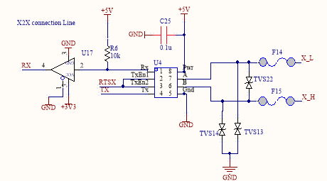
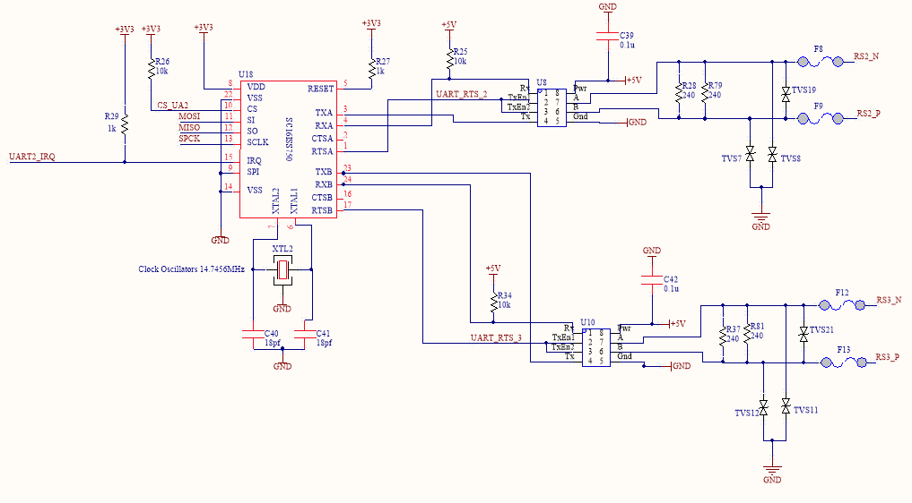
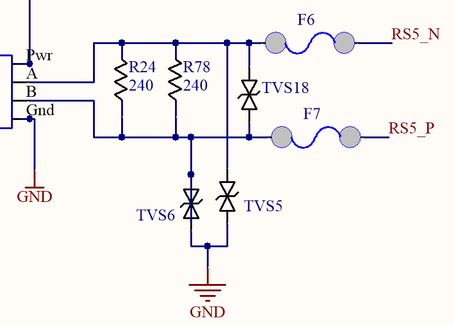
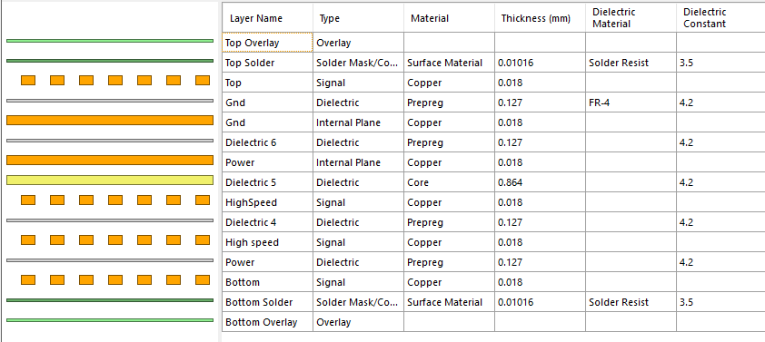
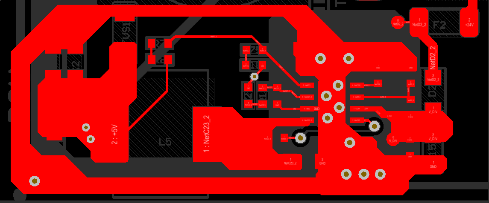
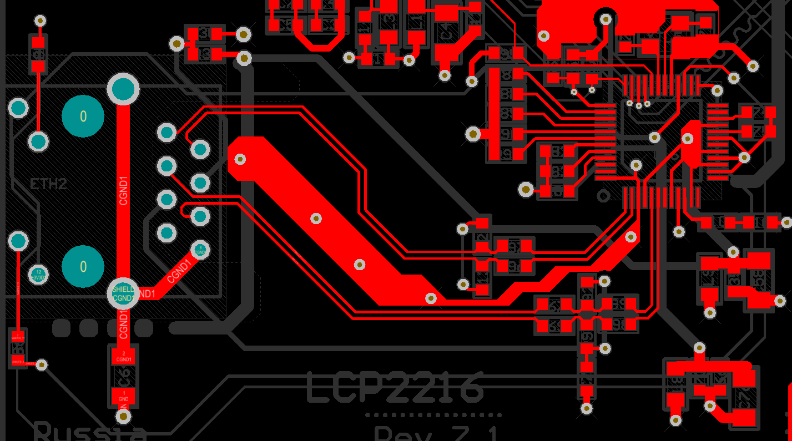

# Процессорный модуль LDO1128`
Пояснительная записка на печатную плату

---

## Оглавление
- [1. Общие сведения о плате](#1-общие-сведения-о-плате)
  - [1.1. Технические характеристики](#11-технические-характеристики)
  
- [2. Общая аппаратная архитектура](#2-общая-аппаратная-архитектура)
  - [2.1. Карта функциональных блоков](#21-карта-функциональных-блоков)
  - [2.2. Связи между силовыми и сигнальными доменами](#22-связи-между-силовыми-и-сигнальными-доменами)
  - [2.3. Общая карта внешних интерфейсов](#23-общая-карта-внешних-интерфейсов)
  - [2.4. Разъёмы и физическое выведение интерфейсов](#24-разъёмы-и-физическое-выведение-интерфейсов)
  
- [3. Питание, локальные напряжения и резервирование времени](#3-питание-локальные-напряжения-и-резервирование-времени)
  - [3.1. Входной домен питания](#31-входной-домен-питания)
  - [3.2. Понижающее преобразование в `LDO_In`](#32-понижающее-преобразование-в-ldo_in)
  - [3.3. Формирование `+5V`](#33-формирование-5v)
  - [3.4. Батарейное резервирование времени](#34-батарейное-резервирование-времени)
  
- [4. Процессорное ядро и базовая аппаратная обвязка](#4-процессорное-ядро-и-базовая-аппаратная-обвязка)
  - [4.1. Центральный микроконтроллер](#41-центральный-микроконтроллер)
  - [4.2. Тактирование, сброс и сервисные цепи](#42-тактирование-сброс-и-сервисные-цепи)
  - [4.3. Локальная логика обслуживания процессорного узла](#43-локальная-логика-обслуживания-процессорного-узла)
  
- [5. Последовательные интерфейсы `RS-485`, `PC` и `X2X`](#5-последовательные-интерфейсы-rs-485-pc-и-x2x)
  - [5.1. Общая структура последовательных каналов](#51-общая-структура-последовательных-каналов)
  - [5.2. Реализация линий `RS-485`](#52-реализация-линий-rs-485)
  - [5.3. Роль `U18` и связанных сервисных цепей](#53-роль-u18-и-связанных-сервисных-цепей)
  - [5.4. Аппаратная интерпретация ролей портов](#54-аппаратная-интерпретация-ролей-портов)
  
- [6. Релейные выходы и силовая коммутация](#6-релейные-выходы-и-силовая-коммутация)
  - [6.1. Назначение и место релейного узла в архитектуре платы](#61-назначение-и-место-релейного-узла-в-архитектуре-платы)
  - [6.2. Аппаратная реализация каналов реле](#62-аппаратная-реализация-каналов-реле)
  - [6.3. Электрические ограничения, коммутируемые цепи и меры осторожности](#63-электрические-ограничения-коммутируемые-цепи-и-меры-осторожности)
  - [6.4. Индикация, управление и диагностически значимые особенности](#64-индикация-управление-и-диагностически-значимые-особенности)

- [7. Защита линий и устойчивость к аварийным воздействиям](#7-защита-линий-и-устойчивость-к-аварийным-воздействиям)
  - [7.1. Защита по питанию](#81-защита-по-питанию)
  - [7.2. Защита сигнальных и коммуникационных линий](#72-защита-сигнальных-и-коммуникационных-линий)
  - [7.3. Практические пределы стойкости и осторожные формулировки](#73-практические-пределы-стойкости-и-осторожные-формулировки)

- [8. Стек слоёв и топологическая логика платы](#8-стек-слоёв-и-топологическая-логика-платы)
  - [8.1. Последовательность слоёв](#81-последовательность-слоёв)
  - [8.2. Функциональная логика стека](#82-функциональная-логика-стека)
  - [8.3. Значение стека для силовых и интерфейсных узлов](#83-значение-стека-для-силовых-и-интерфейсных-узлов)

### 1. Общие сведения о плате

Плата LDO1128 представляет собой модуль релейных выходов линейки Lorentz, выполненный в пластиковом корпусе для установки на DIN-рейку. Модуль предназначен для коммутации внешних устройств по командам от процессорного модуля системы и выполняет роль адресного периферийного узла дискретного вывода в составе распределённой архитектуры Lorentz.

Основная функция платы состоит в управлении внешними нагрузками через выходные реле. Обмен данными и питание модуля организованы через последовательную шину RS485, по которой модуль подключается к процессорному модулю IGAS LCP. В сетевой структуре устройство работает как подчинённый адресный узел, поэтому для штатной эксплуатации должно иметь уникальный адрес в общей линии связи.

Функционально модуль предоставляет восемь цифровых выходов. Каждый выход реализован на релейном канале с нормально разомкнутой и нормально замкнутой группами контактов, что позволяет использовать плату как для включения нагрузки при срабатывании реле, так и для схем, требующих переключающего контакта с выбором нормального состояния. По электрической нагрузочной способности релейные каналы рассчитаны на коммутацию цепей до двухсот сорока вольт переменного тока или до тридцати вольт постоянного тока при токе до двух ампер.

По совокупности функций LDO1128 не является вычислительным или коммуникационным центром системы, а представляет собой исполнительный модуль дискретного вывода, ориентированный на вынос силовой коммутации из центрального контроллера в отдельный адресный блок. Такое разделение упрощает масштабирование системы, позволяет распределять исполнительные каналы вдоль объекта и сохранять единый принцип связи с центральным модулем по RS485.

Конструктивно и архитектурно плата предназначена для работы в составе модульной сети Lorentz, где процессорный модуль выполняет функции ведущего устройства, а LDO1128 — функции удалённого релейного расширения. Допустимая протяжённость линии связи до мастер-сети составляет до одной тысячи метров, что позволяет использовать модуль не только в компактных шкафах автоматики, но и в распределённых системах с выносом исполнительных устройств на значительное расстояние от центрального контроллера.

### 1.1. Технические характеристики

Модуль LDO1128 является адресным релейным модулем дискретного вывода для системы Lorentz с подключением по шине RS485 к процессорному модулю IGAS LCP. Устройство содержит восемь цифровых релейных выходов. Каждый канал имеет нормально разомкнутую и нормально замкнутую группы контактов. Допустимая коммутируемая нагрузка составляет до двухсот сорока вольт переменного тока либо до тридцати вольт постоянного тока при токе до двух ампер. Конструктивное исполнение рассчитано на монтаж в пластиковом корпусе на DIN-рейку. Максимальная удалённость модуля от мастер-сети по линии связи составляет до одной тысячи метров.

Основные технические характеристики платы приведены в таблицах ниже.

| Параметр                      | Значение                                             |
| ----------------------------- | ---------------------------------------------------- |
| Назначение модуля             | Модуль релейных выходов                              |
| Количество цифровых выходов   | `8`                                                  |
| Тип выходов                   | Релейные                                             |
| Конфигурация контактов        | Нормально разомкнутые и нормально замкнутые контакты |
| Поддержка индикации состояния | Да                                                   |
| Поддержка диагностики         | Да                                                   |
| Степень защиты модуля         | `IP20`                                               |

---

| Параметр                  | Значение                                           |
| ------------------------- | -------------------------------------------------- |
| Выходные параметры        | `8` релейных выходов, `3`-проводное подключение    |
| Индикация состояния       | Статус выхода, состояние модуля, состояние питания |
| Индикация модуля          | Да, светодиодный индикатор                         |
| Индикация выходов         | Да, светодиодный индикатор                         |
| Потребление на шине `X2X` | До `2 Вт`                                          |

---

| Параметр                             | Значение                                                      |
| ------------------------------------ | ------------------------------------------------------------- |
| Конфигурация реле                    | Выходы изолированы, нормально открытые и закрытые контакты    |
| Коммутируемое напряжение             | `30 В` пост. тока / `250 В` перем. тока                       |
| Максимальное напряжение на контактах | `264 В` перем. тока                                           |
| Максимально коммутируемое напряжение | `50 В` пост. тока / `264 В` перем. тока                       |
| Частота                              | Пост. ток или `45–63 Гц`                                      |
| Коммутируемый ток                    | `2 А` при `30 В` пост. тока / `2 А` при `250 В` перем. тока   |
| Максимальный ток на модуль           | `16 А` при `30 В` пост. тока / `16 А` при `250 В` перем. тока |
| Сопротивление контактов              | Не более `100 мОм`                                            |

---

| Параметр                    | Значение         |
| --------------------------- | ---------------- |
| Задержка включения `0 → 1`  | Не более `10 мс` |
| Задержка выключения `1 → 0` | Не более `10 мс` |

---

| Параметр                 | Значение                           |
| ------------------------ | ---------------------------------- |
| Изоляция `выход — X2X`   | До `2300 В` переменного напряжения |
| Изоляция `выход — выход` | До `750 В` переменного напряжения  |

---

| Параметр             | Значение                                        |
| -------------------- | ----------------------------------------------- |
| Электрический ресурс | Не менее `500 000` коммутаций при `2 А / 240 В` |
| Механический ресурс  | До `5 000 000` коммутаций                       |

---

| Параметр                          | Значение             |
| --------------------------------- | -------------------- |
| Монтаж в горизонтальном положении | Да                   |
| Монтаж в вертикальном положении   | Да                   |
| Температура эксплуатации          | От `-25` до `+50 °C` |
| Температура хранения              | От `-40` до `+85 °C` |
| Степень защиты                    | `IP20`               |

---

| Параметр                               | Значение                          |
| -------------------------------------- | --------------------------------- |
| Максимальная длина линии связи         | До `1000 м`                       |
| Интерфейс связи с процессорным модулем | `RS485`                           |
| Адресация модуля                       | Требуется уникальный адрес в сети |

---

| Параметр | Значение |
| -------- | -------- |
| Высота   | `118 мм` |
| Ширина   | `45 мм`  |
| Глубина  | `126 мм` |

---

## 2. Общая аппаратная архитектура

---

### 2.1. Карта функциональных блоков

Модуль построен вокруг локального процессорного узла, выполняющего функции адресного релейного контроллера, обмена по внутренней шине и обслуживания сервисных цепей. В отличие от центрального контроллера `LCP`, вычислительная часть здесь реализована не на `ARM`, а на `Atm1` семейства `AVR` с внешним тактированием `16.0 MHz`. Этот узел не является коммуникационным концентратором всей системы, а обслуживает прикладную логику конкретного периферийного модуля: считывает аппаратный адрес, управляет восемью релейными каналами, поддерживает локальную индикацию и взаимодействует с внешней шиной `X2X`.

| Функциональный блок         | Состав                                                                                      | Назначение                                                                                                          |
| --------------------------- | ------------------------------------------------------------------------------------------- | ------------------------------------------------------------------------------------------------------------------- |
| Локальный процессорный узел | `Atm1`, внешнее тактирование `16.0 MHz`, цепи `RESET`, `PL3`, `Dip1`                        | Выполнение прикладной логики модуля, чтение адреса, формирование управляющих сигналов, обслуживание сервисных цепей |
| Подсистема питания          | вход `PSU`, `F1`, `F2`, `D2`, `D12`, `U3`, `U2`, шины `+24V`, `LDO_In`, `+5V`               | Приём внешнего питания, входная защита, понижение и локальная стабилизация питания внутренних узлов                 |
| Коммуникационная подсистема | линия `X2X connection Line`, трансивер `U1`, сигналы `RX`, `TX`, `RTSX`, линии `X_L`, `X_H` | Связь модуля с внешней последовательной шиной и обмен с ведущим устройством системы                                 |
| Исполнительная подсистема   | драйвер `D3 = ULN2803`, реле `F3`…`F10`, выходные разъёмы `P1`, `P2`                        | Коммутация внешних нагрузок через восемь релейных каналов                                                           |
| Диагностическая подсистема  | `LED1`, `LED2`, `LED3`…`LED10`, `LG1`…`LG5`                                                 | Локальный контроль состояния питания, служебных сигналов и релейных каналов без доступа к внутренним цепям          |

Архитектура модуля разделяет обработку логики, силовую коммутацию, питание и шинный обмен на отдельные аппаратные блоки. Процессорный узел на `Atm1` формирует сигналы `D2_RELAY1`…`D9_RELAY8`, которые через `ULN2803` передаются на катушки восьми реле. Коммутационная часть тем самым отделена от логического домена: микроконтроллер работает с низковольтными управляющими сигналами, а силовая коммутация вынесена в отдельный исполнительный каскад с внешними контактными группами `NO/CC/NC`.

Подсистема питания также построена как отдельный домен. Внешнее питание поступает на разъём `P3`, проходит через входные защитные элементы и затем делится на две ветви: одна формирует внутреннюю шину `+24V`, другая подаётся на понижающий каскад `U3` с последующей линейной стабилизацией на `U2`. В результате внутри платы формируется локальная шина `+5V`, от которой питаются процессорный узел, логика индикации и интерфейсные цепи.

Коммуникационная часть сведена к одной выделенной линии `X2X`, выведенной на тот же внешний разъём `P3`. На физическом уровне эта линия выполнена через отдельный трансивер и защитный контур, поэтому модуль аппаратно представляет собой адресный периферийный узел с единственным внешним каналом обмена и локальной релейной функциональностью. Адресная конфигурация задаётся аппаратно через `Dip1`, что позволяет включать несколько одинаковых модулей в одну систему без изменения базовой схемотехники.

По совокупности функций плата `LDO1128` является не универсальным контроллером, а специализированным модулем релейных выходов. Она объединяет локальный вычислительный узел, входной силовой тракт, интерфейс шины `X2X`, восьмиканальный исполнительный каскад и набор средств локальной диагностики. Такая архитектура делает модуль законченным адресным блоком дискретного вывода, рассчитанным на работу в составе общей системы `Lorentz`.

---

### 2.2. Связи между силовыми и сигнальными доменами

Силовой тракт начинается от внешнего разъёма `P3`, на который одновременно выведены шина питания `PSU`, общий провод `GND` и дифференциальная линия `X2X` (`X_L`, `X_H`). Внутри платы входной силовой домен разделяется на две ветви. Первая ветвь проходит через `F2` и `D12` и формирует внутреннюю шину `+24V`. Вторая ветвь проходит через `F1` и `D2`, после чего поступает на понижающий преобразователь `U3`, затем на промежуточную шину `LDO_In` и далее через `U2` формирует локальную шину `+5V`. Таким образом, входное питание не раздаётся по плате как единый необработанный домен: внутри модуля сразу выделяются защищённый домен `+24V` и отдельный низковольтный домен `+5V`.

Шина `+24V` обслуживает исполнительную часть модуля. От неё питаются катушки реле `F3`…`F10` и защитный диодный домен драйвера `D3 = ULN2803`. Логическая часть при этом работает от `+5V`: от этой шины питаются `Atm1`, адресный узел `Dip1`, локальная индикация и линейный интерфейс `X2X`. Такое разделение означает, что внутри платы силовая коммутация и вычислительная часть связаны не общим питающим доменом, а только управляющими сигналами `D2_RELAY1`…`D9_RELAY8`, которые формируются микроконтроллером и передаются на входы `ULN2803`.

Сигнальная архитектура в данной плате также построена по доменному принципу, но не как набор нескольких равноправных интерфейсов, а как связка одного внешнего шинного канала и одного исполнительного выходного домена. Линия `X2X` приходит на плату через `P3`, проходит через предохранители `F11`, `F12` и защитный узел `TVS2`, `TVS3`, `TVS4`, после чего подаётся на линейный интерфейс `U1`. Только после этого сигналы преобразуются в локальные логические линии `RX`, `TX` и `RTSX`, связанные с `Atm1`. Следовательно, внешний коммуникационный домен не соединён с микроконтроллером напрямую: между кабельной линией и вычислительной логикой находится собственный линейный и защитный узел.

Исполнительный домен отделён от сигнального ещё сильнее. Микроконтроллер управляет только входами драйвера `ULN2803`, а выходная коммутация наружу выполняется механическими контактами реле, выведенными на `P1` и `P2` как группы `NO`, `CC`, `NC`. Поэтому внешние коммутируемые цепи не имеют прямой электрической связи ни с доменом `X2X`, ни с низковольтной логикой `+5V`. На уровне архитектуры это образует трёхуровневую модель: первый уровень — внешний шинный и силовой ввод через `P3`, второй уровень — внутренние домены `+24V`, `+5V`, `Atm1` и `U1`, третий уровень — исполнительный релейный домен с сухими контактами на `P1` и `P2`.

Защитные элементы расположены именно на границах этих доменов. На силовом вводе такую границу образуют `F1`, `F2`, `D2` и `D12`. На коммуникационной линии `X2X` роль границы выполняют `F11`, `F12` и `TVS2`…`TVS4`. Между логикой и внешней нагрузкой эту функцию выполняет сама релейная коммутация: управляющий ток замыкается внутри платы через `ULN2803` и катушки реле, а внешняя нагрузка подключается только к контактным группам. За счёт этого аварийные режимы силового ввода, кабельной линии и коммутируемой нагрузки не входят в вычислительный домен без промежуточного защитного или исполнительного барьера.

---

## 2. Общая аппаратная архитектура

---

### 2.3. Общая карта внешних интерфейсов

Внешние интерфейсы модуля сгруппированы по назначению и режиму работы. В отличие от центрального контроллера `LCP`, здесь отсутствуют отдельные группы `Ethernet`, `USB` и нескольких независимых `RS-485`-портов. Внешняя архитектура `LDO1128` сведена к одной комбинированной шине связи и питания, а также к группе исполнительных релейных выходов. Коммуникационная часть представлена одной линией `X2X`, физически выведенной вместе с питанием на общий разъём `P3`, тогда как коммутация внешних нагрузок выведена на разъёмы `P1` и `P2`. 

| Группа интерфейсов     | Каналы                                     | Основные характеристики                                                                                                                                                                          | Физическое подключение                                               |
| ---------------------- | ------------------------------------------ | ------------------------------------------------------------------------------------------------------------------------------------------------------------------------------------------------ | -------------------------------------------------------------------- |
| `X2X` и питание модуля | один комбинированный канал связи и питания | последовательный обмен с процессорным модулем по линии `RS-485`, адресная работа модуля, длина линии до одной тысячи метров от мастер-сети                                                       | общий внешний разъём `P3` с выводами `X_L`, `X_H`, `GND`, `PSU`      |
| Релейные выходы        | восемь каналов                             | восемь цифровых выходов на реле, для каждого канала доступны `NO`, `CC`, `NC`, коммутация до двухсот сорока вольт переменного тока или до тридцати вольт постоянного тока при токе до двух ампер | две выходные колодки `P1` и `P2`                                     |
| Сервисный интерфейс    | один локальный сервисный порт              | внутрисхемное программирование и сервисный доступ к микроконтроллеру                                                                                                                             | разъём `PL3` с линиями `MOSI`, `MISO`, `SPCK`, `RESET`, `+5V`, `GND` |

Коммуникационный домен в этой плате аппаратно минимален. По схеме внешний разъём `P3` объединяет питание `PSU`, общий провод `GND` и дифференциальную пару `X_L/X_H`, а сама линия `X2X` далее поступает на отдельный линейный узел `U1`, после чего связывается с локальной логикой `Atm1` через сигналы `RX`, `TX` и `RTSX`. Это означает, что внешняя карта интерфейсов строится не вокруг множества независимых портов, а вокруг одного выделенного системного канала, через который модуль получает питание и обменивается данными с ведущим устройством. По `README` модуль является адресным и должен иметь уникальный адрес в сети; там же указано, что связь с процессорным модулем `IGAS LCP` организована по последовательной шине `RS485`, а удалённость от мастер-сети может достигать одной тысячи метров.  

Исполнительный домен, напротив, образует основную внешнюю функциональность модуля. На плате реализованы восемь релейных каналов, и каждый из них выведен как полноценная контактная группа с нормально разомкнутым, общим и нормально замкнутым контактами. По схеме эти контакты сведены на два внешних разъёма `P1` и `P2`, а по `README` релейные каналы рассчитаны на коммутацию внешних устройств при напряжении до двухсот сорока вольт переменного тока или до тридцати вольт постоянного тока и токе до двух ампер. Следовательно, карта внешних интерфейсов у `LDO1128` ориентирована не на разнообразие каналов обмена, а на сочетание одного шинного интерфейса управления и группы силовых дискретных выходов.  

Отдельной категорией остаётся сервисный интерфейс `PL3`. Он не относится к штатным полевым подключениям модуля, но физически выведен на плату и образует внешний доступ к процессорному узлу для прошивки и низкоуровневого обслуживания. Таким образом, полная карта внешних интерфейсов `LDO1128` включает три уровня: комбинированный шинно-силовой ввод `P3`, исполнительные выходные колодки `P1/P2` и локальный сервисный разъём `PL3`. Такая структура соответствует роли платы как адресного релейного модуля в составе общей системы `Lorentz`. 

---

### 2.4. Разъёмы и физическое выведение интерфейсов

Физическое выведение интерфейсов в модуле `LDO1128` выполнено через отдельные монтажные точки, каждая из которых соответствует своей функциональной группе. В отличие от центрального контроллера `LCP`, где внешние соединения были распределены между `RS485`, `USB`, `Ethernet`, `microSD` и шиной `X2X`, в данной плате внешняя архитектура сведена к трём основным категориям: комбинированный разъём питания и шины `X2X`, релейные выходные клеммы и сервисный разъём программирования. Дополнительно на плату выведен отдельный `DIP`-переключатель аппаратного адреса.

| Разъём / элемент | Исполнение                | Выводимые сигналы                                                                  | Назначение                                                                 |
| ---------------- | ------------------------- | ---------------------------------------------------------------------------------- | -------------------------------------------------------------------------- |
| `P1`             | выходной клеммный разъём  | `NO1`, `CC1`, `NC1`, `NO2`, `CC2`, `NC2`, `NO5`, `CC5`, `NC5`, `NO6`, `CC6`, `NC6` | Физическое выведение части релейных каналов на внешнюю нагрузку            |
| `P2`             | выходной клеммный разъём  | `NO3`, `CC3`, `NC3`, `NO4`, `CC4`, `NC4`, `NO7`, `CC7`, `NC7`, `NO8`, `CC8`, `NC8` | Физическое выведение оставшейся части релейных каналов на внешнюю нагрузку |
| `P3`             | входной клеммный разъём   | `X_L`, `X_H`, `GND`, `PSU`                                                         | Подключение шины `X2X` и внешнего питания модуля                           |
| `PL3`            | сервисный штыревой разъём | `MOSI`, `MISO`, `SPCK`, `RESET`, `+5V`, `GND`                                      | Внутрисхемное программирование и сервисный доступ к процессорному узлу     |
| `Dip1`           | `DIP`-переключатель       | `A1`, `A2`, `A3`, `A4`, `A5`                                                       | Аппаратное задание адреса модуля в общей шине                              |

Разъёмы `P1` и `P2` образуют внешний исполнительный интерфейс платы. Через них наружу выведены все восемь релейных каналов, причём каждый канал представлен полноценной тройкой контактов `NO/CC/NC`. Такое построение делает модуль законченным релейным блоком, в котором логическая часть и шина обмена остаются внутри низковольтного домена, а наружу выводятся только контактные группы, предназначенные для подключения внешней нагрузки. По топологии платы эта группа разъёмов вынесена на сторону, обозначенную как `HIGH VOLTAGE SIDE`, что подчёркивает физическое отделение коммутируемых цепей от логики и сервисных узлов.

Разъём `P3` реализует внешний интерфейс `X2X` как объединённую точку подключения связи и питания. На него одновременно выведены дифференциальная пара `X_L/X_H`, общий провод `GND` и входная шина `PSU`. Таким образом, этот разъём является не только коммуникационной, но и силовой точкой входа модуля. Внутри платы именно от `P3` начинается как линейный тракт `X2X`, так и входной силовой тракт, далее разделяющийся на внутренние домены `+24V` и `+5V`.

Разъём `PL3` оформляет отдельную сервисную точку доступа к процессорному узлу. На него выведены линии `MOSI`, `MISO`, `SPCK` и `RESET`, а также питание `+5V` и земля. Этот интерфейс не участвует в штатной работе модуля с внешней нагрузкой и не относится к полевым соединениям. Его роль состоит в прошивке, перепрограммировании и низкоуровневом обслуживании `Atm1` без демонтажа платы.

Отдельным физически выведенным элементом является `Dip1`. В аппаратной архитектуре он не является разъёмом в обычном смысле, но выполняет ту же функцию внешнего пользовательского взаимодействия: через него задаётся аппаратный адрес модуля по линиям `A1…A5`. Для адресного узла `RS485/X2X` это принципиально, поскольку модуль должен иметь уникальное положение в общей сети без изменения базовой схемотехники и без обращения к сервисному разъёму.

В данной плате отсутствуют отдельные внешние разъёмы `Ethernet`, `USB` и `microSD`, характерные для центрального модуля `LCP`. Физическое выведение интерфейсов здесь полностью подчинено роли модуля как адресного релейного расширения: один разъём `P3` объединяет питание и шинную связь, `P1/P2` выводят исполнительные контакты, а `PL3` и `Dip1` обеспечивают локальное сервисное и конфигурационное обслуживание.

---

---

## 3. Питание, локальные напряжения и резервирование времени

***

## 3. Питание, локальные напряжения и резервирование времени

### 3.1. Входной домен питания

Входной домен питания построен от внешней шины `PSU` и образует первичную энергетическую границу модуля. В отличие от варианта с единственным вводом `+24V`, в данной схеме входной тракт сразу разделён на две независимые защищённые ветви. Верхняя ветвь проходит через `F2`, затем через `D12` и формирует внутреннюю шину `+24V`. Нижняя ветвь проходит через `F1`, затем через `D2` и подаёт питание на вход понижающего преобразователя `U3 = TPS54331`. Такое построение отделяет распределение внутреннего необработанного домена `+24V` от питания локального узла формирования `LDO_In` и далее `+5V`, а также исключает прямое соединение внутренних шин с внешним вводом без промежуточной защитной ступени.

`F1` и `F2` выполнены на элементах `USMF030`, `D2` и `D12` — на диодах Шоттки `B340A-13-F`. Последовательность «предохранитель → диод» задаёт базовую логику входного тракта. Предохранители ограничивают аварийный ток, поступающий со стороны внешнего источника в случае перегрузки или внутреннего короткого замыкания на одной из ветвей. Диоды выполняют развязку входа, отсекают нежелательные обратные токи из внутренних шин в сторону разъёма питания и одновременно разделяют ветвь внутренней шины `+24V` и ветвь питания импульсного преобразователя. За счёт этого отказ или аномальный режим на одном из downstream-узлов не должен напрямую перетекать в соседнюю ветвь через общую внутреннюю медь.

Нижняя ветвь после `D2` образует локальный входной узел импульсного преобразователя. На этом узле установлены `C3 = 10 µF` и `C10 = 100 nF`, подключённые к земле непосредственно на стороне питания `U3`. Эти элементы формируют локальную входную ёмкость для buck-каскада: `C3` воспринимает низкочастотную составляющую импульсного потребления и снижает динамическое сопротивление источника на входе преобразователя, а `C10` шунтирует высокочастотные токовые составляющие и уменьшает влияние паразитной индуктивности подводящих проводников. Таким образом, входной домен подготавливает питание для работы `TPS54331` не только по уровню напряжения, но и по спектру помех, создавая локальный малой индуктивности источник для входного силового контура.

С тем же входным узлом связана и цепь контроля включения преобразователя. Делитель `R10 = 100 kΩ` и `R13 = 10 kΩ`, подключённый к входу `EN`, питается от ветви после `D2`, поэтому именно состояние входного домена определяет момент разрешения работы `U3`. Для `TPS54331` это имеет прямое схемотехническое значение, поскольку микросхема рассчитана на входной диапазон `3.5…28 V` и поддерживает программируемый порог `UVLO` через вывод `EN` с внутренним источником подтяжки. Иными словами, входной домен в этой конструкции является не только силовой точкой приёма энергии, но и опорным доменом, по уровню которого принимается решение о запуске локальной системы питания.

Верхняя ветвь после `D12` формирует внутреннюю шину `+24V`. По данному фрагменту схемы эта шина не участвует непосредственно в формировании логических напряжений, а существует как отдельный внутренний домен необработанного питания, уже отделённый от внешнего ввода собственным предохранителем и диодом. Нижняя ветвь, напротив, предназначена специально для питания локального импульсного преобразователя и далее узла линейной стабилизации. Такое разветвление на уровне входного домена устраняет необходимость заводить один и тот же незащищённый потенциал на разные участки платы и позволяет локализовать токовые и аварийные режимы по функциональным ветвям.

Для этого узла критична топология печатной платы. `F1`, `F2`, `D2` и `D12` должны располагаться максимально близко к точке ввода внешнего питания, чтобы первичная защита работала на границе платы, а не после протяжённого внутреннего участка меди. Ветвление на шину `+24V` и на вход преобразователя должно происходить после защитных элементов, без длинного общего участка, по которому одновременно текут токи обеих ветвей. Для нижней ветви соединение `D2 – C3/C10 – VIN U3` должно оставаться коротким и широким, поскольку этот участок определяет качество питания импульсного каскада и уровень входных выбросов. Возврат `C3` и `C10` должен замыкаться в тот же локальный силовой полигон земли, который используется входом `U3`, а не уходить длинным путём через общий цифровой контур. В этом смысле входной домен не является пассивным проводником питания: расположение защитных элементов, длина медных участков и организация возвратных токов входят в состав рабочей схемотехники узла.

Роль входного домена ограничена приёмом внешнего питания, первичным ограничением аварийных режимов, разделением внутренних энергетических ветвей и подготовкой питания для downstream-каскадов. Непосредственно с шины `PSU` логические и интерфейсные узлы не питаются. На плате сначала формируются защищённый внутренний домен `+24V` и отдельный подготовленный вход для `TPS54331`, после чего энергия передаётся на каскады локального преобразования и стабилизации.

---

### 3.2. Понижающее преобразование в `+5V`

Шина `LDO_In` формируется на `U3`, обозначенном на схеме как `PSU STEP Down Converter 24V-6V`. Этот узел представляет собой понижающий импульсный преобразователь, принимающий питание от входной ветви `PSU` после `F1` и `D2` и формирующий промежуточную локальную шину питания для последующего стабилизатора `U2`.

Силовой каскад собран по структуре buck-преобразователя. Вывод `PH` микросхемы `U3` подключён к переключаемому узлу, от которого энергия передаётся через `L1` на выход `LDO_In`. Замыкающий путь для тока дросселя формирует `D1 = B340A-13-F`. Вывод `BOOT` обслуживается конденсатором `C7 = 100 n`, установленным между `BOOT` и `PH`.

Выходной фильтр шины `LDO_In` собран на `L1` и `C2 = 22 µF`. Конденсатор установлен после дросселя, на стороне сформированного постоянного напряжения. На шине также установлен `TVS1`, ограничивающий перенапряжения на выходе локального источника. Шина `LDO_In` образует отдельный промежуточный силовой домен со вторичной защитой.

Цепи управления `U3` реализованы как отдельные функциональные узлы. Вход `EN` подключён к делителю `R10 = 100 k` и `R13 = 10 k`, который задаёт условия включения преобразователя по входному напряжению. Вход `SS` связан с `C8 = 10 n`, поэтому запуск шины выполняется с программируемым нарастанием. Регулирование выходного напряжения организовано через `VSENSE` и делитель `R2 = 10 k` и `R12 = 1k4`. Цепь `COMP` собрана на `R5 = 10 k`, `C14 = 10 n` и `C11 = 18 p`, поэтому контур компенсации выполнен дискретно.

Защита узла `LDO_In` построена в 2 уровнях. Внешний уровень образуют `F1`, `D2` и `TVS1`. Внутренний уровень реализован в `U3` через узлы управления запуском, обратной связи и ограничения рабочего режима. Преобразователь работает как промежуточный источник питания между входным доменом `PSU` и локальной шиной `+5V`.

Для этого узла критична топология печатной платы. Соединение входа преобразователя, `C3`, `C10` и переключаемого силового узла должно образовывать минимальную по площади токовую петлю. Увеличение этой петли ухудшает работу импульсного каскада и повышает уровень высокочастотных выбросов.

Вывод `GND` микросхемы `U3` должен быть подключён к полигону земли непосредственно у вывода корпуса. Тот же локальный полигон должен объединять земли входных и выходных конденсаторов, `D1` и цепей компенсации. Такое построение формирует малой индуктивности обратный путь для импульсных токов и улучшает устойчивость узла питания.

Переключаемый узел `PH` должен оставаться коротким и компактным. `D1`, `L1` и `C7` должны располагаться максимально близко к `U3`, а площадь меди этого узла должна быть минимальной. Аналогичное требование относится к `C2` и `TVS1`: их силовой возврат и земля должны замыкаться в тот же локальный силовой полигон.

Для работы узла питания верхний полигон земли должен иметь достаточную площадь и быть связан с внутренними или нижними полигонами земли несколькими переходными отверстиями рядом с `U3`. Узел `LDO_In` является локальным силовым участком, в котором геометрия меди и плотность переходных отверстий входят в состав рабочей схемотехники.

---

### 3.3. Формирование `+5V`

Шина `+5V` формируется от промежуточного домена `LDO_In` через линейный стабилизатор `U2`, выполненный в корпусе `SOT223`. Это второй каскад локального питания в данной архитектуре: сначала импульсный понижающий преобразователь на `U3 = TPS54331` формирует внутреннюю шину `LDO_In` с пониженным напряжением, затем `U2` выполняет окончательную линейную стабилизацию до уровня `+5V` для питания логических и низковольтных узлов платы.

Такое построение разделяет систему питания на два последовательно связанных уровня с разной функцией. Шина `LDO_In` является внутренним силовым доменом предрегулятора, на котором уже снята основная часть перепада от входного питания `PSU`, а `+5V` образует конечный локальный домен стабилизированного распределения. Линейный характер второго каскада в этой точке схемы принципиален: он не участвует в основном силовом преобразовании, а завершает формирование выходной шины, дополнительно подавляет остаточные пульсации импульсного узла и отделяет downstream-нагрузку от переключаемого характера buck-каскада.

Вход `U2` подключён непосредственно к шине `LDO_In`, сформированной выходом `U3` через `L1` и `C2`. Следовательно, электрически линейный стабилизатор полностью зависит от состояния предшествующего импульсного каскада. При отсутствии напряжения на `LDO_In`, при его глубокой просадке либо при отключении `U3` формирование шины `+5V` прекращается автоматически. Последовательность силовых зависимостей в этом узле однозначна: входной домен `PSU` питает `U3`, `U3` формирует `LDO_In`, `U2` преобразует `LDO_In` в окончательную шину `+5V`.

Обвязка `U2` минимальна и соответствует его роли пострегулятора. На выходе установлены `C15 = 100 nF` и `C9 = 22 µF`, подключённые между шиной `+5V` и землёй. Конденсатор `C15` обеспечивает высокочастотное шунтирование непосредственно на выходе стабилизатора и уменьшает локальный импеданс шины на фронтах тока нагрузки. Конденсатор `C9` формирует основную выходную ёмкость, поддерживает стабильность локального домена и сглаживает медленные изменения тока со стороны потребителей. По структуре узла оба элемента должны рассматриваться не как вторичная фильтрация после уже готовой шины, а как часть рабочего выходного контура `U2`.

Шина `+5V` в этой реализации является уже не промежуточной, а конечной низковольтной шиной узла питания. В отличие от исходной архитектуры, где `+5V` выступала непосредственным выходом импульсного преобразователя и одновременно источником для последующего формирования `+3V3`, здесь `+5V` формируется линейным стабилизатором после промежуточного домена `LDO_In`. Тем самым в новой схеме именно `LDO_In` выполняет роль внутренней предрегулированной шины, а `+5V` — роль окончательного стабилизированного домена, раздаваемого на нагрузку.

Работа узла `U2` опирается на уже подготовленное питание со стороны предыдущего каскада. На шине `LDO_In` до входа линейного стабилизатора уже установлены `C2 = 22 µF` и `TVS1`, поэтому вход `U2` получает не только пониженное, но и дополнительно ограниченное по выбросам питание. За счёт этого линейный стабилизатор работает в более мягком режиме по входным помехам, чем при прямом питании от внешнего домена. Соответственно, функция `U2` в общей структуре питания состоит не в защите от грубых входных аварийных режимов, а в локальной постстабилизации и окончательном формировании выходной шины.

Для данного узла критичны и практические требования к layout. `U2` должен располагаться максимально близко к узлу `LDO_In`, чтобы не растягивать промежуточную шину между выходом импульсного преобразователя и входом линейного стабилизатора. Выходные конденсаторы `C15` и `C9` должны быть установлены непосредственно у вывода `OUT`, с коротким и малой индуктивности подключением к земле. Возвратной точкой для этих конденсаторов должна служить локальная земля стабилизатора, а не удалённый участок общего цифрового полигона. При нарушении этого требования линейный каскад теряет качество локальной фильтрации и начинает работать уже на паразитных индуктивностях и сопротивлениях межсоединений, а не на собственной выходной ёмкости.

Тепловой режим `U2` также входит в состав рабочей схемотехники узла. Поскольку стабилизатор рассеивает мощность, пропорциональную разности между `LDO_In` и `+5V` и току нагрузки, его посадочное место и прилегающая медь должны обеспечивать достаточный теплоотвод. Корпус `SOT223` требует использования площадки меди как части теплового пути, поэтому площадь подключённого к корпусу полигона и количество тепловых переходов при многослойной реализации прямо влияют на допустимый ток конечной шины. В этой архитектуре основную долю перепада напряжения снимает `U3`, однако именно `U2` определяет чистоту конечного домена `+5V` и его локальный тепловой предел.

Таким образом, узел формирования `+5V` представляет собой не самостоятельный силовой источник от входного питания, а линейный завершающий каскад после импульсного предрегулятора. Его функция состоит в преобразовании промежуточной шины `LDO_In` в окончательный стабилизированный домен `+5V`, пригодный для питания чувствительных низковольтных узлов платы и отделённый от импульсного каскада как по спектру пульсаций, так и по характеру переходных процессов.

---

### 3.4. Батарейное резервирование времени

Резервирование времени относится к отдельному домену часов реального времени и не входит в основной тракт преобразования `PSU → LDO_In → +5V`. Его функция состоит в сохранении хода часов и связанного с ним временного контекста при исчезновении основного питания. Узел времени имеет собственный источник поддержания, логически и энергетически отделённый от рабочего силового тракта, в котором `U3` формирует промежуточную шину `LDO_In`, а `U2` — конечную локальную шину `+5V`.

Рабочие напряжения основной логики и периферии формируются узлами `U3` и `U2`. Батарейное резервирование времени поддерживает только функцию часов и не предназначено для питания импульсного предрегулятора, линейного стабилизатора, вычислительного ядра, интерфейсов связи или иных силовых и распределительных участков платы. Иными словами, батарейный домен не является резервным питанием модуля в целом, а обслуживает только сохранение времени между циклами выключения и повторного запуска.

При снятии внешнего питания `PSU` рабочие домены `LDO_In` и `+5V` отключаются, а домен времени сохраняет только ход часов. Основной силовой тракт определяет запуск и работу модуля в штатном режиме, батарейный домен — сохранение временной информации при отсутствии внешнего питания. Эти подсистемы связаны общей архитектурой платы, но не образуют единую шину питания и не должны рассматриваться как общий резервируемый энергетический контур.

---

---

## 4. Процессорное ядро и базовая аппаратная обвязка

***

### 4.1. Центральный микроконтроллер

Центральным вычислительным и управляющим узлом платы является `Atm1 = ATmega168`. Микроконтроллер семейства `AVR` построен на `8-bit AVR enhanced RISC architecture` и в данном модуле выполняет функции локального контроллера релейного блока: обрабатывает аппаратный адрес, поддерживает последовательный обмен с внешним интерфейсным узлом, формирует сигналы управления выходными релейными каналами и обслуживает сервисные цепи платы. Для `LDO1128` этот узел является не системным контроллером всей платформы `Lorentz`, а встроенным процессорным ядром адресного модуля дискретного вывода.

К `Atm1` подключены основные внутренние и внешние сигналы платы. Линии `PD0(RX0)` и `PD1(TX0)` выведены как `RX` и `TX` и образуют основной последовательный канал обмена с подсистемой `RS485`. Вывод `PD2(INT0)` используется как сервисная линия `RTSX`. Выводы `PD3`, `PD4`, `PD5`, `PD6`, `PD7`, `PB0`, `PB1` и `PB2` подключены к сетям `D2_RELAY1`, `D3_RELAY2`, `D4_RELAY3`, `D5_RELAY4`, `D6_RELAY5`, `D7_RELAY6`, `D8_RELAY7` и `D9_RELAY8`, то есть именно микроконтроллер формирует восемь дискретных сигналов управления релейными каналами модуля. Вывод `PC0/ADC0` подключён к сигналу `X2X_OUTPUT`, который одновременно выведен на локальную светодиодную индикацию. Выводы `PC1/ADC1`…`PC5/ADC5` соединены с линиями `A1`…`A5`, заведёнными на `Dip1`; в этой конфигурации аналоговые входы используются как цифровые линии чтения аппаратного адреса модуля. Линии `PB3(MOSI)`, `PB4(MISO)`, `PB5(SCK)` и `PC6/RESET` выведены на сервисный разъём `PL3`, формируя стандартный интерфейс внутрисхемного программирования.

Схема включения `ATmega168` соответствует его роли основного логического узла платы. Выводы `AVCC`, `VCC` и `VCC` подключены к шине `+5V`. Выводы `AGND`, `GND` и `GND` соединены с общим полигоном земли. Отдельное подключение `AVCC` и `AGND` сохраняет штатную структуру питания аналогового домена микроконтроллера, несмотря на то что в показанном узле аналоговые каналы используются главным образом как универсальные входы чтения адресных линий. По сигналам и разводке видно, что `Atm1` концентрирует у себя локальную логику адресации, обмена, сервисного доступа и управления исполнительной частью модуля.

Функциональные возможности `ATmega168` охватывают ядро, память, системные блоки, режимы энергосбережения, периферию и дискретные линии ввода-вывода.

- **Core**

  - `8-bit AVR enhanced RISC architecture`
  - `131` instruction, большинство инструкций выполняется за один такт
  - `32 × 8` registers общего назначения
  - fully static operation
  - производительность до `20 MIPS` при частоте `20 MHz`
  - встроенный `2-cycle Multiplier`

* **Memories**

  - `16 Kbytes` встроенной `In-System Self-Programmable Flash` памяти
  - `512 Bytes EEPROM`
  - `1 Kbyte SRAM`
  - ресурс записи/стирания: `10000` циклов для `Flash` и `100000` циклов для `EEPROM`
  - `Data retention`: до `20 years` при `85°C` и до `100 years` при `25°C`
  - optional `Boot Code Section` с независимыми `Lock Bits`
  - `True Read-While-Write Operation`
  - поддержка `In-System Programming by On-chip Boot Program`

* **System**

  - рабочее напряжение питания `1.8…5.5 V`
  - `Power-on Reset` и программируемый `Brown-out Detection`
  - программируемый `Watchdog Timer` с отдельным внутренним генератором
  - внутренний калиброванный генератор
  - поддержка внешнего кварцевого или керамического резонатора
  - поддержка внешних и внутренних источников прерываний
  - встроенный аналоговый компаратор
  - поддержка `debugWIRE`
  - поддержка `QTouch` library, `QTouch` и `QMatrix` acquisition, до `64` sense channels

* **Low-power Modes**

  - режимы `Idle`, `ADC Noise Reduction`, `Power-save`, `Power-down`, `Standby` и `Extended Standby`
  - `Power Consumption at 1MHz, 1.8V, 25°C`: `Active Mode` порядка `0.2 mA`
  - `Power-down Mode`: порядка `0.1 µA`
  - `Power-save Mode`: порядка `0.75 µA`, включая `32 kHz RTC`

* **Peripherals**

  - `2` независимых `8-bit Timer/Counters` с отдельным prescaler и compare mode
  - `1` `16-bit Timer/Counter` с prescaler, compare mode и capture mode
  - `6 PWM Channels`
  - `Programmable Serial USART`
  - `Master/Slave SPI Serial Interface`
  - `Byte-oriented 2-wire Serial Interface`, совместимый с `Philips I2C`
  - `8-channel 10-bit ADC` в `TQFP` и `VQFN` package
  - `Real Time Counter with Separate Oscillator`
  - `Temperature Measurement`
  - `Interrupt and Wake-up on Pin Change`

* **GPIO**

  - до `23 Programmable I/O Lines`
  - индивидуальная настройка направления линий ввода-вывода
  - совмещение `GPIO` с альтернативными функциями `ADC`, `USART`, `SPI`, `TWI`, таймеров и внешних прерываний
  - использование части портов как адресных входов и части — как линий управления релейными каналами

Такой набор функций определяет `Atm1` как центральное процессорное ядро именно данного модуля. Микроконтроллер объединяет вычислительную часть, энергонезависимую и оперативную память, системные механизмы запуска и контроля питания, последовательный интерфейс обмена, сервисный `SPI`-канал программирования, таймерную периферию, аналоговые входы и набор универсальных линий ввода-вывода. Для платы `LDO1128` это делает `ATmega168` основным аппаратным центром локальной логики, адресации, обмена и управления релейными каналами.

---

### 4.2. Тактирование, сброс и сервисные цепи

Тактирование процессорного узла выполнено по одноконтурной схеме и построено на внешнем кварцевом резонаторе `XTL2 = 16.0 MHz`, подключённом к выводам `PB6/XTAL1` и `PB7/XTAL2` микроконтроллера `Atm1 = ATmega168`. Нагрузочная обвязка генератора собрана на `C5` и `C6` номиналом по `18 pF`, подключённых от каждого вывода кварца к земле. Таким образом, в данной реализации используется внешний высокочастотный источник системного тактирования, а не внутренний калиброванный `RC oscillator` микроконтроллера. Для `ATmega168` такой режим является штатным: микроконтроллер поддерживает как внутренние источники частоты, так и внешний кварцевый или керамический резонатор. В рассматриваемой плате выбран именно внешний кварц, что задаёт фиксированную и воспроизводимую частоту работы локального контроллера релейного модуля.

Применение `16.0 MHz` соответствует роли платы как адресного исполнительного узла с последовательным обменом и дискретным управлением реле. Этот источник тактирования обеспечивает предсказуемую временную базу для `USART`, таймеров, внутренних машин состояний и сервисных задержек прошивки. Поскольку `ATmega168` допускает работу на частотах до `20 MHz` при питании `4.5…5.5 V`, использование внешнего кварца `16.0 MHz` на шине `+5V` находится в пределах штатного режима по скорости.

Линия аппаратного сброса выделена в отдельный сервисный узел и заведена на вывод `PC6/RESET`. Подтяжка линии к `+5V` выполнена резистором `R6 = 10 kΩ`, а конденсатор `C4 = 100 nF`, подключённый от `RESET` к земле, формирует внешнюю `RC`-цепь стартового удержания. Такая обвязка создаёт пассивный контур инициализации, сглаживает быстрые помеховые провалы на линии сброса и задаёт контролируемое начальное состояние микроконтроллера при нарастании питания. Ручная кнопка сброса в данном фрагменте схемы не показана; при этом сама линия `RESET` выведена также на сервисный разъём `PL3`, что позволяет формировать внешний сброс при программировании или обслуживании платы.

Внешняя цепь `R6–C4` не заменяет внутренних механизмов контроля запуска, а дополняет их. Для `ATmega168` встроены `Power-on Reset`, программируемый `Brown-out Detection` и `Watchdog Timer` с отдельным внутренним генератором. Следовательно, процессорный узел использует комбинированную схему надзора: базовая устойчивость запуска обеспечивается внутренними средствами микроконтроллера, а внешняя пассивная цепь на линии `RESET` стабилизирует вход сброса на уровне платы и уменьшает чувствительность к локальным помехам и переходным процессам питания.

К сервисным цепям процессорного узла относится интерфейс внутрисхемного программирования, выведенный на разъём `PL3 = IDC-10MS`. На него заведены линии `MOSI`, `MISO`, `SPCK` и `RESET`, а также питание `+5V` и два контакта земли. Такое включение формирует штатный `ISP`-интерфейс `AVR` и позволяет выполнять прошивку, перепрошивку и сервисный доступ к микроконтроллеру без демонтажа платы. Поскольку `PB3(MOSI)`, `PB4(MISO)` и `PB5(SCK)` одновременно являются рабочими выводами последовательного интерфейса `SPI`, сервисный разъём встроен непосредственно в процессорный узел, без промежуточного буфера или отдельного программирующего контроллера.

По структуре схемы линия `RESET` является общей сервисной шиной для нескольких функций: она используется самим микроконтроллером как вход аппаратного сброса и одновременно входит в состав интерфейса программирования на `PL3`. Это означает, что узел сброса должен рассматриваться не как изолированная пассивная цепь, а как часть общего сервисного контура обслуживания микроконтроллера. Аналогично линии `MOSI`, `MISO` и `SPCK` являются не отдельными тестовыми выводами, а прямым продолжением соответствующих выводов `ATmega168`, поэтому качество их разводки влияет как на надёжность программирования, так и на электрическую чистоту самого процессорного узла.

Для данного блока критичны и практические требования к `layout`. `XTL2`, `C5` и `C6` должны быть размещены максимально близко к выводам `PB6/XTAL1` и `PB7/XTAL2`, с короткими и симметричными соединениями. Контур кварцевого генератора должен быть компактным, без прохождения под ним быстро переключающихся линий управления, релейных сигналов или иных шумных сетей. Возвратные выводы `C5` и `C6` должны замыкаться в ближайший участок сплошного полигона земли, чтобы не увеличивать паразитную индуктивность контура. Линию `RESET` также следует вести коротко и без соседства с высокотоковыми и высокочастотными цепями; `R6` и `C4` должны располагаться непосредственно у вывода `PC6/RESET`, чтобы пассивный контур сброса работал на уровне входа микроконтроллера, а не на удалённом фрагменте трассы. Разъём `PL3` должен подключаться к сервисным линиям без избыточных ответвлений и длинных петель, поскольку в этой части платы геометрия межсоединений напрямую влияет на устойчивость программирования и повторяемость запуска процессорного узла.

В результате тактирование, сброс и сервисные цепи образуют компактную базовую обвязку `ATmega168`. Внешний кварц `16.0 MHz` задаёт основной системный такт, узел `R6–C4` обеспечивает внешнюю стабилизацию линии сброса, а разъём `PL3` предоставляет прямой сервисный доступ к `ISP`-интерфейсу микроконтроллера. Эта группа цепей не относится к исполнительной логике модуля напрямую, но определяет корректный запуск, программирование и устойчивую работу всего процессорного узла.

---

### 4.3. Локальная логика обслуживания процессорного узла

Локальная аппаратная обвязка `Atm1 = ATmega168` в данной плате построена существенно проще, чем у процессорного модуля `LCP`, и не повторяет внутреннее разбиение питания на отдельные домены ядра, аналоговой части, `PLL`, `UTMI` или резервного питания. Для процессорного узла здесь используется единый локальный домен `+5V/GND`: выводы `AVCC`, `VCC` и `VCC` подключены к шине `+5V`, а выводы `AGND`, `GND` и `GND` объединены с общим полигоном земли. По показанному фрагменту видно, что питание микроконтроллера организовано как один общий цифровой домен без отдельной ферритовой развязки аналоговой части и без выделенного резервируемого поддомена. Вывод `AREF` в этом узле не образует самостоятельной сервисной подсхемы и не обслуживается внешним опорным источником.

Локальная логика обслуживания процессорного узла в `LDO1128` сосредоточена не вокруг сложной схемы питания, а вокруг конфигурационных и сервисных функций платы. К ним относятся аппаратное задание адреса через `Dip1`, локальная светодиодная индикация, вывод интерфейса программирования на `PL3`, а также прямое формирование внутренних управляющих линий релейного модуля. Иными словами, `ATmega168` обслуживается на плате не развитой вспомогательной логикой, а компактным набором пассивных и интерфейсных цепей, достаточных для работы адресного периферийного модуля на `RS485`.

| Узел      | Элементы обвязки           | Назначение                       |
| -------------------------------------- | -------------------------------------------------------------------- | ---------------------------------------------------------------------------- |
| Питание процессорного узла             | `AVCC`, `VCC`, `VCC`, `AGND`, `GND`, `GND`                           | Формирование единого локального домена `+5V/GND` для `Atm1`                  |
| Аппаратный адрес модуля                | `Dip1`, `R22`, `R23`, `R24`, `R25`, `R26`, линии `A1…A5`             | Задание конфигурационного адреса через дискретные уровни на входах `PC1…PC5` |
| Локальная индикация                    | `LG1`, `LED1`, `LED2`, `R7`, `R8`, `R11`, `R27`, сигнал `X2X_OUTPUT` | Индикация наличия питания и состояния внутреннего служебного сигнала         |
| Сервисный доступ                       | `PL3`, `MOSI`, `MISO`, `SPCK`, `RESET`, `+5V`, `GND`                 | Внутрисхемное программирование и обслуживание микроконтроллера               |
| Линии управления исполнительной частью | `RTSX`, `D2_RELAY1…D9_RELAY8`                                        | Передача управляющих сигналов на downstream-логику релейных каналов          |

Узел аппаратного адреса реализован на `Dip1` и цепях подтяжки `R22…R26` номиналом `10 kΩ`. Линии `A1`, `A2`, `A3`, `A4` и `A5` подключены к выводам `PC1/ADC1`…`PC5/ADC5` микроконтроллера и одновременно заведены на пятипозиционный `DIP`-переключатель. Правая сторона `Dip1` подключена к `+5V`, а каждая адресная линия имеет собственную подтяжку к земле через отдельный резистор. В результате при разомкнутом положении соответствующего ключа на входе поддерживается логический ноль, а при замкнутом — логическая единица от шины `+5V`. Такая схема задаёт аппаратно читаемый набор адресных битов без внешней энергонезависимой памяти и без промежуточной логики. Для модуля `LDO1128`, который по `README` является адресным устройством и должен иметь уникальный адрес в сети, этот узел является базовым механизмом идентификации на уровне платы.

Схемотехнически важно, что адресные линии заведены на `ATmega168` напрямую. Используются выводы порта `C`, совмещённые с каналами `ADC`, однако в данной реализации они работают как дискретные конфигурационные входы. Это означает, что обработка аппаратного адреса полностью определяется прошивкой микроконтроллера, а локальная схема лишь формирует стабильные уровни на входах `PC1…PC5`. Такой подход типичен для компактных периферийных модулей: вместо отдельного дешифратора или конфигурационного регистра используются штатные универсальные входы микроконтроллера и простая пассивная адресная сеть.

Отдельный узел локальной логики образует светодиодная индикация на `LG1`, в составе которой используются два зелёных канала `LED1` и `LED2`. Верхний канал связан с шиной `+5V` через резистивную цепь `R7` и `R11`, поэтому он относится к постоянной сервисной индикации питания или рабочего состояния процессорного узла. Нижний канал связан с сигналом `X2X_OUTPUT`, приходящим с вывода `PC0/ADC0`, через резистивную цепь `R8` и `R27`. В обоих случаях светодиодные каналы замыкаются на `GND`, поэтому логика управления строится через подачу тока на анодную сторону. По структуре схемы нижний канал предназначен именно для индикации внутреннего цифрового состояния, а не для отображения силового состояния релейных контактов. Это делает `LED2` частью локальной диагностической логики платы.

Сигнал `X2X_OUTPUT`, выведенный одновременно на порт микроконтроллера и на индикаторный канал, показывает, что процессорный узел обслуживает не только релейные выходы, но и внутренние служебные состояния модуля. Такие линии могут использоваться прошивкой для индикации режима, обмена, активности или иной технологической диагностики. Параллельно с этим основные управляющие линии исполнительной части формируются непосредственно с портов микроконтроллера: `PD2(INT0)` используется как `RTSX`, а сети `D2_RELAY1…D9_RELAY8` выводятся с `PD3`, `PD4`, `PD5`, `PD6`, `PD7`, `PB0`, `PB1` и `PB2`. По данному фрагменту схемы между `Atm1` и downstream-логикой релейных каналов не показано промежуточных регистров, защёлок или логических матриц. Следовательно, локальная логика обслуживания процессорного узла здесь построена на прямом управлении портами `ATmega168`.

К той же группе относится сервисный доступ через разъём `PL3`. На него выведены `MOSI`, `MISO`, `SPCK` и `RESET`, а также `+5V` и земля. Этот узел уже формально относится к сервисным цепям микроконтроллера, однако в составе локальной логики он важен тем, что обеспечивает прямое обслуживание процессорного узла без дополнительных интерфейсных микросхем. Поскольку линии `PB3`, `PB4`, `PB5` и `PC6` используются одновременно как штатные выводы `SPI`/`RESET` и как сигналы программирования, сервисный контур встроен непосредственно в базовую обвязку `Atm1` и является её функциональным продолжением.

Для данного блока существенны и требования к `layout`. Линии `A1…A5`, идущие от `Dip1` к выводам `PC1…PC5`, должны рассматриваться как высокоомные конфигурационные входы в момент старта, поэтому их не следует прокладывать вдоль шумных линий управления реле и рядом с коммутационными токовыми петлями. Подтягивающие резисторы `R22…R26` должны располагаться так, чтобы состояние адресных линий было жёстко определено непосредственно на уровне платы. Индикаторные цепи `LED1` и `LED2` не критичны по быстродействию, однако их токовые контуры желательно замыкать локально, без протяжённых петель через общий полигон. Питание `AVCC/VCC` и земли `AGND/GND` должны включаться в непрерывный локальный домен `+5V/GND`, поскольку в данной архитектуре устойчивость процессорного узла обеспечивается не сложной многоуровневой развязкой, а простотой и непрерывностью базовой топологии.

Базовая аппаратная обвязка `Atm1` тем самым выполняет четыре практические функции: формирует единый локальный домен питания `+5V`, задаёт аппаратный адрес модуля через `Dip1`, обеспечивает локальную индикацию рабочих состояний и предоставляет прямой сервисный доступ к микроконтроллеру, одновременно передавая сформированные сигналы на исполнительную часть релейного модуля. За счёт этой обвязки `ATmega168` реализован на плате `LDO1128` как полностью обслуженное процессорное ядро адресного модуля дискретного вывода.

---

---

## 5. Последовательные интерфейсы `RS-485`, `PC` и `X2X`

***

### 5.1. Общая структура последовательных каналов

Последовательная подсистема платы построена как набор полудуплексных дифференциальных линий на внешних трансиверах `RS-485` и отдельном двухканальном расширителе `UART`. В состав узла входят шесть нумерованных линий `RS1`…`RS6`, выделенная линия `PC-RS485` и отдельная линия `X2X connection Line`.

Архитектура каналов разделена на две аппаратные группы. Первая группа подключена к основной логике платы напрямую. Вторая группа формируется через `U18 = SC16IS752IPW,128`, который добавляет два последовательных канала и получает команды по `SPI`.

Линейный уровень всех каналов выполнен в едином стиле. Для направлений `RS-485` применены полудуплексные трансиверы `U4`…`U10` типа `SN65HVD3082EDR`, работающие от шины `+5V`. Со стороны внутренней цифровой части используется домен `+3V3`. На части каналов между выходом приёмника трансивера и внутренней логикой установлены одноэлементные буферы `U12`, `U13`, `U14`, `U15`, `U17` типа `SN74LVC1G125DBVR`. Такое построение разделяет линейный домен `RS-485` и внутренний логический домен платы.

Структура источников последовательных сигналов сведена в таблицу.

| Канал                 | Источник сигналов        | Сигналы               |
| --------------------- | ------------------------ | --------------------- |
| `X2X connection Line` | основная логика платы    | `RX/TX`               |
| `PC-RS485`            | основная логика платы    | `RX_PC/TX_PC`         |
| `RS1`                 | основная логика платы    | `RX_PC/TX_PC`         |
| `RS2`                 | `U18 = SC16IS752IPW,128` | канал `A` расширителя |
| `RS3`                 | `U18 = SC16IS752IPW,128` | канал `B` расширителя |
| `RS4`                 | основная логика платы    | `RXD1/TXD1`           |
| `RS5`                 | основная логика платы    | `RXD3/TXD3`           |
| `RS6`                 | основная логика платы    | `RXD2/TXD2`           |

Последовательная подсистема объединяет несколько одинаковых по физическому уровню каналов, различающихся источником `UART`-сигналов и именованием в проекте. Электрическая база всех линий остаётся общей: полудуплексный `RS-485`, внешняя защита линии, локальная развязка питания и цифровое управление направлением передачи.

---

### 5.2. Реализация линий `RS-485`

Линейный уровень всех последовательных каналов выполнен на `SN65HVD3082EDR`. Это полудуплексный трансивер `RS-485`, соответствующий `TIA/EIA-485A`, с внутренним отказоустойчивым приёмником для состояний обрыва линии, короткого замыкания между проводами и неактивной шины. Для трансивера также зафиксированы встроенный `fail-safe` приёмника, защита выводов линии от электростатических разрядов до `15 kV` по модели `Human Body Model` и тепловое отключение. Базовая устойчивость линейного узла формируется свойствами самого трансивера и внешней защитной обвязкой платы.

Каждый канал имеет отдельный сигнал управления направлением передачи. Для линии `PC-RS485` используется `RTS_PC`, для `RS4` — `RTS4`, для `RS5` — `RTS5`, для `RS6` — `RTS6`, для `RS2` и `RS3` — `UART_RTS_2` и `UART_RTS_3`, для линии `X2X` — `RTSX`. Эти сигналы подключены к входам разрешения передатчика и приёмника, поэтому переключение линии между режимами передачи и приёма выполняется цифровым управлением со стороны основной логики платы или расширителя `UART`.

На кабельной стороне каждый канал содержит повторяющийся защитный контур. В оба проводника линии включены самовосстанавливающиеся предохранители `F1`…`F15` типа `MF-USMF005-2`. Подавление импульсных перенапряжений выполняют `TVS`-диоды `TVS2`…`TVS22` типа `SMAJ5.0CA`. В каждом канале присутствует пара резисторов `240 Ω` в узле линии `A/B`. Этот резистивный каркас дополняет внутренние `fail-safe` свойства `SN65HVD3082EDR` и задаёт одинаковую электрическую структуру всех линейных портов.

Для каждого трансивера установлен локальный развязывающий конденсатор `0.1 μF` по питанию. Полная типовая секция канала включает логические сигналы управления, трансивер `RS-485`, локальную развязку питания, внешний защитный контур, предохранители и вывод на кабельную линию.

Приёмная часть прямых каналов дополнительно согласована с внутренним логическим доменом `+3V3`. Для этого используются буферы `SN74LVC1G125DBVR` на каналах, приходящих непосредственно в основную цифровую часть платы. На линиях `RS2` и `RS3` отдельные буферы не показаны, поскольку эти каналы входят в `U18` и обслуживаются в составе его собственного последовательного узла.

Практическая стойкость `RS-485`-подсистемы определяется схемой и размещением элементов на печатной плате. Защитные элементы линии должны располагаться у кабельного ввода, чтобы импульсный ток замыкался в землю до входа в чувствительную часть линейного тракта. `TVS`-диоды и входной защитный контур относятся к кабельной стороне канала и формируют первую границу стойкости порта.

Питание трансиверов и земля защитных элементов должны опираться на плотную локальную медную структуру. Для уменьшения паразитной индуктивности и формирования малошумящего возвратного пути используются сплошные полигоны `VCC` и `GND`. Развязывающие конденсаторы `0.1 μF` должны располагаться непосредственно у выводов питания `SN65HVD3082EDR`. Их физическое размещение рядом с корпусом трансивера входит в рабочую схемотехнику канала.

Линии управления направлением `RTS_PC`, `RTS4`, `RTS5`, `RTS6`, `UART_RTS_2`, `UART_RTS_3` и `RTSX` образуют отдельный управляющий домен. Для устойчивого запуска и исключения ложного включения передатчика эти цепи должны сохранять короткие и чистые трассы и не проходить рядом с силовыми и импульсными узлами.

При усилении защитного домена линии `A/B` могут дополняться последовательными импульсостойкими резисторами. Для более тяжёлых сценариев перенапряжений в эту же архитектуру включаются `MOV` и `TBU`. В текущей реализации штатная граница стойкости порта сформирована элементами `SMAJ5.0CA` и `MF-USMF005-2`.

Реализация `RS-485`-каналов на данной плате включает три взаимосвязанных уровня: линейный трансивер `SN65HVD3082EDR`, внешний защитный контур у разъёма и требования к размещению `TVS`-диодов, предохранителей, байпасных конденсаторов, полигонов `VCC/GND` и управляющих линий на печатной плате.

---

---

### 5.3. Роль `U18` и связанных сервисных цепей

`U18` выполняет функцию двухканального расширителя `UART`, подключённого к основной логике по `SPI`. К микросхеме подведены сигналы `CS_UA2`, `MOSI`, `MISO`, `SPCK`, отдельная линия прерывания `UART2_IRQ` и цепь `RESET`. В составе последовательной подсистемы `U18` добавляет 2 дополнительных `UART`-канала, после чего каждый из них преобразуется в `RS-485` отдельным внешним трансивером.

Питание `U18` выполнено от домена `+3V3`. Узел сброса и подтяжки реализован дискретно: линия `RESET` подтянута через `R27 = 1 k`, вход `CS` связан с `R26 = 10 k`, а линия `IRQ` — с `R29 = 1 k`. Такая обвязка вводит расширитель `UART` в общую систему аппаратной инициализации платы и задаёт устойчивые начальные состояния сервисных линий.

Тактирование `U18` выполнено от `XTL2` на частоте `14.7456 MHz` с 2 нагрузочными конденсаторами `C40` и `C41` по `15 pF`. Отдельный кварцевый контур задаёт собственную частотную базу узла `RS2/RS3` и отделяет его от прямых последовательных каналов, обслуживаемых основной логикой платы.

Канал `A` микросхемы `U18` использует сигналы `TXA`, `RXA` и `RTSA`, которые подаются на трансивер `U8` и формируют линию `RS2`. Канал `B` использует `TXB`, `RXB` и `RTSB`, после чего через трансивер `U10` формирует линию `RS3`. Каналы `RS2` и `RS3` образуют отдельный последовательный домен, обслуживаемый через `SPI`, и не используют прямые `UART`-линии основной логики платы.

Линия `UART2_IRQ` задаёт событийную модель обслуживания узла `RS2/RS3`. Расширитель `UART` может инициировать обработку со стороны хоста по аппаратному сигналу прерывания. За счёт этого узел `RS2/RS3` работает как самостоятельный блок последовательной подсистемы с собственной точкой тактирования, сброса и сигнализации событий.

---

---

### 5.4. Аппаратная интерпретация ролей портов

Электрическая схема формирует несколько однотипных полудуплексных линий `RS-485`, отдельную линию `PC`, отдельную линию `X2X` и два канала `HMI` и `S1`, добавленные через `SC16IS752`. Все эти каналы построены на одном типе линейного трансивера, имеют сходную защитную обвязку и различаются источником `UART`-сигналов и именованием в проекте.

Явные аппаратные роли, зафиксированные обозначениями схемы, относятся к линии `PC-RS485` и к линии `X2X connection Line`. Остальные последовательные каналы сохранены как нумерованные порты `RS1`…`RS6`. Их электрическая архитектура определяет физический интерфейс, управление направлением и защитный контур линии.

На уровне печатной платы последовательная подсистема состоит из трёх функциональных групп:

| Группа                           | Состав                  | Аппаратный признак                                                                                       |
| -------------------------------- | ----------------------- | -------------------------------------------------------------------------------------------------------- |
| Прямые каналы от основной логики | `X2X`, `PC`, `S3`, `S4` | Прямое подключение к внутренним сигналам процессорного узла                                              |
| Каналы через расширитель `UART`  | `HMI`, `S1`             | Формирование через `U18 = SC16IS752IPW,128`                                                              |
| Общий линейный уровень           | все каналы `RS-485`     | Единый тип трансивера `SN65HVD3082EDR`, повторяющаяся защита и одинаковая логика управления направлением |

Такая структура определяет аппаратную архитектуру последовательной части платы: унифицированный линейный уровень `RS-485`, раздельные источники `UART`-сигналов и отдельные каналы для `PC-RS485` и `X2X`.

---

## 7. Защита линий и устойчивость к аварийным воздействиям 
---

### 7.1. Защита по питанию

Защита по питанию построена как последовательная цепочка между внешней шиной `PSU` и внутренними доменами платы. Входной тракт включает ограничение аварийного тока, защиту по полярности, локальное шунтирование перед импульсным преобразователем и вторичную защиту сформированной внутренней шины питания.

На входе платы линия питания преобразователя проходит через `F1`, после чего подаётся на `D2`. `F1` выполняет функцию самовосстанавливающегося предохранителя и ограничивает аварийный ток на вводе. `D2` формирует защитную границу по полярности и отделяет внешний силовой ввод от внутреннего входного узла преобразователя.

На входном узле преобразователя установлены `C3 = 10 μF` и `C10 = 100 nF`. Эта группа формирует локальную входную ёмкость и высокочастотное шунтирование перед `U3 = TPS54331`. Такое включение снижает чувствительность преобразователя к быстрым возмущениям на входной линии и стабилизирует работу силового каскада при импульсных помехах.

На шине `LDO_In` установлен `TVS1 = SMAJ5.0CA`, ограничивающий перенапряжения непосредственно на внутреннем силовом домене. Защитная архитектура платы охватывает внешний ввод питания и внутреннюю шину, питающую линейный стабилизатор и downstream-логику.

Встроенные защитные функции `TPS54331` включают ограничение тока по циклам переключения, снижение частоты при перегрузке и коротком замыкании, защиту от выходного перенапряжения и тепловое отключение. Вход `EN`, подключённый к делителю `R10` и `R13`, формирует порог включения и удержания по входному напряжению через `UVLO`. Работа преобразователя ограничена областью устойчивого питания.

| Уровень защиты           | Элементы                                                                                  | Назначение                                               |
| ------------------------ | ----------------------------------------------------------------------------------------- | -------------------------------------------------------- |
| Входной силовой ввод     | `F1`, `D2`                                                                                | Ограничение аварийного тока и защита по полярности       |
| Вход преобразователя     | `C3`, `C10`                                                                               | Локальная входная ёмкость и высокочастотное шунтирование |
| Внутренняя шина `LDO_In` | `TVS1 = SMAJ5.0CA`                                                                        | Ограничение перенапряжений на локальном силовом домене   |
| Встроенные функции `U3`  | `UVLO`, ограничение тока, снижение частоты, защита от перенапряжения, тепловое отключение | Самозащита узла преобразования в аварийных режимах       |

Для силового узла существенна и топология. Короткая входная токовая петля `VIN–C3/C10–D1`, компактный переключаемый узел `PH`, плотный полигон `GND` и локальное замыкание токов входных и выходных конденсаторов определяют эффективность защитного контура и устойчивость преобразователя к импульсным воздействиям.

---

### 7.2. Защита сигнальных и коммуникационных линий

Защита сигнальных и коммуникационных линий организована по доменному принципу. Для каждого внешнего интерфейса используется собственный набор защитных элементов, соответствующий электрической природе линии и характеру внешнего воздействия.

Наиболее развитый защитный контур реализован на линиях `RS-485`. Все последовательные каналы построены на трансиверах `SN65HVD3082EDR`. На кабельной стороне каждого порта установлены `TVS`-диоды `TVS2`…`TVS22` типа `SMAJ5.0CA` и самовосстанавливающиеся предохранители `F1`, `F3`…`F15` типа `MF-USMF005-2`. В канале также присутствует пара резисторов `240 Ω` в узле линии `A/B`, а питание трансивера локально развязано конденсатором `0.1 μF`.

Защитный контур `RS-485` работает как каскад из ограничения перенапряжения и ограничения тока. `TVS`-элементы формируют низкоомный путь на землю при импульсном перенапряжении. `PPTC`-элементы ограничивают ток при более длительном аварийном воздействии. Встроенные свойства `SN65HVD3082EDR` дополняют внешний контур: трансивер имеет `fail-safe` приёмник для состояний обрыва линии, короткого замыкания между проводами и неактивной шины, защиту выводов от электростатических разрядов до `15 kV` по `Human Body Model` и тепловое отключение. Защита линии `RS-485` формируется совместной работой внешнего защитного каркаса и внутренних функций трансивера.

Для сервисного `USB` используется другой тип защитного узла. Линии `D+_P` и `D-_N` проходят через последовательные резисторы `R3` и `R4` номиналом `39 Ω`, а защиту от импульсных воздействий на входе порта обеспечивают `Z1` и `Z2` с `part number` `CG0603MLC-05E`, подключённые к земле. Эта структура сочетает демпфирование дифференциальной пары и локальный защитный барьер на входе сервисного интерфейса.

Для Ethernet-портов защитная архитектура реализована через экранный домен. Экранная часть разъёма отделена от основной земли и связана с ней через конденсатор `1 nF`. Такое включение снижает прямой перенос высокочастотных токов с кабельного экрана в цифровой домен платы и формирует отдельную электрическую логику экранного контакта разъёма.

| Интерфейсный домен | Элементы защиты  | Защитный эффект          |
| ------------------ | -------------------- | ---------------------------- |
| `RS-485`           | `SMAJ5.0CA`, `MF-USMF005-2`, резисторы `240 Ω`, локальная развязка, встроенные функции `SN65HVD3082EDR` | Ограничение перенапряжения, ограничение тока, устойчивость к обрыву, короткому замыканию и неактивной шине |
| Сервисный `USB`    | `R3`, `R4`, `Z1`, `Z2`                                                                                  | Демпфирование линии и защита от импульсных воздействий на входе порта                                      |
| Ethernet           | экранный домен `CGND`, ёмкостная связь с `GND` через `1 nF`                                             | Снижение прямого переноса высокочастотных токов с кабельного экрана в цифровую землю                       |

Для линий `RS-485` критично и размещение элементов. Защитные компоненты должны располагаться у кабельного ввода, чтобы импульсный ток замыкался в землю до входа в чувствительную часть линейного тракта. Питание трансиверов и земля защитных элементов должны опираться на плотные локальные полигоны `VCC` и `GND`, а развязывающие конденсаторы `0.1 μF` должны размещаться непосредственно у выводов питания `SN65HVD3082EDR`. В этой части платы стойкость к кабельным воздействиям определяется схемой и топологией совместно.

---

---

### 7.3. Практические пределы стойкости и осторожные формулировки

Плата содержит развитый аппаратный защитный слой на вводе питания и на внешних коммуникационных линиях. На уровне схемотехники он включает защиту от переполюсовки на входе `+24V`, ограничение аварийного тока, подавление перенапряжений на шине `+5V`, защиту `RS-485`-портов по току и напряжению, защиту сервисного `USB`-входа и отделение экранного домена Ethernet от основной земли.

ℹ️ **Информация:** Такая архитектура ориентирована на практические ошибки подключения, локальные перенапряжения, электростатические воздействия на кабельных интерфейсах и аварийные режимы питания, характерные для промышленной и полевой интеграции.

Для оценки внешних воздействий на коммуникационные линии применяются следующие уровни:

| Вид воздействия | Уровень |     Напряжение |
| --------------- | ------: | -------------: |
| `ESD (-4-2)`    |     `4` | `8 kV / 15 kV` |
| `EFT (-4-4)`    |     `4` |         `2 kV` |
| `Surge (-4-5)`  |     `2` |         `4 kV` |

Штатный защитный контур `RS-485` построен на `SMAJ5.0CA` и `MF-USMF005-2` в сочетании с внутренними защитными свойствами `SN65HVD3082EDR`. Основная защита порта реализована как сочетание отвода импульсной энергии в землю и ограничения тока в линии. Такая структура повышает устойчивость интерфейса к типовым аварийным и интеграционным воздействиям и снижает импульсную нагрузку на чувствительную часть платы.

⚠️ **Предупреждение:** Защитные элементы платы работают в расчётном режиме при коротких токовых петлях, плотных полигонах земли, размещении защитных компонентов у внешнего ввода и чистой трассировке управляющих и чувствительных линий.

Защита реализована как часть аппаратной архитектуры. Вход питания, `RS-485`, сервисный `USB` и экранный домен Ethernet имеют собственные защитные контуры, согласованные с функцией соответствующего интерфейса и с его местом в общей структуре платы.

---

## 8. Стек слоёв и топологическая логика платы

---

### 8.1. Последовательность слоёв

Плата выполнена по четырёхслойному стеку с двумя внешними сигнальными слоями и двумя внутренними опорными слоями `GND` и `Power`. В отличие от шестислойной структуры модуля `LCP`, в данной реализации стек упрощён до классической схемы `Top Layer → GND → Power → Bottom Layer`. Такое построение сохраняет выделенные внутренние опорные плоскости для возвратных токов и распределения питания, но исключает отдельные внутренние сигнальные слои.

Последовательность слоёв от верхней стороны к нижней приведена в таблице.

| Позиция в стеке | Слой                                      | Тип                                |      Толщина |
| --------------- | ----------------------------------------- | ---------------------------------- | -----------: |
| 1               | `Top Solder`                              | паяльная маска                     | `0.01016 mm` |
| 2               | `Top Layer`                               | медь                               | `0.03556 mm` |
| 3               | диэлектрик между `Top Layer` и `GND`      | `Prepreg`, `FR-4`                  |   `0.127 mm` |
| 4               | `GND`                                     | внутренняя опорная плоскость, медь | `0.03556 mm` |
| 5               | диэлектрик между `GND` и `Power`          | `Core`, `FR-4`                     |    `1.09 mm` |
| 6               | `Power`                                   | внутренняя опорная плоскость, медь | `0.03556 mm` |
| 7               | диэлектрик между `Power` и `Bottom Layer` | `Prepreg`, `FR-4`                  |   `0.127 mm` |
| 8               | `Bottom Layer`                            | медь                               | `0.03556 mm` |
| 9               | `Bottom Solder`                           | паяльная маска                     | `0.01016 mm` |

Для внутренних плоскостей `GND` и `Power` в параметрах стека задан `pullback 0.508 mm`, то есть отступ меди внутренних plane-слоёв от контура платы или соответствующих областей. Диэлектрики стека выполнены на `FR-4` с диэлектрической проницаемостью `4.2`, паяльная маска задана с диэлектрической проницаемостью `3.5`. Толщина меди всех проводящих слоёв одинакова и составляет `0.03556 mm`, что соответствует единой весовой категории меди на внешних и внутренних слоях.

Суммарная толщина стека по заданным слоям составляет около `1.50566 mm`. Основная структура стека формируется последовательностью `Top Layer → GND → Power → Bottom Layer`. В этой конфигурации верхний и нижний слои используются как основные сигнальные и монтажные поверхности, а внутренние слои работают как непрерывные опорные домены для земли и питания.

---

---

### 8.2. Функциональная логика стека

Верхний слой `Top Layer` расположен на расстоянии `0.127 mm` от внутреннего слоя `GND`. Такая близость задаёт короткий путь возвратного тока для верхней сигнальной трассировки, снижает паразитную индуктивность и поддерживает устойчивую работу плотных цифровых, интерфейсных и локальных силовых узлов, размещённых на верхней стороне платы. Для данной платы именно пара `Top Layer → GND` образует основной опорный контур верхнего монтажного и сигнального слоя.

Внутренние слои `GND` и `Power` в данной плате разделены диэлектриком `Core` толщиной `1.09 mm`. По сравнению с плотной plane-парой это даёт меньшую межслойную ёмкость между доменами питания и земли, поэтому внутренний блок `GND/Power` здесь работает прежде всего как система опорных и распределительных слоёв, а не как усиленный высокочастотный ёмкостный контур. Тем не менее наличие двух сплошных внутренних плоскостей сохраняет предсказуемую структуру возвратных токов и упрощает распределение питания по плате.

Нижний слой `Bottom Layer` отделён от внутреннего слоя `Power` диэлектриком `0.127 mm`. Нижняя сторона получает собственный сигнальный слой с короткой межслойной связью с плоскостью питания и может использоваться для служебной разводки, обходных маршрутов и размещения части вторичных узлов. В отличие от верхнего слоя, который опирается непосредственно на `GND`, нижний слой топологически привязан к `Power`, поэтому при переходах между слоями и при трассировке чувствительных цепей требуется учитывать непрерывность опорного домена.

В этой конструкции отсутствуют отдельные внутренние сигнальные слои типа `HighSpeed` и `High speed`, присутствовавшие в шестислойной плате `LCP`. Вся сигнальная трассировка сосредоточена на двух внешних слоях, а внутренние слои полностью отданы под `GND` и `Power`. Такая организация упрощает стек, снижает технологическую сложность и одновременно сохраняет непрерывные внутренние опорные домены для возвратных токов и распределения питания.

Функциональное распределение основных медных слоёв приведено в таблице.

| Слой           | Роль в архитектуре платы                                             |
| -------------- | -------------------------------------------------------------------- |
| `Top Layer`    | основной слой размещения компонентов и плотной локальной трассировки |
| `GND`          | сплошной опорный слой земли и главный путь возвратных токов          |
| `Power`        | внутренний слой распределения питания                                |
| `Bottom Layer` | нижний сигнальный слой для дополнительной разводки и вторичных цепей |

Дополнительное значение для топологической логики имеет одинаковая толщина меди всех проводящих слоёв — `0.03556 mm`. Это делает стек более однородным по сопротивлению и токовой способности слоёв. Для внутренних плоскостей `GND` и `Power` также задан `pullback 0.508 mm`, то есть отступ внутренних plane-областей от края платы. В сумме стек реализует компактную четырёхслойную архитектуру, в которой верхняя сторона работает как основной сигнальный и монтажный слой над сплошной землёй, внутренние слои формируют опорные домены, а нижняя сторона используется как дополнительный сигнальный слой над внутренним распределением питания.

---

### 8.3. Значение стека для силовых и интерфейсных узлов

Для узла питания на `U3 = TPS54331` стек задаёт условия работы силовой трассировки, локальной развязки и возвратных токов импульсного каскада. Близость слоя `Top Layer` к `GND` через диэлектрик `0.127 mm` уменьшает индуктивность горячих токовых петель и поддерживает компактную реализацию входного контура `VIN–C3/C10–D1`. Такое построение согласуется с требованием размещать входной керамический конденсатор как можно ближе к выводу `VIN`, аноду диода и локальному полигону земли. Для этого узла именно верхний слой над сплошной опорной плоскостью `GND` является основным рабочим слоем, на котором должны собираться критичные токовые петли импульсного преобразователя.

Внутренние слои `GND` и `Power` в данной плате разделены не тонким препрегом, а центральным диэлектриком `1.09 mm`. Поэтому стек не формирует плотную plane-пару с высокой межслойной ёмкостью в том смысле, как это было в шестислойной плате `LCP`. В этой конструкции внутренние плоскости работают прежде всего как непрерывные опорные и распределительные домены: `GND` — как основной путь возвратных токов и экранный слой, `Power` — как внутренний слой распределения питания. Для силового узла это означает, что устойчивость питающей системы определяется не столько усиленной межслойной ёмкостью между `GND` и `Power`, сколько локальной развязкой, непрерывностью полигонов и правильной геометрией силовых токовых контуров.

---

---

Для линий `RS-485` и `X2X` стек задаёт условия возврата токов, включения защитных элементов и локальной развязки трансиверов. Сплошной слой `GND` и внутренний слой `Power` поддерживают низкоиндуктивные подключения `TVS`-элементов, `PPTC`-предохранителей и байпасных конденсаторов `0.1 μF`. При размещении защиты у разъёма импульсный ток получает короткий путь в землю без захода в чувствительную часть платы. Такое построение соответствует требованию размещать защитный контур у кабельного ввода и использовать плоскости `VCC` и `GND` как основу высокочастотной разводки.

В отличие от шестислойной архитектуры `LCP`, в этом стекe отсутствуют отдельные внутренние сигнальные слои для скоростной трассировки. Поэтому все интерфейсные линии платы разводятся на внешних слоях, а внутренние слои полностью отданы под `GND` и `Power`. Практически это означает, что наиболее чувствительные и критичные к возвратному току цепи предпочтительно вести на `Top Layer`, непосредственно над `GND`, тогда как `Bottom Layer` используется как дополнительный сигнальный слой для обходных маршрутов и вторичных соединений. Для интерфейсных узлов такой стек не даёт отдельной внутренней среды трассировки, но сохраняет предсказуемую опорную геометрию и упрощает контроль возвратных токов.

---

---

Для всех узлов платы стек определяет не только последовательность слоёв, но и электрическую логику размещения компонентов. Близость сигнального слоя к опорной плоскости уменьшает индуктивность возвратного тока. Внутренние слои `GND` и `Power` формируют непрерывные домены опоры и распределения. Отсутствие внутренних сигнальных слоёв делает внешнюю трассировку более ответственной к сохранению опорного слоя под линией. Эти свойства входят в рабочую архитектуру платы наравне со схемотехникой.

---

  

---
