\newpage

# Введение

Настоящая конструкторская пояснительная записка разработана для системы модульных свободно программируемых контроллеров Lorentz и раскрывает технические решения, принятые в конструкции процессорного модуля LCP2116, модуля аналоговых входов LAI1118, модуля дискретных входов LDI1118 и модуля релейных выходов LDO1128. Документ подготовлен как инженерный текстовый документ в логике ГОСТ 2.105-2019. При включении в комплект технического или эскизного проекта документ может быть приведён к требованиям ГОСТ 2.123-93 по составу проектной документации, обозначению, листу регистрации изменений, основной надписи и нормоконтролю.

Записка предназначена для фиксации конструктивной идеологии изделия: модульной структуры, состава узлов, электрической архитектуры, принципов компоновки, монтажа, диагностирования, ремонтопригодности, ограничений применения, требований безопасности, требований к заземлению и защите цепей. Документ не заменяет технические условия, паспорта, руководства по эксплуатации, сборочные и габаритные чертежи, электрические схемы, спецификации и программную документацию. При расхождении сведений приоритет имеют утверждённые конструкторские документы и технические условия на конкретное исполнение.

## Исходные данные

За основу настоящей редакции принят файл `draft05.md`. Содержательная структура черновика сохранена: безопасность, системные особенности, обзор модулей, габаритные данные, монтаж и подключение, механическая и электрическая конфигурация, механическое обращение, принадлежности, кибербезопасность, утилизация и дополнительная техническая информация. Из черновика удалены смысловые повторы, однотипные предупреждения объединены, разделы с одинаковым назначением переразложены по главам, а все главы и подглавы получили сквозную автоматическую нумерацию.

При подготовке документа использованы следующие материалы.

| Группа документов | Использованные файлы | Применение в записке |
|---|---|---|
| Черновик | `draft05.md` | Базовая структура, инженерная логика разделов, исходный текст по безопасности, монтажу, ЭМС, диагностике, принадлежностям и жизненному циклу. |
| Технические условия | `01_ТУ система управления Lorentz.doc` | Назначение системы, общие технические требования, требования к питанию, надёжности, безопасности, приёмке и программному обеспечению. |
| Общая документация Lorentz | `01_Паспорт на модульные контролеры Lorentz.pdf`; `04_РЭ на модульные контролеры Lorentz rev 1.pdf` | Общая архитектура, модульность, шина X2X, встроенная идентификация модулей, требования безопасного применения и обращения. |
| LCP2116 | Datasheet, паспорт, РЭ, сборочный чертёж и габаритный чертёж LCP2116 | Назначение процессорного модуля, интерфейсы, питание, индикация, microSD, RTC, конструкция и габаритная компоновка. |
| LAI1118 | Datasheet, паспорт, РЭ, сборочный чертёж и габаритный чертёж LAI1118 | Аналоговые входы, дискретный режим, измерительные диапазоны, индикация, подключение, сборочный состав и габаритная компоновка. |
| LDI1118 | РЭ, сборочный чертёж и габаритный чертёж LDI1118 | Дискретные входы, диапазон входных сигналов, индикация, подключение, сборочный состав и габаритная компоновка. |
| LDO1128 | Datasheet, паспорт, РЭ, сборочный чертёж и габаритный чертёж LDO1128 | Релейные выходы, параметры коммутации, изоляция, ресурс контактов, индикация, сборочный состав и габаритная компоновка. |

## Нормативная и конструкторская база

Конструкторская записка рассматривает систему Lorentz как проектно-компонуемое изделие. Состав конкретной системы определяется проектом шкафа управления, количеством сигналов, назначением каналов, схемой питания, требованиями к связи с внешними устройствами и требованиями к безопасности объекта.

В качестве нормативной базы для дальнейшего оформления должны применяться: ГОСТ 2.105-2019 для общих требований к текстовым документам ЕСКД; ГОСТ 2.123-93 при оформлении документа в составе технического или эскизного проекта; ГОСТ 2.106 для состава текстовых документов; требования ЕСКД к таблицам, рисункам, ссылкам, приложениям и перечню документов; технические условия ТУ 4252-001-465265-20 как основной документ, устанавливающий требования к серии контроллеров Lorentz.

## Границы документа

Записка описывает конструктивные решения на уровне системы и модулей. Она не содержит принципиальных электрических схем, трассировки печатных плат, расчёта надёжности по элементной базе, полного расчёта ЭМС, исходных текстов программного обеспечения и методики поверки измерительных каналов. Эти сведения должны оформляться отдельными документами: схемами электрическими, перечнями элементов, спецификациями, программной документацией, методиками испытаний и протоколами приёмки.

# Назначение и область применения системы

Система Lorentz предназначена для построения автоматических и автоматизированных систем измерения, контроля, регулирования, диагностики и управления технологическими процессами. В составе таких систем контроллеры выполняют сбор и обработку аналоговых, дискретных, цифровых и кодированных сигналов, регистрацию измеренных и вычисленных значений, формирование управляющих и аварийных сигналов, обмен с внешними измерительно-вычислительными комплексами, панелями оператора и верхним уровнем автоматизации.

Контроллеры относятся к вторичной части измерительных и управляющих систем. На уровне конструкции это означает, что изделие не является самостоятельным датчиком, исполнительным механизмом или устройством функциональной безопасности. Его техническая роль состоит в приёме сигналов от первичных преобразователей, обработке данных программными средствами, обмене с внешними устройствами и выдаче управляющих сигналов на внешние цепи через модули ввода-вывода.

Система применяется в шкафах управления промышленного оборудования, распределённых системах ввода-вывода, локальных узлах автоматизации, испытательных установках и технологических агрегатах. Конкретная область применения задаётся проектной документацией объекта и выбранным набором модулей.

Изделия Lorentz не должны использоваться как единственное средство защиты персонала и оборудования. Если отказ системы управления может привести к опасному состоянию объекта, должны применяться внешние аппаратные цепи безопасности: аварийное отключение, контакторы безопасности, защитные реле, аппаратные блокировки, предохранительные устройства, цепи контроля дверей, отключение приводов и независимое ограничение энергии исполнительных механизмов.

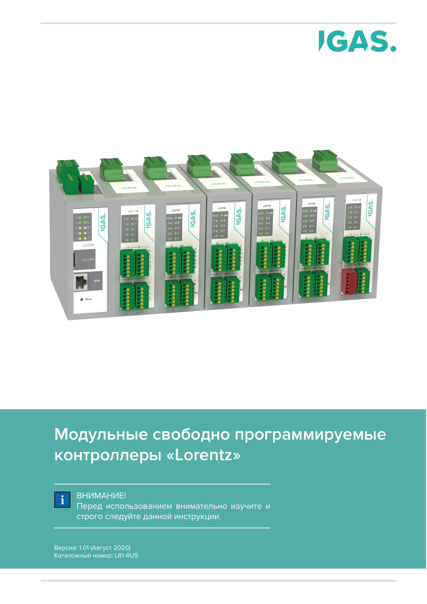{width=80%}

# Состав системы и функциональное назначение модулей

## Общая архитектура

Архитектура Lorentz построена по модульному принципу. Центральным элементом является процессорный модуль LCP, который выполняет прикладную программу, хранит конфигурацию, ведёт журналы событий, поддерживает системное время и обеспечивает связь с внешними устройствами. Функциональные модули ввода-вывода подключаются к процессорному модулю через внутреннюю шину X2X и выполняют локальные функции измерения, приёма дискретных сигналов и коммутации выходных цепей.

Базовая конфигурация системы, рассматриваемая в настоящей записке, включает:

- процессорный модуль LCP2116;
- модуль аналоговых входов LAI1118;
- модуль дискретных входов LDI1118;
- модуль релейных выходов LDO1128;
- внутреннюю кабельную шину X2X;
- внешние интерфейсы RS485, Ethernet и USB;
- цепи питания 24 V DC;
- внешние цепи датчиков, контактов, исполнительных устройств и защитных аппаратов.

Модульность позволяет проектировать систему под требуемое количество сигналов без изменения общей конструктивной модели. При расширении объекта в систему добавляются модули соответствующего функционального типа, а прикладная конфигурация обновляется в инженерном программном обеспечении.

{width=85%}

## Процессорный модуль LCP2116

LCP2116 является центральным процессорным модулем системы Lorentz. Модуль обеспечивает выполнение прикладной программы, управление модулями ввода-вывода по X2X, цифровой обмен с внешними устройствами по RS485 и Ethernet, сервисный доступ через USB, хранение файлов конфигурации и журналов на microSD-карте, поддержание времени с использованием часов реального времени и резервного элемента CR2032.

Конструктивно LCP2116 выполнен в пластиковом корпусе для установки на DIN-рейку. На лицевой панели размещены индикаторы состояния, слот microSD, Ethernet-разъём и органы обслуживания. Верхние и нижние зоны подключения используются для RS485, X2X и других цепей в зависимости от исполнения.

| Параметр | Значение для LCP2116 |
|---|---|
| Назначение | Центральный процессор системы Lorentz |
| Процессорная архитектура | ARM Cortex-M3 |
| Операционная среда | IGAS RT |
| Интерфейсы | RS485, Ethernet, USB, X2X |
| Носитель конфигурации | microSD |
| Часы реального времени | RTC с батареей CR2032 |
| Установка | DIN-рейка, шкаф управления |
| Степень защиты | IP20 |

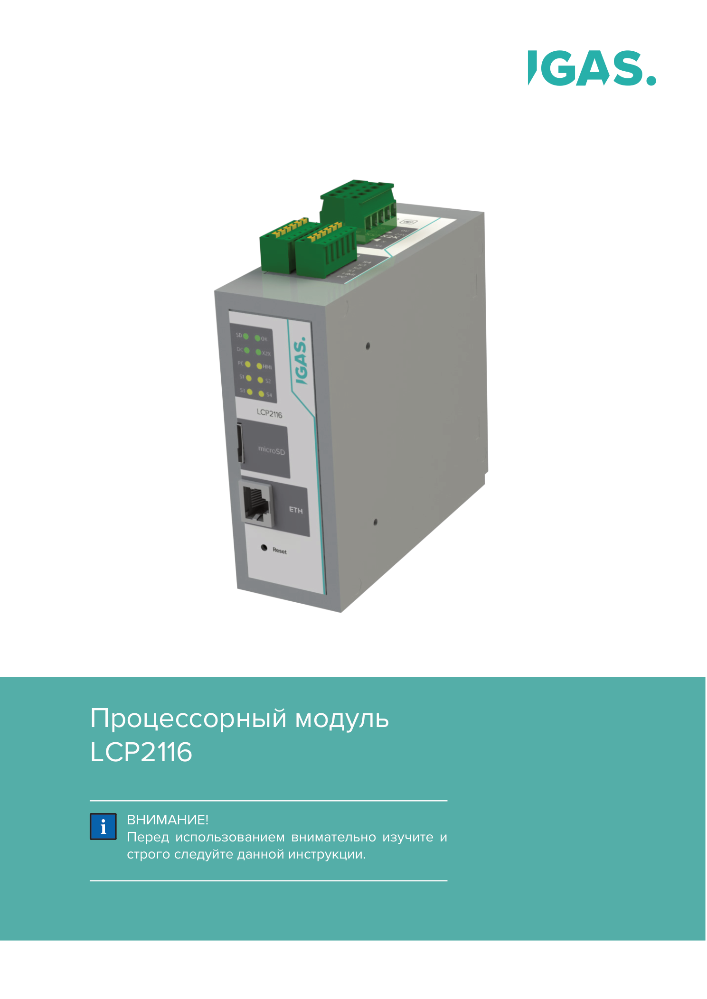{width=45%}

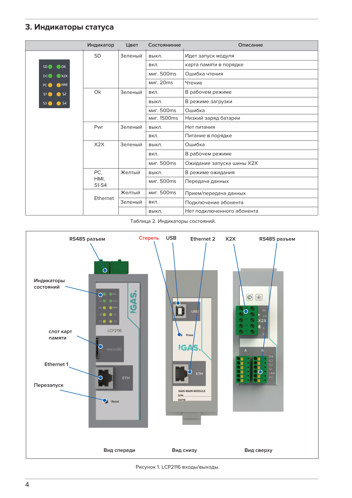{width=75%}

## Модуль аналоговых входов LAI1118

LAI1118 предназначен для сбора и обработки аналоговых сигналов постоянного напряжения и тока. Модуль применяется для подключения датчиков с выходными сигналами 0...10 V и 0...20 mA, а также для работы с дискретными сигналами в предусмотренном режиме. Передача данных и питание выполняются через X2X; модуль является адресным устройством в составе системы.

Ключевое техническое решение LAI1118 состоит в совмещении измерительных каналов в едином модуле, что уменьшает количество отдельных плат ввода и упрощает компоновку шкафа. Конфигурирование режима входа выполняется средствами инженерного программного обеспечения. Для аналоговых цепей должны применяться меры помехозащиты: разделение с силовыми трассами, минимизация неэкранированных участков, правильное подключение экранов и контроль общих проводов.

| Параметр | Значение для LAI1118 |
|---|---|
| Назначение | Модуль аналоговых входов |
| Количество каналов | 8 аналоговых входов |
| Диапазон напряжения | 0...10 V |
| Диапазон тока | 0...20 mA |
| Разрядность | 12 bit |
| Фильтр | 1 kHz |
| Передача данных и питание | X2X |
| Степень защиты | IP20 |

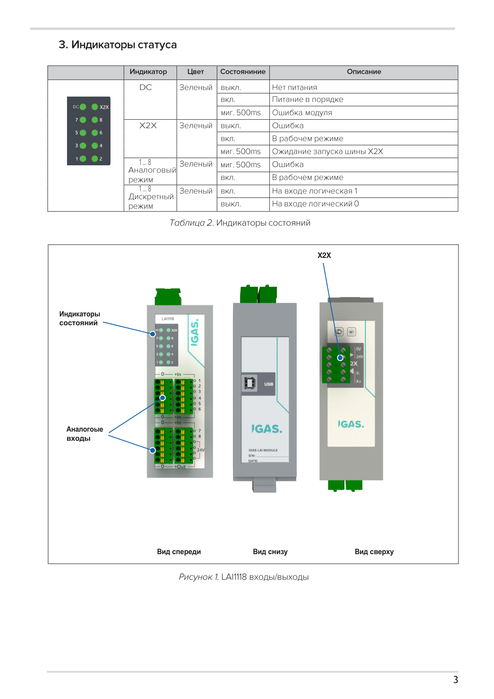{width=75%}

## Модуль дискретных входов LDI1118

LDI1118 предназначен для приёма дискретных сигналов постоянного тока от внешних контактов, концевых выключателей, датчиков положения, релейных контактов и других источников дискретных состояний. Модуль передаёт состояние каналов в процессорный модуль по X2X и обеспечивает визуальную индикацию состояния входов.

Дискретные входные цепи должны проектироваться с учётом длины линий, наличия источников помех, требований к общему проводу и требований к защите от перенапряжений. Для длинных линий и внешней прокладки кабелей требуется предусматривать фильтрацию, защиту и корректную трассировку относительно силовых цепей.

| Параметр | Значение для LDI1118 |
|---|---|
| Назначение | Модуль дискретных входов |
| Количество каналов | 16 дискретных входов |
| Диапазон входного сигнала | 0...24 V по РЭ; 5...30 V DC по ТУ для исполнения LDI1118 |
| Время измерения | 100 us по РЭ |
| Изоляция между входами | 500 V по РЭ |
| Передача данных и питание | X2X |
| Степень защиты | IP20 |

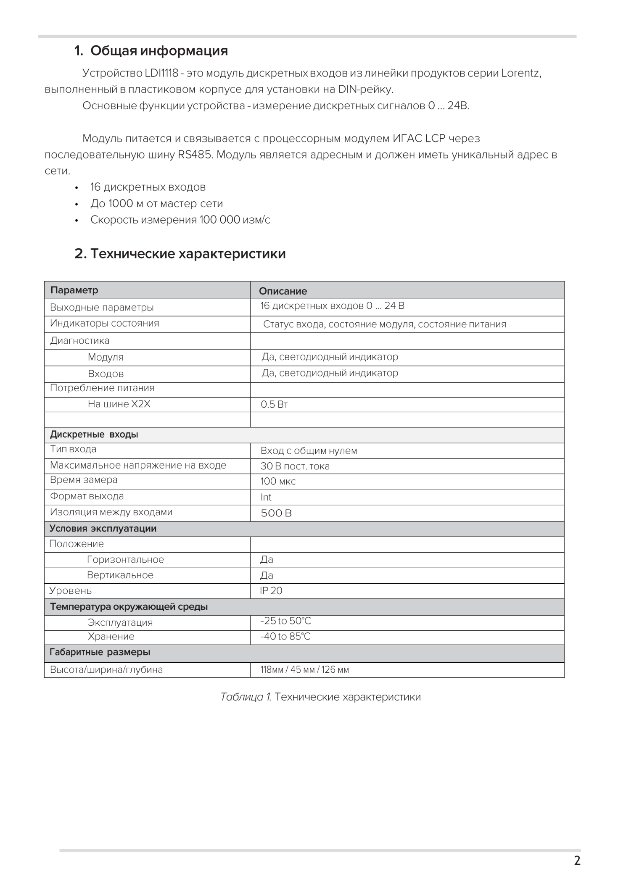{width=70%}

## Модуль релейных выходов LDO1128

LDO1128 предназначен для коммутации внешних цепей с помощью выходных реле. Каждый выход представляет собой сухой контакт, используемый для управления внешними исполнительными устройствами, промежуточными реле, клапанами, сигнализацией и другими нагрузками в пределах допустимых параметров.

Основное конструктивное решение LDO1128 - гальванически развязанные релейные выходы с нормально открытыми и нормально закрытыми контактами. При проектировании необходимо учитывать не только номинальный ток и напряжение, но и характер нагрузки, ресурс контактов, частоту коммутации, наличие индуктивных выбросов и необходимость внешних цепей подавления перенапряжений.

| Параметр | Значение для LDO1128 |
|---|---|
| Назначение | Модуль релейных выходов |
| Количество выходов | 8 релейных выходов |
| Тип выхода | Реле, сухой контакт |
| Коммутируемое напряжение | 30 V DC / 250 V AC |
| Коммутируемый ток | 2 A |
| Ресурс электрический | Не менее 500000 коммутаций при 2 A / 240 V |
| Передача данных и питание | X2X |
| Степень защиты | IP20 |

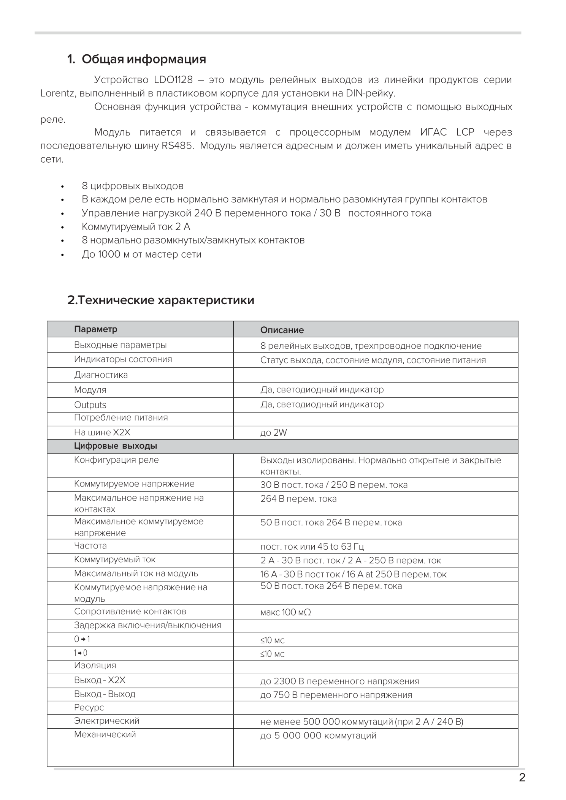{width=70%}

# Конструктивное исполнение

## Корпус и установка на DIN-рейку

Модули Lorentz выполнены в унифицированных пластиковых корпусах, рассчитанных на установку в шкаф управления на 35 mm DIN-рейку. Корпус выполняет функции несущего элемента, защитной оболочки электронного узла, основания для клеммных блоков, световодов и лицевой панели. Конструкция ориентирована на шкафной монтаж и обслуживание без доступа к внутренним электронным компонентам.

Принятое корпусное решение обеспечивает:

- защиту печатной платы от случайного прикосновения и механического воздействия;
- унификацию посадочных мест в шкафу;
- повторяемость компоновки модульного ряда;
- доступность лицевой индикации;
- возможность замены модуля без переразделки полевой проводки;
- разделение зон подключения системной шины, входов, выходов и сервисных интерфейсов.

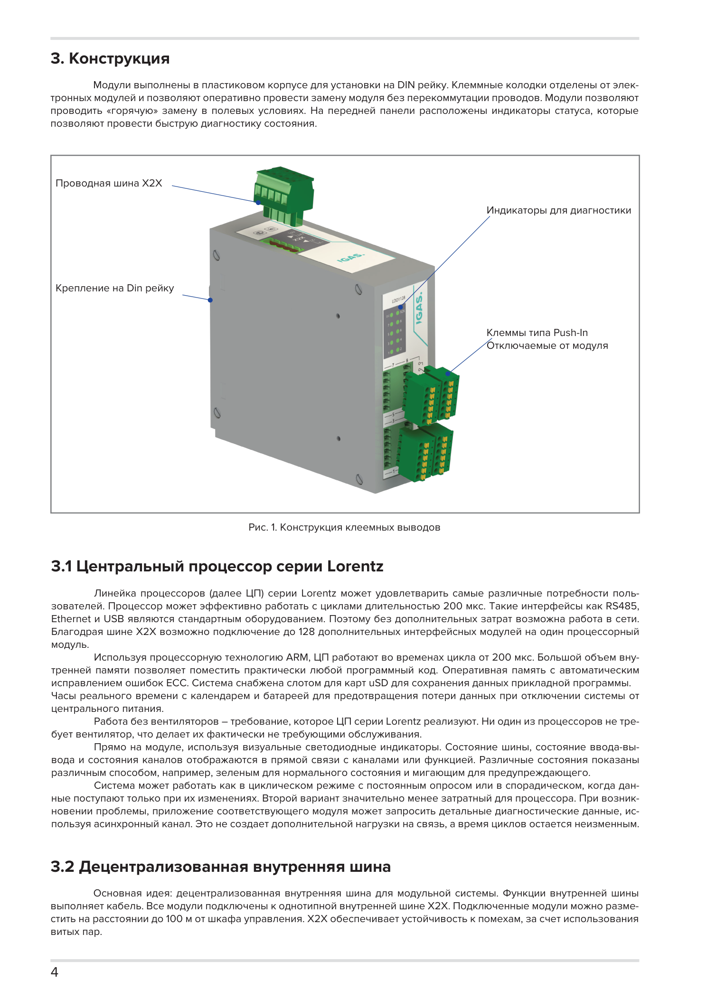{width=80%}

## Съёмные клеммные блоки и Push-In подключение

Полевая проводка подключается к съёмным клеммным блокам. Такое решение отделяет кабельную часть шкафа от электронного модуля и снижает трудоёмкость обслуживания. При замене модуля клеммный блок может быть снят с электронного узла без повторной разделки проводов, если объект переведён в безопасное состояние.

Клеммы Push-In применяются для ускорения монтажа и повышения повторяемости подключения. При этом клеммный блок не должен воспринимать массу кабельного жгута или усилие натяжения. Кабели фиксируются в кабельных каналах, зажимах или экранных скобах, а клеммы используются только как электрический контакт.

## Печатные платы и сборочный состав

Сборочные чертежи LCP2116, LAI1118, LDI1118 и LDO1128 показывают унифицированный состав модулей: корпус, крышка, пружинный элемент крепления, специализированные панели, печатная плата, световоды, разъёмы печатной платы, винты и гайки. Такое построение позволяет применять единую корпусную базу и изменять функциональность модуля за счёт специализированной платы и лицевых элементов.

| Модуль | Основная плата по сборочной документации | Конструктивная роль |
|---|---|---|
| LCP2116 | Плата процессорного модуля LCP PLC M3 PCB | Центральная обработка, интерфейсы, microSD, RTC, связь с X2X |
| LAI1118 | Плата модуля LAI PLC PCB | Измерение аналоговых и дискретных входных сигналов |
| LDI1118 | Плата модуля LDI PLC M3 PCB | Приём дискретных сигналов и передача состояний |
| LDO1128 | Плата модуля LDO PLC M3 PCB | Управление выходными реле и индикацией каналов |

## Лицевая панель и светодиодная индикация

Лицевая панель используется для маркировки модуля, обозначения каналов и визуальной диагностики. Светодиодная индикация должна оставаться видимой после монтажа и подключения кабелей. Кабельные каналы и жгуты не должны перекрывать индикаторы, слот microSD, Ethernet-разъёмы, USB-разъём, кнопки Reset/Erase и маркировку каналов.

# Электрическая архитектура и интерфейсы

## Питание

Основное питание системы выполняется от источника постоянного напряжения 24 V DC. В технических условиях для модулей серии указано питание 24 V с допустимым отклонением минус 15 %, а в документации отдельных модулей могут быть приведены уточнённые диапазоны. Источник питания должен выбираться по суммарному потреблению логики, модулей, внешних датчиков, исполнительных устройств, резерву на расширение и температурному режиму шкафа.

Самовосстанавливающиеся предохранители в модулях являются встроенной защитой изделия и не заменяют внешние аппараты защиты шкафа. Цепи питания, датчиков, исполнительных механизмов и релейных нагрузок должны иметь предохранители, автоматические выключатели или электронные защитные устройства, выбранные по проекту.

## Внутренняя шина X2X

X2X является внутренней системной линией Lorentz. По X2X передаются питание, данные и диагностические состояния между процессорным модулем и модулями ввода-вывода. Каждый модуль является адресным устройством и должен иметь уникальный адрес в пределах соответствующего сегмента.

При проектировании X2X проверяются:

- допустимая длина линии;
- тип кабеля и применение витых пар;
- экранирование и заземление экрана;
- падение напряжения на линии питания;
- количество подключённых модулей;
- суммарное потребление модулей;
- реакция прикладной программы на потерю связи;
- необходимость внешней защиты при выходе линии за пределы шкафа.

{width=85%}

## RS485, Ethernet и USB процессорного модуля

RS485 используется для связи с промышленными устройствами, периферийными приборами и объектовым оборудованием. В проекте должны быть заданы топология сети, полярность линий, скорость обмена, согласование, экранирование и защита от перенапряжений.

Ethernet используется для обмена с верхним уровнем, HMI, SCADA, инженерным программным обеспечением и сетевыми устройствами. Для промышленных шкафов предпочтительно применять экранированные кабели и обеспечивать разгрузку натяжения разъёмов RJ45.

USB является сервисным интерфейсом для диагностики и обслуживания. Он должен быть доступен при открытом шкафу, но не должен воспринимать механическую нагрузку от постоянно висящего кабеля.

## Аналоговые входы LAI1118

Аналоговые цепи 0...10 V и 0...20 mA являются помехочувствительными. Их необходимо прокладывать отдельно от силовых цепей, цепей коммутации релейных нагрузок, кабелей частотных приводов и цепей питания мощных исполнительных устройств. Для длинных линий применяются экранированные кабели, экранные зажимы и минимизация неэкранированного участка у клемм.

## Дискретные входы LDI1118

Дискретные входы подключаются к внешним контактам, датчикам, концевым выключателям и релейным выходам других устройств. При подключении должны соблюдаться допустимый диапазон входных напряжений, общая точка входной группы, защита длинных линий и требования к подавлению ложных срабатываний.

## Релейные выходы LDO1128

Релейные выходы коммутируют внешние цепи через сухие контакты. Питание нагрузки не берётся от модуля, если это специально не предусмотрено схемой. Источник питания нагрузки, предохранитель, коммутационная категория, подавление индуктивных выбросов и безопасное отключение должны задаваться внешней электрической схемой.

Для индуктивных нагрузок применяются внешние защитные элементы: диоды, TVS-диоды, варисторы или RC-цепи в зависимости от рода тока, напряжения, энергии нагрузки и требований к времени отпускания исполнительного устройства.

# Габаритные и компоновочные данные

Габаритные размеры применяются не только как размеры корпуса, но и как данные для проектирования монтажной зоны в шкафу. При компоновке необходимо учитывать выступающие клеммные блоки, радиус изгиба кабелей, доступ к разъёмам, место для маркировки, возможность снятия клеммников и доступ к органам обслуживания.

Новые габаритные чертежи LAI1118, LDI1118 и LDO1128 показывают полный компоновочный контур модулей с выступающими элементами. Для предварительного размещения на DIN-рейке по габаритным чертежам следует принимать высоту 138 mm, фронтальную ширину 46 mm и глубину до 153 mm для модулей ввода-вывода с передними клеммными блоками. При этом паспортные размеры могут отражать иной порядок записи или корпусный размер без части выступающих элементов; окончательная компоновка выполняется по утверждённому габаритному чертежу.

| Модуль | Данные по паспорту/datasheet | Данные по габаритному чертежу для компоновки | Примечание |
|---|---:|---:|---|
| LCP2116 | 138 x 45 x 45 mm / масса до 400-500 g по документам разных типов | высота 138 mm, фронтальная ширина 46 mm, корпусная глубина около 129 mm, полный габарит с выступающими элементами около 136 mm | Для шкафа учитывать Ethernet, USB, RS485, X2X и microSD. |
| LAI1118 | 118 x 138 x 45 mm; масса до 500 g | 138 x 46 x 153 mm | Для компоновки использовать ГЧ, так как он показывает выступание клемм. |
| LDI1118 | 118 x 45 x 126 mm по РЭ; диапазон входов уточняется по документации | 138 x 46 x 153 mm | ГЧ закрывает ранее отсутствующие габаритные данные. |
| LDO1128 | 118 x 45 x 126 mm по РЭ/datasheet | 138 x 46 x 153 mm | Для силовых цепей дополнительно учитывать радиус изгиба и разделение трасс. |

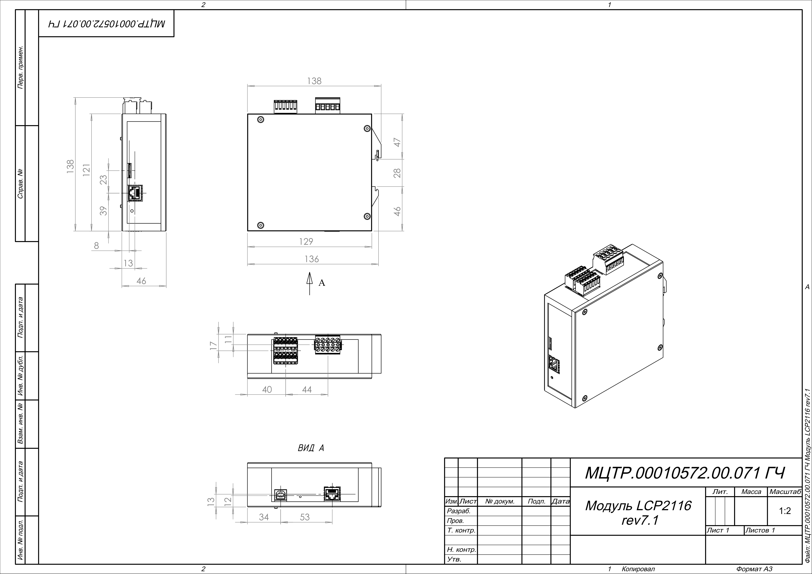{width=85%}

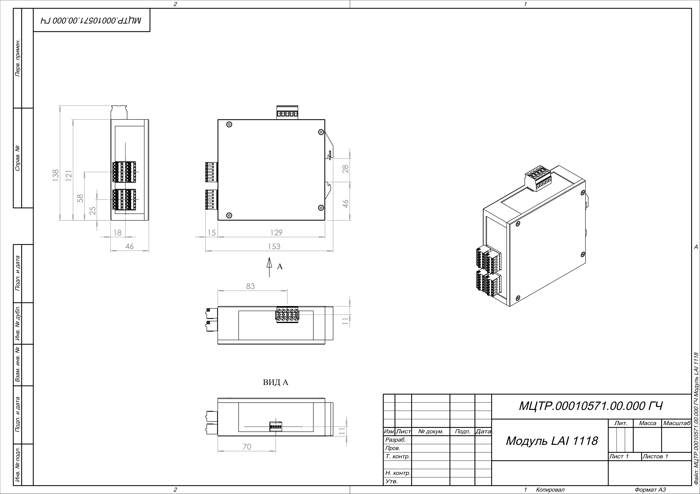{width=85%}

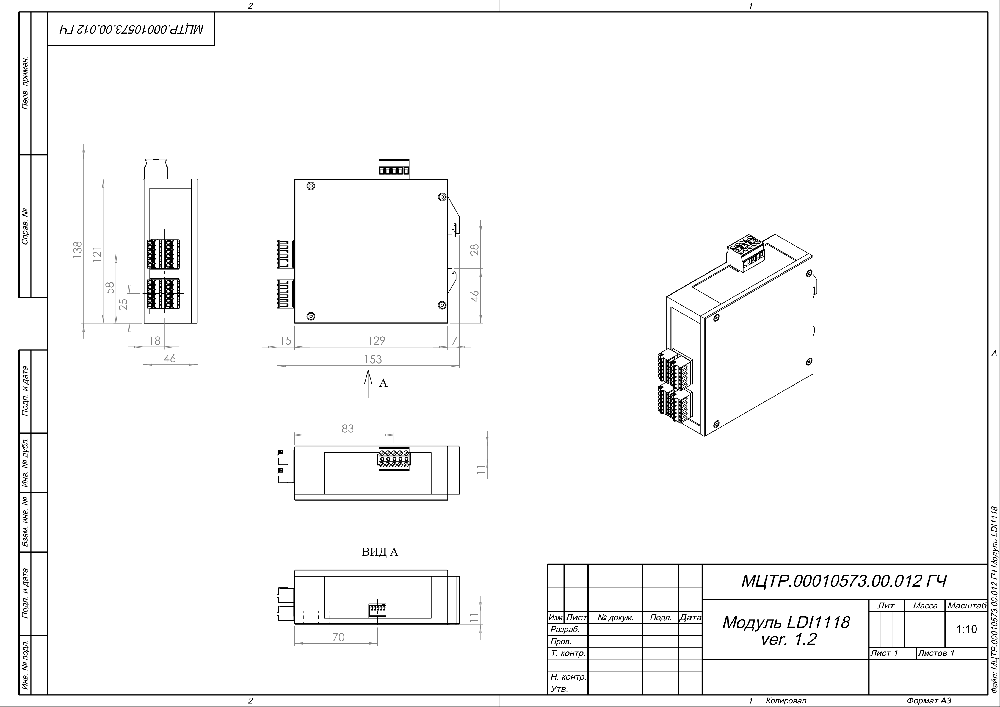{width=85%}

{width=85%}

## Расчёт занимаемой ширины на DIN-рейке

Ширина модульного ряда рассчитывается как сумма фронтальных ширин всех модулей, дополнительных зазоров, концевых фиксаторов и резерва расширения:

```text
Lряд = ΣWмодулей + Lзазоров + Lфиксаторов + Lрезерв
```

Для конфигурации LCP2116 + LAI1118 + LDI1118 + LDO1128 предварительная фронтальная ширина модулей по габаритным чертежам составляет около 184 mm без учёта концевых фиксаторов, межгрупповых зазоров, кабельных каналов и резерва. Рабочая длина DIN-рейки должна назначаться с запасом для обслуживания и возможного расширения.

# Монтаж, ЭМС и заземление

## Установка модулей

Модули устанавливаются на DIN-рейку внутри шкафа управления. Монтаж выполняется при отключённом питании, если утверждённая процедура обслуживания прямо не допускает иной режим. Перед установкой проверяются корпус, клеммные блоки, разъёмы, лицевая панель, маркировка и отсутствие следов перегрева, влаги, коррозии или механических повреждений.

При установке необходимо обеспечить:

- надёжную фиксацию модулей на DIN-рейке;
- доступность лицевой индикации;
- пространство для подключения и снятия клеммных блоков;
- доступ к RS485, Ethernet, USB, X2X и microSD;
- раздельную прокладку силовых и сигнальных цепей;
- разгрузку натяжения всех кабелей;
- подключение экранов к PE-шине или монтажной панели по проекту;
- читаемую маркировку модулей, клемм, каналов и кабелей.

## Электромагнитная совместимость

ЭМС системы определяется не только схемой модуля, но и компоновкой шкафа, трассировкой кабелей, заземлением, экранированием и защитой внешних линий. Силовые цепи, релейные выходы, кабели приводов и цепи коммутации нагрузок должны прокладываться отдельно от аналоговых входов, X2X, RS485 и Ethernet. При пересечении трасс предпочтительно пересечение под прямым углом.

Для аналоговых входов и линий связи применяются экранированные кабели. Экран подключается к заземлённой монтажной панели или PE-шине через экранные зажимы с минимальной длиной неэкранированного участка. Подключение экрана тонким длинным проводником ухудшает высокочастотное поведение и должно применяться только при отсутствии возможности использовать экранный зажим.

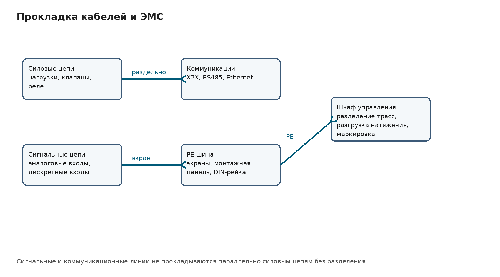{width=85%}

## Защита от электростатических разрядов

Электронные узлы модулей чувствительны к электростатическим разрядам. При монтаже, демонтаже, хранении и обслуживании необходимо исключить прикосновение к контактным площадкам, выводам компонентов, контактам разъёмов и внутренним элементам клеммных блоков. Персонал, инструмент и рабочее место должны быть заземлены при работе с открытыми электронными узлами.

Модуль в закрытом корпусе не требует специальной антистатической упаковки при обычном обращении, но должен защищаться от механических повреждений, влаги, пыли, загрязнения и электростатически заряженных предметов. Открытые платы, запасные электронные узлы и снятые модули без корпуса должны храниться в ESD-защищённой упаковке.

## Защита от перенапряжений

Цепи, выходящие за пределы шкафа, должны иметь внешнюю защиту от перенапряжений, если это требуется условиями объекта. В первую очередь защита рассматривается для линий RS485, X2X между шкафами, Ethernet-линий, питания 24 V DC, аналоговых входов, дискретных входов и релейных выходов, подключённых к внешним нагрузкам.

Встроенные защитные элементы модуля не заменяют защиту шкафа управления. Защита от грозовых и коммутационных перенапряжений должна проектироваться как часть электрической схемы объекта.

# Механическая и электрическая конфигурация

## Потенциальные группы

Потенциальная группа представляет собой совокупность цепей с общей системой питания, общим обратным проводом, общим способом защиты и общим принципом отключения. Разделение потенциальных групп применяется для локализации отказов, снижения влияния помех, разделения цепей датчиков и исполнительных устройств, организации аварийного отключения и упрощения обслуживания.

В системе Lorentz могут выделяться группа логики и X2X, группа аналоговых датчиков, группа дискретных входов, группа релейных нагрузок, группа цепей аварийного отключения и отдельные группы удалённых модулей.

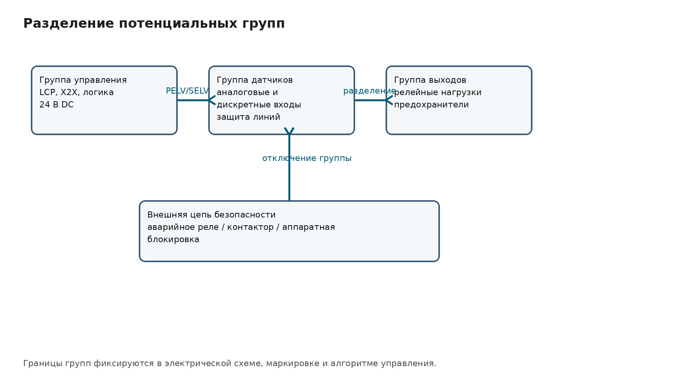{width=85%}

## Безопасное отключение потенциальной группы

Безопасное отключение потенциальной группы должно выполняться внешним аппаратным устройством: аварийным реле, контактором безопасности, защитным контроллером или другим утверждённым средством. Модули Lorentz не рассматриваются как самостоятельные устройства функциональной безопасности, если это прямо не указано в документации на конкретное исполнение.

При срабатывании аварийной функции отключаться должно питание той группы, которая содержит опасные исполнительные устройства. Питание процессорного модуля может оставаться включённым для регистрации аварии и диагностики, но оно не должно создавать обходной путь питания отключаемой группы.

## Расчёт питания

Расчёт питания выполняется раздельно для логики, модулей, датчиков, исполнительных устройств и релейных нагрузок:

```text
Pлогики = PLCP + ΣPIO
Pвнеш = Pдатчиков + Pисполнительных_устройств + Pсигнализации + Pвнешних_реле
Pисточника = Pлогики + Pвнеш + Pрезерв
Iисточника = Pисточника / 24
```

Если релейные нагрузки питаются от отдельного источника, они не включаются в расчёт питания логики, но обязательно включаются в расчёт своей потенциальной группы и в расчёт тепловыделения шкафа, если нагрузка расположена внутри шкафа.

# Диагностика, обслуживание и ремонтопригодность

Система Lorentz предусматривает несколько уровней диагностики: визуальную индикацию на модуле, передачу статусных данных в процессорный модуль, программную обработку состояния каналов, контроль конфигурации и идентификацию модулей по встроенным параметрам.

Визуальная диагностика применяется при монтаже, пусконаладке и обслуживании. Индикаторы отображают питание, состояние процессорного модуля, состояние X2X, активность RS485 и Ethernet, состояние входных и выходных каналов, ошибки запуска и ошибки чтения носителя.

Ремонтопригодность обеспечивается модульной структурой, съёмными клеммными блоками, унифицированной посадкой на DIN-рейку, адресацией модулей, встроенными параметрами идентификации и доступностью лицевой диагностики. При замене модуля необходимо проверить тип, аппаратную версию, адрес X2X, соответствие конфигурации и реакцию прикладной программы.

Перед заменой модуля объект переводится в безопасное состояние. Отключаются соответствующие цепи питания, снимаются клеммные блоки, отключается X2X и интерфейсные кабели, модуль снимается с DIN-рейки без перекоса, после чего устанавливается исправный модуль того же исполнения.

# Программное обеспечение и конфигурирование

Программное обеспечение системы Lorentz разделяется на встроенное программное обеспечение модулей и внешнее инженерное программное обеспечение. Встроенное программное обеспечение устанавливается в энергонезависимую память измерительных модулей в производственном цикле и в эксплуатации не должно быть доступно для изменения пользователем. Такое разделение фиксирует метрологически значимое поведение измерительных каналов и снижает риск несанкционированного изменения алгоритмов измерения.

Внешнее программное обеспечение IGAS Automation Studio применяется для конфигурирования системы. В его задачи входят:

- конфигурирование модулей и центральных процессоров;
- выбор количества используемых измерительных каналов;
- настройка диапазонов измерения и воспроизведения сигналов;
- выбор типа подключаемого датчика или преобразователя;
- конфигурирование каналов связи;
- программирование логических задач на ANSI C и C++;
- настройка интерфейса оператора;
- настройка архивирования данных и событий;
- тестирование сконфигурированного комплекса;
- установка паролей для защиты от несанкционированного доступа.

Файлы конфигурации процессорного модуля хранятся на microSD-карте. Через неё могут сохраняться параметры портов, подключённых устройств, порогов срабатывания, масок реле, журналы событий и другие данные, необходимые для работы системы. Изменение конфигурации должно выполняться только по утверждённой процедуре с контролем версии проекта и резервным копированием исходного состояния.

Приём и передача информационных и управляющих пакетов должны выполняться с контролем формата сообщений. Сообщения, не проходящие контроль структуры и допустимых параметров, не должны приниматься прикладной программой как достоверные. Это требование относится к обмену по внешним интерфейсам и к внутренним диагностическим данным, используемым для управления исполнительными устройствами.

# Безопасность применения

Модули Lorentz предназначены для обычного промышленного применения и не должны использоваться в системах, где отказ без дополнительных мер защиты может привести к гибели людей, тяжёлым травмам, значительному материальному ущербу или потере управляемости опасного объекта. К таким областям относятся системы управления ядерными реакциями, авиационные системы безопасности, медицинские системы жизнеобеспечения, системы управления вооружением и другие объекты, требующие отдельного подтверждения функциональной безопасности.

Система управления должна проектироваться так, чтобы отказ процессорного модуля, отказ модуля ввода-вывода, потеря X2X, зависание прикладной программы, потеря питания или отказ выходного реле не приводили к опасному состоянию объекта. Для всех критичных исполнительных устройств должны быть определены безопасные состояния и независимые аппаратные способы перехода в эти состояния.

По способу защиты от поражения электрическим током контроллеры относятся к классу III по ГОСТ 12.2.007.0-75. Степень защиты оболочки должна быть не ниже IP20. Установка и обслуживание выполняются квалифицированным персоналом с соблюдением требований руководства по эксплуатации, электрической схемы, проектной документации и местных правил безопасности.

# Кибербезопасность и защита конфигурации

Процессорный модуль LCP имеет физические и логические интерфейсы, через которые возможно изменение конфигурации, диагностика или обмен с внешними устройствами. К таким интерфейсам относятся Ethernet, RS485, USB, microSD и инженерное программное обеспечение.

Кибербезопасность системы должна обеспечиваться на уровне объекта. Для этого применяются:

- физическое ограничение доступа к шкафу управления;
- контроль доступа к microSD-карте;
- разграничение доступа к инженерному рабочему месту;
- сетевое разделение технологической сети и офисной сети;
- ограничение IP-доступа, если оно поддерживается конфигурацией;
- резервное копирование конфигураций;
- хранение эталонной версии проекта;
- регистрация изменений и событий;
- запрет использования неутверждённых носителей и кабелей;
- проверка конфигурации после обслуживания.

Кибербезопасность не должна рассматриваться отдельно от функциональной безопасности. Ошибка конфигурации, несанкционированное изменение параметров или подключение неутверждённого устройства могут привести к неправильной работе технологического объекта.

# Условия эксплуатации, хранения и утилизации

Система предназначена для эксплуатации в шкафу управления при условиях, заданных паспортами, техническими условиями и документацией на конкретные модули. По техническим условиям контроллеры должны сохранять работоспособность при температуре окружающего воздуха от -40 до +40 °C, атмосферном давлении от 90,6 до 107 kPa и относительной влажности до 98 % при отсутствии конденсации. В документации отдельных модулей могут быть указаны уточнённые диапазоны; при проектировании применяются данные конкретного исполнения.

Транспортирование и хранение должны исключать механические удары, вибрации сверх допустимых значений, влагу, конденсацию, токопроводящую пыль, агрессивные среды и электростатические воздействия. Перед монтажом модуль должен быть осмотрен. Изделие с повреждённым корпусом, разъёмом, клеммным блоком, следами влаги, перегрева или коррозии к монтажу не допускается.

При утилизации модули относятся к электронным отходам. Необходимо отделять электронные платы, пластиковые корпусные элементы, металлические крепёжные элементы, кабели, батареи CR2032 и носители microSD. Батареи и носители данных утилизируются отдельно по правилам для соответствующего типа отходов; перед утилизацией носителей должна быть исключена утечка конфигурационной и технологической информации.

# Оценка принятых технических решений

Принятая конструктивная схема Lorentz обеспечивает модульность, ремонтопригодность и адаптацию системы под конкретный объект. Использование единой корпусной базы и DIN-рейки снижает трудоёмкость шкафной компоновки. Съёмные клеммные блоки уменьшают время обслуживания и снижают риск ошибки при замене. Передняя индикация обеспечивает быструю первичную диагностику без подключения инженерного ПО.

Использование X2X как внутренней системной линии позволяет строить локальные и распределённые конфигурации. При этом X2X становится критичной системной линией, поэтому требует правильного кабеля, раздельной прокладки, экранирования, контроля длины и реакции прикладной программы на потерю связи.

Релейные выходы LDO1128 удобны для универсальной коммутации внешних цепей, но не должны использоваться как единственное средство безопасности. Для опасных нагрузок требуется внешнее аппаратное отключение и контроль обратной связи. Аналоговые входы LAI1118 требуют аккуратной ЭМС-компоновки, поскольку качество измерения зависит от трассировки, экранов, общих проводов и помеховой обстановки шкафа.

Главный остаточный риск системы связан не с отдельным модулем, а с проектированием шкафа и прикладной конфигурации: неправильное разделение потенциальных групп, отсутствие внешней защиты, некорректная реакция на потерю связи, неправильное заземление или отсутствие резервного состояния исполнительных устройств могут привести к отказу объекта даже при исправных модулях.

# Заключение

Система Lorentz представляет собой модульную платформу промышленной автоматизации, основанную на процессорном модуле LCP и адресных модулях ввода-вывода LAI, LDI и LDO. Принятые конструктивные решения ориентированы на шкафной монтаж, унификацию модулей, удобство подключения, визуальную диагностику, распределённую архитектуру и ремонтопригодность.

Для выпуска окончательной редакции конструкторской пояснительной записки необходимо выполнить нормоконтроль, присвоить обозначение документа, проверить все таблицы по утверждённым КД, согласовать порядок записи габаритов, добавить ссылки на электрические схемы, спецификации, перечни элементов, протоколы испытаний и программную документацию. После этого записка может быть включена в комплект документации изделия или технического проекта.

# Перечень использованных документов

| Обозначение / файл | Наименование |
|---|---|
| ТУ 4252-001-465265-20 | Серия модульных свободно программируемых контроллеров Lorentz. Технические условия. |
| draft05.md | Черновик конструкторской записки Lorentz. |
| 04_РЭ на модульные контролеры Lorentz rev 1.pdf | Руководство по эксплуатации модульных контроллеров Lorentz. |
| 01_Паспорт на модульные контролеры Lorentz.pdf | Паспорт модульных контроллеров Lorentz. |
| 01_МЦТР.000105572.00.000 Datasheet модуля LCP.pdf | Datasheet процессорного модуля LCP2116. |
| 02_МЦТР.000105572.00.000 Паспорт модуля LCP.pdf | Паспорт процессорного модуля LCP2116. |
| МЦТР.00010572.00.071 СБ | Сборочный чертёж модуля LCP2116 rev7.1. |
| МЦТР.00010572.00.071 ГЧ | Габаритный чертёж модуля LCP2116 rev7.1. |
| 01_МЦТР.00010571.00.000 Datasheet модуля LAI 1118.pdf | Datasheet модуля LAI1118. |
| 02_МЦТР.00010571.00.000 Паспорт модуля LAI 1118.pdf | Паспорт модуля LAI1118. |
| 04_МЦТР.00010571.00.000 РЭ | Руководство по эксплуатации модуля LAI1118. |
| МЦТР.00010571.00.000 СБ / ГЧ | Сборочный и габаритный чертежи модуля LAI1118. |
| 04_МЦТР.00010573.00.000 РЭ | Руководство по эксплуатации модуля LDI1118. |
| МЦТР.00010573.00.012 СБ / ГЧ | Сборочный и габаритный чертежи модуля LDI1118. |
| 01_МЦТР.00010570.00.000 Datasheet модуля LDO 1128.pdf | Datasheet модуля LDO1128. |
| 02_МЦТР.00010570.00.000 Паспорт модуля LDO 1128.pdf | Паспорт модуля LDO1128. |
| 04_МЦТР.00010570.00.000 РЭ | Руководство по эксплуатации модуля LDO1128. |
| МЦТР.00010570.00.030 СБ / ГЧ | Сборочный и габаритный чертежи модуля LDO1128. |

# Приложение А. Сводная таблица технических параметров {-}

| Параметр | LCP2116 | LAI1118 | LDI1118 | LDO1128 |
|---|---|---|---|---|
| Функция | Процессорный модуль | Аналоговый ввод | Дискретный ввод | Релейный вывод |
| Установка | DIN-рейка | DIN-рейка | DIN-рейка | DIN-рейка |
| Системная связь | X2X | X2X | X2X | X2X |
| Внешние интерфейсы | RS485, Ethernet, USB | Входные каналы | Входные каналы | Релейные контакты |
| Питание | 24 V DC | Через X2X / 24 V по документации | Через X2X / 24 V по документации | Через X2X / 24 V по документации |
| Количество каналов | Зависит от интерфейсов | 8 AI | 16 DI | 8 RO |
| Диапазоны | RS485/Ethernet/USB/X2X | 0...10 V; 0...20 mA | 0...24 V или 5...30 V DC по источнику | 30 V DC / 250 V AC, 2 A |
| Индикация | Питание, CPU, RS485, Ethernet, X2X, SD | Питание, X2X, каналы | Питание, X2X, каналы | Питание, X2X, выходы |
| Степень защиты | IP20 | IP20 | IP20 | IP20 |
| Основное ограничение | Центральная точка отказа системы | Помехочувствительность аналоговых цепей | Ложные срабатывания при плохой прокладке | Ресурс и защита контактов при нагрузках |

# Приложение Б. Перечень данных для уточнения перед выпуском {-}

Перед выпуском финальной редакции необходимо уточнить и внести в комплект документации:

- присвоенное обозначение конструкторской пояснительной записки;
- окончательный состав системы и перечень модулей конкретной поставки;
- утверждённые электрические схемы подключения LCP, LAI, LDI и LDO;
- перечни элементов и спецификации печатных плат;
- точные допустимые сечения проводников и длины зачистки для применённых клеммных блоков;
- допустимую длину и тип кабеля X2X;
- требования к согласованию RS485 и X2X;
- номиналы внешних предохранителей и защитных устройств;
- схемы потенциальных групп и аварийного отключения;
- методику расчёта тепловыделения для утверждённой компоновки;
- протоколы приёмосдаточных, климатических, электрических и ЭМС-испытаний;
- порядок конфигурирования, резервного копирования и восстановления проекта;
- требования к маркировке модулей, клемм, кабелей и потенциальных групп;
- порядок утилизации microSD, CR2032 и электронных узлов.
