# Пояснительная записка к конструкции модульной системы контроллеров Lorentz

**Обозначение документа:** TBD  
**Изделие:** модульные свободно программируемые контроллеры «Lorentz»  
**Исполнения, раскрытые в текущей редакции:** LCP2116, LAI1118, LDI1118, LDO1128  
**Редакция:** черновая редакция 0.4  

---

## Содержание

- 1. Общие положения
- 2. Нормативная и исходная база
  - 2.1. Нормативная база
  - 2.2. Исходные документы
- 3. Назначение и область применения
- 4. Системная архитектура Lorentz
  - 4.1. Общая модель системы
  - 4.2. Функциональные группы модулей
  - 4.3. Принятый принцип модульности
  - 4.4. Конфигурируемость системы
- 5. Конструктивная архитектура модулей
  - 5.1. Типовой модуль Lorentz
  - 5.2. Корпус
  - 5.3. Панели и маркировка
  - 5.4. Съемные клеммные разъемы
  - 5.5. Светодиодная индикация
  - 5.6. Сервисная замена
- 6. Центральный процессор серии Lorentz
  - 6.1. Назначение процессорного модуля
  - 6.2. Системные возможности
  - 6.3. Роль в конфигурации шкафа
- 7. Внутренняя шина X2X
  - 7.1. Назначение
  - 7.2. Децентрализованная структура
  - 7.3. Сквозное подключение
  - 7.4. Потенциальные группы
  - 7.5. Обмен данными
- 8. Электропитание
  - 8.1. Общие параметры питания
  - 8.2. Питание модулей через X2X
  - 8.3. Общие паспортные параметры
- 9. Монтаж и подключение
  - 9.1. Установка в шкаф
  - 9.2. Прокладка кабелей
  - 9.3. Подключение внешних цепей
- 10. Экранирование, заземление и EMC
  - 10.1. Общий принцип
  - 10.2. Разгрузка экрана и кабеля
  - 10.3. Разделение цепей
- 11. Диагностика и идентификация
  - 11.1. Уровни диагностики
  - 11.2. Встроенные параметры модулей
  - 11.3. Индикация состояния
- 12. Требования безопасности и обращения с модулями
  - 12.1. Квалификация персонала
  - 12.2. Электробезопасность
  - 12.3. Защита от ESD
  - 12.4. Транспортирование и хранение
- 13. Модуль LCP2116
  - 13.1. Назначение
  - 13.2. Основные функции
  - 13.3. Интерфейсы
  - 13.4. Конструктивное исполнение
- 14. Модуль LAI1118
  - 14.1. Назначение
  - 14.2. Основные функции
  - 14.3. Конструктивное исполнение
- 15. Модуль LDI1118
  - 15.1. Назначение
  - 15.2. Основные функции
  - 15.3. Конструктивное исполнение
- 16. Модуль LDO1128
  - 16.1. Назначение
  - 16.2. Основные функции
  - 16.3. Конструктивное исполнение
- 17. Перечень исполнений системы Lorentz
- 18. Принятые технические решения
- 19. Открытые данные для уточнения
- 20. Заключение

---
## 1. Общие положения

Настоящая пояснительная записка является текстовым конструкторским документом, поясняющим технические решения, принятые в конструкции модульной системы контроллеров Lorentz.

Документ подготовлен как связующее описание между комплектом конструкторской документации, паспортами модулей, руководствами по эксплуатации, электрическими схемами, программной конфигурацией и будущим описанием протоколов обмена.

Пояснительная записка описывает:

- назначение и область применения системы Lorentz;
- принцип построения модульной системы;
- конструктивную модель типового модуля;
- решения по корпусу, установке на DIN-рейку, подключению внешних цепей и шинной линии X2X;
- решения по питанию, потенциальным группам, экранированию и диагностике;
- особенности модулей LCP2116, LAI1118, LDI1118 и LDO1128;
- перечень открытых данных, требующих уточнения перед выпуском финальной редакции.

Документ не заменяет паспорт, руководство по эксплуатации, электрическую принципиальную схему, сборочный чертеж, программу и методику испытаний, инструкцию по конфигурированию и эксплуатационный регламент шкафа управления.

---

## 2. Нормативная и исходная база

### 2.1. Нормативная база

Пояснительная записка оформляется как текстовый документ ЕСКД. При подготовке структуры и состава разделов использованы следующие принципы:

- текст должен пояснять принятые технические решения, а не дублировать паспортные таблицы полностью;
- описание должно идти от общесистемной архитектуры к частным конструктивным узлам;
- эксплуатационные требования включаются только в том объеме, в котором они связаны с конструкцией, безопасностью, монтажом, обслуживанием и условиями применения;
- таблицы характеристик применяются для фиксации исходных параметров, но не подменяют собой паспорт изделия;
- рисунки используются как пояснение к конструктивным решениям, монтажу и системной архитектуре.

### 2.2. Исходные документы

| Документ | Использование в пояснительной записке |
|---|---|
| `MAX20-en_V4.40.pdf` | Структурный образец системного описания модульной промышленной системы: системные особенности, механика, подключение, питание, монтаж, диагностика, EMC. |
| `04_РЭ на модульные контролеры Lorentz rev 1.pdf` | Общее описание Lorentz: конструкция, центральный процессор, X2X, встроенные параметры модулей, диагностика, экранирование, обзор исполнений. |
| `01_Паспорт на модульные контролеры Lorentz.pdf` | Общие паспортные параметры системы: питание, шина передачи данных, предохранение, IP20, срок службы, гарантия, условия эксплуатации и хранения, перечень исполнений. |
| `01_МЦТР.000105572.00.000 Datasheet модуля LCP.pdf` | Назначение, интерфейсы, память, питание, диагностика и параметры LCP2116. |
| `02_МЦТР.000105572.00.000 Паспорт модуля LCP.pdf` | Паспортные данные LCP2116. |
| `МЦТР.00010572.00.071 СБ Модуль LCP2116 rev7.1.pdf` | Состав сборки LCP2116. |
| `01_МЦТР.00010571.00.000 Datasheet модуля LAI 1118.pdf` | Назначение и технические характеристики LAI1118. |
| `02_МЦТР.00010571.00.000 Паспорт модуля LAI 1118.pdf` | Паспортные данные LAI1118. |
| `МЦТР.00010571.00.000 СБ Модуль LAI 1118.pdf` | Состав сборки LAI1118. |
| `04_МЦТР.00010573.00.000 РЭ Руководство по эксплуатации модуля LDI 1118.pdf` | Назначение и технические характеристики LDI1118. |
| `МЦТР.00010573.00.012 СБ Модуль LDI 1118.pdf` | Состав сборки LDI1118. |
| `01_МЦТР.00010570.00.000 Datasheet модуля LDO 1128.pdf` | Назначение и технические характеристики LDO1128. |
| `02_МЦТР.00010570.00.000 Паспорт модуля LDO 1128.pdf` | Паспортные данные LDO1128. |
| `МЦТР.00010570.00.030 СБ Модуль LDO 1128 ver. 3.0.pdf` | Состав сборки LDO1128. |

---

## 3. Назначение и область применения

Модульные свободно программируемые контроллеры Lorentz предназначены для применения в промышленных системах автоматизации, управления, контроля, сбора сигналов и коммутации внешних цепей.

Система применяется в составе электротехнических шкафов, технологических установок, стендов и машин, где требуется:

- локальное или распределенное подключение модулей ввода-вывода;
- обработка аналоговых и дискретных сигналов;
- управление релейными выходами;
- связь с внешними устройствами по промышленным интерфейсам;
- конфигурирование состава системы под конкретную задачу;
- диагностика состояния модулей и каналов на уровне контроллера и визуальной индикации.

Система Lorentz рассчитана на обычное промышленное применение. Она не предназначена для применения в системах, где отказ контроллера без независимых защитных мер может привести к смерти, тяжелым травмам, серьезному ущербу или потере критически важных функций.

К недопустимым областям применения без дополнительных сертифицированных мер безопасности относятся:

- управление ядерными процессами;
- управление вооружением;
- системы управления полетами и безопасностью полетов;
- системы управления пассажирским и грузовым транспортом;
- медицинские системы жизнеобеспечения.

При использовании системы Lorentz в составе оборудования должны применяться внешние средства защиты, аварийного отключения, блокировки и диагностики, предусмотренные проектом машины или шкафа управления.

---

## 4. Системная архитектура Lorentz

### 4.1. Общая модель системы

Система Lorentz строится на базе процессорного модуля LCP и адресных модулей ввода-вывода, подключаемых к внутренней кабельной шине X2X.

Процессорный модуль выполняет функции центрального узла управления:

- выполняет прикладную программу;
- управляет обменом с модулями ввода-вывода;
- хранит конфигурацию и журналы событий;
- обеспечивает связь с внешними устройствами и операторскими панелями;
- выполняет диагностику модулей и каналов.

Модули ввода-вывода выполняют локальные функции:

- измерение аналоговых сигналов;
- прием дискретных сигналов;
- коммутация внешних цепей через релейные выходы;
- передача данных и диагностических состояний в процессорный модуль.

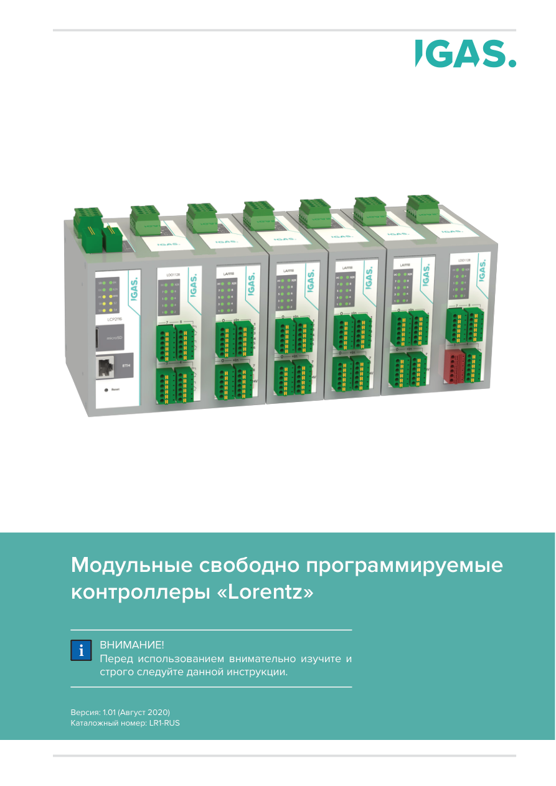

*Рисунок 1 — общий вид модульной системы Lorentz.*

### 4.2. Функциональные группы модулей

В текущей редакции раскрыты следующие функциональные группы:

| Группа | Назначение | Раскрытые исполнения |
|---|---|---|
| Процессорные модули | Центральное управление, связь, конфигурирование, журналы, обмен с модулями | LCP2116 |
| Модули аналогового ввода | Измерение сигналов напряжения, тока и дискретных состояний | LAI1118 |
| Модули дискретного ввода | Прием дискретных сигналов постоянного тока | LDI1118 |
| Модули релейного вывода | Коммутация внешних цепей через релейные контакты | LDO1128 |

Полная линейка Lorentz может включать аналоговые входные и выходные модули, счетные модули, температурные модули, модули дискретного ввода и вывода, процессорные и интерфейсные модули. В настоящей записке подробно описаны только исполнения, по которым предоставлены паспорта, руководства, datasheet и сборочные чертежи.

### 4.3. Принятый принцип модульности

Модульность Lorentz реализована на уровне законченных функциональных устройств. Каждый модуль является самостоятельным изделием в пластиковом корпусе для установки на DIN-рейку.

В отличие от архитектур с отдельным шинным основанием, съемной электронной вставкой и отдельным клеммным блоком, модуль Lorentz монтируется как единая конструктивная единица. Унификация обеспечивается не отдельным rack-основанием, а повторяемой конструкцией корпуса, передней панели, шинного подключения, клеммных зон и способа установки на DIN-рейку.

Такое решение принято для:

- сокращения количества отдельных монтажных компонентов;
- упрощения состава поставки;
- сохранения понятной связи между паспортом, обозначением модуля и физическим изделием;
- упрощения замены модуля как целого функционального блока;
- унификации внешнего вида, маркировки и размещения модулей в шкафу.

### 4.4. Конфигурируемость системы

Состав системы определяется задачей автоматизации. Процессорный модуль LCP может работать с набором адресных модулей, подключенных к X2X. Фактический состав модулей должен быть отражен в конфигурации проекта.

Конфигурируемость системы обеспечивается следующими решениями:

- адресной природой модулей;
- хранением идентификационных параметров в модуле;
- использованием единой шинной линии X2X;
- унифицированным корпусом и электрическим интерфейсом подключения;
- поддержкой программной конфигурации в IGAS Automation Studio.

Состав оборудования может отличаться между исполнениями шкафов и технологических объектов. При этом конструктивная модель системы сохраняется: центральный LCP, кабельная шина X2X, адресные модули ввода-вывода, питание 24 V DC, визуальная и программная диагностика.

---

## 5. Конструктивная архитектура модулей

### 5.1. Типовой модуль Lorentz

Типовой модуль Lorentz включает:

- пластиковый корпус;
- крышку корпуса;
- пружинный элемент фиксации на DIN-рейке;
- печатную плату функционального модуля;
- переднюю панель с маркировкой и зоной индикации;
- верхнюю панель X2X;
- нижнюю панель Slave;
- съемные клеммные разъемы;
- световоды для вывода индикации;
- крепежные элементы.

*Рисунок 2 — конструкция типового модуля Lorentz: DIN-рейка, шина X2X, диагностические индикаторы и съемные клеммы Push-In.*

### 5.2. Корпус

Корпус выполняет функции несущего, защитного и монтажного элемента. Он обеспечивает:

- установку модуля на DIN-рейку;
- размещение печатной платы внутри корпуса;
- механическую защиту электронного узла от случайного прикосновения;
- фиксацию передней, верхней и нижней панелей;
- вывод разъемов в зоны подключения;
- установку световодов для индикации;
- сохранение единой ширины и высоты модулей в ряду шкафа.

Корпус имеет степень защиты IP20 и предназначен для установки внутри шкафа управления. Эксплуатация модуля без шкафа, в условиях прямого воздействия влаги, конденсата, пыли, токопроводящих загрязнений или механических воздействий не является штатным режимом применения.

### 5.3. Панели и маркировка

Передняя панель является эксплуатационной плоскостью модуля. На ней размещаются:

- обозначение модуля;
- светодиодная индикация;
- маркировка каналов;
- разъемы полевых цепей;
- графические обозначения назначения клемм.

Верхняя панель используется для подключения X2X. Нижняя панель используется для цепей Slave или сквозного шинного подключения в зависимости от исполнения модуля.

Маркировка должна обеспечивать однозначное соответствие между:

- номером канала в документации;
- номером клеммы на модуле;
- переменной или каналом в конфигурации;
- проводником в шкафу управления.

### 5.4. Съемные клеммные разъемы

Подключение внешних цепей выполняется через съемные клеммные разъемы. Такое решение отделяет полевую проводку от электронного узла модуля и упрощает обслуживание.

Съемные клеммы позволяют:

- выполнять монтаж проводки до установки или замены модуля;
- заменять функциональный модуль без повторной разделки каждого проводника;
- уменьшать риск ошибки при сервисе;
- сократить время восстановления системы при неисправности модуля.

Клеммные блоки должны фиксироваться в штатном положении. Кабели должны быть закреплены в шкафу так, чтобы усилия от жгутов и изгибов не передавались на разъемы модуля.

### 5.5. Светодиодная индикация

Светодиодная индикация выводится на переднюю панель через световоды. Индикация используется для локальной диагностики:

- питания;
- состояния модуля;
- состояния шины X2X;
- состояния отдельных каналов;
- активности интерфейсов связи, если это предусмотрено исполнением.

Индикация снижает время первичной диагностики при пусконаладке и обслуживании, так как базовое состояние модуля видно без подключения диагностического оборудования.

### 5.6. Сервисная замена

Конструкция ориентирована на замену модуля как законченного функционального блока. При замене сохраняется разделение между шкафной проводкой и электронным узлом за счет съемных клеммных разъемов.

В документации системы указана возможность оперативной замены модулей в полевых условиях. В настоящей пояснительной записке это рассматривается как конструктивная возможность. Фактическая замена должна выполняться по утвержденному регламенту обслуживания с учетом состояния питания, внешних цепей, наличия опасных напряжений и требований электробезопасности.

---

## 6. Центральный процессор серии Lorentz

### 6.1. Назначение процессорного модуля

Процессорный модуль является центральным элементом системы Lorentz. Он выполняет прикладной цикл управления, управляет шиной X2X, обрабатывает данные модулей ввода-вывода, поддерживает внешние интерфейсы и хранит конфигурационные данные.

В системе Lorentz процессорный модуль выполняет роль:

- контроллера прикладной логики;
- ведущего узла шины X2X;
- коммуникационного узла для внешних устройств;
- узла хранения конфигурации и журналов событий;
- диагностического узла системы.

### 6.2. Системные возможности

К системным возможностям процессорной части относятся:

- процессорная архитектура ARM;
- рабочий цикл от 200 µs;
- стандартные интерфейсы RS-485, Ethernet и USB;
- подключение до 128 дополнительных интерфейсных или I/O-модулей по X2X;
- оперативная память с коррекцией ошибок ECC;
- слот uSD для хранения прикладных данных;
- часы реального времени с календарем и батарейным резервированием;
- безвентиляторная конструкция.

Безвентиляторная конструкция исключает вентилятор как изнашиваемый узел и снижает требования к техническому обслуживанию по сравнению с системами принудительного охлаждения.

### 6.3. Роль в конфигурации шкафа

LCP формирует логический центр шкафа управления. От него строится конфигурация модулей, адресное пространство, обмен по X2X и внешняя связь. Фактический состав модулей должен быть согласован с конфигурационными файлами, прикладной программой и схемой шкафа.

---

## 7. Внутренняя шина X2X

### 7.1. Назначение

X2X является внутренней кабельной магистралью системы Lorentz. Через X2X передаются питание и данные между процессорным модулем и модулями ввода-вывода.

В состав шинного подключения входят:

- цепь питания 24 V DC;
- общий провод;
- дифференциальная линия обмена;
- сквозное подключение между модулями.

Каждый модуль является активной шинной станцией. Обмен организуется процессорным модулем в соответствии с конфигурацией системы.

### 7.2. Децентрализованная структура

Основная конструктивная идея X2X в системе Lorentz — вынесение функций внутренней шины в кабельную линию. Это позволяет строить как компактные рядные конфигурации внутри шкафа, так и распределенные участки с удаленными модулями.

Документация Lorentz указывает возможность размещения подключенных модулей на расстоянии до 100 m от шкафа управления. Для повышения помехоустойчивости линия выполняется с использованием витых пар.

*Рисунок 3 — распределенная структура модулей Lorentz с удаленными сегментами X2X.*

### 7.3. Сквозное подключение

Модули подключаются к X2X последовательно, с передачей линии от одного модуля к следующему. Такое решение формирует общую магистраль питания и данных для группы модулей.

*Рисунок 4 — сквозная шина X2X между модулями Lorentz.*

### 7.4. Потенциальные группы

Шина X2X используется не только как линия данных, но и как магистраль электропитания. Поэтому при проектировании шкафа необходимо учитывать группы питания и нагрузки модулей.

Документация Lorentz предусматривает две модели шинного питания:

- со сквозным электропитанием системы ввода-вывода;
- с отдельным электропитанием системы ввода-вывода.

Различные потенциальные группы могут применяться для:

- групп входов;
- групп выходов;
- цепей аварийного отключения;
- участков с различными требованиями к гальваническому разделению;
- участков с различными источниками питания.

Границы потенциальных групп должны задаваться электрической схемой шкафа, а не произвольным расположением модулей.

### 7.5. Обмен данными

Система поддерживает циклический обмен с постоянным опросом и спорадический обмен, при котором данные передаются при изменении состояния. Спорадический обмен уменьшает нагрузку на процессор и шину при малой частоте изменения сигналов.

При возникновении неисправности приложение может запрашивать расширенные диагностические данные по асинхронному каналу. Это отделяет основную передачу технологических данных от диагностического обмена.

---

## 8. Электропитание

### 8.1. Общие параметры питания

Питание системы выполняется от источника постоянного тока 24 V DC. Паспортные данные для модульной системы Lorentz указывают питание 24 V DC с допуском -15 %.

В системе применяется самовосстанавливающееся предохранение. Это решение выбрано для защиты при перегрузках в пределах допустимых сценариев и восстановления работоспособности после устранения причины перегрузки без замены плавкого элемента.

### 8.2. Питание модулей через X2X

Через X2X передаются питание и данные. При проектировании системы необходимо учитывать:

- потребляемую мощность модулей;
- длину кабельной линии;
- падение напряжения на проводниках;
- группировку модулей по функциональным и потенциальным группам;
- допустимые режимы коммутации выходных цепей;
- наличие отдельных источников питания для нагрузок.

Питание полевых нагрузок не должно рассматриваться как часть питания внутренней логики без проверки по схеме конкретного модуля и шкафа.

### 8.3. Общие паспортные параметры

| Параметр | Значение |
|---|---:|
| Электрическое питание | 24 V DC, -15 % |
| Цифровой выход передачи данных | X2X |
| Предохранитель | самовосстанавливающийся |
| Средняя наработка на отказ, не менее | 24000 h |
| Корпус | IP20 |
| Срок службы модуля, не менее | 10 лет |
| Потребляемая мощность без подключенных устройств, не более | 1 W |
| Срок гарантии при условии технического обслуживания | 60 месяцев |

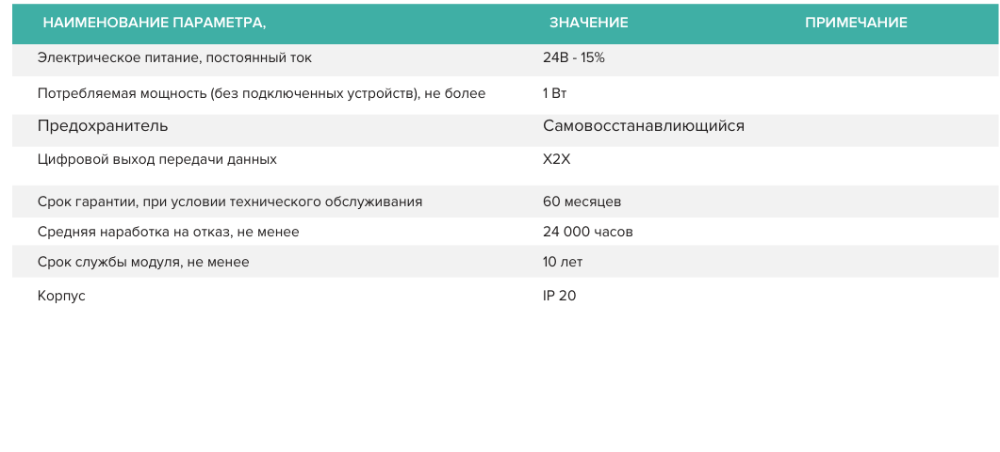

*Рисунок 5 — общие технические характеристики системы Lorentz по паспорту.*

---

## 9. Монтаж и подключение

### 9.1. Установка в шкаф

Модули Lorentz предназначены для установки в электротехнический шкаф на DIN-рейку. Установка должна выполняться квалифицированным персоналом с применением подходящего инструмента и с учетом требований проекта шкафа.

При компоновке шкафа необходимо обеспечить:

- доступ к клеммным разъемам;
- видимость светодиодной индикации;
- возможность снятия съемных клемм;
- допустимые радиусы изгиба кабелей;
- разгрузку разъемов от механических усилий;
- прокладку сигнальных и силовых цепей с учетом EMC;
- возможность идентификации модуля и каналов после монтажа.

### 9.2. Прокладка кабелей

Кабели должны прокладываться так, чтобы не создавать механического напряжения на клеммах. Для этого применяются кабельные каналы, зажимы, стяжки и разгрузка натяжения.

Не допускается использовать разъем модуля как несущий элемент кабельного жгута. Усилие от изгиба, веса и натяжения кабеля должно восприниматься элементами шкафа, а не клеммной группой модуля.

### 9.3. Подключение внешних цепей

Подключение выполняется по схемам конкретного модуля и шкафа. Для каналов ввода-вывода должны быть однозначно определены:

- номер модуля;
- номер канала;
- номер клеммы;
- тип сигнала;
- источник питания внешней цепи;
- общий провод или потенциальная группа;
- наличие экрана и точка его подключения.

Для модулей релейного вывода дополнительно должны быть определены параметры коммутируемой цепи, тип нагрузки, наличие защитных элементов на индуктивных нагрузках и требования к разделению цепей.

---

## 10. Экранирование, заземление и EMC

### 10.1. Общий принцип

Экранирование и заземление относятся к системным решениям шкафа. Пластиковый корпус модуля не является проводящим экраном и не должен рассматриваться как элемент защитного заземления.

Для кабелей, требующих экранирования, экран должен подключаться к заземляющей шине или монтажной панели шкафа через предназначенный для этого зажим. Подключение экрана должно выполняться так, чтобы обеспечивать низкоомный путь для высокочастотных помех.

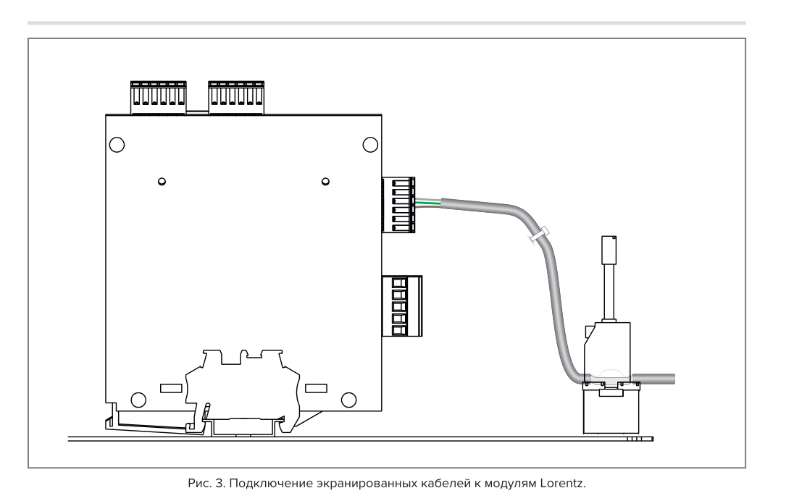

*Рисунок 6 — подключение экранированных кабелей к модулям Lorentz с фиксацией экрана на монтажной панели.*

### 10.2. Разгрузка экрана и кабеля

Экран кабеля и кабельный жгут должны быть механически зафиксированы в шкафу. Это снижает нагрузку на клеммный разъем и уменьшает риск нарушения контакта при вибрации, обслуживании или перемещении проводки.

Экранированные кабели нескольких модулей могут группироваться в пределах одного зажима, если это допускается проектом шкафа и не ухудшает качество соединения экрана с шиной заземления.

### 10.3. Разделение цепей

При проектировании шкафа необходимо разделять:

- цепи питания;
- сигнальные цепи аналоговых входов;
- дискретные входы;
- релейные выходы и силовые цепи;
- Ethernet и другие высокочастотные линии связи;
- цепи X2X.

Цель разделения — снизить паразитные наводки, избежать передачи коммутационных помех в измерительные цепи и обеспечить устойчивость обмена по внутренней шине.

---

## 11. Диагностика и идентификация

### 11.1. Уровни диагностики

Диагностика Lorentz построена на нескольких уровнях:

- локальная светодиодная индикация на модуле;
- передача состояния модуля по X2X;
- передача состояния каналов;
- встроенные идентификационные параметры;
- запрос расширенной диагностики через программный канал;
- обработка диагностических состояний в прикладной программе.

Такое разделение позволяет выполнить первичную диагностику непосредственно у шкафа и затем перейти к программному анализу состояния системы.

### 11.2. Встроенные параметры модулей

Встроенная память внутреннего процессора модуля содержит данные о типе модуля, заводском номере, функциональных возможностях и версии прошивки. Эти сведения учитываются в IGAS Automation Studio.

Назначение встроенных параметров:

- идентификация фактически установленного модуля;
- проверка соответствия установленного оборудования конфигурации;
- снижение риска ошибки при пусконаладке;
- упрощение обслуживания и замены модулей;
- фиксация версии аппаратно-программного исполнения.

### 11.3. Индикация состояния

Светодиодная индикация должна использоваться как первый уровень диагностики. Она позволяет определить наличие питания, состояние обмена, состояние модуля и каналов без подключения ПК.

Программная диагностика должна использоваться для получения расширенных данных: ошибок конфигурации, недоступности модуля, отказов каналов, ошибок обмена и несоответствия фактического состава системы проекту.

---

## 12. Требования безопасности и обращения с модулями

### 12.1. Квалификация персонала

Монтаж, подключение, ввод в эксплуатацию, диагностика и замена модулей должны выполняться квалифицированным персоналом. Персонал должен знать правила монтажа, эксплуатации и обслуживания промышленного электрооборудования.

### 12.2. Электробезопасность

Монтаж и демонтаж должны выполняться при снятом питании, если иной порядок не установлен утвержденным эксплуатационным регламентом. Перед включением оборудования должны быть закрыты все токоведущие части.

Цепи, в которых возможно опасное напряжение, должны иметь конструктивную и организационную защиту от случайного прикосновения. Защитное заземление шкафа и подключенных устройств должно выполняться по проекту шкафа и действующим правилам электромонтажа.

### 12.3. Защита от ESD

Модули содержат электронные компоненты, чувствительные к электростатическим разрядам. При обращении с модулями необходимо:

- исключить касание контактов разъемов без необходимости;
- применять антистатическую упаковку для хранения и транспортирования электронных узлов;
- использовать заземление персонала при работе с открытыми электронными частями;
- заземлять измерительное оборудование;
- не размещать электронные узлы на заряженных пластиковых поверхностях.

### 12.4. Транспортирование и хранение

При транспортировании и хранении модули должны быть защищены от чрезмерных механических нагрузок, недопустимой температуры, влажности и агрессивной среды.

Общие условия хранения по паспорту:

| Параметр | Значение |
|---|---:|
| Температура окружающей среды | -20...+40 °C |
| Атмосферное давление | 90.6...107 kPa |
| Относительная влажность | 0...98 %, без конденсации |

Общие условия эксплуатации по паспорту:

| Параметр | Значение |
|---|---:|
| Температура окружающей среды | -40...+40 °C |
| Атмосферное давление | 90.6...107 kPa |
| Относительная влажность | 0...98 %, без конденсации |

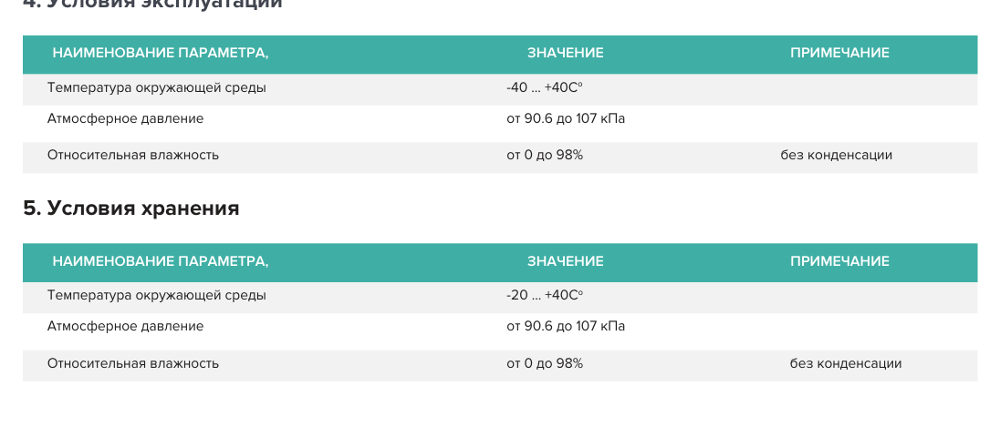

*Рисунок 7 — условия эксплуатации и хранения системы Lorentz по паспорту.*

---

## 13. Модуль LCP2116

### 13.1. Назначение

LCP2116 является процессорным модулем системы Lorentz. Модуль предназначен для управления и контроля модулей ввода-вывода через X2X, связи с внешними устройствами, взаимодействия с операторскими панелями и ведения журналов событий.

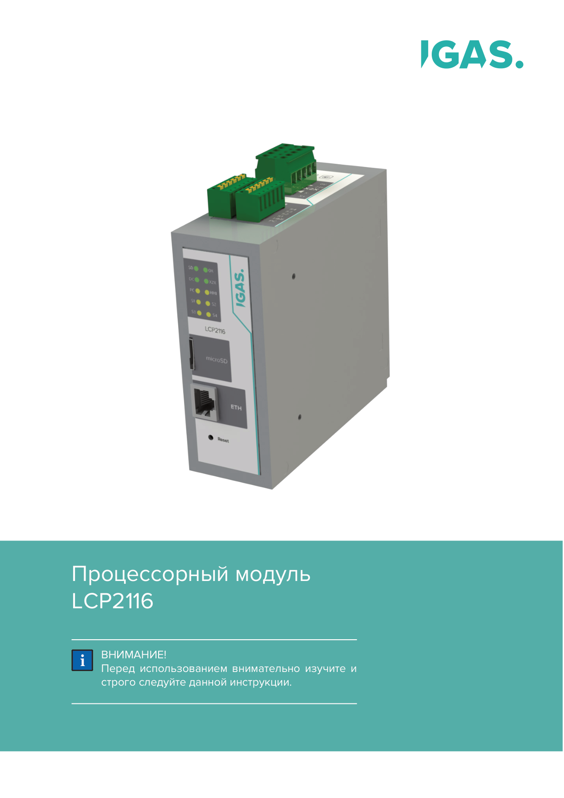

*Рисунок 8 — общий вид процессорного модуля LCP2116.*

### 13.2. Основные функции

LCP2116 выполняет следующие функции:

- управление модулями ввода-вывода серии Lorentz через X2X;
- связь с внешними устройствами по RS-485 и Ethernet;
- взаимодействие с сенсорными панелями ввода-вывода информации;
- ведение журналов событий с записью на uSD;
- хранение файлов конфигурации на съемной uSD-карте;
- поддержание времени через часы реального времени с батареей CR2032;
- диагностика и обслуживание через USB.

Модуль работает под управлением операционной системы реального времени IGAS RT и выполнен на базе ARM Cortex-M3.

### 13.3. Интерфейсы

LCP2116 поддерживает:

- последовательные интерфейсы RS-485;
- Ethernet 10/100Base-T через RJ45;
- USB 2.0 для диагностики и технического обслуживания;
- внутреннюю шину X2X для обмена с локальными и удаленными модулями ввода-вывода.

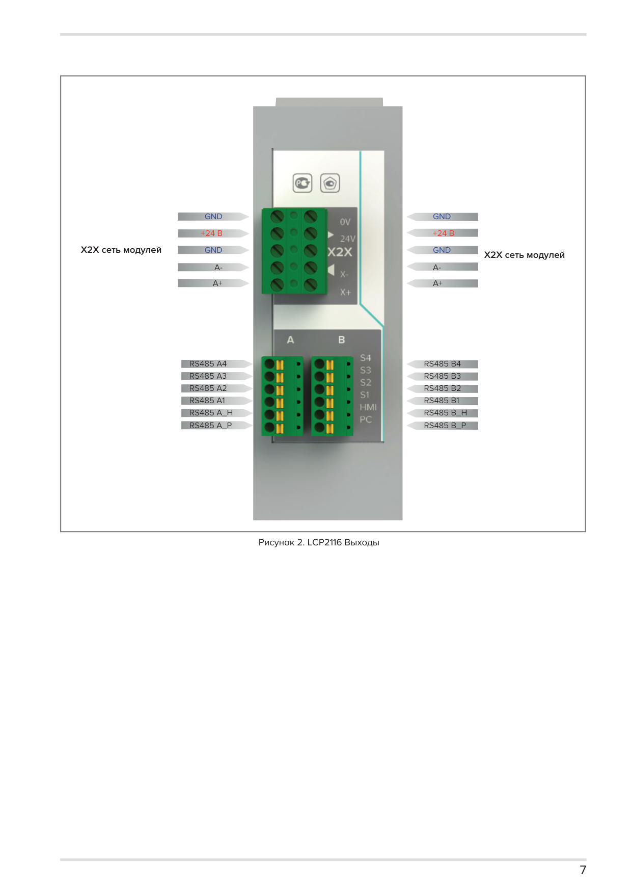

*Рисунок 9 — зоны подключения и интерфейсы LCP2116.*

### 13.4. Конструктивное исполнение

Сборка LCP2116 включает унифицированный корпус Lorentz, крышку корпуса, пружинный элемент фиксации, переднюю панель LCP, верхнюю панель X2X, нижнюю панель Slave, печатную плату LCP, световоды, клеммные разъемы и крепеж.

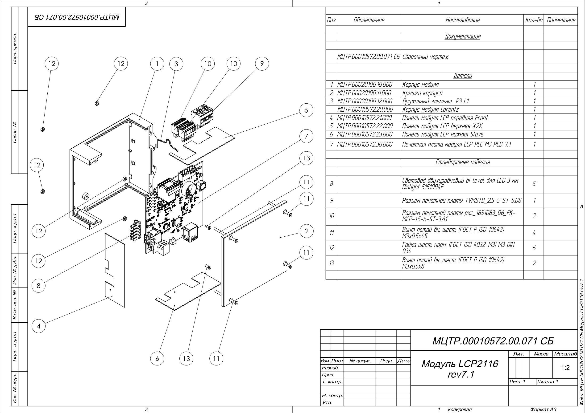

*Рисунок 10 — сборочный чертеж LCP2116.*

---

## 14. Модуль LAI1118

### 14.1. Назначение

LAI1118 является модулем аналоговых входов системы Lorentz. Модуль предназначен для измерения аналоговых сигналов напряжения 0...10 V, токовых сигналов 0...20 mA и дискретных сигналов в диапазоне 0...24 V.

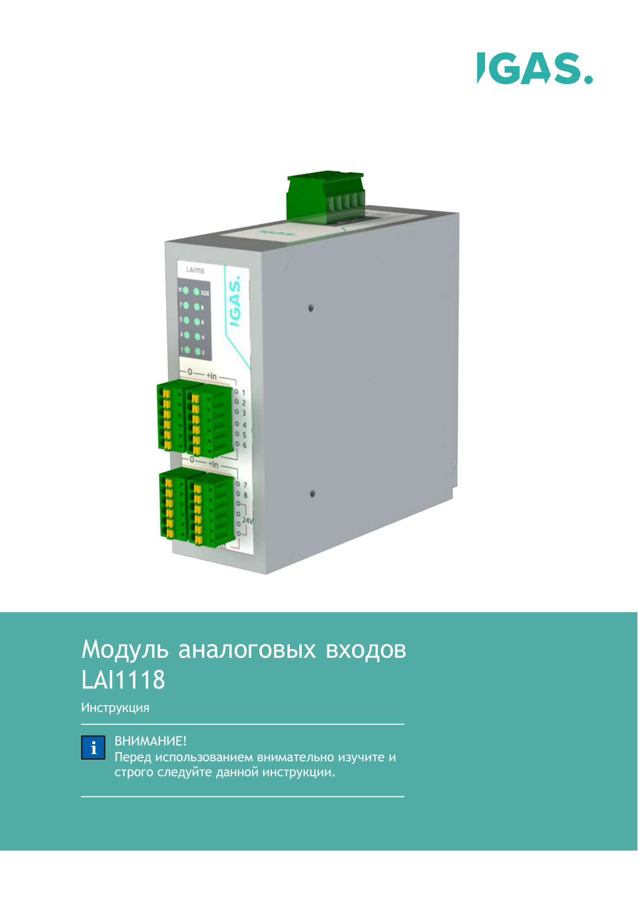

*Рисунок 11 — общий вид модуля аналоговых входов LAI1118.*

### 14.2. Основные функции

LAI1118 обеспечивает:

- 8 аналоговых входов;
- программный выбор режима входа: напряжение или ток;
- измерение максимальной амплитуды сигнала;
- разрешение 16 bit;
- скорость измерения 200 измерений в секунду;
- обмен с процессорным модулем по X2X;
- индикацию состояния модуля и входов.

### 14.3. Конструктивное исполнение

Модуль выполнен в унифицированном корпусе Lorentz. Внешние сигналы подключаются через съемные клеммные блоки на передней панели. Шинное питание и обмен выполняются через X2X.

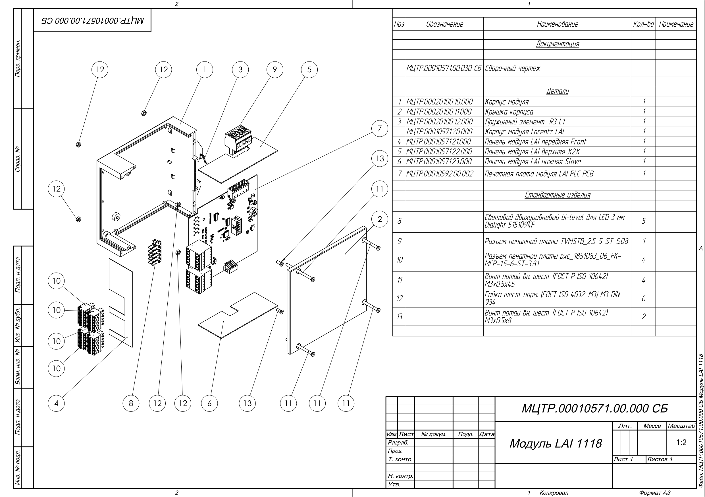

*Рисунок 12 — сборочный чертеж LAI1118.*

---

## 15. Модуль LDI1118

### 15.1. Назначение

LDI1118 является модулем дискретных входов системы Lorentz. Модуль предназначен для приема дискретных сигналов постоянного тока в диапазоне 0...24 V.

*Рисунок 13 — общий вид модуля дискретных входов LDI1118.*

### 15.2. Основные функции

LDI1118 обеспечивает:

- 16 дискретных входов;
- прием сигналов постоянного тока;
- измерение состояния входов;
- передачу данных в процессорный модуль по X2X;
- индикацию состояния модуля и входов;
- адресное включение в сеть модулей.

### 15.3. Конструктивное исполнение

Модуль выполнен в унифицированном корпусе Lorentz. Входные цепи подключаются через съемные клеммные блоки. Конструктивная компоновка соответствует общей модели модулей Lorentz: корпус, крышка, пружинный элемент, передняя панель, верхняя панель X2X, нижняя панель Slave, печатная плата, клеммные разъемы и крепеж.

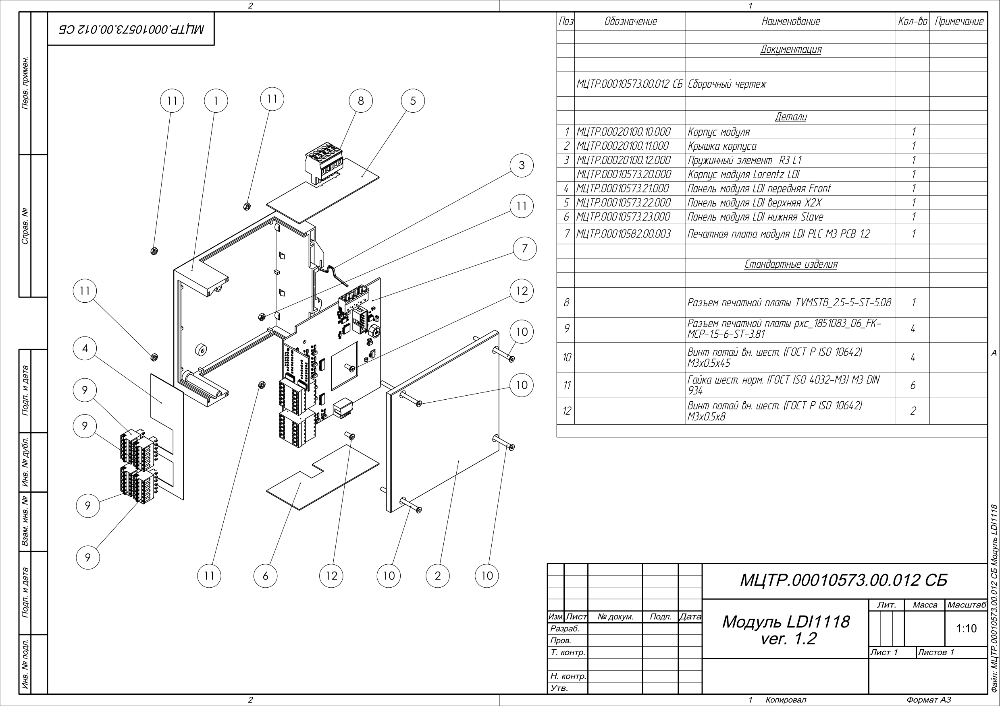

*Рисунок 14 — сборочный чертеж LDI1118.*

---

## 16. Модуль LDO1128

### 16.1. Назначение

LDO1128 является модулем релейных выходов системы Lorentz. Модуль предназначен для коммутации внешних устройств с помощью выходных реле.

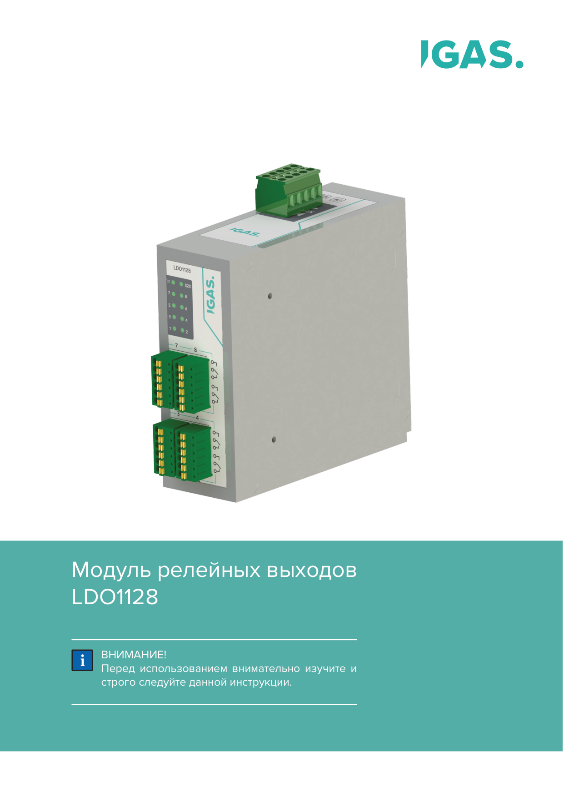

*Рисунок 15 — общий вид модуля релейных выходов LDO1128.*

### 16.2. Основные функции

LDO1128 обеспечивает:

- 8 релейных выходов;
- наличие нормально разомкнутых и нормально замкнутых групп контактов;
- коммутацию цепей постоянного и переменного тока в пределах паспортных параметров;
- обмен с процессорным модулем по X2X;
- индикацию состояния модуля и выходов.

### 16.3. Конструктивное исполнение

Модуль выполнен в унифицированном корпусе Lorentz. Релейные выходы подключаются через съемные клеммные блоки на передней панели. Шинное подключение выполняется через X2X.

Для релейных выходов при проектировании шкафа должны быть определены:

- тип нагрузки;
- рабочее напряжение и ток;
- способ защиты контактов при индуктивных нагрузках;
- разделение цепей управления и силовых цепей;
- требования к зазорам, трассировке и маркировке проводников в шкафу.

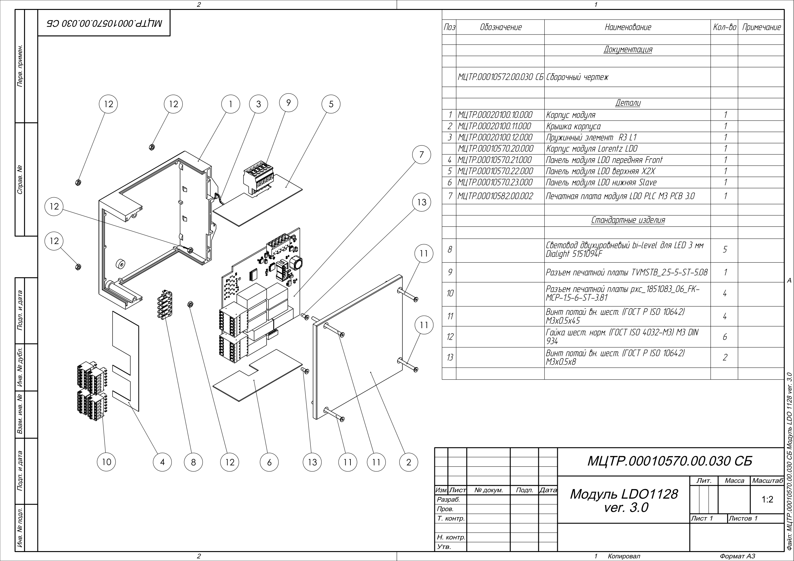

*Рисунок 16 — сборочный чертеж LDO1128.*

---

## 17. Перечень исполнений системы Lorentz

В общей документации Lorentz приведены следующие группы исполнений:

| Группа | Примеры обозначений | Назначение |
|---|---|---|
| Аналоговый ввод | LAI1118, LAI1168, LAI1268 | Ввод сигналов постоянного тока, напряжения и дискретных сигналов |
| Аналоговый вывод | LAO1118, LAO1168, LAO1268 | Вывод сигналов постоянного тока и напряжения |
| Счетные модули | LCM1118, LCM1168 | Счет импульсов |
| Температурные модули | LAT1118, LAT1168 | Ввод сигналов термопар и термопреобразователей сопротивления |
| Модули переменного тока | LCT1114, LCT1164 | Измерение силы и напряжения переменного тока промышленной частоты |
| Релейный вывод | LDO1118, LDO1128 | Релейная коммутация внешних цепей |
| Транзисторный и твердотельный вывод | LDO2118, LDO3168 | Дискретный вывод |
| Дискретный ввод | LDI1118, LDI1218 | Прием дискретных сигналов постоянного или переменного тока |
| Процессорные модули | LCP2116, LCP2126, LCP4116, LPC1164, LFL1112 | Обработка цифровых сигналов и управление системой |
| Интерфейсные модули | LHI1112, LLI1111, LWI1111, LBI1111, LWH1111, LCI1112 | HART, LoRa, Wi-Fi, Bluetooth, Wireless HART, CAN |

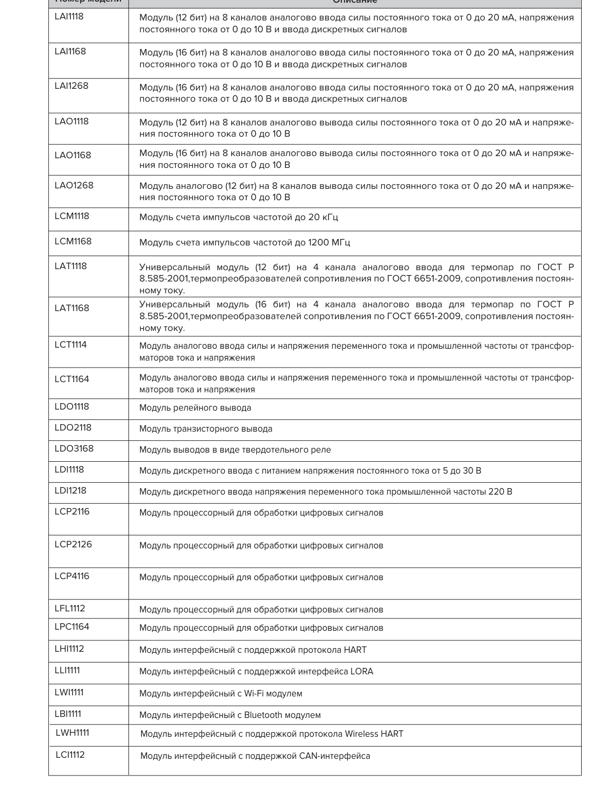

*Рисунок 17 — фрагмент таблицы идентификационных обозначений и описаний модулей Lorentz.*

---

## 18. Принятые технические решения

| Техническое решение | Обоснование |
|---|---|
| Модуль в пластиковом корпусе для DIN-рейки | Упрощает монтаж в шкафу, снижает требования к отдельной механической раме, обеспечивает унификацию габаритов и внешнего вида. |
| Единая конструктивная модель корпуса | Позволяет использовать общие корпусные детали, световоды, крепеж и принцип размещения клемм для разных функциональных модулей. |
| Съемные клеммные разъемы | Упрощают монтаж и сервис, позволяют отделить полевую проводку от электронного узла при замене модуля. |
| Кабельная внутренняя шина X2X | Позволяет строить локальные и распределенные конфигурации без отдельного механического backplane. |
| Дифференциальный обмен по витым парам | Повышает устойчивость линии к промышленным помехам. |
| Хранение параметров модуля во внутренней памяти | Обеспечивает идентификацию модуля и снижает риск ошибки при пусконаладке. |
| Светодиодная индикация на передней панели | Ускоряет первичную диагностику без подключения внешнего оборудования. |
| Безвентиляторное исполнение процессорной части | Снижает количество обслуживаемых и изнашиваемых элементов. |
| Питание 24 V DC | Соответствует типовой архитектуре промышленных шкафов управления. |
| Самовосстанавливающееся предохранение | Позволяет защитить цепи от перегрузки в пределах расчетных сценариев без замены плавкого элемента. |
| Экранирование кабелей через зажим на монтажной панели | Отводит помехи на шину заземления шкафа и не требует использования пластикового корпуса как элемента экрана. |

---

## 19. Открытые данные для уточнения

Перед выпуском финальной редакции требуется уточнить и добавить:

- фактическое обозначение пояснительной записки по ЕСКД;
- полный комплект примененных сборочных чертежей и их актуальные ревизии;
- электрические принципиальные схемы модулей, если в записку должны войти решения по платам;
- регламент замены модулей под напряжением или явный запрет такой операции;
- требования к источнику 24 V DC, расчет тока и падения напряжения на X2X;
- требования к терминаторам, адресации и длинам участков X2X;
- описание протоколов обмена и структуры данных;
- перечень допустимых кабелей для X2X, аналоговых сигналов, дискретных сигналов и Ethernet;
- требования к маркировке клемм и кабелей в шкафу;
- требования к испытаниям, приемке, EMC и условиям эксплуатации конкретного шкафа.

---

## 20. Заключение

Конструкция системы Lorentz построена как модульная промышленная платформа с единым механическим исполнением, кабельной внутренней шиной X2X, адресными модулями ввода-вывода, визуальной диагностикой и возможностью конфигурирования состава системы под конкретную задачу.

Основные конструктивные решения направлены на:

- унификацию модулей;
- удобство монтажа в шкафу;
- сокращение времени обслуживания;
- снижение риска ошибок при подключении и замене;
- поддержку распределенной структуры модулей;
- обеспечение диагностики на уровне модуля и системы.

Финальная редакция пояснительной записки должна быть дополнена протоколами обмена, расчетами питания X2X, требованиями к кабелям, актуальными электрическими схемами и регламентом сервисной замены модулей.
