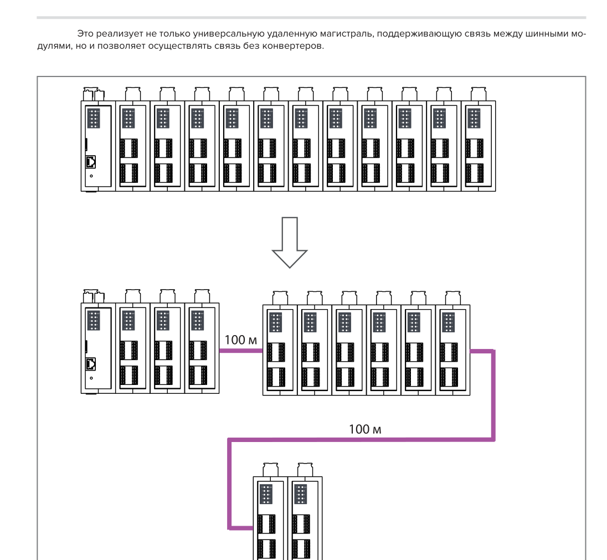
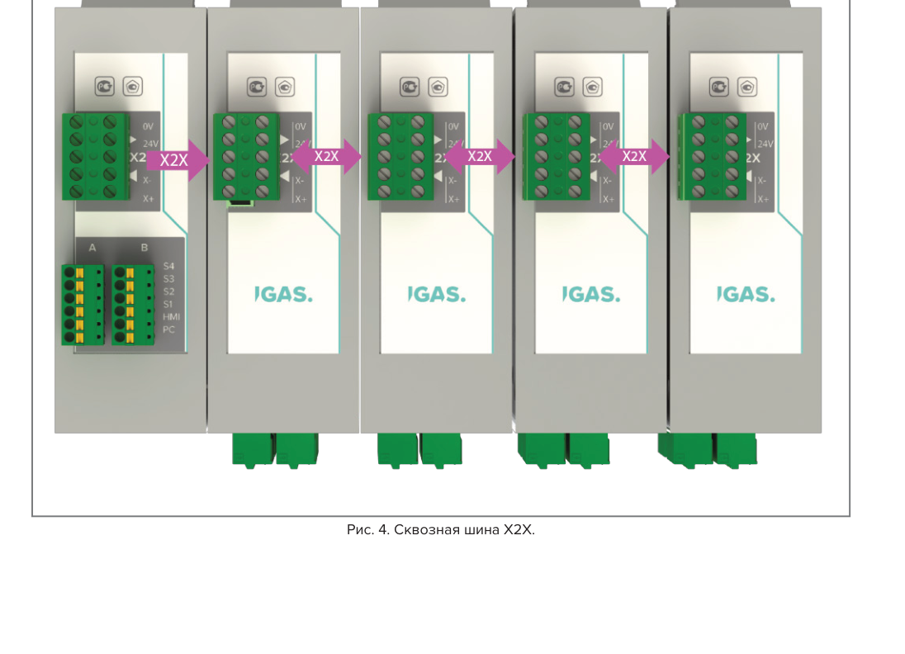
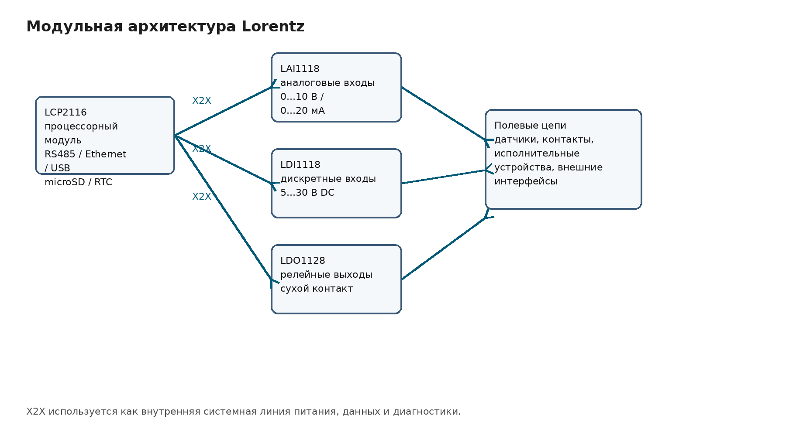

## 2. Рекомендации по технике безопасности

Модульные свободно программируемые контроллеры Lorentz, процессорные модули, модули ввода-вывода и подключаемые к ним устройства управления и контроля разработаны для применения в промышленных системах автоматизации.

Система Lorentz предназначена для выполнения задач управления, сбора сигналов, обработки данных, диагностики, обмена с внешними устройствами и взаимодействия с исполнительными механизмами в составе промышленного оборудования, шкафов управления и распределённых систем ввода-вывода.

Изделия Lorentz не предназначены для применения в системах, отказ которых без дополнительных независимых мер защиты может привести к гибели людей, тяжёлым травмам, значительному материальному ущербу или потере управляемости опасного объекта.

К таким областям относятся:

* управление ядерными реакциями и оборудованием атомных электростанций;
* системы управления вооружением;
* системы управления полётами и обеспечения безопасности полётов;
* системы управления общественным транспортом;
* медицинские системы жизнеобеспечения;
* иные объекты, требующие специальных мер функциональной безопасности, резервирования и сертификации.

При применении модулей Lorentz в составе промышленной системы управления должны быть предусмотрены внешние меры безопасности, соответствующие характеру объекта: аварийное отключение, аппаратные цепи блокировок, защита исполнительных механизмов, предохранительные устройства, контроль питания, заземление, защита от перегрузок и другие меры, установленные проектной документацией, национальными и международными нормами.

Монтаж, ввод в эксплуатацию, техническое обслуживание, замена модулей и диагностика системы допускаются только квалифицированным персоналом.

Квалифицированный персонал — это специалисты, знакомые с транспортированием, монтажом, электрическим подключением, вводом в эксплуатацию и эксплуатацией промышленного электрооборудования, имеющие соответствующую квалификацию и право выполнять данные работы.

Перед монтажом и вводом системы в эксплуатацию необходимо изучить:

* настоящее руководство;
* паспорт изделия;
* электрические схемы подключения;
* маркировку модулей и клемм;
* предельные значения, приведённые в технических характеристиках;
* проектную документацию шкафа управления или установки.

Эксплуатирующая организация обязана обеспечить выполнение требований электробезопасности, промышленной безопасности и местных правил предупреждения несчастных случаев.

---

### 2.1. Назначение и правильное использование

Модули Lorentz предназначены для обычного промышленного применения в составе систем автоматизации.

Правильное использование включает:

* установку модулей в шкаф управления или другой защищённый электротехнический корпус;
* монтаж на DIN-рейку;
* подключение к процессорному модулю и модулям ввода-вывода через шину X2X;
* подключение внешних цепей согласно схемам подключения конкретного модуля;
* эксплуатацию в пределах допустимых электрических, климатических и механических параметров;
* использование только в составе системы, в которой предусмотрены необходимые внешние меры защиты.

Модули должны применяться в исходном конструктивном исполнении. Самовольная доработка корпуса, печатной платы, клеммных соединений, цепей питания, цепей связи и защитных элементов не допускается, если такая доработка не предусмотрена конструкторской документацией, эксплуатационной документацией или утверждённым изменением изделия.

Применение изделия вне указанных условий считается неправильным использованием.

К неправильному использованию относятся:

* эксплуатация вне допустимого диапазона напряжений питания;
* подключение внешних цепей не по назначению клемм;
* эксплуатация при повреждённом корпусе, печатной плате, разъёмах или клеммных блоках;
* эксплуатация в условиях конденсации влаги, если такое исполнение не предусмотрено документацией;
* применение без необходимых внешних предохранительных, коммутационных и защитных устройств;
* использование модулей как единственного средства обеспечения безопасности людей и оборудования;
* применение в системах функциональной безопасности без отдельного подтверждения соответствия.

Если изделие используется не по назначению, предусмотренный конструкцией уровень защиты и надёжности не гарантируется.

---

### 2.2. Изделия и функции безопасности

Модули Lorentz не должны рассматриваться как самостоятельные устройства функциональной безопасности, если это прямо не указано в документации на конкретное исполнение.

Функции аварийного останова, безопасного отключения приводов, аппаратных блокировок, контроля дверей, защиты персонала и защиты технологического оборудования должны реализовываться внешними сертифицированными устройствами безопасности либо отдельными аппаратными цепями, соответствующими требованиям проекта.

При использовании модулей Lorentz в системе, где имеются опасные исполнительные механизмы, пользователь обязан обеспечить независимое безопасное состояние оборудования при отказе контроллера, отказе питания, потере связи X2X, ошибке прикладной программы, зависании процессорного модуля или отказе выходного модуля.

---

### 2.3. Защита от электростатических разрядов

Электронные узлы модулей Lorentz содержат компоненты, чувствительные к электростатическим разрядам. Неправильное обращение с модулями, печатными платами, разъёмами и клеммными соединениями может привести к скрытому повреждению электронных компонентов и последующему отказу изделия.

При монтаже, демонтаже, хранении и обслуживании модулей необходимо соблюдать меры защиты от электростатических разрядов.

Не допускается:

* касаться контактных площадок, штыревых соединителей и внутренних контактов разъёмов;
* касаться выводов электронных компонентов и контактных поверхностей печатной платы;
* размещать открытые электронные узлы на металлических, пластиковых или иных непредназначенных поверхностях;
* подвергать модули воздействию электростатически заряженных предметов, упаковочных материалов и инструментов.

Перед выполнением работ с модулем персонал должен снять электростатический заряд с тела и инструмента. При работе с открытыми электронными узлами следует применять антистатический браслет, антистатический коврик, проводящую упаковку или другие средства ESD-защиты.

---

#### 2.3.1. Упаковка

Модули в штатном закрытом корпусе не требуют специальной антистатической упаковки при обычном обращении, транспортировании и хранении, но должны защищаться от механических повреждений, влаги, загрязнений и электростатических воздействий.

Электронные узлы без корпуса, запасные печатные платы и открытые модули должны храниться и транспортироваться только в ESD-защищённой упаковке.

---

#### 2.3.2. Правила обращения с электронными узлами

При обращении с модулями в корпусе необходимо:

* не касаться контактов разъёмов и клеммных соединений;
* не касаться контактов подключаемых кабелей;
* не прикладывать усилия к световодам, индикаторам, печатным платам и внутренним элементам модуля;
* удерживать модуль за корпус или предусмотренные конструкцией поверхности.

При обращении с электронными узлами без корпуса дополнительно необходимо:

* выполнять работы только на ESD-защищённом рабочем месте;
* использовать заземление персонала и инструмента;
* удерживать плату за края;
* хранить плату на проводящей поверхности, в антистатическом пакете или в проводящем пеноматериале;
* не размещать плату на металлической поверхности без ESD-защиты;
* не располагать электронные узлы вблизи источников электростатического поля;
* перед измерениями разряжать измерительные щупы на заземлённую поверхность.

---

### 2.4. Транспортирование и хранение

При транспортировании и хранении модули Lorentz должны быть защищены от воздействий, способных вызвать механическое повреждение, нарушение электрических параметров или ухудшение изоляционных свойств.

К таким воздействиям относятся:

* ударные и вибрационные нагрузки сверх допустимых значений;
* повышенная влажность;
* конденсация влаги;
* агрессивные среды;
* загрязнение токопроводящей пылью;
* воздействие статического электричества;
* нарушение допустимого температурного диапазона.

Модули должны храниться в упаковке, исключающей повреждение корпуса, клеммных блоков, разъёмов и лицевой панели. Условия хранения должны соответствовать паспортным значениям для конкретного исполнения.

Перед установкой модуль должен быть осмотрен. Модуль с признаками механического повреждения, следами влаги, коррозии, перегрева, нарушения маркировки, повреждения клемм или корпуса к монтажу не допускается.

---

### 2.5. Установка и монтаж

Установка модулей Lorentz должна выполняться в соответствии с эксплуатационной и проектной документацией, с применением исправного инструмента и с соблюдением требований электробезопасности.

Монтаж допускается только при отключённом электропитании шкафа управления и внешних цепей, если иное прямо не предусмотрено эксплуатационной документацией и алгоритмом обслуживания.

При монтаже необходимо соблюдать следующие требования:

* устанавливать модули на DIN-рейку с обеспечением надёжной механической фиксации;
* не допускать перекоса корпуса при установке и снятии;
* не прикладывать усилие к клеммным блокам, индикаторам и разъёмам как к несущим элементам;
* выполнять электрический монтаж в соответствии со схемой подключения;
* выбирать сечение проводников, предохранительные элементы и коммутационные устройства согласно проекту;
* прокладывать кабели так, чтобы исключить механическую нагрузку на клеммные блоки;
* применять разгрузку натяжения кабелей в кабель-каналах, зажимах или других элементах шкафа;
* выполнять подключение экранов кабелей к шине заземления шкафа в соответствии с проектом;
* соблюдать меры защиты от электростатических разрядов.

Для сигнальных линий и линий связи следует применять кабели, соответствующие требованиям конкретного интерфейса. Для линий X2X и других помехочувствительных цепей должны соблюдаться требования по прокладке, длине, экранированию и разделению с силовыми цепями.

---

#### 2.5.1. Подключение и отключение модулей при работающей системе

Конструкция модулей Lorentz предусматривает отделение клеммных блоков от электронного модуля, что позволяет выполнять замену модуля без повторной перекоммутации полевой проводки.

Отключение и замена модуля при работающей системе допускаются только при одновременном выполнении следующих условий:

* данная операция предусмотрена эксплуатационной документацией и процедурой обслуживания;
* внешние цепи, подключённые к модулю, предварительно приведены в безопасное состояние;
* на съёмных клеммных блоках отсутствует опасное напряжение;
* отключение модуля поддерживается прикладным программным обеспечением и не приводит к неконтролируемому состоянию объекта;
* персонал понимает последствия потери связи с модулем и потери состояния его каналов.

Если прикладная программа не поддерживает замену модуля при работающей системе, отключение модуля может привести к аварийной остановке, потере управления, ошибке обмена по X2X или некорректному состоянию технологического объекта.

Замена модулей, подключённых к цепям с опасным напряжением, цепям управления исполнительными механизмами, цепям аварийного отключения или цепям, влияющим на безопасность объекта, должна выполняться только после снятия напряжения и перевода оборудования в безопасное состояние.

---

### 2.6. Эксплуатация

Перед включением системы необходимо проверить:

* правильность установки модулей на DIN-рейку;
* правильность подключения питания;
* соответствие подключений схемам внешних соединений;
* отсутствие повреждений корпуса, клемм, разъёмов и кабелей;
* наличие предусмотренных проектом предохранителей и защитных устройств;
* подключение защитного заземления шкафа управления;
* правильность подключения экранов кабелей;
* отсутствие незащищённых частей, находящихся под напряжением;
* соответствие условий эксплуатации паспортным значениям.

Во время эксплуатации должны быть закрыты двери и защитные крышки шкафа управления, если внутри шкафа имеются цепи с опасным напряжением.

Не допускается эксплуатация модулей при:

* повреждении корпуса;
* повреждении клеммных блоков;
* следах перегрева;
* попадании влаги внутрь корпуса;
* нарушении фиксации на DIN-рейке;
* отсутствии внешних защитных устройств, предусмотренных проектом;
* некорректной работе индикации или диагностических функций без выяснения причины.

Электронные устройства не являются абсолютно отказобезопасными. При проектировании системы необходимо учитывать возможность отказа процессорного модуля, модуля ввода-вывода, линии связи, источника питания, исполнительного устройства или прикладной программы. Внешние устройства, включая приводы, клапаны, нагреватели, насосы, реле и другие исполнительные механизмы, должны быть защищены так, чтобы отказ системы управления не приводил к опасному состоянию объекта.

---

#### 2.6.1. Защита от прикосновения к электрическим частям

В составе шкафа управления, исполнительных цепей и подключаемых устройств могут присутствовать напряжения, опасные для жизни и здоровья.

Перед включением системы необходимо убедиться, что:

* шкаф управления подключён к защитному заземлению;
* все токоведущие части закрыты кожухами, крышками или дверями шкафа;
* внешние цепи подключены согласно проектной документации;
* защитные проводники и экраны кабелей подключены к соответствующим шинам;
* отсутствуют незакреплённые проводники и открытые токоведущие элементы.

Заземление шкафа управления должно быть выполнено до подачи питания. Это требование действует также при кратковременных испытаниях, наладке и диагностике.

Работы внутри шкафа управления допускаются только после отключения питания и проверки отсутствия напряжения, если конкретная процедура обслуживания не требует выполнения измерений под напряжением. Измерения под напряжением допускаются только квалифицированным персоналом с применением исправных измерительных средств и средств индивидуальной защиты.

---

### 2.7. Структура предупреждений

В настоящем документе применяются предупреждения и информационные примечания, указывающие на опасные ситуации, ограничения применения и условия, необходимые для правильной эксплуатации изделия.

Предупреждения используются только для информации, связанной с безопасностью персонала, сохранностью оборудования или предотвращением неправильной эксплуатации.

| Сигнальное слово   | Назначение                                                                                                                                                            |
| ------------------ | --------------------------------------------------------------------------------------------------------------------------------------------------------------------- |
| **ОПАСНО**         | Указывает на опасную ситуацию, которая при несоблюдении требований приведёт к смерти, тяжёлой травме или значительному материальному ущербу.                          |
| **ПРЕДУПРЕЖДЕНИЕ** | Указывает на потенциально опасную ситуацию, которая при несоблюдении требований может привести к смерти, тяжёлой травме или значительному материальному ущербу.       |
| **ВНИМАНИЕ**       | Указывает на ситуацию, которая при несоблюдении требований может привести к травме, повреждению оборудования, отказу системы или нарушению технологического процесса. |
| **ПРИМЕЧАНИЕ**     | Содержит техническую информацию, пояснение, рекомендацию по применению или указание, предотвращающее ошибку монтажа, настройки или эксплуатации.                      |

Предупреждения должны учитываться совместно с техническими характеристиками, схемами подключения, проектной документацией и требованиями нормативных документов, применимых к конкретному объекту.


---

## 3. Системные особенности

Модульная система Lorentz предназначена для построения промышленных систем управления, сбора данных и распределённого ввода-вывода. Система формируется из процессорного модуля LCP и функциональных модулей ввода-вывода, подключаемых к внутренней кабельной шине X2X.

Архитектура Lorentz построена по модульному принципу. Процессорный модуль выполняет функции центрального узла управления, связи, обработки данных и диагностики. Модули ввода-вывода выполняют локальные функции измерения, приёма дискретных сигналов, коммутации выходных цепей и передачи данных в процессорный модуль.

Конструктивно система ориентирована на установку в шкаф управления. Модули выполнены в унифицированных пластиковых корпусах для монтажа на DIN-рейку. Внешние цепи подключаются через съёмные клеммные блоки. На передней панели расположены светодиодные индикаторы состояния, обеспечивающие локальную диагностику модуля, шины и каналов.


---

### 3.1. Модульная архитектура Lorentz

Система Lorentz объединяет процессорные, аналоговые, дискретные, релейные и интерфейсные модули в единую распределённую систему. Состав системы определяется задачей автоматизации и проектной конфигурацией шкафа управления.

Базовая конфигурация включает:

* процессорный модуль LCP;
* модули аналогового ввода LAI;
* модули дискретного ввода LDI;
* модули релейного вывода LDO;
* кабельную линию X2X для обмена данными и питания модулей;
* внешние цепи питания, датчиков, исполнительных механизмов и интерфейсов связи.

Модульная структура позволяет собирать систему под конкретное количество сигналов и требуемый состав интерфейсов. При изменении состава объекта конфигурация может быть расширена добавлением модулей соответствующего типа без изменения общей конструктивной модели системы.

---

#### 3.1.1. Оптимизированная конструкция

Конструкция модулей Lorentz разделяет электронную часть, корпусную часть и съёмные клеммные соединения. Такое решение снижает трудоёмкость монтажа, упрощает обслуживание и уменьшает риск ошибок при замене модулей.

Основные конструктивные решения:

* **Пластиковый корпус для DIN-рейки.** Корпус обеспечивает механическую защиту электронного узла, фиксацию модуля в шкафу управления и унифицированное расположение внешних интерфейсов.
* **Съёмные клеммные блоки.** Полевая проводка подключается к клеммным блокам, отделённым от электронного модуля. Это позволяет заменить модуль без повторной разделки и перекоммутации проводов.
* **Клеммы Push-In.** Подключение проводников выполняется через клеммы быстрого монтажа. Такое решение сокращает время электромонтажа и повышает повторяемость сборки шкафа.
* **Передняя светодиодная индикация.** Состояние питания, шины, интерфейсов и каналов выводится на лицевую панель модуля.
* **Унифицированная посадка.** Модули имеют согласованную конструктивную модель и устанавливаются в один ряд на DIN-рейку либо распределяются по шкафу и объекту через X2X.
* **Кабельная шина X2X.** Внутренняя шина выполнена кабельной, что позволяет строить как локальные, так и распределённые конфигурации.


---

#### 3.1.2. Конфигурирование состава системы

Состав системы Lorentz определяется набором модулей, установленных в проекте. Процессорный модуль LCP обеспечивает обмен с модулями ввода-вывода по X2X и выполняет прикладную программу управления.

Модульная архитектура позволяет:

* подключать к одному процессорному модулю набор модулей ввода-вывода, соответствующий задаче объекта;
* размещать часть модулей рядом с процессорным модулем, а часть — удалённо;
* выполнять функциональное разделение входов, выходов и интерфейсов по группам;
* формировать потенциальные группы для различных цепей питания и исполнительных устройств;
* сохранять единую программную и диагностическую модель системы при изменении аппаратного состава.

Встроенные параметры модулей используются для идентификации типа модуля, заводского номера, функциональных возможностей и версии встроенного программного обеспечения. Эти данные применяются при конфигурировании, пусконаладке и обслуживании системы.

---

#### 3.1.3. Механическая конструкция

Механика модулей Lorentz рассчитана на монтаж в промышленном шкафу управления. Корпус модуля выполняет несколько функций: удерживает печатную плату, защищает электронные компоненты, обеспечивает фиксацию на DIN-рейке, выводит индикацию на лицевую панель и формирует посадочные места для клеммных блоков.

Конструктивные элементы модуля:

* основание корпуса с креплением на DIN-рейку;
* внутренняя печатная плата с электронными компонентами;
* лицевая панель с маркировкой и светодиодной индикацией;
* съёмные клеммные блоки внешних цепей;
* разъём или клеммный блок шины X2X;
* элементы фиксации корпуса и крышек;
* маркировочные зоны для обозначения модуля и каналов.

Размещение клемм, индикаторов и интерфейсов выполнено так, чтобы электромонтаж, диагностика и замена модуля выполнялись без доступа к внутренним электронным элементам.

---

#### 3.1.4. Удобство электромонтажа

Система Lorentz рассчитана на шкафной электромонтаж с предварительной подготовкой полевой проводки. Съёмные клеммные блоки позволяют разделить операции монтажа кабелей и установки электронных модулей.

При сборке шкафа управления клеммные блоки могут быть подключены к внешним цепям до окончательной установки или замены электронного модуля. При обслуживании модуль может быть извлечён без демонтажа полевой проводки, если такая операция допускается эксплуатационной процедурой и объект переведён в безопасное состояние.

Преимущества применённого решения:

* сокращение времени первичного монтажа;
* снижение риска ошибки при повторном подключении проводов;
* сохранение полевой проводки при замене модуля;
* возможность проверки цепей на клеммнике;
* удобное разделение сигнальных цепей, цепей питания и цепей шины;
* снижение механической нагрузки на плату модуля.

Кабели должны прокладываться с разгрузкой натяжения. Для этого применяются кабель-каналы, зажимы, стяжки и элементы крепления внутри шкафа управления. Не допускается передавать усилие натяжения кабеля на клеммный блок модуля.

---

#### 3.1.5. Подключение внешних цепей

Подключение внешних цепей выполняется в соответствии с назначением конкретного модуля и схемой внешних соединений.

В системе используются следующие типы подключений:

* цепи питания 24 V DC;
* линии внутренней шины X2X;
* аналоговые входные цепи;
* дискретные входные цепи;
* релейные выходные цепи;
* интерфейсные линии RS485, Ethernet и USB;
* цепи экранов и функционального заземления кабелей.

Сигнальные и силовые цепи должны прокладываться раздельно с учётом требований электромагнитной совместимости. Для помехочувствительных цепей и линий связи должны применяться кабели соответствующего типа. Экраны кабелей подключаются к шине заземления шкафа через предусмотренные зажимы или клеммы в соответствии с проектной документацией.


---

### 3.2. Полная система

Система Lorentz рассматривается как комплектная платформа, включающая процессорный модуль, модули ввода-вывода, внутреннюю шину, внешние интерфейсы связи, диагностику и средства конфигурирования.

---

#### 3.2.1. Процессорные модули LCP

Процессорный модуль LCP является центральным элементом системы Lorentz. Он выполняет прикладную программу, управляет обменом с модулями ввода-вывода, обеспечивает связь с внешними устройствами и хранит данные конфигурации.

Функции процессорного модуля:

* управление и контроль модулей ввода-вывода через X2X;
* обмен с внешними устройствами по RS485;
* обмен по Ethernet;
* обслуживание и диагностика через USB;
* взаимодействие с панелями оператора;
* ведение журналов событий;
* хранение файлов конфигурации на съёмной microSD-карте;
* поддержание системного времени с использованием часов реального времени.

Процессорная часть построена на базе ARM Cortex-M3 и работает под управлением операционной системы реального времени IGAS RT. Применение безвентиляторной конструкции снижает требования к техническому обслуживанию и повышает пригодность модуля для длительной эксплуатации в шкафу управления.

---

#### 3.2.2. Модули ввода-вывода

Модули ввода-вывода Lorentz предназначены для подключения датчиков, дискретных сигналов и исполнительных устройств к процессорному модулю.

В составе текущей системы выделяются следующие группы модулей:

* **LAI** — модули аналогового ввода;
* **LDI** — модули дискретного ввода;
* **LDO** — модули релейного вывода;
* **LCP** — процессорные модули.

Модули LAI применяются для ввода аналоговых сигналов постоянного тока и напряжения. Модули LDI применяются для ввода дискретных сигналов постоянного тока. Модули LDO применяются для коммутации внешних цепей через релейные выходы.

Все модули подключаются к процессорному модулю через X2X и работают как элементы единой распределённой системы.

---

#### 3.2.3. Интерфейсы связи и внешние устройства

Система Lorentz поддерживает подключение к внешним устройствам управления, диагностики и визуализации.

К основным интерфейсам относятся:

* RS485 для связи с промышленными устройствами и периферией;
* Ethernet для сетевого обмена;
* USB для диагностики и технического обслуживания;
* X2X для локального и распределённого обмена с модулями ввода-вывода.

Набор доступных интерфейсов определяется исполнением процессорного модуля и проектной конфигурацией системы.

---

#### 3.2.4. Функции безопасности

Модули Lorentz не являются самостоятельными устройствами функциональной безопасности, если это прямо не указано в документации на конкретное исполнение.

Функции аварийного останова, безопасного отключения приводов, аппаратных блокировок и защиты персонала должны выполняться внешними устройствами безопасности или отдельными аппаратными цепями. При проектировании системы необходимо учитывать возможные отказы процессорного модуля, выходного модуля, линии связи X2X, источника питания и прикладной программы.

Система управления должна быть построена так, чтобы отказ одного элемента не приводил к опасному состоянию технологического объекта.

---

### 3.3. Технологии и специальные решения

---

#### 3.3.1. Внутренняя шина X2X

X2X является внутренней магистралью системы Lorentz для передачи питания, данных и диагностических состояний между процессорным модулем и модулями ввода-вывода.

Функции внутренней шины выполняет кабельная линия. Все модули подключаются к однотипной шине X2X. Модули могут размещаться рядом с процессорным модулем в одном шкафу управления либо удалённо в пределах допустимой длины линии.

Применение X2X обеспечивает:

* подключение модулей ввода-вывода к процессорному модулю;
* построение распределённой структуры без дополнительных преобразователей интерфейса;
* передачу данных между модулями и процессорным модулем;
* передачу диагностических состояний;
* возможность формирования групп модулей по функциональному или территориальному признаку;
* повышение помехоустойчивости за счёт применения витых пар.



---

#### 3.3.2. Сквозная шина и распределённое размещение модулей

Система допускает построение сквозной линии X2X между несколькими модулями. Это позволяет размещать модули последовательно по шкафу управления или выносить отдельные группы модулей ближе к датчикам и исполнительным механизмам.

Такая структура уменьшает количество длинных полевых кабелей, упрощает шкафную разводку и позволяет разделять систему на функциональные группы.



---

#### 3.3.3. Адресация и идентификация модулей

Каждый модуль Lorentz является активной станцией внутренней шины. Для корректной работы системы процессорный модуль должен получать данные о составе подключённых модулей, их назначении и состоянии.

Во встроенной памяти модуля хранятся идентификационные и служебные параметры:

* тип модуля;
* заводской номер;
* функциональные возможности;
* версия встроенного программного обеспечения.

Эти данные используются при конфигурировании системы, пусконаладке, диагностике и сервисном обслуживании. Наличие встроенных параметров снижает риск ошибочной установки модуля, облегчает проверку фактической конфигурации и упрощает поиск неисправностей.

---

#### 3.3.4. Питание и потенциальные группы

Система Lorentz использует питание постоянного тока 24 V. Шина X2X применяется не только для обмена данными, но и как часть инфраструктуры питания модулей.

В системе могут применяться различные схемы организации питания:

* сквозное питание модулей ввода-вывода;
* отдельное питание групп модулей;
* разделение модулей на потенциальные группы;
* выделение отдельных групп для входных цепей, выходных цепей и цепей аварийного отключения.

Потенциальные группы используются для электрического разделения участков системы, снижения взаимного влияния цепей и обеспечения требований проекта по питанию и безопасности.

При проектировании питания должны учитываться:

* потребляемая мощность модулей;
* токи внешних датчиков и исполнительных механизмов;
* падение напряжения на кабелях;
* необходимость предохранительных элементов;
* требования к заземлению и экранированию;
* сценарии отключения отдельных групп питания.

---

#### 3.3.5. Исполнения модулей

Линейка Lorentz включает процессорные, аналоговые, дискретные, релейные и интерфейсные модули. Перечень исполнений определяется паспортом и эксплуатационной документацией.

К основным группам относятся:

* процессорные модули LCP;
* модули аналогового ввода LAI;
* модули аналогового вывода LAO;
* модули дискретного ввода LDI;
* модули релейного, транзисторного и твердотельного вывода LDO;
* модули счёта импульсов LCM;
* температурные модули LAT;
* модули измерения переменного тока и напряжения LCT;
* интерфейсные модули связи.

В настоящей пояснительной записке подробно раскрываются модули LCP, LAI, LDI и LDO. Остальные исполнения приводятся как часть общей линейки и уточняются по соответствующим паспортам и руководствам.

---

### 3.4. Диагностика

Система Lorentz предусматривает несколько уровней диагностики:

* визуальная диагностика непосредственно на модуле;
* передача статусных данных в процессорный модуль;
* программная обработка состояния каналов;
* получение расширенных диагностических данных;
* идентификация модуля по встроенным параметрам.

Диагностика предназначена для быстрого выявления неисправностей при монтаже, пусконаладке, эксплуатации и сервисном обслуживании.

---

#### 3.4.1. Визуальная диагностика

На передней панели модулей расположены светодиодные индикаторы. Они используются для отображения состояния питания, процессора, шины, интерфейсов связи, входов, выходов и отдельных каналов.

Визуальная индикация позволяет выполнить первичную диагностику без подключения внешнего программного средства. Состояния отображаются непосредственно на модуле и связаны с соответствующими функциями или каналами.

Типовые диагностируемые состояния:

* наличие питания;
* состояние процессорного модуля;
* состояние обмена по X2X;
* активность интерфейсов связи;
* состояние входных каналов;
* состояние выходных каналов;
* наличие ошибки или предупреждения.

---

#### 3.4.2. Диагностические данные в обмене

Статусные данные модулей передаются в процессорный модуль по X2X. Это позволяет прикладной программе контролировать состояние модулей и каналов во время работы системы.

Система может работать в циклическом режиме с постоянным опросом или в режиме передачи данных при изменении состояния. При возникновении неисправности прикладная программа может запросить дополнительные диагностические данные от соответствующего модуля.

Такая организация диагностики позволяет получать информацию о состоянии системы без остановки основного обмена и без существенного увеличения нагрузки на связь.

---

#### 3.4.3. Встроенные параметры модулей

Встроенные параметры модуля используются для автоматизированной идентификации и контроля конфигурации. Они позволяют сопоставить фактически установленный модуль с проектной конфигурацией.

Контроль встроенных параметров применяется для:

* проверки правильности установленного типа модуля;
* контроля заводского номера;
* определения функциональных возможностей модуля;
* определения версии встроенного программного обеспечения;
* диагностики ошибок конфигурации;
* упрощения сервисной замены.

Использование встроенных параметров снижает вероятность ошибки при пусконаладке и обслуживании, особенно в системах с большим количеством однотипных модулей.

---

### 3.5. Конструктивные решения, принятые в системе

При разработке системы Lorentz приняты следующие основные конструктивные решения:

* применение унифицированного пластикового корпуса для установки на DIN-рейку;
* отделение полевой проводки от электронного модуля за счёт съёмных клеммных блоков;
* применение кабельной внутренней шины X2X вместо жёсткой объединительной платы;
* вывод диагностической индикации на лицевую панель модуля;
* поддержка локального и распределённого размещения модулей;
* применение встроенных параметров модулей для идентификации и диагностики;
* организация питания и обмена через системную инфраструктуру X2X;
* возможность формирования потенциальных групп;
* применение внешнего экранирования и заземления кабелей на уровне шкафа управления.

Указанные решения обеспечивают модульность, ремонтопригодность, масштабируемость и пригодность системы для применения в промышленных шкафах управления.


---

## 4. Обзор модулей

**Информация:**
В настоящем разделе приведён обзор модулей Lorentz, указанных в текущей исходной документации. Модули, не имеющие отдельного паспорта, руководства по эксплуатации или сборочной документации в составе текущего комплекта исходных данных, описаны на уровне общего назначения.

---

### 4.1. Стандартные модули

Стандартные модули Lorentz образуют линейку процессорных, аналоговых, дискретных, релейных и интерфейсных устройств для построения модульных систем промышленной автоматизации.

Все модули системы рассчитаны на установку в шкаф управления, подключение через внутреннюю шину X2X и работу совместно с процессорным модулем LCP. Конкретный состав системы определяется проектной конфигурацией, количеством сигналов, типом внешних цепей и требованиями к обмену с внешними устройствами.

---

#### 4.1.1. Обзор модулей: по обозначениям

| Обозначение модуля | Тип модуля                                     | Описание                                                                                                                                        | Особенности                                                                                                         |
| ------------------ | ---------------------------------------------- | ----------------------------------------------------------------------------------------------------------------------------------------------- | ------------------------------------------------------------------------------------------------------------------- |
| LAI1118            | Модуль аналогового ввода                       | Модуль на 8 каналов аналогового ввода силы постоянного тока от 0 до 20 мА, напряжения постоянного тока от 0 до 10 В и ввода дискретных сигналов | Разрядность 12 бит; подключение и питание через X2X; применяется для сбора аналоговых и дискретных сигналов         |
| LAI1168            | Модуль аналогового ввода                       | Модуль на 8 каналов аналогового ввода силы постоянного тока от 0 до 20 мА, напряжения постоянного тока от 0 до 10 В и ввода дискретных сигналов | Разрядность 16 бит                                                                                                  |
| LAI1268            | Модуль аналогового ввода                       | Модуль на 8 каналов аналогового ввода силы постоянного тока от 0 до 20 мА, напряжения постоянного тока от 0 до 10 В и ввода дискретных сигналов | Разрядность 16 бит                                                                                                  |
| LAO1118            | Модуль аналогового вывода                      | Модуль на 8 каналов аналогового вывода силы постоянного тока от 0 до 20 мА и напряжения постоянного тока от 0 до 10 В                           | Разрядность 12 бит                                                                                                  |
| LAO1168            | Модуль аналогового вывода                      | Модуль на 8 каналов аналогового вывода силы постоянного тока от 0 до 20 мА и напряжения постоянного тока от 0 до 10 В                           | Разрядность 16 бит                                                                                                  |
| LAO1268            | Модуль аналогового вывода                      | Модуль на 8 каналов аналогового вывода силы постоянного тока от 0 до 20 мА и напряжения постоянного тока от 0 до 10 В                           | Разрядность 12 бит                                                                                                  |
| LCM1118            | Модуль счёта импульсов                         | Модуль счёта импульсов частотой до 20 кГц                                                                                                       | Применяется для импульсных входных сигналов                                                                         |
| LCM1168            | Модуль счёта импульсов                         | Модуль счёта импульсов частотой до 1200 МГц                                                                                                     | Применяется для высокочастотных импульсных сигналов                                                                 |
| LAT1118            | Универсальный температурный модуль             | Модуль на 4 канала аналогового ввода для термопар, термопреобразователей сопротивления и измерения сопротивления постоянному току               | Разрядность 12 бит; поддержка термопар по ГОСТ Р 8.585-2001 и термопреобразователей сопротивления по ГОСТ 6651-2009 |
| LAT1168            | Универсальный температурный модуль             | Модуль на 4 канала аналогового ввода для термопар, термопреобразователей сопротивления и измерения сопротивления постоянному току               | Разрядность 16 бит; поддержка термопар по ГОСТ Р 8.585-2001 и термопреобразователей сопротивления по ГОСТ 6651-2009 |
| LCT1114            | Модуль измерения переменного тока и напряжения | Модуль аналогового ввода силы и напряжения переменного тока промышленной частоты от трансформаторов тока и напряжения                           | Применяется для цепей измерения переменного тока и напряжения                                                       |
| LCT1164            | Модуль измерения переменного тока и напряжения | Модуль аналогового ввода силы и напряжения переменного тока промышленной частоты от трансформаторов тока и напряжения                           | Применяется для цепей измерения переменного тока и напряжения                                                       |
| LDO1118            | Модуль релейного вывода                        | Модуль релейного вывода                                                                                                                         | Общесистемное обозначение релейного модуля в перечне исполнений                                                     |
| LDO1128            | Модуль релейных выходов                        | Модуль управления внешними цепями с помощью выходных реле                                                                                       | 8 релейных выходов; 8 нормально разомкнутых / нормально замкнутых контактов; сухой контакт; управление по X2X       |
| LDO2118            | Модуль транзисторного вывода                   | Модуль транзисторного вывода                                                                                                                    | Применяется для дискретного управления нагрузками постоянного тока                                                  |
| LDO3168            | Модуль твердотельного вывода                   | Модуль выводов в виде твердотельного реле                                                                                                       | Применяется для коммутации внешних цепей без механических контактов                                                 |
| LDI1118            | Модуль дискретного ввода                       | Модуль дискретного ввода с питанием напряжением постоянного тока от 5 до 30 В                                                                   | Применяется для приёма дискретных сигналов постоянного тока                                                         |
| LDI1218            | Модуль дискретного ввода                       | Модуль дискретного ввода напряжения переменного тока промышленной частоты 220 В                                                                 | Применяется для приёма дискретных сигналов переменного тока                                                         |
| LCP2116            | Процессорный модуль                            | Модуль процессорный для обработки цифровых сигналов                                                                                             | Центральный процессор системы; X2X; RS485; Ethernet; USB; microSD; IGAS RT; ARM Cortex-M3                           |
| LCP2126            | Процессорный модуль                            | Модуль процессорный для обработки цифровых сигналов                                                                                             | Исполнение процессорного модуля                                                                                     |
| LCP4116            | Процессорный модуль                            | Модуль процессорный для обработки цифровых сигналов                                                                                             | Исполнение процессорного модуля                                                                                     |
| LPC1164            | Процессорный модуль                            | Модуль процессорный для обработки цифровых сигналов                                                                                             | Исполнение процессорного модуля                                                                                     |
| LFL1112            | Процессорный модуль                            | Модуль процессорный для обработки цифровых сигналов                                                                                             | Исполнение процессорного модуля                                                                                     |
| LHI1112            | Интерфейсный модуль                            | Модуль интерфейсный с поддержкой протокола HART                                                                                                 | Подключение устройств с поддержкой HART                                                                             |
| LLI1111            | Интерфейсный модуль                            | Модуль интерфейсный с поддержкой интерфейса LoRa                                                                                                | Беспроводной интерфейс LoRa                                                                                         |
| LWI1111            | Интерфейсный модуль                            | Модуль интерфейсный с Wi-Fi модулем                                                                                                             | Беспроводной интерфейс Wi-Fi                                                                                        |
| LBI1111            | Интерфейсный модуль                            | Модуль интерфейсный с Bluetooth модулем                                                                                                         | Беспроводной интерфейс Bluetooth                                                                                    |
| LWH1111            | Интерфейсный модуль                            | Модуль интерфейсный с поддержкой протокола Wireless HART                                                                                        | Беспроводной интерфейс Wireless HART                                                                                |
| LCI1112            | Интерфейсный модуль                            | Модуль интерфейсный с поддержкой CAN-интерфейса                                                                                                 | Подключение CAN-сети                                                                                                |

---

#### 4.1.2. Обзор модулей: по группам

---

##### 4.1.2.1. Процессорные модули

Процессорные модули выполняют функции центрального узла управления. Они обеспечивают выполнение прикладной программы, обмен с модулями ввода-вывода по X2X, связь с внешними устройствами и диагностику системы.

| Обозначение модуля | Тип модуля          | Описание                                                                                                                                           | Особенности                                                                                                                                          |
| ------------------ | ------------------- | -------------------------------------------------------------------------------------------------------------------------------------------------- | ---------------------------------------------------------------------------------------------------------------------------------------------------- |
| LCP2116            | Процессорный модуль | Центральный процессорный модуль системы Lorentz для обработки цифровых сигналов, управления модулями ввода-вывода и обмена с внешними устройствами | 6 портов RS485; 2 Ethernet; USB 2.0 Type B; X2X; microSD; IGAS RT; ARM Cortex-M3; часы реального времени с батареей CR2032; светодиодная диагностика |
| LCP2126            | Процессорный модуль | Процессорный модуль для обработки цифровых сигналов                                                                                                | Исполнение процессорного модуля Lorentz                                                                                                              |
| LCP4116            | Процессорный модуль | Процессорный модуль для обработки цифровых сигналов                                                                                                | Исполнение процессорного модуля Lorentz                                                                                                              |
| LPC1164            | Процессорный модуль | Процессорный модуль для обработки цифровых сигналов                                                                                                | Исполнение процессорного модуля Lorentz                                                                                                              |
| LFL1112            | Процессорный модуль | Процессорный модуль для обработки цифровых сигналов                                                                                                | Исполнение процессорного модуля Lorentz                                                                                                              |

---

##### 4.1.2.2. Модули аналогового ввода

Модули аналогового ввода применяются для подключения датчиков с выходными сигналами постоянного тока и напряжения. Данные передаются в процессорный модуль по X2X.

| Обозначение модуля | Тип модуля               | Описание                                                                    | Особенности                                                                                        |
| ------------------ | ------------------------ | --------------------------------------------------------------------------- | -------------------------------------------------------------------------------------------------- |
| LAI1118            | Модуль аналогового ввода | 8 каналов аналогового ввода: 0–20 мА, 0–10 В; поддержка дискретных сигналов | Разрядность 12 бит; питание и передача данных через X2X; конфигурирование в IGAS Automation Studio |
| LAI1168            | Модуль аналогового ввода | 8 каналов аналогового ввода: 0–20 мА, 0–10 В; поддержка дискретных сигналов | Разрядность 16 бит                                                                                 |
| LAI1268            | Модуль аналогового ввода | 8 каналов аналогового ввода: 0–20 мА, 0–10 В; поддержка дискретных сигналов | Разрядность 16 бит                                                                                 |

---

##### 4.1.2.3. Модули аналогового вывода

Модули аналогового вывода применяются для формирования управляющих сигналов постоянного тока и напряжения для внешних устройств.

| Обозначение модуля | Тип модуля                | Описание                                      | Особенности        |
| ------------------ | ------------------------- | --------------------------------------------- | ------------------ |
| LAO1118            | Модуль аналогового вывода | 8 каналов аналогового вывода: 0–20 мА, 0–10 В | Разрядность 12 бит |
| LAO1168            | Модуль аналогового вывода | 8 каналов аналогового вывода: 0–20 мА, 0–10 В | Разрядность 16 бит |
| LAO1268            | Модуль аналогового вывода | 8 каналов аналогового вывода: 0–20 мА, 0–10 В | Разрядность 12 бит |

---

##### 4.1.2.4. Модули дискретного ввода

Модули дискретного ввода применяются для подключения датчиков положения, кнопок, концевых выключателей, релейных контактов и других источников дискретных сигналов.

| Обозначение модуля | Тип модуля               | Описание                                                                        | Особенности                                                                                   |
| ------------------ | ------------------------ | ------------------------------------------------------------------------------- | --------------------------------------------------------------------------------------------- |
| LDI1118            | Модуль дискретного ввода | Модуль дискретного ввода с питанием напряжением постоянного тока от 5 до 30 В   | Используется для приёма дискретных сигналов постоянного тока; подключение к системе через X2X |
| LDI1218            | Модуль дискретного ввода | Модуль дискретного ввода напряжения переменного тока промышленной частоты 220 В | Используется для приёма дискретных сигналов переменного тока                                  |

---

##### 4.1.2.5. Модули дискретного и релейного вывода

Модули вывода применяются для управления исполнительными устройствами, промежуточными реле, электромагнитными клапанами, световой сигнализацией и другими внешними нагрузками.

| Обозначение модуля | Тип модуля                   | Описание                                                  | Особенности                                                                                                                                                                                         |
| ------------------ | ---------------------------- | --------------------------------------------------------- | --------------------------------------------------------------------------------------------------------------------------------------------------------------------------------------------------- |
| LDO1118            | Модуль релейного вывода      | Модуль релейного вывода                                   | Общесистемное обозначение релейного модуля в перечне исполнений                                                                                                                                     |
| LDO1128            | Модуль релейных выходов      | Модуль управления внешними цепями с помощью выходных реле | 8 цифровых выходов; 8 реле; нормально разомкнутые и нормально замкнутые контакты; сухой контакт; коммутируемый ток 2 А; коммутируемое напряжение 30 В DC / 250 В AC; управление и питание через X2X |
| LDO2118            | Модуль транзисторного вывода | Модуль транзисторного вывода                              | Используется для дискретного управления нагрузками постоянного тока                                                                                                                                 |
| LDO3168            | Модуль твердотельного вывода | Модуль выводов в виде твердотельного реле                 | Используется для коммутации внешних цепей без механических релейных контактов                                                                                                                       |

---

##### 4.1.2.6. Модули счёта импульсов

Модули счёта импульсов применяются для обработки импульсных сигналов от датчиков, счётчиков, энкодеров и других источников дискретных импульсов.

| Обозначение модуля | Тип модуля             | Описание                                    | Особенности                                                  |
| ------------------ | ---------------------- | ------------------------------------------- | ------------------------------------------------------------ |
| LCM1118            | Модуль счёта импульсов | Модуль счёта импульсов частотой до 20 кГц   | Применяется для низко- и среднечастотных импульсных сигналов |
| LCM1168            | Модуль счёта импульсов | Модуль счёта импульсов частотой до 1200 МГц | Применяется для высокочастотных импульсных сигналов          |

---

##### 4.1.2.7. Температурные и универсальные измерительные модули

Температурные модули применяются для подключения термопар, термопреобразователей сопротивления и цепей измерения сопротивления постоянному току.

| Обозначение модуля | Тип модуля                         | Описание                                                                                                                | Особенности                                                                                                         |
| ------------------ | ---------------------------------- | ----------------------------------------------------------------------------------------------------------------------- | ------------------------------------------------------------------------------------------------------------------- |
| LAT1118            | Универсальный температурный модуль | 4 канала аналогового ввода для термопар, термопреобразователей сопротивления и измерения сопротивления постоянному току | Разрядность 12 бит; поддержка термопар по ГОСТ Р 8.585-2001 и термопреобразователей сопротивления по ГОСТ 6651-2009 |
| LAT1168            | Универсальный температурный модуль | 4 канала аналогового ввода для термопар, термопреобразователей сопротивления и измерения сопротивления постоянному току | Разрядность 16 бит; поддержка термопар по ГОСТ Р 8.585-2001 и термопреобразователей сопротивления по ГОСТ 6651-2009 |

---

##### 4.1.2.8. Модули измерения переменного тока и напряжения

Модули LCT применяются для измерения силы и напряжения переменного тока промышленной частоты от трансформаторов тока и напряжения.

| Обозначение модуля | Тип модуля                                     | Описание                                                                                                              | Особенности                        |
| ------------------ | ---------------------------------------------- | --------------------------------------------------------------------------------------------------------------------- | ---------------------------------- |
| LCT1114            | Модуль измерения переменного тока и напряжения | Модуль аналогового ввода силы и напряжения переменного тока промышленной частоты от трансформаторов тока и напряжения | Диапазон входных сигналов — до 6 А |
| LCT1164            | Модуль измерения переменного тока и напряжения | Модуль аналогового ввода силы и напряжения переменного тока промышленной частоты от трансформаторов тока и напряжения | Диапазон входных сигналов — до 6 А |

---

##### 4.1.2.9. Интерфейсные модули

Интерфейсные модули расширяют коммуникационные возможности системы Lorentz и применяются для подключения внешних сетей, беспроводных каналов и промышленных протоколов.

| Обозначение модуля | Тип модуля          | Описание                                                 | Особенности                          |
| ------------------ | ------------------- | -------------------------------------------------------- | ------------------------------------ |
| LHI1112            | Интерфейсный модуль | Модуль интерфейсный с поддержкой протокола HART          | Подключение устройств с HART         |
| LLI1111            | Интерфейсный модуль | Модуль интерфейсный с поддержкой интерфейса LoRa         | Беспроводной интерфейс LoRa          |
| LWI1111            | Интерфейсный модуль | Модуль интерфейсный с Wi-Fi модулем                      | Беспроводной интерфейс Wi-Fi         |
| LBI1111            | Интерфейсный модуль | Модуль интерфейсный с Bluetooth модулем                  | Беспроводной интерфейс Bluetooth     |
| LWH1111            | Интерфейсный модуль | Модуль интерфейсный с поддержкой протокола Wireless HART | Беспроводной интерфейс Wireless HART |
| LCI1112            | Интерфейсный модуль | Модуль интерфейсный с поддержкой CAN-интерфейса          | Подключение CAN-сети                 |

---

### 4.2. Модули, раскрываемые в настоящей пояснительной записке

Настоящая пояснительная записка подробно раскрывает конструктивные решения по модулям, входящим в рассматриваемую конфигурацию системы Lorentz.

| Обозначение модуля | Тип модуля               | Назначение в системе                                                                                    | Раздел документа    |
| ------------------ | ------------------------ | ------------------------------------------------------------------------------------------------------- | ------------------- |
| LCP2116            | Процессорный модуль      | Центральный узел управления, связи, хранения конфигурации, диагностики и обмена с модулями ввода-вывода | Раздел «Модуль LCP» |
| LAI1118            | Модуль аналогового ввода | Сбор и обработка аналоговых сигналов 0–10 В, 0–20 мА и дискретных сигналов                              | Раздел «Модуль LAI» |
| LDI1118            | Модуль дискретного ввода | Приём дискретных сигналов постоянного тока от внешних устройств                                         | Раздел «Модуль LDI» |
| LDO1128            | Модуль релейных выходов  | Коммутация внешних цепей с помощью выходных реле                                                        | Раздел «Модуль LDO» |

---

### 4.3. Общие конструктивные признаки модулей

Модули Lorentz имеют унифицированную конструктивную модель, обеспечивающую совместную установку, подключение и обслуживание в составе одной модульной системы.

Общие конструктивные признаки:

* пластиковый корпус для установки на DIN-рейку;
* лицевая панель с маркировкой и светодиодной индикацией;
* съёмные клеммные блоки для подключения внешних цепей;
* подключение к внутренней шине X2X;
* питание от системной шины или цепи 24 В DC в соответствии с исполнением;
* адресация модулей в сети X2X;
* возможность визуальной диагностики состояния питания, шины и каналов;
* применение общей корпусной базы и унифицированных элементов крепления.

Конструктивная унификация снижает трудоёмкость проектирования шкафа управления, упрощает монтаж, сокращает время замены модуля и обеспечивает единый подход к маркировке, диагностике и обслуживанию системы.


---

## 5. Габаритные и компоновочные данные

Настоящий раздел описывает данные, применяемые при компоновке модульной системы Lorentz в шкафу управления, разработке монтажных панелей, формировании электрических схем, подготовке сборочной документации и проверке установочных ограничений.

Габаритные и компоновочные данные используются для:

* выбора размеров шкафа управления;
* расчёта занимаемой ширины на DIN-рейке;
* размещения процессорного модуля и модулей ввода-вывода;
* определения зон подключения кабелей;
* организации кабельных каналов;
* обеспечения доступа к съёмным клеммным блокам;
* размещения элементов маркировки;
* проверки доступности индикаторов, кнопок и интерфейсных разъёмов;
* обеспечения тепловых и монтажных зазоров.

Габаритные размеры конкретного модуля принимаются по его паспорту, руководству по эксплуатации, сборочному чертежу или datasheet. При расхождении данных приоритет имеет утверждённая конструкторская документация на конкретное исполнение модуля.

---

### 5.1. Поддержка проектирования

#### 5.1.1. Конструкторские данные

Компоновка системы Lorentz выполняется на основании конструкторской документации на модули, сборочных чертежей, паспортов и эксплуатационной документации.

Для каждого модуля при проектировании шкафа должны учитываться:

* габаритные размеры корпуса;
* ширина, занимаемая модулем на DIN-рейке;
* глубина с учётом подключённых клеммных блоков и кабелей;
* высота модуля с учётом верхних и нижних подключений;
* расположение лицевой панели и светодиодной индикации;
* расположение съёмных клеммных блоков;
* расположение интерфейсных разъёмов;
* направление подвода кабелей;
* минимальный радиус изгиба подключаемых кабелей;
* место для маркировки проводов и клемм.

Конструкторская модель шкафа должна учитывать не только номинальные размеры корпуса, но и эксплуатационные зоны: пространство для подключения, отключения, обслуживания, визуального контроля индикации и замены модуля.

---

#### 5.1.2. Поддержка CAD и ECAD

При разработке механической компоновки шкафа допускается использовать двумерные чертежи, сборочные чертежи, эскизы размещения и трёхмерные модели модулей Lorentz, если они входят в комплект конструкторской документации.

Для электрического проектирования применяются условные графические обозначения, таблицы соединений, перечни элементов, схемы подключения и данные о назначении клемм. Эти данные должны соответствовать паспортам и datasheet конкретных модулей.

При подготовке ECAD-библиотеки для системы Lorentz рекомендуется включать для каждого модуля:

* обозначение модуля;
* функциональный тип;
* условное графическое обозначение;
* перечень клемм;
* назначение клемм;
* тип подключаемых цепей;
* допустимые электрические параметры цепей;
* указание на шину X2X;
* данные для маркировки кабелей и проводников;
* ссылку на конструкторский документ или datasheet.

ECAD-описание не должно заменять утверждённую конструкторскую документацию. При выпуске шкафа в производство проверка выполняется по электрической схеме, сборочному чертежу и документации на конкретные модули.

---

#### 5.1.3. Поддержка маркировки и печати

Маркировка модулей, клемм, проводников и кабелей должна обеспечивать однозначную идентификацию цепей при монтаже, пусконаладке и обслуживании.

При подготовке маркировки рекомендуется предусматривать:

* позиционное обозначение модуля в шкафу;
* обозначение типа модуля;
* обозначение канала;
* номер клеммы;
* обозначение кабеля;
* обозначение жилы;
* принадлежность цепи к потенциальной группе;
* назначение сигнала;
* связь с электрической схемой.

Маркировка должна быть читаемой после установки модуля в шкаф и подключения кабелей. Размещение маркировки не должно закрывать светодиодную индикацию, органы управления, интерфейсные разъёмы и предупреждающие надписи.

---

### 5.2. Габаритные размеры

#### 5.2.1. Общие требования к применению габаритных размеров

Габаритные размеры модуля должны применяться с учётом его фактического положения в шкафу управления.

При расчёте компоновки необходимо учитывать:

* номинальные размеры корпуса;
* выступающие части клеммных блоков;
* подключённые кабели;
* радиус изгиба кабелей;
* доступ к защёлкам и элементам фиксации;
* доступ к кнопкам, разъёмам и индикаторам;
* зазоры до кабельных каналов;
* зазоры до соседних модулей и стенок шкафа;
* тепловые зазоры, заданные проектом шкафа.

Габаритные размеры в таблицах настоящего раздела приведены для предварительной компоновки. Окончательная проверка выполняется по чертежам и утверждённой документации на конкретное исполнение модуля.

---

#### 5.2.2. Процессорный модуль LCP2116

Процессорный модуль LCP2116 устанавливается на DIN-рейку и является центральным модулем системы Lorentz. При компоновке шкафа необходимо учитывать расположение интерфейсов RS485, Ethernet, USB, разъёма X2X, слота microSD, кнопок Reset/Erase и лицевой светодиодной индикации.

| Параметр                  |                           Значение |
| ------------------------- | ---------------------------------: |
| Тип модуля                |                Процессорный модуль |
| Обозначение               |                            LCP2116 |
| Установка                 |                          DIN-рейка |
| Высота                    |                             138 мм |
| Ширина                    |                              45 мм |
| Глубина                   |                              45 мм |
| Масса                     |                              400 г |
| Степень защиты            |                               IP20 |
| Основные зоны подключения | RS485, Ethernet, USB, X2X, microSD |

**Компоновочные требования для LCP2116:**

* лицевая панель должна быть доступна для контроля индикации;
* USB-разъём должен быть доступен для диагностики и технического обслуживания;
* Ethernet-разъёмы должны иметь пространство для подключения и извлечения RJ45;
* клеммы RS485 и X2X должны иметь свободное пространство для монтажа проводников;
* слот microSD должен оставаться доступным для обслуживания;
* кнопки Reset и Erase не должны перекрываться кабелями или элементами шкафа.


---

#### 5.2.3. Модуль аналогового ввода LAI1118

Модуль LAI1118 устанавливается на DIN-рейку и применяется для ввода аналоговых сигналов напряжения, тока и дискретных сигналов. Передача данных и питание выполняются через шину X2X.

| Параметр                     |                 Значение |
| ---------------------------- | -----------------------: |
| Тип модуля                   | Модуль аналогового ввода |
| Обозначение                  |                  LAI1118 |
| Установка                    |                DIN-рейка |
| Габаритные размеры           |        118 × 138 × 45 мм |
| Количество аналоговых входов |                        8 |
| Диапазон входного напряжения |                   0…10 В |
| Диапазон входного тока       |                  0…20 мА |
| Степень защиты               |                     IP20 |
| Масса, не более              |                    500 г |

**Компоновочные требования для LAI1118:**

* клеммные блоки входных сигналов должны быть доступны для подключения и проверки цепей;
* сигнальные кабели аналоговых входов должны прокладываться отдельно от силовых цепей;
* для экранированных кабелей необходимо предусмотреть место подключения экрана к шине заземления шкафа;
* кабельная укладка не должна создавать механическую нагрузку на клеммные блоки;
* лицевая индикация должна оставаться видимой после подключения кабелей.


---

#### 5.2.4. Модуль дискретного ввода LDI1118

Модуль LDI1118 применяется для ввода дискретных сигналов постоянного тока. В настоящем документе модуль рассматривается как часть конфигурации Lorentz; окончательные габаритные размеры должны приниматься по паспорту, datasheet или сборочному чертежу LDI1118.

| Параметр                  |                    Значение |
| ------------------------- | --------------------------: |
| Тип модуля                |    Модуль дискретного ввода |
| Обозначение               |                     LDI1118 |
| Установка                 |                   DIN-рейка |
| Диапазон входных сигналов |                   5…30 В DC |
| Габаритные размеры        | Уточняются по КД на LDI1118 |
| Степень защиты            |                        IP20 |

**Компоновочные требования для LDI1118:**

* клеммные блоки дискретных входов должны быть доступны для подключения и измерений;
* цепи дискретных входов должны быть отделены от силовых цепей;
* при использовании длинных линий необходимо учитывать помехоустойчивость и требования к прокладке кабелей;
* маркировка входных каналов должна соответствовать электрической схеме шкафа;
* лицевая индикация входных состояний должна оставаться видимой.


---

#### 5.2.5. Модуль релейных выходов LDO1128

Модуль LDO1128 устанавливается на DIN-рейку и применяется для коммутации внешних цепей с помощью выходных реле. При компоновке шкафа необходимо учитывать не только размеры корпуса, но и требования к прокладке цепей нагрузки, разделению цепей управления и силовых цепей, а также доступ к клеммным блокам.

| Параметр                    |                Значение |
| --------------------------- | ----------------------: |
| Тип модуля                  | Модуль релейных выходов |
| Обозначение                 |                 LDO1128 |
| Установка                   |               DIN-рейка |
| Высота                      |                  118 мм |
| Ширина                      |                   45 мм |
| Глубина                     |                  126 мм |
| Количество цифровых выходов |                       8 |
| Тип выхода                  |  Релейный сухой контакт |
| Коммутируемый ток           |                     2 А |
| Коммутируемое напряжение    |      30 В DC / 250 В AC |
| Степень защиты              |                    IP20 |

**Компоновочные требования для LDO1128:**

* релейные выходные цепи должны прокладываться с учётом напряжения и категории подключаемой нагрузки;
* цепи нагрузки должны быть отделены от низковольтных сигнальных цепей;
* клеммные блоки должны иметь свободное пространство для подключения проводников и контроля затяжки/фиксации;
* при коммутации индуктивной нагрузки должны применяться внешние средства подавления перенапряжений, если они предусмотрены проектом;
* кабели нагрузки не должны создавать усилие на клеммных блоках;
* лицевая индикация состояния выходов должна быть видимой при закрытой штатной компоновке шкафа.


---

### 5.3. Расчёт занимаемой ширины на DIN-рейке

Для предварительной компоновки шкафа ширина модульного ряда рассчитывается как сумма ширин всех установленных модулей и дополнительных зазоров, предусмотренных проектом.

Расчёт выполняется по формуле:

`L = ΣWмодулей + Lзазоров + Lрезерв`

где:

* `L` — расчетная длина участка DIN-рейки;
* `ΣWмодулей` — сумма ширин установленных модулей;
* `Lзазоров` — дополнительные зазоры между группами модулей, кабельными каналами и элементами шкафа;
* `Lрезерв` — резерв на расширение системы.

Для типовой конфигурации, включающей один LCP2116, один LAI1118, один LDI1118 и один LDO1128, расчет выполняется после уточнения ширины LDI1118 по его конструкторской документации.

При наличии перспективы расширения системы рекомендуется предусматривать резерв на DIN-рейке для установки дополнительных модулей X2X и клеммных элементов.

---

### 5.4. Требования к размещению в шкафу управления

Модули Lorentz должны размещаться так, чтобы обеспечивались:

* доступ к клеммным блокам;
* доступ к интерфейсным разъёмам;
* видимость светодиодной индикации;
* возможность замены модуля без демонтажа соседних элементов, если это предусмотрено конструкцией шкафа;
* разделение сигнальных и силовых кабелей;
* разгрузка натяжения кабелей;
* подключение экранов кабелей к шине заземления;
* соблюдение температурного режима;
* соблюдение требований электробезопасности.

Кабельные каналы не должны перекрывать клеммные блоки, кнопки, интерфейсные разъёмы и маркировку. Расстояние от модуля до кабельного канала выбирается с учётом минимального радиуса изгиба кабелей и возможности повторного подключения проводников.

---

### 5.5. Резервирование пространства

При проектировании шкафа рекомендуется предусматривать резерв свободного пространства:

* по ширине DIN-рейки — для установки дополнительных модулей;
* по глубине — для подключения кабелей, RJ45-разъёмов, USB-кабеля и клеммных блоков;
* по высоте — для подвода кабелей сверху и снизу;
* в зоне лицевой панели — для обслуживания, визуальной диагностики и маркировки.

Резерв пространства должен определяться проектом шкафа управления. При отсутствии отдельных требований рекомендуется закладывать запас, достаточный для подключения кабелей без натяжения и без уменьшения допустимого радиуса изгиба.

---

### 5.6. Данные, требующие уточнения

Для завершения раздела необходимо подтвердить по утверждённой конструкторской документации:

* габаритные размеры LDI1118;
* порядок записи размеров LAI1118: высота × ширина × глубина или иной порядок, применённый в паспорте;
* наличие утверждённых 2D-чертежей для вставки в раздел;
* наличие 3D-моделей модулей для CAD-компоновки шкафа;
* требования к минимальным монтажным зазорам;
* требования к ориентации установки;
* необходимость концевых фиксаторов DIN-рейки;
* наличие специальных требований к вибрации, охлаждению и кабельной разгрузке.


---

## 6. Монтаж и подключение

Настоящий раздел устанавливает общие требования к установке модулей Lorentz, подключению внешних цепей, прокладке кабелей, организации разгрузки натяжения, экранированию и заземлению.

Требования раздела применяются к процессорным модулям LCP и модулям ввода-вывода Lorentz, устанавливаемым в шкаф управления на DIN-рейку и подключаемым к внутренней шине X2X.

Модули Lorentz имеют степень защиты IP20 и предназначены для установки внутри электротехнического шкафа, корпуса или другого защитного объёма, обеспечивающего требуемую защиту персонала, оборудования и кабельных соединений.

---

### 6.1. Установка

Модули Lorentz устанавливаются на DIN-рейку внутри шкафа управления. DIN-рейка должна быть механически закреплена на монтажной панели шкафа и обеспечивать устойчивое положение модулей при эксплуатации, обслуживании и подключении кабелей.

При проектировании и монтаже необходимо учитывать следующие требования:

* DIN-рейка должна иметь чистую и токопроводящую поверхность в местах контакта с элементами заземления и крепления;
* DIN-рейка должна быть надёжно закреплена на монтажной панели шкафа;
* монтажная панель шкафа должна быть подключена к защитному заземлению;
* модули должны устанавливаться без перекоса корпуса;
* клеммные блоки, разъёмы, светодиодные индикаторы и органы обслуживания должны оставаться доступными после монтажа;
* кабельные каналы не должны препятствовать подключению и отключению клеммных блоков;
* кабели не должны создавать механическую нагрузку на клеммные блоки и разъёмы модулей;
* сигнальные цепи, силовые цепи и линии связи должны прокладываться с учётом требований электромагнитной совместимости.

Монтаж выполняется только квалифицированным персоналом при отключённом электропитании шкафа управления и внешних цепей, если иное не предусмотрено утверждённой процедурой обслуживания.

**ВНИМАНИЕ:**
Перед установкой необходимо проверить отсутствие механических повреждений корпуса, клеммных блоков, разъёмов, маркировки и лицевой панели. Модуль с повреждённым корпусом, следами перегрева, влаги, коррозии или нарушенной фиксацией к монтажу не допускается.

**ПРИМЕЧАНИЕ:**
Если модуль устанавливается в систему, в которой уже выполнена полевая проводка, съёмные клеммные блоки позволяют заменить модуль без повторной разделки проводов. Такая операция допускается только после перевода подключённых цепей и технологического объекта в безопасное состояние.

---

#### 6.1.1. Общая последовательность монтажа

Монтаж модуля выполняется в следующей последовательности:

1. Отключить питание шкафа управления и внешних цепей.
2. Проверить отсутствие опасного напряжения на цепях подключения.
3. Проверить состояние DIN-рейки и монтажной панели.
4. Установить модуль на DIN-рейку в проектное положение.
5. Проверить фиксацию модуля на рейке.
6. Подключить клеммные блоки внешних цепей.
7. Подключить линию X2X.
8. Подключить цепи связи и интерфейсные кабели, если они предусмотрены конфигурацией.
9. Выполнить разгрузку натяжения кабелей.
10. Подключить экраны кабелей к шине заземления шкафа согласно проекту.
11. Проверить правильность маркировки и соответствие подключений электрической схеме.
12. Подать питание и проверить светодиодную индикацию состояния.

---

#### 6.1.2. Горизонтальная установка

Горизонтальная установка является основной компоновочной схемой для модулей Lorentz в шкафу управления. При такой установке модули располагаются в один ряд на горизонтальной DIN-рейке, а кабельные каналы размещаются над и/или под модульным рядом.

При горизонтальной установке необходимо обеспечить:

* свободный доступ к лицевой панели и светодиодной индикации;
* свободное пространство для подключения верхних и передних клеммных блоков;
* свободное пространство для подключения Ethernet, USB, RS485 и X2X на процессорном модуле;
* возможность отключения съёмных клеммных блоков без демонтажа соседних модулей;
* прокладку кабелей без натяжения;
* минимальный радиус изгиба кабелей согласно требованиям производителя кабеля;
* разделение сигнальных и силовых цепей;
* возможность подключения экранов кабелей к шине заземления шкафа.

Рекомендуется размещать процессорный модуль LCP в начале модульного ряда, а модули ввода-вывода — последовательно по функциональным группам: аналоговые входы, дискретные входы, релейные выходы, интерфейсные модули.


---

#### 6.1.3. Вертикальная установка

Вертикальная установка допускается, если она предусмотрена проектом шкафа и не нарушает температурные, монтажные и эксплуатационные ограничения конкретных модулей.

При вертикальной установке необходимо учитывать:

* возможность смещения модулей под действием собственного веса и вибрации;
* необходимость применения концевых фиксаторов DIN-рейки;
* направление подвода кабелей;
* доступность клеммных блоков;
* условия естественной конвекции внутри шкафа;
* температурный режим верхних модулей в ряду;
* сохранение доступа к индикации и интерфейсам процессорного модуля.

При вертикальном расположении модульный ряд должен быть механически зафиксирован сверху и снизу. Концевые фиксаторы должны исключать сползание модулей по DIN-рейке.

**ПРИМЕЧАНИЕ:**
Вертикальная установка должна проверяться по тепловому режиму шкафа. При отсутствии расчёта теплового режима предпочтительным вариантом является горизонтальная установка.


---

#### 6.1.4. Наклонная установка

Наклонная установка допускается только при наличии проектного обоснования и проверки условий охлаждения, кабельной разгрузки и механической фиксации.

При наклонной установке необходимо обеспечить:

* отсутствие самопроизвольного смещения модуля по DIN-рейке;
* надёжную фиксацию модульного ряда концевыми зажимами;
* отсутствие натяжения кабелей;
* достаточное пространство для подключения и обслуживания;
* отсутствие перегрева модулей;
* сохранение видимости индикаторов.

Если проектом не задана наклонная установка, модули следует размещать горизонтально.

---

#### 6.1.5. Установка лицевой стороной вверх или вниз

Установка модулей лицевой стороной вверх или вниз не является основной схемой монтажа и должна применяться только при наличии проектного решения.

При такой компоновке необходимо проверить:

* возможность естественного охлаждения;
* отсутствие скопления пыли и загрязнений на клеммных блоках;
* доступность разъёмов и индикаторов;
* возможность безопасного обслуживания;
* отсутствие механической нагрузки от кабелей на клеммы;
* исключение попадания влаги или конденсата на клеммные соединения.

При отсутствии отдельного подтверждения допустимости такой установки предпочтительно применять горизонтальную установку на вертикальной монтажной панели шкафа.

---

#### 6.1.6. Установка при повышенных вибрационных требованиях

Если шкаф управления устанавливается на объекте с повышенной вибрацией, должны быть предусмотрены дополнительные меры механической фиксации.

К таким мерам относятся:

* применение концевых фиксаторов DIN-рейки слева и справа от модульного ряда;
* дополнительная фиксация кабелей в кабельных каналах;
* разгрузка натяжения всех проводов и кабелей;
* исключение свободно висящих тяжёлых кабельных пучков;
* применение стяжек, зажимов или кабельных держателей;
* проверка фиксации съёмных клеммных блоков;
* проверка фиксации Ethernet, USB и RS485 кабелей;
* исключение передачи вибрационных нагрузок на клеммы и разъёмы.

В условиях повышенной вибрации не допускается использовать клеммные блоки и разъёмы как элементы механической опоры кабельного жгута.

**ВНИМАНИЕ:**
При повышенной вибрации кабели должны быть закреплены на неподвижных элементах шкафа. Передача массы кабеля на клеммный блок модуля может привести к нарушению контакта, повреждению клемм или отказу канала.

---

#### 6.1.7. Разгрузка натяжения кабелей

Разгрузка натяжения кабелей обязательна для всех внешних цепей, подключаемых к модулям Lorentz.

Разгрузка натяжения выполняется одним или несколькими способами:

* фиксацией кабеля в кабельном канале;
* креплением кабельного пучка стяжками;
* применением кабельных зажимов на монтажной панели;
* применением экранирующих зажимов с механической фиксацией кабеля;
* формированием кабельной петли без натяжения у клеммного блока;
* разделением тяжёлых кабелей и сигнальных проводников по разным трассам.

Кабель должен подходить к клеммному блоку без бокового усилия. При обслуживании должно быть возможно отключить клеммный блок без демонтажа всего кабельного жгута.


---

### 6.2. Подключение проводников

Подключение проводников выполняется к съёмным клеммным блокам модулей Lorentz согласно электрической схеме и назначению клемм конкретного модуля.

Перед подключением необходимо:

* проверить соответствие модуля проектной документации;
* проверить маркировку проводника;
* проверить назначение клеммы;
* подготовить проводник с требуемой длиной зачистки;
* исключить повреждение жилы при зачистке;
* исключить попадание отдельных жил за пределы клеммы;
* проверить фиксацию проводника после подключения.

Длина зачистки проводников и допустимое сечение жил должны приниматься по документации на применённый клеммный блок или по документации на конкретный модуль. Если в конструкторской документации шкафа установлены собственные требования к подготовке проводников, приоритет имеет документация шкафа.

**ПРИМЕЧАНИЕ:**
Для Push-In клемм необходимо применять инструмент, не повреждающий пружинный механизм и корпус клеммы. Не допускается использовать чрезмерное усилие при подключении или извлечении проводника.

---

#### 6.2.1. Подключение цепей питания

Цепи питания должны подключаться с соблюдением полярности, номинального напряжения и требований к защите цепей.

Для модулей Lorentz применяется питание постоянного тока 24 В, если иное не указано в документации на конкретное исполнение. Цепи питания должны быть защищены предохранителями, автоматическими выключателями или другими защитными устройствами в соответствии с проектом шкафа управления.

При подключении питания необходимо учитывать:

* допустимое входное напряжение модуля;
* ток потребления модуля;
* токи внешних датчиков и исполнительных устройств;
* падение напряжения на кабелях;
* разделение потенциальных групп;
* требования к защитному заземлению;
* требования к отключению аварийных групп питания.

Питание выходных цепей, цепей датчиков и цепей логики должно быть разделено по проекту, если это требуется для безопасности или помехоустойчивости.

---

#### 6.2.2. Подключение X2X

X2X является внутренней кабельной шиной системы Lorentz. Она используется для передачи данных, питания и диагностических состояний между процессорным модулем и модулями ввода-вывода.

При подключении X2X необходимо соблюдать следующие требования:

* использовать кабель, соответствующий требованиям проекта;
* соблюдать назначение контактов X2X;
* не менять полярность и порядок жил;
* прокладывать X2X отдельно от силовых кабелей и цепей коммутации нагрузки;
* соблюдать допустимую длину линии;
* не допускать натяжения кабеля на клемме или разъёме;
* использовать витые пары для повышения помехоустойчивости;
* подключать экран кабеля к шине заземления шкафа в соответствии с проектом.

При построении распределённой структуры модули могут размещаться удалённо от шкафа управления в пределах допустимой длины линии X2X. Длина, тип кабеля и способ экранирования должны быть подтверждены проектной документацией.


---

#### 6.2.3. Подключение аналоговых входов

Аналоговые входные цепи относятся к помехочувствительным цепям. Их необходимо прокладывать отдельно от силовых кабелей, релейных выходов, цепей питания мощных нагрузок и частотно-регулируемых приводов.

Для аналоговых входов рекомендуется:

* применять экранированные кабели;
* подключать экран к шине заземления шкафа согласно проекту;
* минимизировать длину неэкранированного участка у клемм;
* не прокладывать аналоговые цепи параллельно силовым кабелям на большой длине;
* пересекать силовые кабели под прямым углом;
* использовать отдельные клеммные группы для токовых и напряженческих сигналов;
* соблюдать полярность токовых и напряженческих входов.

Для модулей LAI подключение аналоговых сигналов выполняется в соответствии с назначением каналов конкретного исполнения.

---

#### 6.2.4. Подключение дискретных входов

Дискретные входы подключаются к внешним контактам, датчикам, концевым выключателям, кнопкам и другим источникам дискретного сигнала.

При подключении дискретных входов необходимо:

* соблюдать диапазон допустимого входного напряжения;
* учитывать тип источника сигнала;
* отделять входные цепи от силовых цепей;
* маркировать каждый канал согласно электрической схеме;
* предусматривать защиту от перенапряжений при длинных линиях или внешней прокладке кабелей;
* исключать ложные срабатывания от помех за счёт правильной прокладки и экранирования.

Для модуля LDI1118 входные цепи постоянного тока должны подключаться согласно паспорту и схеме внешних соединений.

---

#### 6.2.5. Подключение релейных выходов

Релейные выходы применяются для коммутации внешних цепей через сухие контакты. При подключении релейных выходов необходимо учитывать электрические параметры нагрузки, тип нагрузки и условия коммутации.

При подключении релейных выходов необходимо:

* соблюдать допустимое коммутируемое напряжение;
* соблюдать допустимый коммутируемый ток;
* разделять цепи управления и цепи нагрузки;
* применять внешние защитные цепи для индуктивных нагрузок, если это предусмотрено проектом;
* устанавливать предохранительные элементы в цепях нагрузки;
* не объединять цепи разных потенциальных групп без проектного решения;
* учитывать категорию нагрузки и ресурс коммутационных контактов;
* маркировать цепи нагрузки отдельно от низковольтных сигнальных цепей.

Для модуля LDO1128 подключение внешних цепей выполняется к релейным клеммам соответствующих каналов. Состояние выходов контролируется по светодиодной индикации и диагностическим данным системы.

---

#### 6.2.6. Подключение RS485

Интерфейсы RS485 применяются для связи с промышленными устройствами, периферией и внешними системами.

При подключении RS485 необходимо:

* использовать витую пару;
* соблюдать полярность линий A/B или D+/D- согласно схеме;
* применять согласование линии, если оно предусмотрено проектом сети;
* подключать экран кабеля к шине заземления шкафа;
* не прокладывать RS485 рядом с силовыми кабелями без разделения;
* соблюдать допустимую длину линии и скорость обмена;
* выполнять топологию сети согласно проекту.

Для длинных линий RS485 требуется отдельная проверка помехоустойчивости, заземления и защиты от перенапряжений.

---

#### 6.2.7. Подключение Ethernet

Ethernet-интерфейсы процессорного модуля используются для сетевого обмена, связи с внешними устройствами и технического обслуживания.

При подключении Ethernet необходимо:

* применять промышленный кабель категории, соответствующей скорости обмена и условиям прокладки;
* соблюдать минимальный радиус изгиба кабеля;
* исключить натяжение кабеля в разъёме RJ45;
* не прокладывать Ethernet-кабель совместно с силовыми цепями без разделения;
* предусмотреть фиксацию кабеля в кабельном канале или держателе;
* обеспечить доступ к защёлке RJ45 для обслуживания;
* подключать экран кабеля в соответствии с проектом заземления шкафа.

Кабель Ethernet должен подходить к разъёму без изгиба непосредственно у корпуса разъёма. Трасса кабеля должна позволять отключить кабель без демонтажа соседних элементов шкафа.


---

#### 6.2.8. Подключение USB

USB-интерфейс процессорного модуля применяется для диагностики и технического обслуживания.

При компоновке шкафа необходимо обеспечить доступ к USB-разъёму. USB-кабель не должен оставаться постоянно подключённым, если это не предусмотрено проектом. При временном подключении кабель должен прокладываться так, чтобы исключить механическую нагрузку на разъём.

---

### 6.3. Защита от перенапряжений и грозовых воздействий

Цепи, выходящие за пределы шкафа управления, должны быть защищены от перенапряжений в соответствии с проектом объекта.

Защита от перенапряжений должна рассматриваться для следующих цепей:

* питание 24 В DC;
* длинные линии X2X;
* линии RS485;
* Ethernet-линии, выходящие за пределы шкафа;
* аналоговые входные цепи;
* дискретные входные цепи;
* релейные выходные цепи, подключённые к внешним нагрузкам.

При проектировании защиты необходимо учитывать:

* длину кабельной линии;
* прокладку кабеля внутри или вне здания;
* вероятность грозовых воздействий;
* наличие общих контуров заземления;
* категорию перенапряжения;
* требования к электромагнитной совместимости;
* допустимые параметры входов и выходов модулей.

Для внешних линий, подверженных грозовым и коммутационным перенапряжениям, должны применяться ограничители перенапряжений, гальваническая развязка, защитные элементы или другие средства, предусмотренные проектом.

**ВНИМАНИЕ:**
Встроенные защитные элементы модуля не заменяют внешнюю защиту шкафа управления и объекта. Защита линий, выходящих за пределы шкафа, должна проектироваться отдельно.

---

### 6.4. Экранирование и заземление

Экранирование и заземление являются обязательными элементами проектирования системы Lorentz при применении длинных линий связи, аналоговых сигналов, распределённой X2X и внешних кабельных трасс.

Основные цели экранирования:

* снижение влияния электромагнитных помех на измерительные и коммуникационные цепи;
* уменьшение излучения помех от кабельных линий;
* повышение устойчивости обмена по X2X, RS485 и Ethernet;
* снижение вероятности ложных срабатываний дискретных входов;
* стабилизация аналоговых измерений.

Заземление шкафа управления должно быть выполнено до подачи питания. Монтажная панель, DIN-рейка, шина защитного заземления и зажимы экранов должны образовывать низкоомную систему соединений.

---

#### 6.4.1. Общая схема заземления

В шкафу управления должны быть предусмотрены:

* шина защитного заземления PE;
* заземлённая монтажная панель;
* заземлённая DIN-рейка;
* точки подключения экранов кабелей;
* соединения с минимальной длиной и минимальным сопротивлением;
* отдельные трассы для силовых и сигнальных цепей.

DIN-рейка должна быть электрически связана с монтажной панелью, если она используется как часть системы заземления или как опорный элемент для экранных зажимов. Качество контакта DIN-рейки с монтажной панелью должно быть обеспечено конструкцией шкафа и проверено при сборке.

---

#### 6.4.2. Подключение экранов кабелей

Экраны кабелей должны подключаться к шине заземления шкафа или к заземлённой монтажной панели через экранные зажимы.

Экранирование рекомендуется применять для:

* аналоговых входных цепей;
* линий X2X;
* линий RS485;
* Ethernet-линий;
* длинных дискретных линий;
* цепей, проходящих рядом с силовыми кабелями;
* цепей, выходящих за пределы шкафа управления.

При подключении экрана необходимо соблюдать следующие требования:

* экран должен подключаться к заземлению по кратчайшему пути;
* соединение экрана должно иметь малое сопротивление;
* неэкранированный участок кабеля у клемм должен быть минимальным;
* экран не должен подключаться тонким длинным проводником, если можно применить широкую контактную площадку или экранный зажим;
* экранный зажим должен одновременно обеспечивать электрический контакт и механическую разгрузку кабеля;
* подключение экрана должно соответствовать проекту заземления объекта.


---

#### 6.4.3. Экранирование аналоговых цепей

Для аналоговых сигналов 0–10 В и 0–20 мА рекомендуется применять экранированные кабели.

При прокладке аналоговых кабелей необходимо:

* отделять их от силовых цепей и релейных выходов;
* избегать параллельной прокладки с кабелями двигателей, нагревателей и частотных приводов;
* минимизировать длину кабеля;
* подключать экран согласно проекту шкафа;
* не использовать экран как рабочий проводник сигнальной цепи;
* не допускать разрыва экрана в промежуточных соединениях без проектного решения.

Для токовых сигналов 0–20 мА требования к помехоустойчивости обычно мягче, чем для напряженческих сигналов 0–10 В, но экранирование всё равно должно применяться при длинных линиях и наличии источников помех.

---

#### 6.4.4. Экранирование X2X

Шина X2X является системной линией обмена между процессорным модулем и модулями ввода-вывода. Для обеспечения устойчивого обмена кабель X2X должен прокладываться отдельно от силовых цепей и цепей коммутации нагрузки.

При прокладке X2X необходимо:

* использовать витые пары;
* соблюдать допустимую длину линии;
* исключать прокладку рядом с силовыми кабелями без разделения;
* подключать экран кабеля к заземлению шкафа согласно проекту;
* избегать петель заземления;
* обеспечивать механическую фиксацию кабеля;
* не допускать натяжения линии на разъёме или клеммном блоке.

При распределённом размещении модулей требуется отдельная проверка трассы X2X, особенно если линия проходит между шкафами, по объекту или рядом с мощными источниками помех.

---

#### 6.4.5. Экранирование RS485 и Ethernet

Линии RS485 должны выполняться витой парой. Для промышленных условий рекомендуется применять экранированный кабель. Экран подключается к системе заземления согласно проекту.

Ethernet-линии должны прокладываться с соблюдением требований к категории кабеля, радиусу изгиба и механической фиксации. Для промышленных шкафов предпочтительно использовать экранированные Ethernet-кабели и разъёмы, обеспечивающие стабильное соединение экрана.

---

### 6.5. Прокладка кабелей

Кабельная разводка должна обеспечивать электрическую безопасность, помехоустойчивость, ремонтопригодность и доступность обслуживания.

Кабели в шкафу управления рекомендуется разделять на группы:

* силовые цепи питания и нагрузки;
* релейные выходные цепи;
* дискретные входные цепи;
* аналоговые сигнальные цепи;
* линии RS485;
* линии Ethernet;
* линии X2X;
* цепи экранов и защитного заземления.

Силовые цепи и цепи коммутации нагрузки должны прокладываться отдельно от аналоговых сигналов, X2X, RS485 и Ethernet. При пересечении сигнальных и силовых кабелей пересечение следует выполнять под прямым углом.

---

#### 6.5.1. Кабельные каналы

Кабельные каналы должны размещаться так, чтобы:

* не перекрывать лицевую индикацию;
* не закрывать кнопки Reset и Erase процессорного модуля;
* не препятствовать доступу к USB, Ethernet и RS485;
* не мешать отключению съёмных клеммных блоков;
* не создавать усилие на клеммах;
* обеспечивать укладку кабелей с допустимым радиусом изгиба.

Расстояние от кабельного канала до модуля выбирается по фактическим кабелям, клеммным блокам и разъёмам. Для Ethernet и USB необходимо учитывать длину корпуса разъёма и радиус изгиба кабеля.

---

#### 6.5.2. Маркировка кабелей и проводников

Каждый проводник должен иметь маркировку, позволяющую сопоставить его с электрической схемой, клеммой и каналом модуля.

Маркировка должна содержать данные, достаточные для монтажа и обслуживания:

* позиционное обозначение модуля;
* номер клеммы;
* номер канала;
* обозначение кабеля;
* обозначение жилы;
* назначение сигнала;
* принадлежность к потенциальной группе.

Маркировка не должна закрывать зону подключения и не должна ухудшать фиксацию проводника в клемме.

---

### 6.6. Проверка после монтажа

После завершения монтажа необходимо выполнить проверку системы до подачи питания и после подачи питания.

До подачи питания проверяется:

* соответствие установленного состава модулей проекту;
* фиксация модулей на DIN-рейке;
* правильность подключения питания;
* правильность подключения X2X;
* правильность подключения входных и выходных цепей;
* отсутствие коротких замыканий;
* отсутствие переполюсовки;
* наличие предохранительных элементов;
* наличие заземления монтажной панели и DIN-рейки;
* подключение экранов кабелей;
* отсутствие механического натяжения кабелей;
* читаемость маркировки.

После подачи питания проверяется:

* индикация питания;
* индикация состояния процессорного модуля;
* состояние X2X;
* наличие связи с модулями ввода-вывода;
* состояние RS485 и Ethernet;
* отсутствие аварийных диагностических сообщений;
* корректность отображения входных сигналов;
* корректность управления выходами в тестовом режиме;
* запись событий и конфигурации, если это предусмотрено проектом.

**ВНИМАНИЕ:**
Проверку выходных цепей необходимо выполнять только при безопасном состоянии исполнительных механизмов. Перед тестовым включением выходов должны быть исключены опасные движения, подача среды, включение нагревателей, запуск насосов и другие нежелательные действия объекта.

---

### 6.7. Особенности обслуживания

При обслуживании модулей Lorentz необходимо соблюдать требования электробезопасности и ESD-защиты.

Перед заменой модуля необходимо:

* определить тип и позиционное обозначение заменяемого модуля;
* сохранить или проверить конфигурацию системы;
* перевести объект в безопасное состояние;
* отключить питание соответствующих цепей;
* отключить съёмные клеммные блоки;
* отключить линию X2X и интерфейсные кабели;
* снять модуль с DIN-рейки;
* установить исправный модуль того же исполнения;
* подключить клеммные блоки и кабели;
* проверить индикацию и диагностические данные.

Если модуль содержит встроенные параметры идентификации, после замены необходимо проверить соответствие фактически установленного модуля проектной конфигурации.

---

### 6.8. Данные, требующие уточнения в рабочей документации

Для выпуска окончательной редакции раздела должны быть уточнены и внесены в рабочую документацию следующие данные:

* тип и стандарт DIN-рейки;
* допустимые монтажные положения для каждого модуля;
* минимальные монтажные зазоры сверху, снизу и по бокам;
* допустимые сечения проводников для клеммных блоков каждого модуля;
* длина зачистки проводников;
* требования к наконечникам и гильзам;
* допустимые типы кабелей X2X;
* требования к оконечной нагрузке или согласованию X2X, если применимо;
* требования к согласованию RS485;
* схема подключения экранов для каждого типа линии;
* требования к защите от перенапряжений;
* требования к монтажу при вибрации;
* требования к тепловому режиму шкафа;
* перечень допустимых операций по замене модулей при работающей системе.


---

## 7. Механическая и электрическая конфигурация

Настоящий раздел описывает принципы построения механической и электрической конфигурации модульной системы Lorentz.

Раздел определяет:

* структуру системы на базе процессорного модуля LCP и модулей ввода-вывода;
* подключение модулей к внутренней шине X2X;
* общую концепцию электропитания;
* разделение цепей на потенциальные группы;
* защиту цепей питания, входов и выходов;
* принципы безопасного отключения внешних цепей;
* правила объединения модульных групп;
* расчёт потребляемой мощности;
* оценку тепловыделения модулей.

Механическая и электрическая конфигурация системы должна разрабатываться совместно. Размещение модулей на DIN-рейке, трассировка кабелей, организация питания, заземление, экранирование и разделение потенциальных групп напрямую влияют на помехоустойчивость, ремонтопригодность и безопасность системы.

---

### 7.1. Конфигурация системы Lorentz

Система Lorentz строится на базе процессорного модуля LCP и функциональных модулей ввода-вывода, подключаемых через внутреннюю кабельную шину X2X.

Процессорный модуль LCP выполняет функции центрального узла:

* выполняет прикладную программу;
* управляет модулями ввода-вывода по X2X;
* обеспечивает обмен с внешними устройствами по RS485 и Ethernet;
* обеспечивает сервисный доступ через USB;
* хранит конфигурационные данные и журналы событий;
* выполняет диагностику модулей, каналов и коммуникационных интерфейсов.

Модули ввода-вывода выполняют локальные функции:

* ввод аналоговых сигналов;
* ввод дискретных сигналов;
* коммутация внешних цепей релейными выходами;
* передача данных и диагностических состояний в процессорный модуль;
* идентификация модуля в составе системы.

Система может строиться как локальная группа модулей в одном шкафу управления или как распределённая структура с удалёнными модулями, подключёнными к процессорному модулю по X2X.



---

#### 7.1.1. Подключение к внешним системам управления и визуализации

Внешний обмен системы Lorentz выполняется через интерфейсы процессорного модуля LCP.

К основным внешним интерфейсам относятся:

* RS485 для подключения промышленных устройств, периферии и сетей Modbus RTU;
* Ethernet для обмена с верхним уровнем, SCADA, HMI, инженерным ПО и сетевыми устройствами;
* USB для диагностики, сервисного обслуживания и локального подключения;
* X2X для обмена с модулями ввода-вывода Lorentz.

В отличие от систем, где каждый удалённый сегмент подключается через отдельный шинный контроллер, в Lorentz центральную роль выполняет процессорный модуль LCP. Он связывает внешние интерфейсы управления с внутренней системой модулей ввода-вывода.

Протоколы верхнего уровня, структура регистров, формат конфигурационных файлов и правила обмена с HMI/SCADA должны описываться в отдельном разделе настоящей документации или в руководстве по программному обеспечению.

---

#### 7.1.2. Подключение модулей к X2X

X2X является внутренней кабельной шиной системы Lorentz. Шина используется для передачи питания, данных и диагностических состояний между процессорным модулем и модулями ввода-вывода.

Типовая линия X2X включает цепи:

* +24 V;
* GND;
* A+;
* A-;
* дополнительные общие цепи, если они предусмотрены конкретным исполнением.

Каждый модуль, подключённый к X2X, является адресным устройством. Для корректной работы системы каждый адресный модуль должен иметь уникальный адрес в пределах соответствующей сети.

При построении X2X-линии необходимо учитывать:

* допустимую длину кабеля;
* тип кабеля;
* применение витых пар;
* экранирование кабеля;
* раздельную прокладку с силовыми цепями;
* падение напряжения на линии питания;
* количество подключённых модулей;
* суммарное потребление модулей;
* требования к диагностике потери связи.


---

#### 7.1.3. Локальные и удалённые группы модулей

Модули Lorentz могут размещаться рядом с процессорным модулем или удалённо от него в пределах допустимой длины линии X2X.

Локальная группа применяется, когда все сигналы заведены в один шкаф управления. Такое решение упрощает питание, диагностику и обслуживание.

Удалённая группа применяется, когда часть датчиков и исполнительных устройств расположена на расстоянии от основного шкафа. В этом случае модуль ввода-вывода размещается ближе к объекту, а связь с процессорным модулем выполняется по X2X.

Удалённое размещение позволяет:

* сократить длину полевых кабелей;
* уменьшить количество кабелей между объектом и шкафом;
* отделить функциональные группы оборудования;
* упростить обслуживание распределённых узлов;
* снизить влияние помех при правильной прокладке и экранировании X2X.

При удалённом размещении модулей линия X2X должна рассматриваться как критическая системная линия. Потеря питания или связи по X2X приводит к потере доступности соответствующей группы модулей.

---

#### 7.1.4. Адресация и конфигурирование модулей

Модульная система должна быть сконфигурирована так, чтобы процессорный модуль LCP однозначно определял состав подключённых устройств, их адреса и функциональное назначение.

Для каждого модуля в конфигурации должны быть определены:

* тип модуля;
* адрес в сети X2X;
* позиционное обозначение в шкафу;
* назначение каналов;
* параметры входов и выходов;
* принадлежность к потенциальной группе;
* диагностические параметры;
* связь с прикладной программой.

Адресация должна исключать дублирование адресов в одной сети. При замене модуля необходимо проверить соответствие адреса, типа модуля и проектной конфигурации.

Конфигурация модулей выполняется средствами инженерного ПО, применяемого для системы Lorentz. Встроенные параметры модуля используются для идентификации типа, функциональных возможностей, заводского номера и версии встроенного программного обеспечения.

---

### 7.2. Концепция электропитания

Электропитание системы Lorentz строится на базе источника постоянного напряжения 24 V DC.

Источник питания должен обеспечивать:

* питание процессорного модуля;
* питание модулей ввода-вывода;
* питание линии X2X;
* питание внешних датчиков, если оно предусмотрено проектом;
* питание исполнительных цепей, если они относятся к низковольтной части шкафа;
* резерв по мощности для пусковых режимов, диагностики и расширения системы.

**ОПАСНО:**
Подача напряжения выше допустимых значений может привести к необратимому повреждению модулей, отказу защитных элементов, перегреву проводников и повреждению подключённых устройств. Напряжение питания должно соответствовать документации на конкретный модуль и проекту шкафа управления.

**ВНИМАНИЕ:**
Внутренний самовосстанавливающийся предохранитель модуля не заменяет внешнюю защиту цепей питания шкафа управления. Внешние цепи должны быть защищены предохранителями, автоматическими выключателями или другими защитными устройствами, выбранными по проекту.

---

#### 7.2.1. Разделение питания системы и внешних цепей

В системе Lorentz следует различать несколько электрических областей:

* питание процессорного модуля LCP;
* питание X2X и подключённых модулей ввода-вывода;
* питание датчиков;
* питание исполнительных устройств;
* цепи релейной коммутации;
* цепи интерфейсов связи;
* защитное заземление и экраны кабелей.

Питание логики и системной шины не должно без проектного решения объединяться с питанием мощных исполнительных устройств. Нагрузки, создающие импульсные токи, коммутационные выбросы или электромагнитные помехи, должны питаться от отдельных защищённых цепей.

Релейные выходы LDO коммутируют внешние цепи через сухие контакты. Наличие релейного контакта не означает, что питание нагрузки берётся от модуля. Источник питания нагрузки, предохранители и средства подавления перенапряжений должны определяться схемой внешних соединений.

---

#### 7.2.2. Питание через X2X

Внутренняя шина X2X используется для обмена данными и питания адресных модулей ввода-вывода. При расчёте системы необходимо учитывать суммарное потребление всех модулей, подключённых к одной линии.

Для линии X2X должны быть проверены:

* допустимое количество модулей;
* суммарная потребляемая мощность;
* падение напряжения на кабеле;
* длина линии;
* качество контактов;
* защита от короткого замыкания;
* устойчивость к помехам;
* диагностика потери питания и связи.

Если группа модулей размещается удалённо, необходимо дополнительно проверить падение напряжения на линии и возможность локального питания группы, если это предусмотрено проектом.

---

#### 7.2.3. Питание входных и выходных цепей

Входные и выходные цепи должны получать питание в соответствии с назначением модуля.

Для аналоговых входов необходимо учитывать:

* питание внешних датчиков;
* тип сигнала: напряжение или ток;
* допустимый диапазон входного сигнала;
* общую точку измерения;
* экранирование и заземление;
* защиту от перенапряжений.

Для дискретных входов необходимо учитывать:

* напряжение источника сигнала;
* тип датчика или контакта;
* общий провод входной группы;
* защиту длинных линий;
* возможность ложного срабатывания от помех.

Для релейных выходов необходимо учитывать:

* напряжение коммутируемой цепи;
* ток нагрузки;
* характер нагрузки: активная, индуктивная, ёмкостная;
* ресурс релейных контактов;
* внешнюю защиту контактов;
* предохранители цепи нагрузки;
* разделение потенциальных групп.

---

#### 7.2.4. Потенциальные группы

Потенциальная группа — это совокупность цепей, имеющих общую систему питания, общий обратный провод и общий принцип отключения.

В системе Lorentz потенциальные группы применяются для:

* разделения цепей датчиков и исполнительных устройств;
* разделения входных и выходных цепей;
* организации аварийного отключения группы нагрузок;
* снижения влияния коммутационных помех;
* повышения ремонтопригодности шкафа;
* локализации отказа в пределах одной группы;
* упрощения диагностики.

Примеры потенциальных групп:

* группа аналоговых входов;
* группа дискретных входов;
* группа релейных выходов;
* группа питания датчиков;
* группа исполнительных устройств;
* группа цепей, отключаемых аварийным реле;
* группа удалённых модулей X2X.

Разделение потенциальных групп должно быть отражено в электрической схеме, маркировке проводников, перечне клемм и описании алгоритма управления.


---

#### 7.2.5. Отказ питания модуля или группы модулей

При отказе питания модуля или линии X2X процессорный модуль должен рассматривать соответствующий модуль как недоступный.

При проектировании прикладной программы необходимо определить реакцию на следующие события:

* потеря питания процессорного модуля;
* потеря питания X2X;
* потеря связи с отдельным модулем;
* потеря связи с группой модулей;
* недостоверность входных данных;
* невозможность управления выходом;
* отказ релейного выхода;
* несоответствие фактической конфигурации проектной.

Для каждого критичного сигнала должно быть определено безопасное или технологически допустимое состояние при потере связи.

**ПРИМЕЧАНИЕ:**
Если модуль недоступен по X2X, данные его каналов не должны использоваться прикладной программой как достоверные. Алгоритм должен иметь отдельную обработку признака неисправности связи или питания.

---

#### 7.2.6. Источник питания 24 V DC

Источник питания 24 V DC должен выбираться по суммарной мощности системы, пусковым токам, запасу по нагрузке, условиям эксплуатации и требованиям электробезопасности.

При выборе источника питания необходимо учитывать:

* потребление LCP;
* потребление всех модулей X2X;
* потребление датчиков;
* потребление исполнительных устройств;
* токи релейных катушек внешних промежуточных реле;
* токи световой и звуковой сигнализации;
* резерв на расширение;
* допустимое падение напряжения;
* срабатывание защитных устройств;
* температуру внутри шкафа.

Рекомендуется предусматривать запас мощности источника питания. Размер запаса определяется проектом шкафа управления, режимом работы нагрузок и требованиями к резервированию.

---

#### 7.2.7. Резервирование питания

Резервирование питания применяется, если потеря питания приводит к недопустимой потере управления, данных или связи.

Резервирование может выполняться следующими способами:

* применение резервированного источника питания;
* разделение питания процессорного модуля и исполнительных цепей;
* применение ИБП для цепей управления;
* применение отдельных источников питания для удалённых групп;
* сохранение конфигурации и журналов на энергонезависимом носителе;
* резервирование внешних цепей безопасности аппаратными средствами.

Резервирование питания не заменяет функции аварийного отключения. Цепи безопасности должны проектироваться отдельно от обычного питания системы управления.

---

### 7.3. Защита системы Lorentz

Защита системы зависит от принятой концепции питания, состава модулей, длины кабельных линий, типа нагрузок и требований объекта.

Должны быть защищены:

* вход питания 24 V DC;
* линии питания удалённых модулей;
* линии X2X;
* цепи питания датчиков;
* дискретные входные цепи с длинными линиями;
* аналоговые входные цепи;
* релейные выходные цепи;
* Ethernet и RS485 линии, выходящие за пределы шкафа;
* цепи, проходящие между шкафами.

Встроенные защитные элементы модулей защищают модуль в пределах его конструкции. Они не освобождают разработчика шкафа от установки внешних средств защиты.

---

#### 7.3.1. Защита потенциальных групп

Каждая потенциальная группа должна иметь защиту, соответствующую её назначению.

Для группы питания датчиков применяются:

* предохранители или электронные защитные устройства;
* ограничение тока;
* защита от переполюсовки, если предусмотрена проектом;
* защита от перенапряжений при внешних линиях.

Для группы релейных выходов применяются:

* предохранители в цепях нагрузки;
* защитные цепи для индуктивных нагрузок;
* варисторы, RC-цепи, диоды или TVS-элементы по типу нагрузки;
* разделение цепей переменного и постоянного тока;
* маркировка опасного напряжения, если коммутируется сетевое напряжение.

Для группы X2X применяются:

* защита питания линии;
* контроль падения напряжения;
* экранирование;
* правильная прокладка кабеля;
* защита от перенапряжений при выходе линии за пределы шкафа.

---

#### 7.3.2. Защита релейных выходов

Релейные выходы LDO предназначены для коммутации внешних цепей через сухие контакты. Защита релейных контактов должна рассчитываться по фактической нагрузке.

При проектировании релейных выходов необходимо учитывать:

* максимальное коммутируемое напряжение;
* максимальный коммутируемый ток;
* ресурс контактов при заданной нагрузке;
* тип нагрузки;
* частоту коммутации;
* наличие индуктивных выбросов;
* аварийные режимы нагрузки;
* возможность залипания контакта.

Для индуктивных нагрузок должны применяться внешние цепи подавления перенапряжений. Для цепей постоянного тока допускается применение диодов, TVS-диодов или варисторов. Для цепей переменного тока допускается применение RC-цепей или варисторов. Конкретное решение выбирается по проекту.

---

#### 7.3.3. Защита входных цепей

Входные цепи защищаются в зависимости от типа сигнала и условий прокладки.

Для аналоговых входов необходимо предусматривать:

* ограничение перенапряжений;
* защиту от переполюсовки, если это требуется проектом;
* экранирование;
* фильтрацию помех;
* разделение с силовыми цепями;
* защиту внешних линий, выходящих за пределы шкафа.

Для дискретных входов необходимо предусматривать:

* защиту от перенапряжений;
* защиту от наведённых импульсов на длинных линиях;
* фильтрацию дребезга и помех;
* корректное подключение общего провода;
* защиту от ошибочного подключения напряжения.

---

#### 7.3.4. Защита коммуникационных линий

Линии X2X, RS485 и Ethernet должны защищаться как системные коммуникационные цепи.

Для X2X необходимо обеспечить:

* правильный тип кабеля;
* экранирование;
* соблюдение допустимой длины;
* разделение с силовыми трассами;
* защиту при выходе за пределы шкафа;
* контроль целостности связи.

Для RS485 необходимо обеспечить:

* витую пару;
* согласование линии, если оно предусмотрено проектом;
* защиту от перенапряжений на длинных линиях;
* корректное заземление экрана;
* отсутствие петель земли.

Для Ethernet необходимо обеспечить:

* промышленный кабель соответствующей категории;
* экранированное исполнение при прокладке в промышленной зоне;
* защиту линий между шкафами;
* соблюдение радиуса изгиба;
* разгрузку натяжения разъёма RJ45.

---

### 7.4. Безопасное отключение потенциальной группы

Безопасное отключение потенциальной группы в системе Lorentz должно рассматриваться как функция внешней схемы шкафа управления, а не как внутренняя сертифицированная функция модулей Lorentz, если иное прямо не указано в документации на конкретное исполнение.

Отключение потенциальной группы применяется для:

* снятия питания с исполнительных устройств;
* отключения группы релейных нагрузок;
* отключения питания датчиков;
* перевода объекта в безопасное состояние;
* обслуживания части системы без отключения всего шкафа;
* разделения аварийных и неаварийных цепей.

**ОПАСНО:**
Модули Lorentz не должны использоваться как единственное средство обеспечения безопасности персонала и оборудования. Функции аварийного останова, безопасного отключения приводов, блокировки дверей, защиты персонала и предотвращения опасного движения должны реализовываться внешними сертифицированными устройствами безопасности или аппаратными цепями, соответствующими проекту.

---

#### 7.4.1. Принцип действия

Принцип безопасного отключения потенциальной группы основан на отключении внешнего питания группы через устройство безопасности: аварийное реле, контактор безопасности, защитный контроллер или другое аппаратное средство.

При срабатывании функции безопасности устройство отключает питание соответствующей группы. В результате исполнительные устройства, подключённые к этой группе, переходят в состояние, определённое проектом.

Отключаться могут:

* питание исполнительных устройств;
* питание группы релейных нагрузок;
* питание группы датчиков;
* питание промежуточных реле;
* питание внешних цепей, управляемых модулем.

При этом питание процессорного модуля и системной шины может оставаться включённым, если это необходимо для диагностики, регистрации события и отображения аварийного состояния.

---

#### 7.4.2. Область применения

Безопасное отключение потенциальной группы применяется только в пределах функции, предусмотренной проектом шкафа управления.

Применение допустимо для:

* отключения группы исполнительных устройств;
* отключения питания выходных цепей;
* отключения группы релейных нагрузок;
* отключения питания датчиков в аварийном режиме;
* разделения технологических зон;
* локализации аварии в пределах одного участка системы.

Применение не допускается как замена:

* сертифицированной функции аварийного останова;
* безопасного отключения момента привода;
* аппаратной блокировки опасного движения;
* механического удержания подвешенной нагрузки;
* защиты персонала от поражения электрическим током;
* защиты от доступа в опасную зону.

---

#### 7.4.3. Квалифицированный персонал

Проектирование и проверка цепей безопасного отключения должны выполняться квалифицированным персоналом.

Персонал должен понимать:

* структуру потенциальных групп;
* схему питания шкафа;
* назначение входных и выходных цепей;
* принцип действия аварийного реле или устройства безопасности;
* последствия отключения каждой группы;
* остаточные риски после отключения;
* требования применимых стандартов и проектной документации.

Перед вводом в эксплуатацию функция отключения должна быть проверена на объекте. Проверка должна подтвердить фактическое отключение всех цепей, которые должны отключаться по проекту.

---

#### 7.4.4. Безопасное состояние

Безопасное состояние должно определяться для каждого исполнительного устройства отдельно.

Для разных объектов безопасным состоянием может быть:

* снятие питания с клапана;
* закрытие клапана;
* останов насоса;
* отключение нагревателя;
* снятие команды с привода;
* отключение промежуточного реле;
* сохранение питания контроллера для регистрации аварии;
* переход HMI в аварийный режим.

Не допускается считать безопасным состояние только по факту снятия команды с выхода модуля. Необходимо учитывать физическое поведение подключённого исполнительного устройства: инерцию, остаточное давление, остаточную энергию, заряд конденсаторов, удержание нагрузки, возможность залипания реле или контактора.

**ОПАСНО:**
Если исполнительный механизм может сохранять опасную энергию после отключения питания, должны применяться дополнительные меры: механический тормоз, разгрузочный клапан, разрядная цепь, блокировка, контроль положения или другие средства, предусмотренные проектом.

---

#### 7.4.5. Структура потенциальной группы

Потенциальная группа, отключаемая внешним устройством безопасности, должна иметь чётко определённые границы.

В составе группы должны быть определены:

* источник питания группы;
* защитный аппарат группы;
* коммутационный элемент отключения;
* входные цепи;
* выходные цепи;
* общая точка питания;
* общий провод;
* цепи контроля обратной связи;
* исполнительные устройства;
* клеммы подключения;
* маркировка группы.

Не допускается скрытое питание отключаемой группы через обходные цепи, общие провода, сигнальные линии, обратные связи или внешние устройства. Любой путь обратной подачи напряжения должен быть исключён схемой.

---

#### 7.4.6. Контроль обратной связи

Для критичных цепей отключения рекомендуется предусматривать контроль обратной связи.

Контроль обратной связи позволяет определить:

* сработало ли аварийное реле;
* разомкнулся ли контактор;
* отключено ли питание группы;
* не произошло ли залипание контакта;
* не сохранилось ли напряжение на нагрузке;
* соответствует ли фактическое состояние проектному.

Для релейных выходов необходимо учитывать возможность залипания контактов. Если выход управляет критичной нагрузкой, отключение нагрузки должно выполняться внешним устройством безопасности, а не только контактом модуля LDO.

---

#### 7.4.7. Информация по подключению

При подключении цепей безопасного отключения необходимо соблюдать следующие требования:

* питание отключаемой группы должно проходить через внешний аппарат безопасности;
* все исполнительные устройства группы должны питаться только от отключаемой цепи;
* не допускается параллельная подача питания в обход аппарата безопасности;
* общие провода разных групп не должны объединяться без проектного решения;
* цепи обратной связи должны подключаться согласно схеме устройства безопасности;
* цепи управления и цепи нагрузки должны быть разделены;
* кабели отключаемой группы должны быть промаркированы;
* после монтажа должно быть выполнено функциональное испытание.

**ВНИМАНИЕ:**
Если хотя бы одно исполнительное устройство в потенциальной группе получает питание в обход аварийного отключения, функция безопасного отключения группы считается невыполненной.

---

### 7.5. Объединение модульных групп X2X

X2X применяется как внутренняя кабельная шина связи между процессорным модулем LCP и модулями ввода-вывода Lorentz.

Модульные группы могут объединяться в пределах одной системы, если это предусмотрено проектом и не нарушает допустимые параметры X2X.

Объединение применяется для:

* размещения модулей в разных частях шкафа;
* выноса модулей ближе к датчикам и исполнительным устройствам;
* формирования функциональных групп;
* уменьшения количества длинных полевых кабелей;
* упрощения обслуживания удалённых участков.


---

#### 7.5.1. Локальная группа

Локальная группа — это набор модулей, размещённых рядом с LCP на одной DIN-рейке или в одном шкафу.

Преимущества локальной группы:

* короткие системные соединения;
* простая диагностика;
* единая зона питания;
* удобный доступ к модулям;
* простая проверка адресов;
* минимальное падение напряжения на X2X.

Локальная группа рекомендуется для шкафов, где все полевые сигналы заведены в один электротехнический шкаф.

---

#### 7.5.2. Удалённая группа

Удалённая группа — это набор модулей, расположенных на расстоянии от процессорного модуля и подключённых к нему по X2X.

При проектировании удалённой группы необходимо проверить:

* длину линии X2X;
* тип кабеля;
* экранирование;
* падение напряжения;
* защиту от перенапряжений;
* заземление экранов;
* наличие локального питания, если оно предусмотрено проектом;
* реакцию прикладной программы на потерю связи.

Удалённая группа должна иметь понятную маркировку, отдельное позиционное обозначение и отражение в электрической схеме.

---

#### 7.5.3. Несколько процессорных модулей

Если в одном объекте применяются несколько процессорных модулей LCP, их X2X-сегменты не должны электрически объединяться без отдельного проектного решения.

Обмен между несколькими процессорными модулями должен выполняться через внешние интерфейсы, предусмотренные проектом: Ethernet, RS485 или другой утверждённый канал связи.

Такое разделение исключает конфликт адресации, некорректное питание шинных сегментов и нештатную работу модулей ввода-вывода.

---

### 7.6. Расчёт потребляемой мощности

Расчёт потребляемой мощности выполняется по паспортным и техническим данным всех модулей, источников сигналов и подключённых устройств.

Цель расчёта:

* выбрать источник питания 24 V DC;
* проверить допустимую нагрузку X2X;
* определить токи потенциальных групп;
* выбрать защитные аппараты;
* проверить падение напряжения;
* оценить тепловыделение в шкафу;
* заложить резерв на расширение.

Расчёт должен выполняться отдельно для:

* питания процессорного модуля;
* питания модулей ввода-вывода;
* питания датчиков;
* питания исполнительных устройств;
* цепей релейных нагрузок;
* удалённых групп;
* резервируемых цепей.

---

#### 7.6.1. Исходные данные для расчёта

Для расчёта используются следующие данные:

* потребляемая мощность каждого модуля без подключённых внешних устройств;
* количество модулей каждого типа;
* токи датчиков;
* токи исполнительных устройств;
* токи внешних реле, ламп, клапанов и других нагрузок;
* коэффициент одновременности;
* пусковые токи;
* длина кабелей;
* сечение проводников;
* допустимое падение напряжения;
* резерв на расширение.

Если паспорт модуля указывает потребление без подключённых устройств, внешние датчики и исполнительные устройства должны учитываться отдельно.

---

#### 7.6.2. Расчёт мощности логики и модулей

Потребляемая мощность логики системы рассчитывается как сумма потребления процессорного модуля и всех модулей ввода-вывода.

```text
Pлогики = PLCP + ΣPIO
```

где:

* `Pлогики` — мощность, потребляемая логикой системы;
* `PLCP` — потребляемая мощность процессорного модуля;
* `ΣPIO` — сумма потребляемой мощности модулей ввода-вывода без внешних устройств.

Для конфигурации, включающей LCP, LAI, LDI и LDO, расчёт записывается так:

```text
Pлогики = PLCP + PLAI + PLDI + PLDO
```

Значения `PLCP`, `PLAI`, `PLDI` и `PLDO` принимаются по паспортам или datasheet конкретных модулей.

---

#### 7.6.3. Расчёт мощности внешних устройств

Потребление внешних устройств рассчитывается отдельно от потребления модулей.

```text
Pвнеш = Pдатчиков + Pисполнительных_устройств + Pсигнализации + Pвнешних_реле
```

Для датчиков:

```text
Pдатчиков = Σ(Uдатчика × Iдатчика)
```

Для исполнительных устройств:

```text
Pисполнительных_устройств = Σ(Uнагрузки × Iнагрузки)
```

Если нагрузка подключена через сухой контакт релейного модуля LDO, ток нагрузки не является током питания модуля LDO, но должен учитываться при расчёте источника питания соответствующей потенциальной группы и при выборе защиты цепи нагрузки.

---

#### 7.6.4. Расчёт полного потребления источника 24 V DC

Полное потребление источника питания 24 V DC определяется суммой потребления логики, внешних устройств и резерва.

```text
Pисточника = Pлогики + Pвнеш + Pрезерв
```

Ток источника питания рассчитывается по формуле:

```text
Iисточника = Pисточника / Uпитания
```

Для системы с номинальным питанием 24 V DC:

```text
Iисточника = Pисточника / 24
```

Резерв по мощности задаётся проектом. Если специальных требований нет, резерв должен учитывать расширение системы, пусковые токи, старение источника питания и температурный режим шкафа.

---

#### 7.6.5. Расчёт потенциальных групп

Если система разделена на потенциальные группы, расчёт выполняется отдельно для каждой группы.

```text
Pгруппы = Pмодулей_группы + Pдатчиков_группы + Pнагрузок_группы
```

```text
Iгруппы = Pгруппы / Uгруппы
```

Для каждой группы должны быть выбраны:

* источник питания или ответвление от общего источника;
* предохранитель или автоматический выключатель;
* сечение проводников;
* клеммы;
* устройство отключения;
* маркировка;
* диагностические точки.

Группа релейных выходов должна рассчитываться по фактическим нагрузкам. Группа аналоговых входов должна рассчитываться с учётом питания датчиков. Группа X2X должна рассчитываться с учётом потребления подключённых модулей и падения напряжения на кабеле.

---

#### 7.6.6. Коэффициент одновременности

При расчёте нагрузок допускается учитывать коэффициент одновременности, если режим работы устройства подтверждён алгоритмом управления.

Коэффициент одновременности применим для:

* релейных выходов;
* электромагнитных клапанов;
* сигнальных ламп;
* внешних реле;
* датчиков с импульсным потреблением;
* исполнительных устройств, которые не могут быть включены одновременно по алгоритму.

Не допускается применять коэффициент одновременности для цепей безопасности, если одновременное включение нагрузок возможно при отказе или аварийном режиме.

---

#### 7.6.7. Пример структуры расчёта

Для конфигурации:

* один LCP;
* один LAI;
* один LDI;
* один LDO;
* восемь аналоговых датчиков;
* восемь дискретных входов;
* восемь релейных нагрузок;

расчёт выполняется по структуре:

```text
Pлогики = PLCP + PLAI + PLDI + PLDO
```

```text
Pдатчиков = ΣPаналоговых_датчиков + ΣPдискретных_датчиков
```

```text
Pнагрузок = ΣPрелейных_нагрузок
```

```text
Pисточника = Pлогики + Pдатчиков + Pнагрузок + Pрезерв
```

```text
Iисточника = Pисточника / 24
```

Если релейные нагрузки питаются от отдельного источника, они не включаются в расчёт источника питания логики, но включаются в расчёт своей потенциальной группы.

---

### 7.7. Расчёт тепловыделения

Тепловыделение шкафа управления определяется суммарными потерями мощности всех установленных устройств.

Для модулей Lorentz в расчёт тепловыделения включаются:

* собственное потребление процессорного модуля;
* собственное потребление модулей ввода-вывода;
* потери в релейных катушках;
* потери в контактах реле при протекании тока;
* потери в защитных элементах;
* потери в источниках питания;
* тепловыделение внешних устройств, размещённых в шкафу.

Тепловыделение модуля не равно полной мощности нагрузки, коммутируемой его релейным контактом. Нагрузка выделяет тепло в месте своего расположения. В модуле учитываются только внутренние потери реле и контактной группы.

---

#### 7.7.1. Расчёт тепловыделения модулей

Для предварительного расчёта тепловыделения допускается принимать собственную потребляемую мощность модуля как мощность, выделяемую внутри шкафа.

```text
Pтепл_модулей = PLCP + PLAI + PLDI + PLDO + ...
```

Если модуль коммутирует нагрузки, дополнительно оцениваются потери на контактах.

```text
Pконтакта = Iнагрузки² × Rконтакта
```

Суммарные потери контактов:

```text
Pконтактов = Σ(Iканала² × Rконтакта)
```

где:

* `Iканала` — ток нагрузки через конкретный релейный контакт;
* `Rконтакта` — сопротивление контакта по datasheet;
* `Pконтактов` — тепловыделение на контактных группах.

---

#### 7.7.2. Тепловыделение источника питания

Источник питания выделяет тепло в зависимости от выходной мощности и КПД.

```text
Pпотерь_источника = Pвыход / η - Pвыход
```

где:

* `Pвыход` — мощность, отдаваемая источником питания в нагрузку;
* `η` — КПД источника питания;
* `Pпотерь_источника` — тепловыделение источника внутри шкафа.

Если источник питания установлен в том же шкафу, его потери должны учитываться при расчёте температуры внутри шкафа.

---

#### 7.7.3. Проверка температурного режима

После расчёта тепловыделения необходимо проверить температурный режим шкафа.

Проверяются:

* максимальная температура воздуха внутри шкафа;
* температура в зоне процессорного модуля;
* температура в зоне релейных выходов;
* температура рядом с источником питания;
* наличие естественной или принудительной вентиляции;
* влияние соседних греющихся устройств;
* условия эксплуатации объекта.

Если расчётная температура превышает допустимые значения для модулей, необходимо изменить компоновку, увеличить шкаф, добавить вентиляцию, разделить источники тепла или снизить нагрузку.

---

### 7.8. Тепловое влияние соседних модулей

При размещении модулей на DIN-рейке необходимо учитывать тепловое влияние соседних устройств.

Наибольшее внимание требуется для:

* процессорного модуля;
* релейных выходных модулей;
* источников питания;
* модулей, расположенных рядом с силовыми аппаратами;
* модулей, установленных в верхней части шкафа;
* модулей с постоянной высокой нагрузкой.

Если рядом с модулем размещается устройство с высоким тепловыделением, необходимо проверить:

* допустимую температуру эксплуатации;
* наличие воздушного зазора;
* направление конвекции;
* плотность монтажа;
* влияние кабельных каналов на охлаждение;
* температуру при закрытой двери шкафа.

При отсутствии специальных требований в datasheet рекомендуется не размещать чувствительные аналоговые модули непосредственно рядом с источниками тепла, силовыми контакторами, частотными преобразователями и мощными источниками питания.

---

### 7.9. Проверка механической и электрической конфигурации

Перед выпуском рабочей документации и перед вводом системы в эксплуатацию должна быть выполнена проверка конфигурации.

Проверяются:

* соответствие состава модулей проекту;
* соответствие адресов X2X;
* соответствие типов модулей конфигурации;
* наличие уникальных позиционных обозначений;
* правильность подключения питания;
* правильность подключения потенциальных групп;
* правильность подключения входов и выходов;
* соответствие защитных аппаратов токам цепей;
* достаточность источника питания;
* допустимое падение напряжения;
* правильность подключения экранов;
* разделение силовых и сигнальных цепей;
* доступность клемм и индикаторов;
* корректность диагностики;
* реакция прикладной программы на потерю модуля;
* безопасное состояние исполнительных устройств при отказе.

Результаты проверки должны быть отражены в протоколе пусконаладки или в составе рабочей документации шкафа управления.

---

### 7.10. Данные, требующие уточнения в рабочей документации

Для окончательного выпуска раздела должны быть уточнены следующие данные:

* точные допустимые токи X2X для конкретного исполнения LCP;
* допустимое количество модулей на одну линию X2X с учётом фактического кабеля;
* допустимая длина X2X для каждой конфигурации;
* требуемое оконечное согласование X2X, если оно применяется;
* допустимые сечения проводников для всех клеммных блоков;
* требуемая длина зачистки проводников;
* точные схемы потенциальных групп;
* номиналы внешних предохранителей;
* требования к SELV/PELV источникам питания;
* требования к резервированию питания;
* требования к безопасному отключению групп;
* методика расчёта тепловыделения для утверждённой компоновки;
* ограничения по соседству модулей, если они будут заданы в datasheet;
* перечень диагностических признаков, используемых прикладной программой.


## 8. Механическое обращение

Настоящий раздел описывает правила механического обращения с модулями Lorentz при сборке, установке, демонтаже, замене, расширении системы и маркировке.

Требования раздела применяются к процессорному модулю LCP и модулям ввода-вывода Lorentz, устанавливаемым в шкаф управления на DIN-рейку.

Механическое обращение с модулями должно выполняться без приложения усилий к печатной плате, контактам, светодиодам, разъёмам, клеммным блокам и элементам индикации. Все операции выполняются за корпус модуля и предусмотренные конструкцией элементы фиксации.

---

### 8.1. Прочная механическая конструкция

Модули Lorentz выполнены в пластиковом корпусе для установки на DIN-рейку. Корпус выполняет функции несущего элемента, защитной оболочки электронного узла, основания для клеммных блоков, интерфейсных разъёмов, маркировки и светодиодной индикации.

Конструктивная модель модуля включает:

* пластиковый корпус;
* внутреннюю печатную плату с электронными компонентами;
* узел крепления на DIN-рейку;
* съёмные клеммные блоки внешних цепей;
* клеммы или разъёмы шины X2X;
* лицевую панель с индикацией состояния;
* зоны маркировки модуля, каналов и клемм.

Съёмные клеммные блоки отделяют полевую проводку от электронного модуля. Такое решение позволяет заменить модуль без повторной разделки и перекоммутации проводов, если объект переведён в безопасное состояние и процедура обслуживания допускает такую замену.


---

### 8.2. Циклы соединения и разъединения

В процессе эксплуатации на механические соединения модуля воздействуют циклы установки, снятия, подключения и отключения. К таким соединениям относятся:

* крепление корпуса на DIN-рейке;
* съёмные клеммные блоки;
* клеммы Push-In;
* разъёмы X2X;
* разъёмы Ethernet;
* разъёмы USB;
* соединения RS485;
* слот microSD;
* батарейный отсек или посадочное место батареи, если оно доступно для обслуживания.

Предельное количество циклов соединения и разъединения должно приниматься по документации на конкретный модуль, применённый клеммный блок, разъём или комплектующее изделие.

| Соединяемые элементы       | Характер операции                         | Требование                                                         |
| -------------------------- | ----------------------------------------- | ------------------------------------------------------------------ |
| Корпус модуля — DIN-рейка  | Установка и снятие модуля                 | Выполнять без перекоса корпуса и без ударной нагрузки              |
| Клеммный блок — модуль     | Отключение и подключение полевой проводки | Не прикладывать боковое усилие; проверять фиксацию после установки |
| Проводник — Push-In клемма | Подключение и извлечение проводника       | Применять инструмент, не повреждающий пружинный механизм           |
| X2X — модуль               | Подключение системной шины                | Исключить натяжение кабеля и нарушение порядка жил                 |
| Ethernet RJ45 — LCP        | Подключение сетевого кабеля               | Обеспечить доступ к защёлке и допустимый радиус изгиба кабеля      |
| USB — LCP                  | Сервисное подключение                     | Не оставлять кабель под механической нагрузкой                     |
| microSD — LCP              | Установка и извлечение карты              | Выполнять только по сервисной процедуре                            |

**ПРИМЕЧАНИЕ:**
Если в документации на конкретный разъём или клеммный блок не указан ресурс циклов соединения, данный параметр должен быть уточнён по документации производителя комплектующего изделия или принят в рабочей документации шкафа управления.

---

### 8.3. Сборка системы Lorentz

Система Lorentz может собираться двумя основными способами:

| Вариант сборки | Описание                                                                                        | Область применения                                                                    |
| -------------- | ----------------------------------------------------------------------------------------------- | ------------------------------------------------------------------------------------- |
| Вариант 1      | Модули устанавливаются на DIN-рейку по одному и затем соединяются линиями X2X и внешними цепями | Основной способ сборки шкафа управления                                               |
| Вариант 2      | Предварительно подготовленные группы модулей устанавливаются в шкаф как функциональные узлы     | Применяется при серийной сборке или при сборке заранее подготовленных модульных групп |

Перед сборкой необходимо:

* хранить модули в защитной упаковке до начала монтажа;
* проверить отсутствие механических повреждений;
* проверить соответствие обозначения модуля проектной документации;
* не касаться контактов разъёмов, клемм и открытых электронных элементов;
* соблюдать меры защиты от электростатических разрядов;
* исключить попадание пыли, влаги и токопроводящих загрязнений внутрь корпуса;
* подготовить маркировку модулей, кабелей и клемм.

**ВНИМАНИЕ:**
Механическая сборка не должна выполняться при подключённом питании, если процедура обслуживания прямо не допускает соответствующую операцию. Перед установкой, заменой и демонтажом необходимо перевести объект в безопасное состояние.

---

#### 8.3.1. Вариант 1. Установка модулей по одному на DIN-рейку

Вариант 1 применяется при обычной сборке шкафа управления.

Порядок выполнения:

1. Извлечь модуль из упаковки.
2. Проверить корпус, клеммные блоки, разъёмы, лицевую панель и маркировку.
3. Установить модуль на DIN-рейку в проектное положение.
4. Проверить фиксацию модуля на DIN-рейке.
5. Установить следующий модуль в соответствии с компоновочным чертежом.
6. Подключить линию X2X между процессорным модулем и модулями ввода-вывода.
7. Подключить съёмные клеммные блоки внешних цепей.
8. Проверить отсутствие натяжения проводов.
9. Закрепить кабели в кабельных каналах или зажимах.
10. Подключить экраны кабелей к шине заземления шкафа согласно проекту.
11. Проверить маркировку и соответствие электрической схеме.


---

#### 8.3.2. Вариант 2. Установка предварительно подготовленной группы

Вариант 2 применяется, если часть системы собирается как функциональная группа: например, группа аналоговых входов, группа дискретных входов, группа релейных выходов или удалённый узел X2X.

Порядок выполнения:

1. Подготовить модульную группу согласно компоновочному чертежу.
2. Проверить типы модулей и их адреса.
3. Проверить клеммные блоки и маркировку каналов.
4. Проверить линию X2X внутри группы.
5. Установить группу на DIN-рейку.
6. Зафиксировать группу концевыми фиксаторами DIN-рейки, если это предусмотрено проектом.
7. Подключить системную линию X2X к группе.
8. Подключить внешние цепи.
9. Выполнить разгрузку натяжения кабелей.
10. Проверить электрические соединения и диагностическую индикацию после подачи питания.

Такой способ удобен для повторяемых шкафов, где состав групп заранее определён и проверяется по типовой схеме.


---

### 8.4. Установка системы на DIN-рейку

DIN-рейка должна быть закреплена на монтажной панели шкафа управления. Поверхность рейки должна быть чистой, без деформаций, загрязнений и повреждений, мешающих фиксации корпуса.

Порядок установки:

1. Убедиться, что питание шкафа отключено.
2. Проверить отсутствие опасного напряжения на внешних цепях.
3. Проверить состояние DIN-рейки.
4. Совместить крепёжный паз корпуса модуля с DIN-рейкой.
5. Установить модуль на рейку без перекоса.
6. Зафиксировать модуль штатным механизмом корпуса.
7. Проверить, что модуль не смещается по рейке при лёгком механическом воздействии.
8. При необходимости установить концевые фиксаторы DIN-рейки.
9. Подключить кабели и клеммные блоки.
10. Выполнить разгрузку натяжения кабелей.

**ПРИМЕЧАНИЕ:**
При вертикальной установке или при наличии вибрации модульный ряд должен фиксироваться концевыми зажимами DIN-рейки. Фиксаторы предотвращают сползание модулей и снижение надёжности контактов.


---

### 8.5. Снятие системы с DIN-рейки

Снятие модуля или группы модулей допускается только после выполнения мер безопасности.

Перед снятием необходимо:

* отключить питание шкафа и внешних цепей;
* проверить отсутствие опасного напряжения;
* перевести технологический объект в безопасное состояние;
* промаркировать отключаемые кабели, если маркировка отсутствует или повреждена;
* отключить съёмные клеммные блоки;
* отключить X2X и интерфейсные кабели;
* освободить кабели от натяжения;
* исключить падение модуля после освобождения фиксатора.

---

#### 8.5.1. Снятие одного модуля

Порядок снятия одного модуля:

1. Отключить питание и проверить отсутствие напряжения.
2. Отключить внешние клеммные блоки.
3. Отключить X2X и интерфейсные кабели, относящиеся к модулю.
4. Освободить кабельную разгрузку, если она мешает снятию.
5. Освободить механизм фиксации на DIN-рейке.
6. Снять модуль с рейки без перекоса.
7. Установить защитные заглушки или изолировать открытые кабели, если это требуется процедурой.
8. Поместить снятый модуль в защитную упаковку.


---

#### 8.5.2. Снятие группы модулей

Снятие группы модулей выполняется, если требуется демонтировать функциональный узел целиком.

Порядок снятия:

1. Отключить питание соответствующей группы.
2. Проверить отсутствие напряжения на цепях группы.
3. Отключить внешние клеммные блоки.
4. Отключить системную линию X2X.
5. Освободить кабельные крепления, мешающие снятию группы.
6. Снять концевые фиксаторы DIN-рейки, если они установлены.
7. Освободить фиксаторы корпусов на DIN-рейке.
8. Снять группу модулей с рейки.
9. Установить снятые клеммные блоки обратно на модули или зафиксировать их отдельно согласно процедуре.
10. Упаковать группу так, чтобы исключить повреждение клемм, разъёмов и лицевых панелей.


---

### 8.6. Расширение системы Lorentz

Расширение системы выполняется добавлением новых модулей ввода-вывода, интерфейсных модулей или удалённых групп X2X.

Перед расширением необходимо проверить:

* поддерживает ли процессорный модуль требуемое количество модулей;
* не превышена ли допустимая длина линии X2X;
* достаточно ли мощности источника питания;
* не превышены ли допустимые токи потенциальных групп;
* хватает ли места на DIN-рейке;
* обеспечены ли монтажные зазоры;
* есть ли резерв в кабельных каналах;
* не нарушается ли тепловой режим шкафа;
* не возникает ли конфликт адресов X2X;
* предусмотрена ли обработка нового модуля в прикладной программе.

Порядок расширения:

1. Отключить питание системы или соответствующей группы.
2. Установить новый модуль на DIN-рейку.
3. Задать уникальный адрес модуля, если адрес задаётся аппаратно.
4. Подключить X2X.
5. Подключить внешние цепи.
6. Обновить проектную конфигурацию.
7. Проверить маркировку.
8. Подать питание.
9. Проверить индикацию, связь и диагностические данные.
10. Выполнить функциональную проверку каналов.


---

### 8.7. Модули с несколькими зонами фиксации

В отдельных исполнениях модуля корпус может иметь несколько зон фиксации: крепление к DIN-рейке, фиксацию съёмных клеммных блоков, фиксацию интерфейсных разъёмов, фиксацию крышки или элемента маркировки.

Каждая зона фиксации должна обслуживаться отдельно. Не допускается открывать один фиксатор и одновременно прикладывать усилие к другому элементу корпуса, если это не предусмотрено конструкцией.

---

#### 8.7.1. Открытие фиксаторов

Перед открытием фиксатора необходимо:

* убедиться, что питание отключено;
* снять механическое натяжение кабелей;
* определить, какой элемент должен быть освобождён;
* использовать подходящий инструмент;
* не применять чрезмерное усилие;
* не использовать отвёртку как рычаг на тонких стенках корпуса;
* не касаться контактных поверхностей.

После открытия фиксатора элемент должен перемещаться свободно. Если перемещения нет, необходимо проверить наличие скрытого крепления, кабельной нагрузки или перекоса.

---

#### 8.7.2. Закрытие фиксаторов

После установки модуля, клеммного блока или крышки необходимо проверить полное закрытие фиксатора.

Признаки правильной фиксации:

* элемент установлен заподлицо с корпусом;
* нет перекоса;
* отсутствует люфт, не предусмотренный конструкцией;
* клеммный блок не выходит из посадочного места при лёгком вытягивании;
* кабели не создают усилие на фиксатор;
* индикация и маркировка не закрыты.

Если фиксатор не закрывается, запрещается дожимать его силой. Необходимо проверить ориентацию элемента, состояние направляющих, отсутствие посторонних предметов и правильность посадки.


---

### 8.8. Установка дополнительных принадлежностей

Дополнительные принадлежности применяются для повышения надёжности монтажа, маркировки, механической фиксации, разгрузки натяжения кабелей и экранирования.

К таким принадлежностям относятся:

* концевые фиксаторы DIN-рейки;
* кабельные стяжки;
* кабельные зажимы;
* держатели кабелей;
* экранные зажимы;
* маркировочные бирки;
* держатели маркировки;
* защитные заглушки;
* элементы крепления кабелей к монтажной панели.

Применяемые принадлежности должны соответствовать условиям эксплуатации шкафа управления, сечению кабелей, диаметру кабельных пучков и требованиям проекта.

---

#### 8.8.1. Концевые фиксаторы DIN-рейки

Концевые фиксаторы применяются для предотвращения смещения модулей по DIN-рейке.

Фиксаторы должны применяться:

* при вертикальной установке модулей;
* при вибрации;
* при наличии тяжёлых кабельных пучков;
* при установке модульной группы на длинной DIN-рейке;
* при транспортировании шкафа с установленными модулями;
* при наличии свободного участка рейки рядом с модульным рядом.

Фиксатор должен устанавливаться вплотную к крайнему модулю, но без деформации корпуса.

---

#### 8.8.2. Кабельные зажимы и разгрузка натяжения

Кабели должны фиксироваться на неподвижных элементах шкафа. Клеммный блок модуля не должен воспринимать массу кабеля или усилие натяжения.

Разгрузка натяжения требуется для:

* кабелей X2X;
* Ethernet-кабелей;
* RS485-линий;
* кабелей аналоговых датчиков;
* кабелей релейных нагрузок;
* кабелей, выходящих за пределы шкафа;
* тяжёлых многожильных кабелей.

Кабель должен иметь небольшой свободный участок перед клеммным блоком, достаточный для обслуживания, но не создающий петлю, которая мешает закрытию шкафа или перекрывает индикацию.


---

#### 8.8.3. Экранные зажимы

Экранные зажимы применяются для подключения экранов кабелей к заземлённой монтажной панели или шине заземления шкафа.

Экранный зажим должен обеспечивать:

* низкое сопротивление соединения экрана с землёй;
* короткий путь отвода помехового тока;
* механическую фиксацию кабеля;
* минимальную длину неэкранированного участка;
* отсутствие натяжения экрана на клеммном блоке.

Экранные зажимы рекомендуется применять для X2X, RS485, Ethernet и аналоговых сигналов, особенно при длинных линиях и прокладке рядом с источниками помех.


---

### 8.9. Маркировочные элементы

Маркировка необходима для однозначной идентификации модулей, клемм, каналов, кабелей и потенциальных групп.

Маркировочные элементы применяются для обозначения:

* позиционного обозначения модуля;
* типа модуля;
* адреса в сети X2X;
* номера канала;
* номера клеммы;
* назначения сигнала;
* номера кабеля;
* номера жилы;
* принадлежности к потенциальной группе;
* цепей с опасным напряжением;
* цепей аварийного отключения.

Маркировка должна быть видимой после установки модулей и подключения кабелей. Она не должна закрывать светодиодную индикацию, разъёмы, кнопки, предупреждающие надписи и заводскую маркировку.


---

#### 8.9.1. Маркировка модуля

На модуле должно быть указано позиционное обозначение, соответствующее электрической схеме и компоновочному чертежу шкафа.

Рекомендуемая структура обозначения:

* обозначение шкафа;
* обозначение монтажной панели;
* номер DIN-рейки;
* позиция модуля на рейке;
* тип модуля;
* адрес X2X, если он задаётся аппаратно или используется при обслуживании.

Пример структуры: `A1-R2-M05-LAI1118`.

---

#### 8.9.2. Маркировка клемм и каналов

Каждая клемма должна быть связана с конкретным каналом и цепью в электрической схеме.

Для клемм рекомендуется указывать:

* номер канала;
* назначение сигнала;
* полярность;
* общий провод;
* принадлежность к группе питания;
* тип сигнала;
* номер кабеля и жилы.

Для аналоговых входов дополнительно указывается тип сигнала: токовый вход, вход напряжения или дискретный вход, если это предусмотрено конкретным модулем.

Для релейных выходов указывается тип контакта: общий контакт, нормально разомкнутый контакт, нормально замкнутый контакт.

---

#### 8.9.3. Маркировка кабелей

Кабель должен иметь маркировку на обоих концах.

Маркировка кабеля должна позволять определить:

* откуда приходит кабель;
* куда подключается кабель;
* номер цепи;
* тип сигнала;
* принадлежность к потенциальной группе;
* необходимость экранирования;
* связь с внешним устройством.

Для кабелей, выходящих за пределы шкафа, маркировка должна сохраняться после укладки в кабельный канал и после закрытия шкафа.

---

### 8.10. Варианты маркировки системы Lorentz

В системе Lorentz индивидуально маркируются:

* процессорный модуль LCP;
* модули ввода-вывода;
* съёмные клеммные блоки;
* отдельные клеммы;
* каналы;
* кабели;
* потенциальные группы;
* линии X2X;
* интерфейсные линии RS485, Ethernet и USB.

Маркировка должна соответствовать электрической схеме, перечню элементов, таблице соединений и конфигурации программного обеспечения.

---

#### 8.10.1. Маркировка модулей ввода-вывода

Для модулей LAI, LDI и LDO маркировка должна связывать физический модуль с его функциональным назначением в системе.

В маркировке рекомендуется указывать:

* позиционное обозначение;
* тип модуля;
* адрес X2X;
* функциональную группу;
* диапазон каналов;
* принадлежность к потенциальной группе.

Пример:

| Поле маркировки | Пример          |
| --------------- | --------------- |
| Позиция         | `A1-R1-M03`     |
| Тип             | `LAI1118`       |
| Адрес           | `X2X-03`        |
| Назначение      | `Analog inputs` |
| Каналы          | `AI1…AI8`       |

---

#### 8.10.2. Маркировка процессорного модуля

Для процессорного модуля LCP маркировка должна обеспечивать идентификацию центрального узла системы.

В маркировке рекомендуется указывать:

* позиционное обозначение;
* тип процессорного модуля;
* сетевое имя;
* IP-адреса Ethernet, если они фиксированы проектом;
* назначение портов RS485;
* обозначение линии X2X;
* номер версии конфигурации, если это предусмотрено документацией шкафа.

---

#### 8.10.3. Маркировка X2X

Линия X2X должна маркироваться как системная линия связи и питания модулей.

В маркировке X2X рекомендуется указывать:

* номер линии;
* начальный модуль;
* конечный модуль или группа;
* направление подключения;
* принадлежность к шкафу или удалённому узлу;
* тип кабеля;
* наличие экрана.

Пример: `X2X-L1: LCP2116 → LAI1118 → LDI1118 → LDO1128`.

---

#### 8.10.4. Маркировка потенциальных групп

Потенциальные группы должны иметь единое обозначение в электрической схеме, на клеммах, кабелях и в описании алгоритма.

Для каждой группы указываются:

* обозначение группы;
* источник питания;
* защитный аппарат;
* отключающее устройство;
* модули и каналы, входящие в группу;
* назначение группы;
* аварийный статус группы, если применимо.

Пример:

| Обозначение группы | Назначение                      |
| ------------------ | ------------------------------- |
| `PG-AI`            | Питание аналоговых датчиков     |
| `PG-DI`            | Дискретные входные цепи         |
| `PG-DO`            | Релейные выходные цепи          |
| `PG-X2X-1`         | Линия X2X первой группы модулей |

---

### 8.11. Проверка после механических операций

После установки, снятия, замены или расширения системы необходимо выполнить механическую и электрическую проверку.

Проверяются:

* правильность установки модуля на DIN-рейку;
* фиксация модуля;
* отсутствие перекоса корпуса;
* правильность установки клеммных блоков;
* отсутствие повреждений клемм и разъёмов;
* отсутствие натяжения кабелей;
* фиксация кабельных пучков;
* подключение экранов;
* читаемость маркировки;
* соответствие адреса X2X;
* соответствие установленного модуля проекту;
* видимость светодиодной индикации;
* отсутствие посторонних предметов в зоне клемм и разъёмов.

После подачи питания дополнительно проверяются:

* индикация питания;
* состояние процессорного модуля;
* связь по X2X;
* наличие всех модулей в конфигурации;
* диагностические сообщения;
* корректность отображения входов;
* корректность управления выходами в безопасном тестовом режиме.

---

## 9. Принадлежности, модули и составные части

Настоящий раздел описывает состав модульной системы Lorentz, применяемые принадлежности, сменные элементы, кабельные соединения, элементы маркировки, элементы механической фиксации и части модулей, которые учитываются при проектировании, сборке, эксплуатации и сервисном обслуживании.

В разделе приведены:

* основные группы модулей Lorentz;
* составные части модулей;
* принадлежности для монтажа на DIN-рейку;
* принадлежности для подключения и фиксации кабелей;
* элементы экранирования и заземления;
* элементы маркировки;
* сменные элементы процессорного модуля;
* рекомендуемые изображения для оформления раздела.

Принадлежности, указанные в настоящем разделе, должны уточняться по рабочей конструкторской документации, спецификации шкафа управления, паспортам модулей и перечням покупных изделий.

---

### 9.1. Дополнительное оборудование для модулей и контроллеров Lorentz

Для установки, подключения и обслуживания модулей Lorentz применяются следующие группы дополнительного оборудования:

| Группа                         | Назначение                                                                       |
| ------------------------------ | -------------------------------------------------------------------------------- |
| DIN-рейка и концевые фиксаторы | Механическое крепление модулей в шкафу управления                                |
| Съёмные клеммные блоки         | Подключение внешних цепей, датчиков, исполнительных устройств и питания          |
| Кабели X2X                     | Передача питания, данных и диагностических состояний между модулями              |
| Кабели RS485                   | Подключение промышленных устройств и периферии                                   |
| Ethernet-кабели                | Сетевой обмен с HMI, SCADA, инженерным ПО и внешними системами                   |
| USB-кабель                     | Диагностика и техническое обслуживание процессорного модуля                      |
| Экранирующие зажимы            | Подключение экранов кабелей к заземлённой монтажной панели или PE-шине           |
| Кабельные стяжки и зажимы      | Разгрузка натяжения кабелей и фиксация жгутов                                    |
| Маркировочные элементы         | Идентификация модулей, каналов, клемм, кабелей и потенциальных групп             |
| microSD-карта                  | Хранение конфигурации, прикладных данных и журналов событий процессорного модуля |
| Батарея CR2032                 | Резервирование часов реального времени процессорного модуля                      |
| Защитные заглушки и крышки     | Защита неиспользуемых разъёмов и клемм от загрязнения и случайного контакта      |


---

### 9.2. Модули системы Lorentz

Модули Lorentz являются основными составными изделиями системы. Каждый модуль выполняет определённую функцию и подключается к процессорному модулю через внутреннюю шину X2X либо через интерфейсы, предусмотренные конкретным исполнением.

---

#### 9.2.1. Процессорные модули

Процессорные модули являются центральными узлами системы Lorentz. Они выполняют прикладную программу, управляют модулями ввода-вывода, обеспечивают связь с внешними устройствами, хранят конфигурацию и выполняют диагностику.

| Обозначение | Наименование        | Назначение                                                                                                                     |
| ----------- | ------------------- | ------------------------------------------------------------------------------------------------------------------------------ |
| LCP2116     | Процессорный модуль | Центральный процессор системы, управление модулями ввода-вывода по X2X, связь RS485, Ethernet, USB, хранение данных на microSD |
| LCP2126     | Процессорный модуль | Исполнение процессорного модуля для обработки цифровых сигналов                                                                |
| LCP4116     | Процессорный модуль | Исполнение процессорного модуля для обработки цифровых сигналов                                                                |
| LPC1164     | Процессорный модуль | Исполнение процессорного модуля для обработки цифровых сигналов                                                                |
| LFL1112     | Процессорный модуль | Исполнение процессорного модуля для обработки цифровых сигналов                                                                |

Для процессорных модулей должны предусматриваться:

* доступ к разъёмам RS485;
* доступ к Ethernet-разъёмам RJ45;
* доступ к USB-разъёму;
* доступ к слоту microSD;
* доступ к элементу питания часов реального времени, если его замена предусмотрена конструкцией;
* видимость светодиодной индикации;
* маркировка сетевых интерфейсов и линии X2X.


---

#### 9.2.2. Модули аналогового ввода

Модули аналогового ввода применяются для подключения датчиков с выходными сигналами постоянного тока и напряжения.

| Обозначение | Наименование             | Назначение                                                                                                                             |
| ----------- | ------------------------ | -------------------------------------------------------------------------------------------------------------------------------------- |
| LAI1118     | Модуль аналогового ввода | Восемь каналов аналогового ввода: токовые сигналы от 0 до 20 мА, напряжение от 0 до 10 В, ввод дискретных сигналов; разрядность 12 бит |
| LAI1168     | Модуль аналогового ввода | Восемь каналов аналогового ввода: токовые сигналы от 0 до 20 мА, напряжение от 0 до 10 В, ввод дискретных сигналов; разрядность 16 бит |
| LAI1268     | Модуль аналогового ввода | Восемь каналов аналогового ввода: токовые сигналы от 0 до 20 мА, напряжение от 0 до 10 В, ввод дискретных сигналов; разрядность 16 бит |

Для модулей LAI должны предусматриваться:

* экранированные кабели для аналоговых сигналов;
* отдельная прокладка от силовых цепей;
* маркировка типа сигнала по каждому каналу;
* маркировка полярности;
* подключение экранов к заземлённой панели или PE-шине;
* защита входных цепей при длинных линиях.


---

#### 9.2.3. Модули аналогового вывода

Модули аналогового вывода применяются для формирования управляющих аналоговых сигналов постоянного тока и напряжения.

| Обозначение | Наименование              | Назначение                                                                                                     |
| ----------- | ------------------------- | -------------------------------------------------------------------------------------------------------------- |
| LAO1118     | Модуль аналогового вывода | Восемь каналов аналогового вывода: токовые сигналы от 0 до 20 мА и напряжение от 0 до 10 В; разрядность 12 бит |
| LAO1168     | Модуль аналогового вывода | Восемь каналов аналогового вывода: токовые сигналы от 0 до 20 мА и напряжение от 0 до 10 В; разрядность 16 бит |
| LAO1268     | Модуль аналогового вывода | Восемь каналов аналогового вывода: токовые сигналы от 0 до 20 мА и напряжение от 0 до 10 В; разрядность 12 бит |

Для модулей LAO должны предусматриваться:

* маркировка каждого выходного канала;
* защита внешних управляющих цепей;
* экранирование аналоговых линий;
* проверка нагрузки аналогового выхода;
* разделение с релейными и силовыми цепями.


---

#### 9.2.4. Модули счёта импульсов

Модули счёта импульсов применяются для обработки импульсных сигналов от датчиков, счётчиков, энкодеров и других источников дискретных импульсов.

| Обозначение | Наименование           | Назначение                          |
| ----------- | ---------------------- | ----------------------------------- |
| LCM1118     | Модуль счёта импульсов | Счёт импульсов частотой до 20 кГц   |
| LCM1168     | Модуль счёта импульсов | Счёт импульсов частотой до 1200 МГц |

Для модулей LCM должны предусматриваться:

* кабели, соответствующие частоте входного сигнала;
* экранирование входных линий;
* минимальная длина неэкранированного участка;
* защита от импульсных перенапряжений;
* маркировка входов и общих цепей;
* проверка совместимости уровней сигнала.


---

#### 9.2.5. Температурные модули

Температурные модули применяются для подключения термопар, термопреобразователей сопротивления и цепей измерения сопротивления постоянному току.

| Обозначение | Наименование                       | Назначение                                                                                                                                       |
| ----------- | ---------------------------------- | ------------------------------------------------------------------------------------------------------------------------------------------------ |
| LAT1118     | Универсальный температурный модуль | Четыре канала аналогового ввода для термопар, термопреобразователей сопротивления и измерения сопротивления постоянному току; разрядность 12 бит |
| LAT1168     | Универсальный температурный модуль | Четыре канала аналогового ввода для термопар, термопреобразователей сопротивления и измерения сопротивления постоянному току; разрядность 16 бит |

Для модулей LAT должны предусматриваться:

* корректный тип кабеля для термопар;
* исключение паразитных термо-ЭДС в соединениях;
* экранирование измерительных линий;
* разделение с силовыми цепями;
* маркировка типа датчика;
* соблюдение схемы подключения термопреобразователя сопротивления;
* защита от внешних помех и перенапряжений.


---

#### 9.2.6. Модули измерения переменного тока и напряжения

Модули LCT применяются для измерения силы и напряжения переменного тока промышленной частоты от трансформаторов тока и напряжения.

| Обозначение | Наименование                                   | Назначение                                                                         |
| ----------- | ---------------------------------------------- | ---------------------------------------------------------------------------------- |
| LCT1114     | Модуль измерения переменного тока и напряжения | Аналоговый ввод сигналов от трансформаторов тока и напряжения промышленной частоты |
| LCT1164     | Модуль измерения переменного тока и напряжения | Аналоговый ввод сигналов от трансформаторов тока и напряжения промышленной частоты |

Для модулей LCT должны предусматриваться:

* соблюдение схемы подключения трансформаторов тока и напряжения;
* маркировка измерительных цепей;
* защита вторичных цепей;
* отдельная прокладка измерительных кабелей;
* проверка допустимого входного диапазона;
* запрет размыкания вторичной цепи трансформатора тока под нагрузкой, если это применимо к конкретной схеме.


---

#### 9.2.7. Модули дискретного и релейного вывода

Модули вывода применяются для управления исполнительными устройствами, промежуточными реле, электромагнитными клапанами, сигнализацией и другими внешними цепями.

| Обозначение | Наименование                 | Назначение                                                                                   |
| ----------- | ---------------------------- | -------------------------------------------------------------------------------------------- |
| LDO1118     | Модуль релейного вывода      | Релейное управление внешними цепями                                                          |
| LDO1128     | Модуль релейных выходов      | Восемь релейных выходов, сухой контакт, нормально разомкнутые и нормально замкнутые контакты |
| LDO2118     | Модуль транзисторного вывода | Дискретное управление нагрузками постоянного тока                                            |
| LDO3168     | Модуль твердотельного вывода | Коммутация внешних цепей твердотельными выходами                                             |

Для модулей LDO должны предусматриваться:

* защита цепей нагрузки;
* маркировка COM, NO и NC для релейных контактов;
* разделение цепей переменного и постоянного тока;
* защита контактов при индуктивной нагрузке;
* проверка коммутируемого тока и напряжения;
* маркировка потенциальных групп;
* контроль состояния выходов через индикацию и диагностические данные.


---

#### 9.2.8. Модули дискретного ввода

Модули дискретного ввода применяются для подключения датчиков положения, кнопок, концевых выключателей, релейных контактов и других источников дискретного сигнала.

| Обозначение | Наименование             | Назначение                                                           |
| ----------- | ------------------------ | -------------------------------------------------------------------- |
| LDI1118     | Модуль дискретного ввода | Ввод дискретных сигналов постоянного тока с питанием от 5 до 30 В    |
| LDI1218     | Модуль дискретного ввода | Ввод дискретных сигналов переменного тока промышленной частоты 220 В |

Для модулей LDI должны предусматриваться:

* маркировка входных каналов;
* защита длинных входных линий;
* разделение с силовыми цепями;
* проверка уровня входного напряжения;
* корректное подключение общего провода;
* фильтрация или программная обработка дребезга, если это требуется алгоритмом.


---

#### 9.2.9. Интерфейсные модули

Интерфейсные модули расширяют коммуникационные возможности системы Lorentz.

| Обозначение | Наименование                      | Назначение                              |
| ----------- | --------------------------------- | --------------------------------------- |
| LHI1112     | Интерфейсный модуль HART          | Подключение устройств с поддержкой HART |
| LLI1111     | Интерфейсный модуль LoRa          | Беспроводной интерфейс LoRa             |
| LWI1111     | Интерфейсный модуль Wi-Fi         | Беспроводной интерфейс Wi-Fi            |
| LBI1111     | Интерфейсный модуль Bluetooth     | Беспроводной интерфейс Bluetooth        |
| LWH1111     | Интерфейсный модуль Wireless HART | Беспроводной интерфейс Wireless HART    |
| LCI1112     | Интерфейсный модуль CAN           | Подключение CAN-сети                    |

Для интерфейсных модулей должны предусматриваться:

* маркировка интерфейса;
* отдельная прокладка коммуникационных кабелей;
* экранирование проводных интерфейсов;
* защита линий, выходящих за пределы шкафа;
* учёт радиочастотных условий для беспроводных модулей;
* описание сетевых параметров в конфигурационной документации.


---

### 9.3. Составные части модулей Lorentz

Модуль Lorentz рассматривается как законченное электронное изделие в корпусе. При этом в составе модуля выделяются конструктивные и функциональные части, которые должны учитываться при проектировании, монтаже и обслуживании.

---

#### 9.3.1. Корпус модуля

Корпус является несущей и защитной частью модуля.

Функции корпуса:

* защита печатной платы от механического воздействия;
* установка модуля на DIN-рейку;
* фиксация съёмных клеммных блоков;
* размещение лицевой панели;
* вывод светодиодной индикации;
* размещение заводской и эксплуатационной маркировки;
* защита пользователя от случайного контакта с электронными узлами.

Корпус не должен использоваться как элемент крепления кабельного жгута. Усилие от кабелей должно передаваться на кабельные каналы, стяжки, зажимы или монтажную панель шкафа.


---

#### 9.3.2. Печатная плата

Печатная плата является внутренним электронным узлом модуля. Она содержит процессорные, измерительные, интерфейсные, коммутационные и защитные цепи в зависимости от типа модуля.

При эксплуатации не допускается:

* касаться печатной платы руками без ESD-защиты;
* прикладывать усилие к плате через разъёмы или клеммы;
* эксплуатировать модуль с открытым корпусом;
* производить самостоятельную доработку печатной платы;
* заменять компоненты без утверждённой ремонтной документации.


---

#### 9.3.3. Съёмные клеммные блоки

Съёмные клеммные блоки применяются для подключения внешних цепей. Они отделяют полевую проводку от электронного узла и позволяют выполнять замену модуля без повторной разделки проводов.

Клеммные блоки применяются для:

* аналоговых входов;
* аналоговых выходов;
* дискретных входов;
* релейных выходов;
* питания;
* X2X;
* RS485;
* экранов или функциональных соединений, если это предусмотрено схемой.

При выборе и применении клеммных блоков необходимо учитывать:

* количество контактов;
* допустимое сечение проводника;
* допустимый ток;
* допустимое напряжение;
* тип проводника;
* длину зачистки;
* наличие маркировки;
* возможность отключения клеммного блока при обслуживании.


---

#### 9.3.4. Клеммы Push-In

Клеммы Push-In применяются для ускоренного подключения проводников и повышения повторяемости монтажа.

Требования к применению:

* проводник должен быть зачищен на длину, указанную в документации на клеммный блок;
* многопроволочный проводник должен применяться с наконечником, если это требуется типом клеммы;
* не допускается повреждение жил при зачистке;
* не допускается ввод проводника с загнутой или распушенной жилой;
* извлечение проводника должно выполняться подходящим инструментом;
* после подключения необходимо проверить механическую фиксацию проводника.


---

#### 9.3.5. Узел крепления на DIN-рейку

Узел крепления на DIN-рейку обеспечивает механическую фиксацию модуля в шкафу управления.

При монтаже необходимо:

* устанавливать модуль без перекоса;
* проверять фиксацию после установки;
* применять концевые фиксаторы DIN-рейки при вертикальной установке, вибрации или транспортировании шкафа;
* не использовать клеммы и разъёмы как точки приложения усилия;
* не допускать смещения модуля при подключении кабелей.


---

#### 9.3.6. Лицевая панель и светодиодная индикация

Лицевая панель используется для визуальной идентификации модуля и контроля состояния.

На лицевой панели размещаются:

* обозначение модуля;
* светодиодная индикация питания;
* индикация состояния шины;
* индикация состояния каналов;
* индикация ошибки или ожидания сети, если предусмотрена модулем;
* маркировочные зоны.

Индикация должна оставаться видимой после монтажа и подключения кабелей.


---

#### 9.3.7. Адресные переключатели X2X

Адресные переключатели применяются для задания адреса модуля в сети X2X, если это предусмотрено конкретным исполнением.

Требования к применению:

* адрес должен быть уникальным в пределах одной сети X2X;
* адрес должен соответствовать проектной конфигурации;
* изменение адреса должно выполняться при отключённом питании;
* после изменения адреса необходимо проверить связь с модулем и диагностические данные;
* адрес должен быть указан в маркировке модуля или в таблице конфигурации.


---

#### 9.3.8. Интерфейсные разъёмы

Интерфейсные разъёмы применяются для подключения сетевых и сервисных кабелей.

К интерфейсным разъёмам относятся:

* Ethernet RJ45;
* USB;
* RS485;
* X2X;
* разъёмы интерфейсных модулей, если они предусмотрены исполнением.

При подключении необходимо:

* обеспечить доступ к защёлкам разъёмов;
* соблюдать минимальный радиус изгиба кабелей;
* выполнять разгрузку натяжения;
* применять экранированные кабели для промышленных линий связи;
* маркировать каждый интерфейс по назначению.


---

### 9.4. Кабели X2X

Кабели X2X являются системной принадлежностью Lorentz. Они обеспечивают связь и питание модулей ввода-вывода.

Кабель X2X должен обеспечивать:

* передачу питания 24 V DC;
* передачу данных;
* устойчивость к промышленным помехам;
* правильное подключение витых пар;
* возможность экранирования;
* механическую стойкость при прокладке в шкафу или между шкафами.

При выборе кабеля X2X необходимо учитывать:

* длину линии;
* падение напряжения;
* количество модулей;
* суммарное потребление;
* условия прокладки;
* наличие источников помех;
* требования к экранированию;
* требования к внешней оболочке.


---

### 9.5. Экранирующие зажимы

Экранирующие зажимы применяются для подключения экранов кабелей к заземлённой монтажной панели или PE-шине шкафа.

Экранирующие зажимы применяются для:

* X2X;
* RS485;
* Ethernet;
* аналоговых входов;
* аналоговых выходов;
* длинных дискретных линий;
* кабелей, проходящих рядом с силовыми цепями.

Зажим должен обеспечивать:

* низкоомный контакт экрана с землёй;
* короткий путь отвода помехового тока;
* механическую фиксацию кабеля;
* минимальную длину неэкранированного участка;
* отсутствие нагрузки на клеммный блок модуля.


---

### 9.6. Экранирующая скоба или шина подключения экранов

Экранирующая скоба или отдельная шина подключения экранов используется для группового подключения экранов кабелей в шкафу управления.

Применение экранирующей скобы рекомендуется:

* при большом количестве аналоговых сигналов;
* при нескольких линиях X2X;
* при нескольких линиях RS485;
* при прокладке кабелей между шкафами;
* при высокой плотности монтажа;
* при наличии мощных источников помех.

Экранирующая скоба должна быть установлена на заземлённой монтажной панели. Подключение экрана должно выполняться до ввода отдельных жил в клеммный блок, чтобы неэкранированный участок был минимальным.


---

### 9.7. Концевые фиксаторы DIN-рейки

Концевые фиксаторы DIN-рейки применяются для механической фиксации модульного ряда.

Фиксаторы применяются:

* при вертикальной установке модулей;
* при вибрации;
* при транспортировании шкафа с установленными модулями;
* при наличии тяжёлых кабельных жгутов;
* при установке группы модулей на длинной DIN-рейке;
* при наличии свободного участка рейки рядом с модульным рядом.

Фиксатор должен устанавливаться вплотную к крайнему модулю без деформации корпуса.


---

### 9.8. Маркировочные элементы

Маркировочные элементы применяются для идентификации модулей, клемм, каналов, кабелей и потенциальных групп.

Маркируются:

* процессорный модуль;
* модули ввода-вывода;
* клеммные блоки;
* отдельные клеммы;
* каналы;
* кабели;
* линии X2X;
* интерфейсы RS485 и Ethernet;
* потенциальные группы;
* цепи аварийного отключения;
* цепи с опасным напряжением.

Маркировка должна соответствовать электрической схеме, таблице соединений, перечню элементов и конфигурации программного обеспечения.


---

#### 9.8.1. Маркировка модулей

Маркировка модуля должна содержать:

* позиционное обозначение;
* тип модуля;
* адрес X2X, если он используется;
* функциональную группу;
* назначение каналов;
* принадлежность к шкафу или монтажной панели.

Пример структуры маркировки:

| Поле       | Пример        |
| ---------- | ------------- |
| Шкаф       | A1            |
| DIN-рейка  | R1            |
| Позиция    | M03           |
| Тип        | LAI1118       |
| Адрес      | X2X-03        |
| Назначение | Analog inputs |

---

#### 9.8.2. Маркировка клемм

Маркировка клемм должна обеспечивать однозначное сопоставление клеммы с электрической схемой.

Для клемм указываются:

* номер клеммы;
* номер канала;
* назначение сигнала;
* полярность;
* общий провод;
* тип контакта;
* принадлежность к потенциальной группе.

Для релейных выходов дополнительно указывается тип контакта: COM, NO или NC.

---

#### 9.8.3. Маркировка кабелей

Кабели должны маркироваться на обоих концах.

Маркировка кабеля должна содержать:

* номер кабеля;
* начало и конец кабельной линии;
* тип сигнала;
* номер жилы;
* назначение цепи;
* наличие экрана;
* принадлежность к потенциальной группе.

Для линий X2X рекомендуется указывать направление подключения и номер сегмента.

---

### 9.9. Инструмент для клеммных блоков

Для подключения и отключения проводников в клеммах Push-In должен применяться инструмент, который не повреждает корпус клеммы и пружинный механизм.

Инструмент применяется для:

* открытия пружинной клеммы;
* извлечения проводника;
* проверки фиксации;
* обслуживания клеммных блоков.

Не допускается применять инструмент с чрезмерной толщиной, острыми повреждёнными гранями или следами деформации. Повреждение клеммы может привести к нестабильному контакту, нагреву, ложным срабатываниям или отказу канала.


---

### 9.10. Сменные элементы процессорного модуля

Процессорный модуль LCP содержит сменные или обслуживаемые элементы, которые должны учитываться при эксплуатации.

---

#### 9.10.1. microSD-карта

microSD-карта используется для хранения конфигурационных файлов, прикладных данных и журналов событий.

При применении microSD необходимо учитывать:

* промышленное исполнение карты;
* ресурс записи;
* температурный диапазон;
* устойчивость к внезапному отключению питания;
* требования к файловой системе;
* процедуру безопасного извлечения;
* необходимость резервного копирования конфигурации.

**ВНИМАНИЕ:**
Внезапное отключение питания во время записи на microSD может привести к потере данных или повреждению файловой системы. Для критичных применений необходимо предусматривать резервное питание, корректное завершение записи или алгоритм восстановления данных.


---

#### 9.10.2. Батарея CR2032

Батарея CR2032 применяется для резервирования часов реального времени процессорного модуля.

При обслуживании батареи необходимо учитывать:

* полярность установки;
* срок службы батареи;
* условия хранения;
* запрет короткого замыкания;
* необходимость утилизации согласно местным требованиям;
* проверку времени после замены;
* сохранение герметичности и механической целостности батарейного узла, если он закрыт крышкой.

Замена батареи должна выполняться по сервисной процедуре. После замены необходимо проверить корректность системного времени.


---

### 9.11. Защитные заглушки и крышки

Защитные заглушки и крышки применяются для закрытия неиспользуемых разъёмов, клеммных мест и сервисных зон.

Они выполняют следующие функции:

* защита от пыли;
* защита от случайного касания;
* снижение риска попадания токопроводящих частиц;
* механическая защита контактов;
* визуальное выделение неиспользуемых интерфейсов;
* предотвращение ошибочного подключения.

Заглушки не должны ухудшать теплоотвод, закрывать индикацию или мешать доступу к обслуживаемым элементам.


---

### 9.12. Кабельные стяжки, держатели и разгрузка натяжения

Кабельные стяжки и держатели применяются для фиксации кабельных жгутов и разгрузки натяжения.

Разгрузка натяжения требуется для:

* кабелей X2X;
* кабелей RS485;
* Ethernet-кабелей;
* USB-кабеля при сервисном подключении;
* аналоговых сигнальных кабелей;
* кабелей релейных нагрузок;
* внешних кабелей, выходящих за пределы шкафа.

Кабель должен подходить к клеммному блоку без бокового усилия. Клеммный блок не должен воспринимать массу кабельного жгута.


---

### 9.13. Принадлежности для защиты от перенапряжений

Для внешних линий, длинных кабельных трасс и цепей, выходящих за пределы шкафа, должны применяться внешние средства защиты от перенапряжений.

К таким средствам относятся:

* ограничители перенапряжений для питания 24 V DC;
* защитные элементы для RS485;
* защитные элементы для Ethernet;
* ограничители перенапряжений для аналоговых входов;
* защитные цепи для дискретных входов;
* RC-цепи, варисторы, TVS-диоды или диоды для индуктивных нагрузок релейных выходов.

Конкретный тип защиты выбирается по проекту шкафа управления и условиям объекта.


---

### 9.14. Комплект поставки модулей

Комплект поставки конкретного модуля должен определяться паспортом изделия и спецификацией заказа.

Типовой комплект поставки модуля включает:

| Наименование                | Назначение                                                                                                 |
| --------------------------- | ---------------------------------------------------------------------------------------------------------- |
| Модуль Lorentz              | Основное изделие                                                                                           |
| Паспорт                     | Документ с общими данными, техническими характеристиками, отметками приёмки и гарантийными обязательствами |
| Руководство по эксплуатации | Документ с правилами применения, монтажа, подключения и обслуживания                                       |
| Съёмные клеммные блоки      | Подключение внешних цепей, если они входят в комплект поставки                                             |
| Упаковка                    | Защита изделия при транспортировании и хранении                                                            |

Для LCP дополнительно должны учитываться microSD-карта и батарея CR2032, если они входят в конкретный комплект поставки или поставляются как обслуживаемые элементы.

Для LDO дополнительно учитываются клеммные блоки релейных выходов и маркировка контактов COM, NO, NC.

Для LAI, LDI, LAO, LCM, LAT и LCT дополнительно учитываются клеммные блоки соответствующих входных и выходных цепей.

---

## 11. Кибербезопасность

Настоящий раздел описывает требования и проектные меры кибербезопасности для модульной системы Lorentz.

Раздел применяется к процессорным модулям LCP, модулям ввода-вывода Lorentz, внутренней шине X2X, интерфейсам RS485, Ethernet, USB, съёмным носителям microSD, инженерному обслуживанию и сетевой интеграции системы в шкафах управления.

Модули Lorentz относятся к промышленным устройствам управления. Их кибербезопасность должна обеспечиваться не только встроенными средствами устройства, но и архитектурой объекта: физической защитой шкафа, сегментацией сети, ограничением доступа к инженерным интерфейсам, контролем конфигурации, регламентом обслуживания и управлением съёмными носителями.

---

### 11.1. Процессорный модуль LCP

Процессорный модуль LCP является центральным вычислительным и коммуникационным узлом системы Lorentz. Через него выполняется управление модулями ввода-вывода, обмен с внешними устройствами, запись журналов событий, хранение конфигурации и сервисное обслуживание.

К интерфейсам, значимым для кибербезопасности, относятся:

* Ethernet;
* RS485;
* USB;
* microSD;
* X2X;
* кнопки Reset и Erase;
* сервисные и диагностические режимы;
* конфигурационные файлы;
* журналы событий;
* прикладная программа.

---

#### 11.1.1. Основная функциональность

В штатной эксплуатации процессорный модуль LCP выполняет следующие функции:

* запуск встроенного программного обеспечения реального времени;
* выполнение прикладной программы;
* обмен с модулями ввода-вывода по X2X;
* обмен с внешними устройствами по RS485;
* обмен с HMI, SCADA, инженерным ПО или другими системами по Ethernet;
* сервисное подключение через USB;
* чтение и запись данных на microSD;
* ведение журналов событий;
* диагностика состояния процессора, питания, Ethernet, RS485 и X2X;
* обработка конфигурационных файлов.

С точки зрения кибербезопасности основная функция LCP должна рассматриваться как управление промышленным объектом. Любое несанкционированное изменение конфигурации, прикладной программы, сетевых параметров, карты регистров, файлов на microSD или алгоритмов обмена может привести к нарушению работы объекта.

---

#### 11.1.2. Предсказуемое неправильное использование

При проектировании системы необходимо учитывать следующие сценарии неправильного или несанкционированного использования:

* физический доступ к шкафу управления и процессорному модулю;
* подключение постороннего устройства к Ethernet;
* подключение постороннего устройства к USB;
* замена или копирование microSD-карты;
* изменение файлов конфигурации;
* изменение прикладной программы;
* изменение сетевых параметров;
* подключение к RS485-линии;
* подключение к X2X-линии;
* нажатие кнопок Reset или Erase;
* замена модуля на устройство с другим адресом или другим исполнением;
* подключение неутверждённого HMI, SCADA или инженерного ПК;
* загрузка устаревшей или неподтверждённой конфигурации.

Для указанных сценариев должны быть предусмотрены организационные, электрические, сетевые и программные меры защиты.

---

#### 11.1.3. Безопасность в окружении объекта

Система Lorentz должна устанавливаться в защищённом промышленном окружении.

Минимальная целевая модель окружения:

* шкаф управления закрыт и доступен только квалифицированному персоналу;
* Ethernet-сегмент системы отделён от офисной сети;
* прямое подключение к Интернету отсутствует;
* сервисный доступ выполняется только через утверждённые рабочие места;
* USB и microSD используются только по регламенту обслуживания;
* резервные копии конфигурации хранятся в контролируемом месте;
* изменения конфигурации фиксируются в журнале проекта;
* сетевые параметры документируются в рабочей документации.

Процессорный модуль LCP не должен рассматриваться как самостоятельный пограничный сетевой защитный узел. Защита сетевого периметра должна выполняться средствами инфраструктуры объекта: межсетевыми экранами, VLAN, маршрутизаторами, VPN, списками доступа и физическим разделением сетей.

---

### 11.2. Системная безопасность

#### 11.2.1. Физические и логические интерфейсы

Физические интерфейсы LCP должны быть доступны только персоналу, выполняющему монтаж, пусконаладку, диагностику и обслуживание.

| Интерфейс     | Назначение                                | Основной риск                                              | Мера защиты                                                                 |
| ------------- | ----------------------------------------- | ---------------------------------------------------------- | --------------------------------------------------------------------------- |
| Ethernet      | Сетевой обмен с HMI, SCADA, инженерным ПО | Несанкционированный сетевой доступ                         | Сегментация сети, firewall, закрытый промышленный контур                    |
| RS485         | Обмен с промышленными устройствами        | Подмена устройства, инъекция команд, нарушение обмена      | Физическая защита линии, контроль адресов, регламент подключения            |
| USB           | Диагностика и сервис                      | Несанкционированное обслуживание, загрузка данных          | Доступ только при открытом шкафу, регламент сервисного подключения          |
| microSD       | Хранение конфигурации и журналов          | Замена карты, копирование данных, повреждение файлов       | Контроль носителя, резервные копии, пломбирование доступа при необходимости |
| X2X           | Обмен с модулями ввода-вывода             | Подмена модуля, нарушение связи, доступ к внутренней линии | Прокладка внутри шкафа или защищённой трассы, контроль адресов              |
| Reset / Erase | Сервисное воздействие на контроллер       | Сброс, потеря настроек, переход в сервисный режим          | Физическая защита шкафа, доступ только квалифицированному персоналу         |

---

#### 11.2.2. Физическая безопасность

LCP и модули Lorentz не предназначены для свободного физического доступа посторонних лиц. Система должна устанавливаться в шкаф управления, защищённый от несанкционированного открытия.

Физическая защита должна предотвращать:

* доступ к клеммным блокам;
* доступ к Ethernet и USB;
* доступ к microSD;
* доступ к кнопкам Reset и Erase;
* подключение к RS485 и X2X;
* замену модулей;
* изменение адресных переключателей;
* подключение посторонних кабелей;
* механическое повреждение корпуса и проводки.

Для объектов с повышенными требованиями к безопасности рекомендуется применять:

* запираемые шкафы;
* пломбирование дверей шкафа;
* пломбирование доступа к microSD;
* пломбирование сервисных разъёмов;
* журналирование сервисных работ;
* допуск к шкафу только по наряду или регламенту;
* видеонаблюдение или контроль доступа в помещение.

---

#### 11.2.3. Сетевая безопасность

Ethernet-интерфейсы LCP должны подключаться к промышленной сети, предназначенной для систем управления.

Не допускается прямое подключение LCP к Интернету без промежуточных средств защиты. Если удалённый доступ необходим, он должен выполняться через утверждённую инфраструктуру объекта.

Рекомендуемые меры:

* выделенный промышленный Ethernet-сегмент;
* разделение офисной и технологической сети;
* VLAN для оборудования управления;
* межсетевой экран между технологической и внешней сетью;
* запрет входящих соединений, не предусмотренных проектом;
* ограничение доступа по IP-адресам;
* отключение неиспользуемых портов коммутатора;
* журналирование сетевого доступа;
* контроль подключения инженерных ноутбуков;
* резервное копирование сетевых параметров.

Сетевые адреса, порты, протоколы обмена и точки доступа должны быть отражены в документации на шкаф управления или в отдельном документе по программной конфигурации.

---

#### 11.2.4. Защита изделий, подключённых к внешним сетям

Если система Lorentz включена в сеть предприятия, сеть заказчика, удалённую сервисную сеть или сеть с доступом через Интернет, должны быть реализованы дополнительные меры защиты.

К таким мерам относятся:

* межсетевой экран;
* VPN с управлением учётными записями;
* запрет прямой публикации LCP во внешней сети;
* списки разрешённых адресов;
* отдельная сервисная учётная запись;
* отключение сервисного доступа после завершения работ;
* проверка конфигурации после удалённого обслуживания;
* хранение резервной копии до изменения конфигурации;
* журналирование изменений.

Сервисный доступ не должен оставаться постоянно открытым, если это не предусмотрено проектом и политикой безопасности объекта.

---

### 11.3. Кибербезопасность в состояниях жизненного цикла изделия

#### 11.3.1. Пусконаладка

Пусконаладка должна выполняться в доверенной среде.

Перед первым включением необходимо проверить:

* состав установленных модулей;
* соответствие адресов X2X проекту;
* сетевые параметры LCP;
* содержимое microSD;
* версию прикладной программы;
* версию конфигурационных файлов;
* параметры обмена RS485;
* параметры обмена Ethernet;
* отсутствие неиспользуемых сетевых подключений;
* отсутствие посторонних USB-устройств.

Во время пусконаладки допускается временное включение сервисных функций. После завершения пусконаладки все временные каналы доступа должны быть отключены или ограничены согласно проекту.

---

#### 11.3.2. Эксплуатация

В режиме эксплуатации должны работать только те интерфейсы и сервисы, которые необходимы для выполнения технологической функции.

В эксплуатации необходимо обеспечить:

* запрет несанкционированного доступа к шкафу;
* контроль подключений Ethernet;
* отсутствие постоянного сервисного USB-подключения без проектной необходимости;
* защиту microSD от извлечения;
* контроль целостности конфигурации;
* ведение журнала изменений;
* контроль диагностических сообщений;
* резервное копирование конфигурации после утверждённых изменений.

Любые изменения конфигурации, адресов, сетевых параметров, прикладной программы или состава модулей должны выполняться по регламенту и фиксироваться в документации.

---

#### 11.3.3. Техническое обслуживание

Перед техническим обслуживанием необходимо определить, какие действия затрагивают кибербезопасность системы.

К таким действиям относятся:

* подключение инженерного ПК;
* подключение USB;
* извлечение microSD;
* замена microSD;
* изменение конфигурации;
* обновление прикладной программы;
* изменение сетевых параметров;
* замена LCP;
* замена I/O-модуля с адресацией;
* изменение адреса X2X;
* подключение временного сетевого оборудования.

После обслуживания необходимо выполнить проверку:

* соответствие установленной конфигурации проекту;
* доступность только требуемых интерфейсов;
* отсутствие временных кабелей;
* корректность времени и журналов;
* корректность работы HMI/SCADA;
* корректность обмена с модулями X2X;
* отсутствие активных диагностических ошибок.

---

#### 11.3.4. Вывод из эксплуатации

При выводе LCP или шкафа управления из эксплуатации необходимо учитывать наличие данных на microSD и во внутренней памяти устройства.

Перед передачей, ремонтом, списанием или утилизацией необходимо:

* сохранить резервную копию конфигурации, если она требуется;
* удалить с microSD конфиденциальные технологические данные;
* удалить или обезличить журналы событий, если они содержат данные объекта;
* извлечь microSD, если носитель не должен передаваться вместе с изделием;
* проверить отсутствие сервисных паролей, ключей, сетевых адресов и данных доступа в передаваемом комплекте;
* оформить акт списания или передачи согласно внутренним правилам организации.

Если устройство неисправно и данные не могут быть удалены программно, носитель информации должен быть извлечён и уничтожен или передан по регламенту обращения с конфиденциальными носителями.

---

### 11.4. Безопасность сервисов и приложений

Прикладная программа, конфигурационные файлы, таблицы обмена, карты регистров, сетевые настройки и файлы на microSD являются частью защищаемой конфигурации системы.

Для них должны применяться следующие правила:

* хранить исходные файлы проекта в системе управления версиями или в утверждённом архиве;
* фиксировать версию, установленную на объекте;
* хранить резервную копию рабочей конфигурации;
* не использовать неподтверждённые файлы конфигурации;
* проверять соответствие версии перед загрузкой;
* ограничивать право изменения проекта;
* документировать все изменения;
* сохранять журнал пусконаладочных и сервисных работ.

---

#### 11.4.1. Таблица сервисных объектов

| Объект                 | Назначение                               | Риск                                    | Рекомендация                                               |
| ---------------------- | ---------------------------------------- | --------------------------------------- | ---------------------------------------------------------- |
| IGAS RT                | Выполнение прикладной программы и обмена | Некорректная версия, повреждение ПО     | Хранить утверждённый образ и версию проекта                |
| Прикладная программа   | Управление объектом                      | Несанкционированное изменение алгоритма | Изменять только по утверждённой процедуре                  |
| Конфигурационные файлы | Настройки системы и модулей              | Подмена параметров                      | Контроль версий, резервные копии                           |
| microSD                | Хранение конфигурации и журналов         | Замена, копирование, повреждение файлов | Ограничить доступ, выполнять резервное копирование         |
| Ethernet               | Обмен с внешними системами               | Сетевой доступ извне                    | Сегментация, firewall, ограничение адресов                 |
| USB                    | Сервисное подключение                    | Несанкционированное обслуживание        | Использовать только при открытом регламентном обслуживании |
| RS485                  | Подключение периферии                    | Подмена устройства или команд           | Контроль адресов, физическая защита линии                  |
| X2X                    | Внутренняя шина модулей                  | Потеря связи, подмена модуля            | Контроль адресов и состава модулей                         |
| Reset / Erase          | Сервисные действия                       | Сброс или очистка данных                | Физическое ограничение доступа                             |

---

### 11.5. Меры защиты конфигурации

Конфигурация системы Lorentz должна рассматриваться как управляемый инженерный артефакт.

Для защиты конфигурации необходимо:

* хранить эталонную конфигурацию отдельно от установленного оборудования;
* указывать номер версии конфигурации в документации;
* применять резервное копирование перед изменениями;
* фиксировать дату и основание изменения;
* проверять конфигурацию после загрузки;
* сравнивать фактический состав модулей с проектным;
* контролировать адреса X2X;
* контролировать сетевые параметры LCP;
* хранить копию проекта у ответственного лица.

---

### 11.6. Требования к инженерному рабочему месту

Инженерное рабочее место, подключаемое к системе Lorentz, должно быть доверенным.

Перед подключением инженерного ПК необходимо проверить:

* актуальность антивирусной защиты, если она применяется в организации;
* отсутствие несанкционированных сетевых мостов;
* отсутствие подключения к открытым сетям при работе с технологической сетью;
* наличие утверждённой версии инженерного ПО;
* наличие резервной копии текущей конфигурации;
* права доступа инженера;
* соответствие процедуры обслуживания регламенту объекта.

Не рекомендуется подключать к LCP личные компьютеры, непроверенные USB-устройства и носители без контроля содержимого.

---

### 11.7. Требования к журналированию

Для расследования отказов, ошибок эксплуатации и несанкционированных изменений необходимо вести журнал событий системы и журнал сервисных действий.

В журнале сервисных действий рекомендуется фиксировать:

* дату и время работ;
* фамилию исполнителя;
* основание работ;
* серийный номер или позиционное обозначение устройства;
* версию прикладной программы;
* версию конфигурации;
* изменённые параметры;
* результат проверки;
* обнаруженные ошибки;
* решение о возврате системы в эксплуатацию.

Журнал событий LCP должен использоваться совместно с эксплуатационным журналом объекта.

---

### 11.8. Остаточные риски

Даже при выполнении перечисленных мер остаются остаточные риски, связанные с физическим доступом, ошибками персонала, повреждением носителя, сетевой ошибкой, некорректной конфигурацией или отказом внешних устройств.

К остаточным рискам относятся:

* физическая замена microSD;
* физическое подключение к USB или Ethernet при открытом шкафу;
* неправильная загрузка конфигурации;
* ошибочное изменение адреса X2X;
* применение устаревшей версии проекта;
* повреждение файловой системы при внезапном отключении питания;
* подмена внешнего устройства на RS485;
* подключение шкафа к незащищённой сети;
* отсутствие актуальной резервной копии.

Указанные риски должны снижаться организационными мерами, регламентом доступа и проверкой конфигурации после обслуживания.

---

## 12. Экологически безопасная утилизация

Настоящий раздел описывает общие требования к разборке, сортировке и утилизации модулей Lorentz, принадлежностей, кабелей, упаковки и сменных элементов.

Утилизация должна выполняться в соответствии с действующими требованиями законодательства, правилами обращения с электронными отходами, правилами обращения с батареями и внутренними регламентами эксплуатирующей организации.

---

### 12.1. Разделение материалов

Перед утилизацией изделие должно быть разделено на группы материалов и компонентов.

| Компонент                           | Состав / пример                                 | Рекомендуемый способ обращения                                         |
| ----------------------------------- | ----------------------------------------------- | ---------------------------------------------------------------------- |
| Электронный модуль                  | Печатная плата, электронные компоненты, разъёмы | Передать на переработку электронных отходов                            |
| Пластиковый корпус                  | Корпус модуля, крышки, заглушки                 | Передать на переработку пластика или утилизировать по местным правилам |
| Клеммные блоки                      | Пластик, металлические контакты                 | Передать на переработку как электротехнические отходы                  |
| Кабели                              | Медные жилы, изоляция, экран                    | Передать на переработку кабельной продукции                            |
| DIN-рейка и металлические фиксаторы | Сталь, оцинкованная сталь, металл               | Передать на переработку металла                                        |
| Экранирующие зажимы                 | Металл                                          | Передать на переработку металла                                        |
| microSD-карта                       | Электронный носитель данных                     | Очистить данные и передать на переработку электронных отходов          |
| Батарея CR2032                      | Литиевый элемент питания                        | Сдать в пункт приёма батарей                                           |
| Бумажная документация               | Паспорт, инструкции, вкладыши                   | Передать на переработку бумаги                                         |
| Картонная упаковка                  | Коробки, прокладки                              | Передать на переработку бумаги и картона                               |
| Полимерная упаковка                 | Пакеты, плёнка, защитные элементы               | Утилизировать по местным правилам для пластика                         |

---

### 12.2. Электронные отходы

Модули Lorentz содержат электронные компоненты и не должны утилизироваться как бытовые отходы.

К электронным отходам относятся:

* процессорные модули LCP;
* модули аналогового ввода и вывода;
* модули дискретного ввода;
* модули релейного и транзисторного вывода;
* интерфейсные модули;
* печатные платы;
* microSD-карты;
* повреждённые клеммные блоки с металлическими контактами;
* электронные принадлежности.

Электронные отходы должны передаваться организациям, имеющим право на сбор, переработку или утилизацию такого оборудования.

---

### 12.3. Батареи

Батарея CR2032, применяемая для резервирования часов реального времени процессорного модуля, должна утилизироваться отдельно от электронного модуля.

При обращении с батареей необходимо:

* не замыкать контакты;
* не разбирать батарею;
* не нагревать батарею;
* не выбрасывать батарею вместе с бытовыми отходами;
* хранить снятые батареи так, чтобы исключить короткое замыкание;
* сдавать батареи в специализированные пункты приёма.

Перед утилизацией LCP батарея должна быть извлечена, если это допускается конструкцией и процедурой разборки.

---

### 12.4. Носители данных

microSD-карта может содержать конфигурационные файлы, журналы событий, параметры объекта и другую служебную информацию.

Перед утилизацией, передачей или ремонтом необходимо:

* определить, содержит ли носитель данные объекта;
* создать резервную копию, если данные требуются;
* удалить данные программными средствами;
* при наличии требований информационной безопасности физически уничтожить носитель;
* оформить передачу или уничтожение носителя согласно регламенту организации.

Если microSD-карта неисправна и данные не могут быть удалены программно, носитель должен рассматриваться как потенциально содержащий конфиденциальную информацию.

---

### 12.5. Упаковочные материалы

Упаковка модулей должна разделяться по типу материала.

Картонная и бумажная упаковка передаётся на переработку бумаги и картона. Полимерные пакеты, плёнки, защитные элементы и антистатические пакеты утилизируются по правилам обращения с соответствующими полимерными материалами.

Антистатическая упаковка может использоваться повторно для хранения и транспортирования электронных модулей, если она не повреждена и сохраняет защитные свойства.

---

### 12.6. Разборка перед утилизацией

Разборка изделия перед утилизацией должна выполняться квалифицированным персоналом.

Перед разборкой необходимо:

* отключить питание;
* отсоединить внешние цепи;
* снять модуль с DIN-рейки;
* удалить съёмные клеммные блоки, если это предусмотрено процедурой;
* извлечь microSD-карту;
* извлечь батарею CR2032, если это допускается конструкцией;
* удалить маркировку с конфиденциальными данными объекта, если это требуется;
* рассортировать компоненты по группам материалов.

Не допускается разборка электронного модуля под напряжением или при подключённых внешних цепях.

---

### 12.7. Утилизация кабелей и экранов

Кабельная продукция должна утилизироваться отдельно от электронных модулей.

Кабели X2X, RS485, Ethernet, аналоговые кабели, кабели питания и кабели релейных нагрузок содержат металлические жилы и полимерную изоляцию. Экранированные кабели дополнительно содержат экран из металлической оплётки или фольги.

Кабели рекомендуется передавать на переработку кабельной продукции. Перед утилизацией необходимо удалить маркировку, если она содержит данные объекта или внутренние обозначения заказчика.

---

### 12.8. Утилизация модулей после отказа

Неисправные модули могут содержать данные, следы аварийного режима, повреждённые компоненты или загрязнения.

Перед утилизацией неисправного модуля необходимо определить:

* требуется ли техническая экспертиза причины отказа;
* требуется ли сохранение модуля для гарантийного анализа;
* содержит ли модуль съёмный носитель данных;
* требуется ли удаление конфиденциальной маркировки;
* требуется ли отдельная утилизация батареи;
* имеются ли следы перегрева, разрушения или химического загрязнения.

Если модуль передаётся на анализ, он должен быть упакован так, чтобы сохранить состояние отказа и исключить дальнейшее повреждение.

---

### 12.9. Ответственность за утилизацию

Ответственность за корректную утилизацию несёт организация, эксплуатирующая систему или выполняющая демонтаж оборудования.

Эксплуатирующая организация должна обеспечить:

* соблюдение требований законодательства;
* сортировку материалов;
* отдельный сбор батарей;
* защиту данных на носителях;
* передачу электронных отходов уполномоченной организации;
* документальное оформление списания, если это требуется внутренними правилами;
* исключение повторного использования неисправных модулей без проверки.

---

### 12.10. Сводная таблица утилизации

| Группа изделий                                | Примеры                                 | Действие перед утилизацией                                      | Направление утилизации                    |
| --------------------------------------------- | --------------------------------------- | --------------------------------------------------------------- | ----------------------------------------- |
| Модули LCP, LAI, LAO, LDI, LDO, LCM, LAT, LCT | Электронные модули Lorentz              | Снять с DIN-рейки, удалить носители и батареи при необходимости | Электронные отходы                        |
| microSD                                       | Карта памяти LCP                        | Скопировать или удалить данные                                  | Электронные отходы / уничтожение носителя |
| CR2032                                        | Батарея RTC                             | Извлечь и изолировать контакты                                  | Пункт приёма батарей                      |
| Кабели                                        | X2X, RS485, Ethernet, сигнальные кабели | Удалить конфиденциальную маркировку                             | Переработка кабелей                       |
| Клеммные блоки                                | Съёмные клеммы модулей                  | Отделить от модулей при необходимости                           | Электротехнические отходы                 |
| Металлические элементы                        | DIN-рейка, фиксаторы, экранные зажимы   | Отделить от шкафа                                               | Переработка металла                       |
| Пластиковые элементы                          | Корпуса, крышки, заглушки               | Отделить от электроники, если предусмотрено процедурой          | Переработка пластика / местные правила    |
| Упаковка                                      | Картон, бумага, плёнка                  | Рассортировать по материалу                                     | Переработка бумаги, картона и пластика    |


---

## 13. Дополнительная информация

В настоящем разделе приведены дополнительные сведения, необходимые для проектирования, монтажа, диагностики и сопровождения модульной системы Lorentz.

Раздел содержит общие рекомендации по электромагнитной совместимости, прокладке кабелей, экранированию, диагностике, идентификации модулей, работе с данными, обработке отказов связи и использованию временных меток. Конкретные предельные значения, схемы подключения и электрические параметры должны уточняться по техническим данным соответствующего модуля и проектной документации шкафа управления.

---

### 13.1 Информация по электромагнитной совместимости

#### 13.1.1 Электромагнитная совместимость

Электромагнитная совместимость — это способность устройства или системы выполнять заданные функции в рабочей электромагнитной обстановке без недопустимого влияния на другие устройства и без недопустимой чувствительности к внешним помехам.

Модульная система Lorentz применяется в шкафах управления и промышленных установках. Основными интерфейсами, чувствительными к электромагнитной обстановке, являются:

* шина X2X;
* линии RS485;
* Ethernet;
* аналоговые входы и выходы;
* входы термопар и термопреобразователей сопротивления;
* дискретные входы;
* релейные и транзисторные выходы;
* цепи питания +24 В;
* цепи заземления, экранирования и уравнивания потенциалов.

Электромагнитная устойчивость системы обеспечивается совместно аппаратной частью модулей, правильным монтажом, корректной прокладкой кабелей, защитой питания, экранированием, заземлением экранов и разделением силовых и сигнальных цепей.

---

#### 13.1.2 Источники и пути распространения помех

Помехи могут передаваться в систему Lorentz проводным и излучаемым путём.

**Проводные помехи могут поступать через:**

* линии питания +24 В;
* общую цепь 0 В;
* линии RS485;
* кабель X2X;
* Ethernet-кабель;
* аналоговые сигнальные линии;
* кабели датчиков температуры;
* дискретные входы;
* релейные цепи нагрузки;
* цепи заземления и экранирования.

**Излучаемые помехи могут воздействовать через:**

* неэкранированные участки кабелей;
* длинные параллельные трассы силовых и сигнальных проводов;
* отверстия и вводы в шкаф управления;
* пластиковые корпуса модулей;
* некачественное соединение экрана с монтажной панелью;
* разрывы в системе уравнивания потенциалов.

Для устойчивой работы системы необходимо рассматривать не отдельный модуль, а всю монтажную конфигурацию: источник питания, шкаф, кабельные каналы, экраны, заземление, исполнительные устройства и внешние интерфейсы.

---

#### 13.1.3 Типы связи помех

**Прямая проводная связь**

Прямая связь возникает при попадании помехи непосредственно в электрическую цепь. Типовые причины:

* коммутация индуктивных нагрузок;
* броски тока при включении питания;
* плохой контакт 0 В;
* разность потенциалов между шкафами;
* общая цепь питания для силовых и сигнальных устройств;
* ошибочное подключение экрана как рабочего проводника.

**Ёмкостная связь**

Ёмкостная связь возникает между проводниками, имеющими значительную параллельную протяжённость. Типовые причины:

* параллельная прокладка кабелей питания и аналоговых сигналов;
* параллельная прокладка кабелей приводов и X2X/RS485;
* длинные неэкранированные участки входных цепей;
* близкое расположение проводов релейных нагрузок и измерительных цепей.

**Индуктивная связь**

Индуктивная связь возникает из-за переменного магнитного поля, создаваемого токовыми контурами. Типовые причины:

* катушки контакторов и реле;
* электродвигатели;
* соленоиды;
* импульсные источники питания;
* сварочное оборудование;
* силовые кабели с большими токами;
* петли, образованные проводами питания и возвратными проводниками.

**Излучаемая электромагнитная связь**

Излучаемая связь возникает при воздействии электромагнитного поля на кабели и электронные узлы. Типовые источники:

* радиопередающие устройства;
* частотные преобразователи;
* сварочные аппараты;
* мощные контакторы;
* высоковольтные коммутационные аппараты;
* неэкранированные кабели большой длины;
* плохо заземлённые металлические конструкции.

---

#### 13.1.4 Основы прокладки проводов

##### 13.1.4.1 Расположение проводов

При монтаже шкафов с модулями Lorentz необходимо соблюдать следующие правила:

* силовые цепи и сигнальные цепи прокладываются раздельно;
* аналоговые сигналы прокладываются отдельно от релейных и силовых цепей;
* кабели X2X, RS485 и Ethernet не прокладываются в одном жгуте с цепями питания исполнительных механизмов;
* пересечение силовых и сигнальных кабелей выполняется под прямым углом;
* прямые и обратные проводники одной цепи прокладываются рядом;
* провод +24 В и соответствующий 0 В прокладываются совместно;
* неиспользуемые жилы кабеля не оставляются свободно висящими;
* кабели фиксируются в кабельных каналах или зажимах так, чтобы исключить механическую нагрузку на клеммные блоки;
* длина неэкранированного участка у входа в клеммник должна быть минимальной;
* трассы кабелей должны быть документированы в схеме шкафа.

Для X2X и RS485 должны использоваться витые пары. Это снижает площадь токовой петли и повышает устойчивость к дифференциальным и синфазным помехам.

---

##### 13.1.4.2 Экранированные линии

Экранированные кабели применяются для линий, чувствительных к электромагнитным помехам или являющихся источником помех.

Экранирование рекомендуется для следующих цепей:

* X2X;
* RS485;
* Ethernet;
* аналоговые входы;
* аналоговые выходы;
* термопары;
* термопреобразователи сопротивления при длинных линиях;
* входы счётчиков и частотных каналов;
* сигналы от датчиков малых уровней;
* кабели, выходящие за пределы шкафа управления.

Экран должен соединяться с шиной заземления или монтажной панелью в шкафу с минимальной длиной соединения. Предпочтительно использовать заземляющие зажимы, обеспечивающие контакт по окружности экрана, а не длинный вывод «косичкой».

При наличии разности потенциалов между шкафами необходимо обеспечить уравнивание потенциалов. Подключение экрана только с одной стороны допускается только как вынужденная мера при подтверждённой проблеме токов по экрану.

---

##### 13.1.4.3 Заземление и уравнивание потенциалов

Корпуса модулей Lorentz выполнены из пластика. Защитное заземление не должно рассматриваться как соединение корпуса модуля с PE. Заземление экранов и уравнивание потенциалов выполняются на уровне шкафа управления, монтажной панели, PE-шины и специальных экранных зажимов.

Для устойчивой работы системы необходимо:

* обеспечить низкоомное соединение монтажной панели с PE;
* соединять экраны кабелей с монтажной панелью через экранные зажимы;
* исключать использование экрана как рабочего проводника 0 В;
* не разрывать цепи уравнивания потенциалов между шкафами;
* не создавать длинные тонкие проводники заземления вместо широкого контакта с монтажной панелью;
* прокладывать проводники PE и функционального заземления согласно требованиям проекта и применимых правил электромонтажа.

---

#### 13.1.5 Прикладные меры защиты

##### 13.1.5.1 Коммутация индуктивных нагрузок

При коммутации катушек реле, контакторов, соленоидов и других индуктивных нагрузок на выходах модулей необходимо применять цепи подавления перенапряжений.

Для нагрузок постоянного тока применяются:

* диод обратного включения;
* стабилитрон или TVS-диод;
* RC-цепь при необходимости ускоренного отпускания;
* варистор, если это предусмотрено проектом.

Для нагрузок переменного тока применяются:

* варистор;
* RC-цепь;
* готовый модуль подавления помех для катушек контакторов;
* защитные элементы, рекомендованные изготовителем нагрузки.

Отсутствие защиты на индуктивной нагрузке приводит к перенапряжениям на контактах реле или выходных ключах, ускоренному износу контактов, ложным срабатываниям входов, ошибкам связи и снижению ресурса модулей.

---

##### 13.1.5.2 Аналоговые сигналы

Аналоговые входы и выходы должны подключаться с учётом уровня сигнала, длины линии и электромагнитной обстановки.

Для аналоговых цепей рекомендуется:

* использовать экранированный кабель;
* прокладывать кабель отдельно от силовых цепей;
* подключать экран к монтажной панели шкафа;
* использовать общий 0 В только в пределах допустимой схемы подключения;
* избегать разветвлений и петель сигнальной земли;
* применять отдельные потенциальные группы для шумных и чувствительных цепей;
* выполнять калибровку и проверку канала после монтажа.

Для токовых сигналов устойчивость к помехам выше, чем для сигналов напряжения. При большой длине кабеля и тяжёлой электромагнитной обстановке токовый интерфейс предпочтительнее сигнала напряжения.

---

##### 13.1.5.3 Температурные измерения

Температурные модули Lorentz могут использоваться с термопарами и термопреобразователями сопротивления в зависимости от исполнения.

При подключении термопар необходимо учитывать:

* тип термопары;
* полярность;
* материал компенсационного кабеля;
* место перехода на медный кабель;
* температуру холодного спая;
* экранирование кабеля;
* недопустимость прокладки рядом с силовыми цепями.

При подключении термопреобразователей сопротивления необходимо учитывать:

* тип датчика;
* схему подключения;
* сопротивление линии;
* качество контактов;
* влияние самонагрева;
* экранирование при длинных линиях.

Для точных измерений температура клеммной зоны и условия прокладки кабеля должны быть стабильными.

---

##### 13.1.5.4 Счётные и частотные входы

Для модулей счёта импульсов и частотных входов требуется повышенное внимание к качеству сигнала.

Рекомендуется:

* использовать витую пару;
* применять экранированный кабель;
* прокладывать кабель отдельно от силовых цепей;
* согласовывать уровни сигнала с входом модуля;
* обеспечивать правильное подключение общего проводника;
* задавать фильтрацию входа в соответствии с частотой сигнала;
* исключать дребезг контактов, если источник сигнала механический.

---

#### 13.1.6 Экранированные линии

Экранированные линии являются обязательной мерой для многих промышленных применений. В системе Lorentz экранирование особенно важно для:

* X2X-линий между шкафами или удалёнными модулями;
* RS485-линий;
* аналоговых измерительных каналов;
* термопар;
* частотных и счётных входов;
* кабелей, выходящих из шкафа управления;
* кабелей, проходящих рядом с приводами, контакторами и силовыми цепями.

Экран должен подключаться как можно ближе к месту ввода кабеля в шкаф. Внутри шкафа экран не должен продолжаться длинным одиночным проводом. При необходимости несколько экранов допускается группировать на общей экранной шине или монтажной панели, если это не ухудшает контакт и не создаёт механическую нагрузку на клеммы.

---

#### 13.1.7 Настройки и монтаж X2X

X2X является внутренней шиной системы Lorentz для питания и обмена данными между процессорным модулем и модулями ввода-вывода.

При проектировании X2X необходимо учитывать:

* фактическое количество подключённых модулей;
* адрес каждого модуля;
* отсутствие повторяющихся адресов;
* порядок модулей в проекте;
* длину кабельных участков;
* качество витой пары;
* наличие экранного соединения;
* раздельную прокладку от силовых цепей;
* питание потенциальных групп;
* допустимую нагрузку по питанию;
* диагностику отсутствующих или ошибочно установленных модулей.

Адреса модулей должны соответствовать конфигурации проекта. Модуль с неверным адресом или модуль, установленный не в соответствии с проектом, должен рассматриваться как ошибка конфигурации.

Для снижения электромагнитного излучения и повышения помехоустойчивости длина X2X-кабеля должна соответствовать фактической компоновке шкафа и объекта. Не допускается оставлять избыточные петли кабеля внутри шкафа или рядом с силовыми цепями.

---

#### 13.1.8 Условия окружающей среды

Модули Lorentz предназначены для работы в промышленных шкафах управления. Предельные условия эксплуатации определяются техническими данными конкретного исполнения.

При проектировании необходимо учитывать:

* температуру окружающей среды внутри шкафа;
* самонагрев модулей;
* тепловыделение соседних устройств;
* наличие вентиляции или кондиционирования шкафа;
* относительную влажность;
* отсутствие конденсации, если иное не указано в технических данных;
* степень защиты шкафа;
* вибрацию;
* загрязнение воздуха;
* наличие агрессивных газов или паров;
* требования к хранению и транспортированию.

Если шкаф устанавливается рядом с силовыми приводами, контакторами, высоковольтными цепями или источниками импульсных помех, требования к экранированию и заземлению должны быть ужесточены на уровне проекта шкафа.

---

### 13.2 Определения и сокращения

В настоящем руководстве используются следующие сокращения.

| Сокращение | Расшифровка                                 | Описание                                                                          |
| ---------- | ------------------------------------------- | --------------------------------------------------------------------------------- |
| LCP        | Lorentz Control Processor                   | Процессорный модуль системы Lorentz                                               |
| LAI        | Lorentz Analog Input                        | Модуль аналоговых входов                                                          |
| LAO        | Lorentz Analog Output                       | Модуль аналоговых выходов                                                         |
| LDI        | Lorentz Digital Input                       | Модуль дискретных входов                                                          |
| LDO        | Lorentz Digital Output                      | Модуль дискретных или релейных выходов                                            |
| LAT        | Lorentz Analog Temperature                  | Температурный модуль                                                              |
| LCT        | Lorentz Counter                             | Модуль счёта импульсов или частотных сигналов                                     |
| X2X        | Внутренняя шина Lorentz                     | Кабельная шина питания и обмена данными между модулями                            |
| RS485      | Дифференциальный последовательный интерфейс | Интерфейс связи с внешними устройствами                                           |
| Ethernet   | Сетевой интерфейс                           | Интерфейс обмена с HMI, SCADA, инженерным ПО или другими системами                |
| USB        | Universal Serial Bus                        | Сервисный интерфейс диагностики и обслуживания                                    |
| uSD        | microSD card                                | Съёмный носитель конфигурации и журналов                                          |
| RTC        | Real Time Clock                             | Часы реального времени                                                            |
| FRAM       | Ferroelectric RAM                           | Энергонезависимая память                                                          |
| HMI        | Human Machine Interface                     | Панель оператора                                                                  |
| SCADA      | Supervisory Control and Data Acquisition    | Система диспетчеризации и сбора данных                                            |
| PE         | Protective Earth                            | Защитное заземление                                                               |
| GND        | Ground                                      | Общий провод цепи                                                                 |
| NC         | Normally Closed / Not Connected             | Нормально замкнутый контакт или неподключённый контакт в зависимости от контекста |
| NO         | Normally Open                               | Нормально разомкнутый контакт                                                     |
| ModuleOK   | Состояние модуля                            | Логический признак готовности модуля к обмену                                     |
| StaleData  | Устаревшие данные                           | Признак того, что данные не обновлены в текущем цикле обмена                      |
| EMC        | Electromagnetic Compatibility               | Электромагнитная совместимость                                                    |

---

### 13.3 Открытые лицензии программного обеспечения

Процессорные модули Lorentz работают под управлением встроенного программного обеспечения и среды выполнения IGAS RT. Если в составе программного обеспечения изделия, загрузчика, сервисных утилит или библиотек применяются компоненты с открытыми лицензиями, перечень таких компонентов должен быть приведён в эксплуатационной или программной документации.

Для каждого компонента с открытой лицензией должны быть указаны:

* наименование компонента;
* версия;
* назначение в составе изделия;
* тип лицензии;
* ссылка на текст лицензии или приложение с текстом лицензии;
* наличие модификаций;
* способ предоставления исходного кода, если это требуется лицензией.

Если открытые компоненты в поставляемом программном обеспечении не применяются, в данном разделе допускается указывать: «Компоненты программного обеспечения с открытыми лицензиями в составе поставки не используются».

---

### 13.4 Диагностические светодиоды

Светодиодные индикаторы предназначены для быстрой диагностики состояния процессорного модуля, интерфейсов связи, питания, карты памяти, шины X2X и каналов ввода-вывода.

Диагностика с передней панели не заменяет программную диагностику. При возникновении ошибки состояние светодиодов должно рассматриваться совместно с журналом событий, конфигурацией проекта и диагностическими данными, доступными через прикладное или инженерное ПО.

---

#### 13.4.1 Индикаторы процессорного модуля LCP

| Индикатор         | Назначение                                  | Типовые состояния                                             |
| ----------------- | ------------------------------------------- | ------------------------------------------------------------- |
| PWR               | Питание процессорного модуля                | Питание отсутствует; питание в норме                          |
| OK                | Состояние процессора и прикладной программы | Запуск; рабочий режим; ошибка; режим загрузки                 |
| SD                | Состояние карты microSD                     | Карта исправна; чтение/запись; ошибка чтения                  |
| Ethernet          | Состояние сетевого интерфейса               | Абонент подключён; абонент отсутствует; приём/передача данных |
| RS485 / S1-S4     | Обмен по последовательным интерфейсам       | Нет обмена; приём/передача данных                             |
| X2X               | Состояние внутренней шины                   | Ожидание запуска; обмен с модулями; ошибка связи              |
| Battery / Warning | Состояние батареи RTC                       | Норма; предупреждение о низком заряде                         |

Состояния мигания и постоянного свечения должны проверяться по таблице индикации конкретного исполнения LCP.

---

#### 13.4.2 Индикаторы модулей ввода-вывода

Модули ввода-вывода Lorentz имеют индикацию состояния модуля и каналов. Назначение индикаторов зависит от типа модуля.

| Тип модуля          | Диагностируемые состояния                                                      |
| ------------------- | ------------------------------------------------------------------------------ |
| LAI                 | Состояние модуля, питание, состояние аналоговых каналов, ошибка измерения      |
| LAO                 | Состояние модуля, питание, состояние выходных каналов                          |
| LDI                 | Состояние модуля, питание, состояние дискретных входов                         |
| LDO                 | Состояние модуля, питание, состояние выходов, состояние релейных каналов       |
| LAT                 | Состояние модуля, питание, обрыв датчика, выход измерения за пределы диапазона |
| LCT                 | Состояние модуля, питание, состояние счётных входов, ошибка сигнала            |
| Интерфейсные модули | Состояние модуля, питание, состояние интерфейса, обмен данными                 |

Зелёный индикатор используется для нормального состояния или активности канала. Мигающий или предупреждающий режим используется для состояний запуска, ожидания обмена, отсутствия связи или диагностического предупреждения. Красный индикатор, если он предусмотрен исполнением, применяется для ошибки модуля, ошибки канала или отказа связи.

---

#### 13.4.3 Общая логика диагностики

При диагностике неисправности рекомендуется выполнять проверку в следующем порядке:

1. Проверить наличие питания +24 В.
2. Проверить состояние PWR на LCP и модулях.
3. Проверить состояние OK процессорного модуля.
4. Проверить состояние X2X.
5. Проверить адреса модулей.
6. Проверить физическое подключение X2X.
7. Проверить конфигурацию проекта.
8. Проверить состояние конкретного канала.
9. Проверить журнал событий.
10. Проверить внешнюю цепь датчика или исполнительного устройства.

Если модуль физически установлен, но отсутствует в конфигурации, система должна рассматривать это как ошибку конфигурации. Если модуль присутствует в конфигурации, но не отвечает по X2X, система должна формировать диагностическое сообщение о потере связи.

---

### 13.5 Использование модулей ввода-вывода с процессорным модулем LCP

Модули ввода-вывода Lorentz подключаются к процессорному модулю LCP через внутреннюю шину X2X. Каждый модуль является активной станцией шины и должен иметь корректную адресацию в составе проекта.

LCP выполняет следующие функции:

* опрос модулей ввода-вывода;
* передачу выходных данных в модули;
* приём входных данных;
* контроль состояния шины;
* контроль состояния модулей;
* обработку диагностических данных;
* передачу данных в HMI, SCADA и другие внешние системы;
* запись событий на microSD.

---

#### 13.5.1 Конфигурация модулей

Конфигурация системы должна определять:

* тип каждого модуля;
* адрес модуля;
* расположение в сети X2X;
* назначение каналов;
* режимы работы каналов;
* параметры фильтрации;
* параметры аналоговых диапазонов;
* поведение выходов при ошибке;
* принадлежность к потенциальной группе;
* диагностические реакции приложения.

Изменение состава модулей без изменения конфигурации не допускается для штатной эксплуатации. После замены модуля необходимо проверить адрес, тип модуля, диагностическое состояние и корректность обмена.

---

#### 13.5.2 Циклический и спорадический обмен

Система Lorentz может использовать циклический обмен, при котором данные модулей обновляются в каждом цикле, и спорадический обмен, при котором данные передаются при изменении или по запросу.

Циклический обмен применяется для:

* дискретных входов;
* дискретных выходов;
* аналоговых сигналов, участвующих в регулировании;
* каналов, требующих постоянного контроля;
* аварийных и блокировочных сигналов.

Спорадический обмен применяется для:

* медленно меняющихся параметров;
* расширенной диагностики;
* сервисных данных;
* параметров конфигурации;
* данных, не влияющих на быстрый цикл управления.

Режим обмена должен выбираться исходя из требований приложения к времени реакции, загрузке процессора и устойчивости связи.

---

#### 13.5.3 Поведение при ошибке модуля

При ошибке модуля приложение должно определить безопасное или технологически допустимое состояние.

Для входных модулей необходимо определить:

* как используется последнее корректное значение;
* когда значение считается устаревшим;
* какая диагностическая переменная устанавливается;
* формируется ли авария;
* допускается ли продолжение работы.

Для выходных модулей необходимо определить:

* устанавливаются ли выходы в нулевое состояние;
* сохраняется ли последнее состояние;
* выполняется ли отключение группы;
* формируется ли аварийное сообщение;
* требуется ли ручное подтверждение после восстановления связи.

Для релейных выходов необходимо учитывать физическое состояние реле при снятии питания и время включения/отключения контактов.

---

### 13.6 Температурные модули — методы измерения

Температурные модули Lorentz применяются для измерения температуры с использованием термопреобразователей сопротивления и термопар в зависимости от исполнения.

---

#### 13.6.1 Прямое измерение сопротивления

При прямом измерении температуры используется термопреобразователь сопротивления. Модуль измеряет сопротивление чувствительного элемента и преобразует его в температуру по заданной характеристике.

Такой метод применяется для:

* Pt100;
* Pt1000;
* других термопреобразователей сопротивления, поддерживаемых конкретным модулем.

При проектировании необходимо учитывать:

* тип датчика;
* схему подключения;
* сопротивление линии;
* качество клеммного соединения;
* диапазон температур;
* требуемую точность;
* электромагнитную обстановку;
* необходимость экранированного кабеля.

Для длинных линий и точных измерений сопротивление проводов должно компенсироваться схемой подключения и настройками модуля.

---

#### 13.6.2 Косвенное измерение термопарой

Термопара формирует термоэлектрическое напряжение, зависящее от разности температур между измерительным спаем и точкой компенсации. Модуль измеряет это напряжение и рассчитывает температуру с учётом типа термопары и температуры компенсационного узла.

При подключении термопар необходимо:

* применять кабель, соответствующий типу термопары;
* соблюдать полярность;
* не выполнять произвольный переход на медный кабель без компенсации;
* избегать параллельной прокладки с силовыми кабелями;
* подключать экран по правилам проекта;
* исключать нагрев клеммной зоны сторонними источниками тепла.

Ошибка в типе термопары, полярности или компенсации холодного спая приводит к систематической ошибке измерения.

---

### 13.7 Общие параметры модулей

Модули Lorentz содержат идентификационные и диагностические параметры, используемые при пусконаладке, обслуживании и проверке конфигурации.

Набор параметров зависит от типа модуля и версии прошивки. Не каждый модуль обязан поддерживать полный перечень диагностических параметров.

---

#### 13.7.1 FirmwareVersion

**Имя параметра:** FirmwareVersion

Параметр содержит версию прошивки модуля. Используется для проверки совместимости модуля с проектом, инженерным ПО и прикладной программой.

| Тип данных | Значение | Описание                                                          |
| ---------- | -------- | ----------------------------------------------------------------- |
| UINT       | 0…65535  | Версия прошивки в формате, принятом для данного семейства модулей |

---

#### 13.7.2 HardwareVariant

**Имя параметра:** HardwareVariant

Параметр содержит аппаратное исполнение модуля. Используется для отличия ревизий платы, вариантов корпуса и вариантов электрической схемы.

| Тип данных | Значение | Описание                   |
| ---------- | -------- | -------------------------- |
| UINT       | 0…65535  | Код аппаратного исполнения |

---

#### 13.7.3 ModuleID

**Имя параметра:** ModuleID

Параметр содержит идентификатор типа модуля. Используется для автоматической проверки соответствия фактически установленного модуля проектной конфигурации.

| Тип данных | Значение | Описание                  |
| ---------- | -------- | ------------------------- |
| UINT       | 0…65535  | Идентификатор типа модуля |

Если ModuleID не соответствует ожидаемому типу, приложение должно сформировать ошибку конфигурации и не использовать данные модуля в штатном алгоритме.

---

#### 13.7.4 ModuleOK

**Имя параметра:** ModuleOK

Параметр показывает, что модуль исправен, отвечает по X2X и готов к обмену данными.

| Тип данных | Значение | Описание                                                 |
| ---------- | -------- | -------------------------------------------------------- |
| BOOL       | 0        | Модуль не готов, отсутствует связь или обнаружена ошибка |
| BOOL       | 1        | Модуль готов к обмену                                    |

ModuleOK должен использоваться в приложении для блокировки работы с недостоверными входными данными и для перевода выходов в заданное безопасное состояние.

---

#### 13.7.5 SerialNumber

**Имя параметра:** SerialNumber

Параметр содержит заводской номер модуля. Используется для трассировки, сервисной замены, гарантийного учёта и проверки состава оборудования.

| Тип данных      | Значение                    | Описание               |
| --------------- | --------------------------- | ---------------------- |
| STRING / UINT32 | В зависимости от реализации | Заводской номер модуля |

---

#### 13.7.6 StaleData

**Имя параметра:** StaleData

Параметр показывает, что данные модуля не были обновлены в ожидаемом цикле обмена.

| Тип данных | Значение | Описание                         |
| ---------- | -------- | -------------------------------- |
| BOOL       | 0        | Данные актуальны                 |
| BOOL       | 1        | Данные устарели или не обновлены |

StaleData должен обрабатываться отдельно от ModuleOK. Модуль может оставаться физически доступным, но его данные могут быть непригодны для использования в текущем цикле управления.

---

### 13.8 Общие параметры процессорного модуля

Процессорный модуль LCP предоставляет системные параметры, используемые для диагностики, обслуживания и контроля состояния контроллера.

Набор параметров зависит от исполнения LCP, версии прошивки и состава прикладного ПО.

---

#### 13.8.1 BatteryStatusCPU

**Имя параметра:** BatteryStatusCPU

Параметр показывает состояние батареи резервирования часов реального времени.

| Тип данных | Значение | Описание                                                   |
| ---------- | -------- | ---------------------------------------------------------- |
| BOOL       | 0        | Батарея отсутствует или напряжение ниже допустимого уровня |
| BOOL       | 1        | Батарея в норме                                            |

При низком заряде батареи необходимо заменить батарею в ходе обслуживания. При разряде батареи возможно нарушение сохранения времени при снятии питания.

---

#### 13.8.2 ModeSwitch

**Имя параметра:** ModeSwitch

Параметр показывает текущий режим работы процессорного модуля.

| Тип данных | Значение | Описание                           |
| ---------- | -------- | ---------------------------------- |
| UINT       | 0        | Режим загрузки или сервисный режим |
| UINT       | 1        | Рабочий режим                      |
| UINT       | 2        | Режим ожидания                     |
| UINT       | 3        | Ошибка или аварийный режим         |

Конкретные значения должны уточняться по описанию прошивки LCP.

---

#### 13.8.3 StatusInput01

**Имя параметра:** StatusInput01

Параметр показывает состояние входного питания процессорного модуля.

| Тип данных | Значение | Описание                                          |
| ---------- | -------- | ------------------------------------------------- |
| BOOL       | 0        | Питание вне допустимого диапазона или отсутствует |
| BOOL       | 1        | Питание в допустимом диапазоне                    |

---

#### 13.8.4 StorageWear

**Имя параметра:** StorageWear

Параметр показывает состояние ресурса энергонезависимого носителя, если такая диагностика поддерживается исполнением.

| Тип данных | Значение | Описание                                      |
| ---------- | -------- | --------------------------------------------- |
| UINT       | 0…100    | Оценка износа или состояния носителя          |
| UINT       | 65535    | Состояние не поддерживается или не определено |

Для microSD-карты дополнительно должны контролироваться ошибки чтения и записи, доступность файлов конфигурации и корректность журнала событий.

---

#### 13.8.5 SupplyCurrent

**Имя параметра:** SupplyCurrent

Параметр содержит измеренный или расчётный ток питания, если такая функция поддерживается исполнением LCP.

| Тип данных | Значение | Описание                                   |
| ---------- | -------- | ------------------------------------------ |
| UINT       | 0…65535  | Ток питания в единицах, заданных прошивкой |

---

#### 13.8.6 SupplyVoltage

**Имя параметра:** SupplyVoltage

Параметр содержит измеренное напряжение питания, если такая функция поддерживается исполнением LCP.

| Тип данных | Значение | Описание                                          |
| ---------- | -------- | ------------------------------------------------- |
| UINT       | 0…65535  | Напряжение питания в единицах, заданных прошивкой |

---

#### 13.8.7 SystemTime

**Имя параметра:** SystemTime

Параметр содержит системное время контроллера. Системное время используется для журналов событий, временных меток, диагностики и анализа последовательности событий.

Время должно проверяться после:

* первого включения;
* замены батареи;
* длительного хранения;
* сброса контроллера;
* восстановления после ошибки;
* загрузки новой конфигурации.

---

#### 13.8.8 TemperatureCPU

**Имя параметра:** TemperatureCPU

Параметр содержит температуру процессорного узла, если такая функция поддерживается аппаратным исполнением.

| Тип данных | Значение                    | Описание                       |
| ---------- | --------------------------- | ------------------------------ |
| INT        | В зависимости от реализации | Температура процессорного узла |

---

#### 13.8.9 TemperatureENV

**Имя параметра:** TemperatureENV

Параметр содержит температуру окружающей среды внутри корпуса или рядом с контроллером, если такая функция поддерживается исполнением.

| Тип данных | Значение                    | Описание                                          |
| ---------- | --------------------------- | ------------------------------------------------- |
| INT        | В зависимости от реализации | Температура окружающей среды или зоны контроллера |

---

#### 13.8.10 X2XStatus

**Имя параметра:** X2XStatus

Параметр показывает состояние внутренней шины X2X.

| Тип данных | Значение | Описание                                      |
| ---------- | -------- | --------------------------------------------- |
| UINT       | 0        | Шина не запущена                              |
| UINT       | 1        | Шина запущена, обмен выполняется              |
| UINT       | 2        | Ошибка конфигурации                           |
| UINT       | 3        | Потеря связи с одним или несколькими модулями |

---

#### 13.8.11 EthernetStatus

**Имя параметра:** EthernetStatus

Параметр показывает состояние Ethernet-интерфейса.

| Тип данных | Значение | Описание                           |
| ---------- | -------- | ---------------------------------- |
| UINT       | 0        | Физическое соединение отсутствует  |
| UINT       | 1        | Соединение установлено             |
| UINT       | 2        | Выполняется обмен данными          |
| UINT       | 3        | Ошибка интерфейса или конфигурации |

---

#### 13.8.12 RS485Status

**Имя параметра:** RS485Status

Параметр показывает состояние обмена по соответствующему RS485-порту.

| Тип данных | Значение | Описание          |
| ---------- | -------- | ----------------- |
| UINT       | 0        | Обмен отсутствует |
| UINT       | 1        | Приём данных      |
| UINT       | 2        | Передача данных   |
| UINT       | 3        | Ошибка обмена     |

---

### 13.9 Работа при отказах связи и питания

Система Lorentz должна иметь определённое поведение при нарушении связи, отказе питания или ошибке носителя данных. Это поведение задаётся проектом, прикладной программой и настройками модулей.

---

#### 13.9.1 Потеря связи X2X

При потере связи между LCP и модулем ввода-вывода данные модуля становятся недостоверными. Приложение должно:

* установить признак ошибки связи;
* заблокировать использование устаревших входных данных;
* перевести связанные выходы в заданное безопасное состояние;
* сформировать сообщение в журнал событий;
* отобразить ошибку на HMI или в SCADA;
* требовать подтверждения оператора, если это предусмотрено проектом.

Для выходных модулей запрещается полагаться на неопределённое состояние выхода после потери связи. Поведение выходов должно быть явно задано.

---

#### 13.9.2 Снятие питания

При снятии питания процессорный модуль останавливает выполнение прикладной программы. Состояние выходов определяется аппаратной схемой модулей и внешними цепями.

При проектировании необходимо учитывать:

* состояние релейных контактов при снятии питания;
* состояние транзисторных выходов;
* поведение внешних контакторов;
* наличие механической энергии в объекте;
* необходимость аварийного останова;
* наличие ИБП;
* сохранение журналов и конфигурации;
* корректность времени после восстановления питания.

Если потеря питания может привести к опасному состоянию объекта, должны применяться внешние цепи безопасности, независимые от прикладной программы.

---

#### 13.9.3 Ошибка microSD

microSD используется для хранения конфигурации и журналов. Ошибка чтения или записи может привести к невозможности загрузки конфигурации, потере журнала или невозможности корректного обслуживания.

При ошибке microSD система должна:

* сформировать диагностическое сообщение;
* запретить загрузку неподтверждённой конфигурации;
* сохранить безопасное состояние выходов;
* сообщить оператору о необходимости обслуживания;
* не перезаписывать повреждённые данные без регламентной процедуры;
* использовать резервную копию конфигурации при восстановлении.

---

### 13.10 Время и временные метки

Процессорный модуль LCP содержит часы реального времени с резервированием от батареи. Время используется для журналов событий, диагностики и анализа последовательности технологических событий.

---

#### 13.10.1 Информация о времени

В системе могут использоваться следующие источники времени:

* часы реального времени LCP;
* системный таймер контроллера;
* время HMI;
* время SCADA;
* время инженерного ПК при обслуживании;
* временные метки в журнале событий.

При эксплуатации необходимо обеспечить согласованность времени между LCP, HMI и SCADA. Несогласованное время затрудняет анализ аварий и последовательности событий.

---

#### 13.10.2 События с временными метками

Временная метка должна присваиваться следующим событиям:

* включение питания;
* запуск LCP;
* останов прикладной программы;
* изменение режима работы;
* потеря связи X2X;
* восстановление связи X2X;
* ошибка модуля;
* ошибка канала;
* ошибка microSD;
* изменение конфигурации;
* аварийное срабатывание;
* подтверждение аварии оператором;
* изменение критического параметра.

Если событие получено от удалённого модуля, необходимо учитывать задержку обмена по X2X и цикл обработки приложения. Для высокоточных временных измерений должна применяться отдельная методика измерения и синхронизации.

---

#### 13.10.3 Восстановление времени после сброса

После сброса, замены батареи или длительного хранения необходимо проверить корректность системного времени. Если время недостоверно, журнал событий должен содержать признак недостоверного времени до момента его установки.

---

### 13.11 Передача сообщений и больших блоков данных

В системе Lorentz обмен данными может выполняться циклически через X2X, а также через RS485, Ethernet, USB и файлы на microSD. Для передачи больших сообщений, файлов конфигурации, журналов и сервисных данных должна применяться процедура, обеспечивающая целостность данных.

---

#### 13.11.1 Сообщение, фрагмент, последовательность и транспортный блок

**Сообщение**

Сообщение — это логически завершённый набор данных, передаваемый между двумя участниками обмена. Сообщением может быть команда, ответ, фрагмент конфигурации, запись журнала или блок сервисных данных.

**Фрагмент**

Фрагмент — это часть сообщения ограниченного размера. Фрагментация применяется, когда сообщение больше допустимого размера одного транспортного блока.

**Последовательность**

Последовательность определяет порядок передачи фрагментов. Каждый фрагмент должен иметь номер или иной признак порядка, позволяющий принимающей стороне восстановить исходное сообщение.

**Транспортный блок**

Транспортный блок — это физически передаваемая часть данных в рамках конкретного интерфейса. Размер транспортного блока зависит от протокола, буфера и настроек обмена.

---

#### 13.11.2 Контроль целостности

При передаче больших блоков данных необходимо использовать:

* длину сообщения;
* номер последовательности;
* контрольную сумму или CRC;
* признак последнего фрагмента;
* подтверждение приёма;
* таймаут ожидания;
* повтор передачи при ошибке;
* диагностическое сообщение при превышении числа повторов.

Без контроля целостности повреждённый фрагмент может привести к некорректной конфигурации, ошибочному журналу или неверным сервисным данным.

---

#### 13.11.3 Поведение при ошибке передачи

При ошибке передачи принимающая сторона должна отклонить повреждённое сообщение. Передающая сторона должна повторить передачу или сформировать ошибку обмена.

Ошибка передачи должна фиксироваться, если:

* нарушена контрольная сумма;
* нарушен порядок фрагментов;
* отсутствует ожидаемый фрагмент;
* превышен таймаут;
* получено сообщение недопустимой длины;
* получен неподдерживаемый тип команды;
* принимающая сторона не подтверждает данные.

---

#### 13.11.4 Передача конфигурации

Файлы конфигурации должны передаваться и применяться только как завершённый набор данных. Частично переданная или повреждённая конфигурация не должна использоваться для запуска системы.

Перед применением конфигурации необходимо проверить:

* формат файла;
* версию конфигурации;
* совместимость с версией прошивки;
* состав модулей;
* адреса X2X;
* контрольную сумму;
* дату создания;
* источник файла.

После успешного применения конфигурации должна быть создана запись в журнале событий.

---

#### 13.11.5 Передача журналов событий

Журналы событий могут считываться с microSD или передаваться через сервисный интерфейс. При передаче журналов необходимо сохранять:

* временные метки;
* код события;
* источник события;
* состояние модуля;
* состояние канала;
* версию конфигурации;
* признак достоверности времени.

Если передача журнала прервана, принимающая сторона должна иметь возможность запросить повторную передачу нужного диапазона записей.

---

#### 13.11.6 Рекомендации по программной реализации

Для обмена крупными блоками данных в прикладном или сервисном протоколе рекомендуется использовать следующий порядок:

1. Передать заголовок сообщения.
2. Передать размер сообщения.
3. Передать идентификатор типа данных.
4. Передать номер версии формата.
5. Передать фрагменты данных с номерами последовательности.
6. Подтвердить приём каждого фрагмента или группы фрагментов.
7. Проверить CRC всего сообщения.
8. Применить данные только после успешной проверки.
9. Записать результат в журнал событий.

Такой подход исключает применение неполных или повреждённых данных и упрощает диагностику при нестабильной связи.
