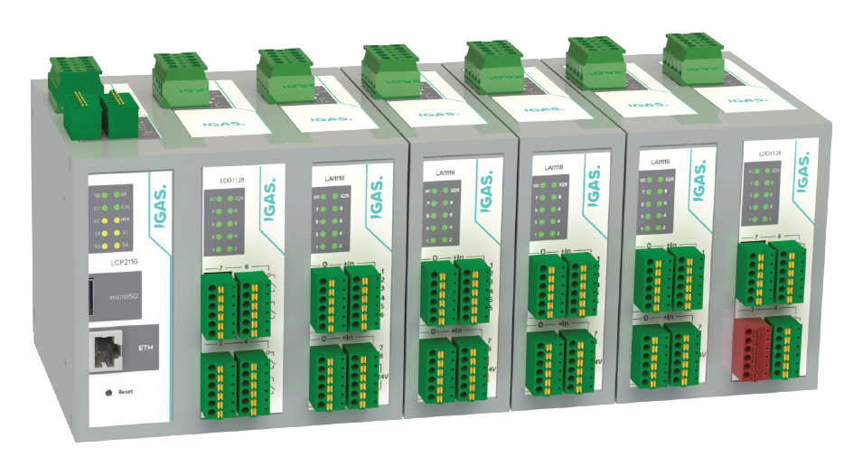
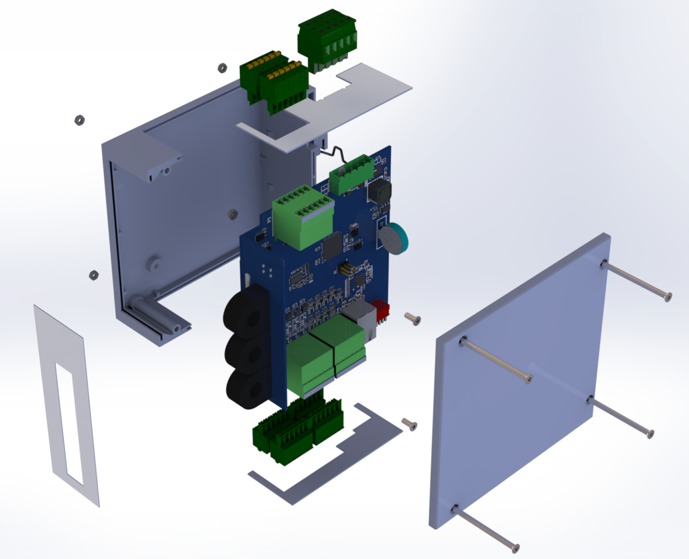
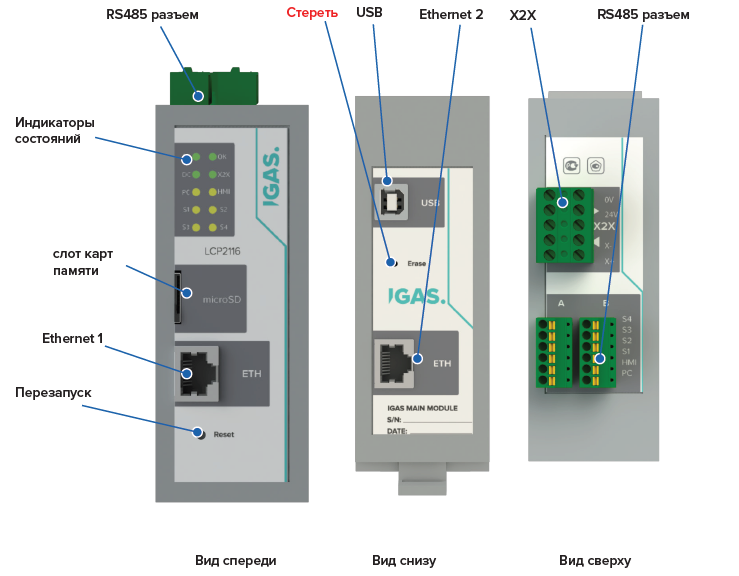
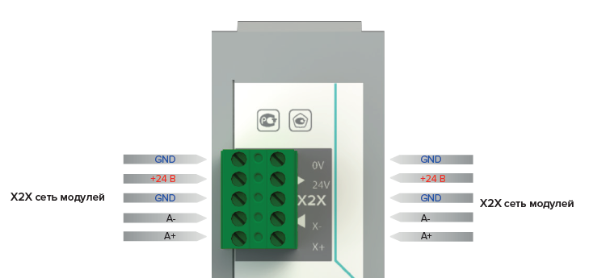
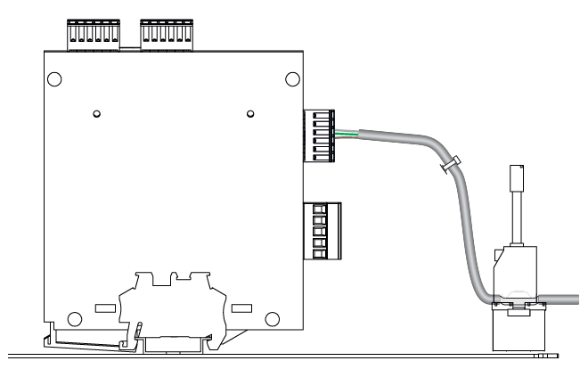

 
   
  
   ---

# Lorentz

**Свободнопрограммируемый контроллер**

## Общее техническое описание

---

# Содержание

| **1**  | Общие положения                                     |
|--------|-----------------------------------------------------|
| **2**  | Назначение и область применения                     |
| **3**  | Состав системы                                      |
| **4**  | Общая архитектура                                   |
| **5**  | Конструкция модулей                                 |
| **6**  | Процессорный модуль LCP2116                         |
| **7**  | Внутренняя шина X2X                                 |
| **8**  | Электропитание                                      |
| **9**  | Программная платформа LCP                           |
| **10** | Программное обеспечение функциональных модулей      |
| **11** | Функционирование и обмен данными                    |
| **12** | Диагностика и идентификация                         |
| **13** | Монтаж, прокладка кабелей и EMC                     |
| **14** | Техническое обслуживание и замена                   |
| **15** | Границы применения и ответственность проектировщика |
| **16** | Ссылочная документация                              |
| **17** | Заключение                                          |

# 1. Общие положения

Настоящий документ содержит общее техническое описание модульной системы программируемых контроллеров Lorentz. Документ предназначен для первичного ознакомления разработчиков, проектировщиков, специалистов по наладке и обслуживанию с архитектурой системы, составом аппаратных средств и базовой программной платформой.

Описание построено от уровня системы к уровню отдельных функциональных узлов. Параметры каналов, электрические характеристики, схемы подключения, ограничения по нагрузкам и состав конкретных плат приводятся в паспортах, руководствах, схемах и сборочных документах соответствующих модулей и в настоящем документе полностью не дублируются.

> ℹ️ **Информация:** Lorentz является универсальной аппаратно-программной платформой. Прикладная программа конкретной установки, шкафа или технологической системы разрабатывается отдельно и не является частью базового описания контроллеров.

# 2. Назначение и область применения

Lorentz предназначена для построения промышленных систем управления, контроля, сбора данных и коммутации внешних цепей. Состав системы формируется из центрального процессорного модуля и требуемого набора адресных функциональных модулей.

Платформа может применяться в составе электротехнических шкафов, технологического оборудования, измерительных стендов, систем диспетчеризации, локальных и распределенных узлов автоматизации. Конкретное назначение определяется прикладным программным обеспечением и составом подключенных модулей.

- обработка аналоговых и дискретных сигналов;

- управление релейными и иными исполнительными цепями;

- подключение датчиков, преобразователей, операторских панелей и внешних систем;

- локальная и распределенная установка модулей;

- разработка прикладной логики на языках C и C++;

- расширение состава системы без изменения общей архитектуры.

Модули имеют степень защиты IP20 и предназначены для установки внутри металлического электротехнического шкафа либо иного корпуса, обеспечивающего требуемую защиту оборудования от внешней среды и случайного доступа.

# 3. Состав системы

В передаваемую линейку входят следующие полностью разработанные и эксплуатируемые модули:

| **Обозначение** | **Функциональная группа**                  | **Роль в системе**                                                                                                                   |
|-----------------|--------------------------------------------|--------------------------------------------------------------------------------------------------------------------------------------|
| LCP2116         | Процессорный модуль                        | Выполнение прикладной программы, управление X2X, связь с внешними устройствами, хранение и обработка данных.                         |
| LAI1118         | Модуль аналогового ввода                   | Прием и первичное преобразование аналоговых и связанных с ними дискретных сигналов; передача результатов в LCP.                      |
| LDI1118         | Модуль дискретного ввода                   | Прием дискретных сигналов постоянного тока и передача их состояний в LCP.                                                            |
| LDO1128         | Модуль релейного вывода                    | Коммутация внешних цепей посредством релейных выходов по командам LCP.                                                               |
| LCT1114         | Модуль коммутационного ресурса выключателя | Работа в составе систем контроля коммутационного ресурса выключателя. Детальные функции и параметры приведены в документации модуля. |

Каждый функциональный модуль является самостоятельным микропроцессорным устройством, имеет собственную прошивку, адрес в сети X2X, локальную индикацию и набор параметров, определяемый его назначением.

  

<em>Рисунок 1 — Общий вид разработанных модулей системы Lorentz.</em>

# 4. Общая архитектура

Система строится по централизованно-распределенному принципу. Процессорный модуль LCP2116 выполняет прикладную логику и является ведущим устройством внутренней линии X2X. Функциональные модули выполняют локальный ввод, вывод, измерение или специализированную обработку и обмениваются данными с LCP по RS-485 с использованием Modbus RTU.

| **Уровень**      | **Состав**                                   | **Функции**                                                                                               |
|------------------|----------------------------------------------|-----------------------------------------------------------------------------------------------------------|
| Прикладной       | Пользовательская программа LCP               | Алгоритмы управления, обработка данных, связь с внешними системами, ведение журналов и сервисные функции. |
| Системный        | FreeRTOS, HAL, драйверы и библиотеки         | Планирование задач, доступ к аппаратным ресурсам, интерфейсам и базовым службам.                          |
| Коммуникационный | X2X, RS-485, Ethernet, USB                   | Обмен с функциональными модулями, операторскими устройствами, датчиками и внешними системами.             |
| Полевой          | LAI, LDI, LDO, LCT и подключенные устройства | Получение технологических сигналов и воздействие на исполнительные цепи.                                  |

Номинальная конфигурация X2X включает до 32 адресных модулей. Фактическое время полного цикла опроса зависит от количества модулей, установленной скорости, объема запросов и времени ответа каждого устройства. Увеличение количества устройств сверх базового ограничения возможно только после отдельной оценки производительности и проверки устойчивости обмена.

  

<em>Рисунок 2 — Общая структурная схема системы Lorentz.</em>

# 5. Конструкция модулей

Модули выполнены в унифицированном пластиковом корпусе для установки на DIN-рейку. Общая конструктивная модель применяется ко всем модулям линейки и обеспечивает одинаковый способ размещения в шкафу, подключения, маркировки и обслуживания.

- пластиковый корпус и крышка одного типоразмера;

- пружинный фиксатор на DIN-рейке;

- печатная плата функционального модуля;

- унифицированные верхняя и нижняя шинные панели;

- передняя панель с обозначением, маркировкой каналов и светодиодной индикацией;

- съемные клеммные разъемы одной серии; количество контактов зависит от модуля;

- световоды и общий набор крепежных элементов.

  

<em>Рисунок 3 — Конструкция типового модуля Lorentz.</em>

Корпус является несущим и защитным элементом, но не выполняет функцию электромагнитного экрана или защитного заземления. Экранирование и защитное заземление обеспечиваются конструкцией металлического шкафа, монтажной панелью, кабельными зажимами и системой заземления конкретного объекта.

На каждой плате установлен самовосстанавливающийся защитный элемент. Конкретные параметры защиты и потребления приводятся в документации соответствующего модуля.

# 6. Процессорный модуль LCP2116

LCP2116 является центральным вычислительным и коммуникационным модулем системы. Модуль построен на микроконтроллере семейства ATSAM3X и предназначен для свободного программирования на языках C и C++. Прикладной разработчик получает доступ к аппаратным ресурсам через базовый проект, HAL и набор драйверов.

## 6.1. Интерфейсы

| **Интерфейс**         | **Количество** | **Назначение**                                                                                         |
|-----------------------|----------------|--------------------------------------------------------------------------------------------------------|
| RS-485 X2X            | 1              | Внутренняя линия подключения адресных модулей Lorentz.                                                 |
| RS-485 PC             | 1              | По умолчанию — связь с внешним компьютером или системой SCADA; может использоваться для другой задачи. |
| RS-485 HMI            | 1              | По умолчанию — подключение операторской панели; назначение программно не ограничено.                   |
| RS-485 S1–S4          | 4              | Подключение датчиков, преобразователей и других периферийных устройств.                                |
| Ethernet 10/100Base-T | 2              | Два независимых порта RJ45 для внешнего сетевого обмена.                                               |
| USB                   | 1              | Сервис, диагностика и обмен данными; базовый комплект поддерживает USB CDC.                            |
| microSD               | 1              | Хранение файлов, журналов и прикладных данных.                                                         |
| RTC                   | 1              | Часы реального времени с резервным питанием.                                                           |

Обозначения PC и HMI отражают рекомендуемое применение портов и не ограничивают их использование. Все шесть внешних последовательных портов физически выполнены как RS-485.

  

<em>Рисунок 4 — Расположение и назначение интерфейсов LCP2116.</em>

## 6.2. Базовые аппаратные функции

- управление светодиодной индикацией состояния;

- аппаратный watchdog;

- контроль резервной батареи RTC;

- работа с SPI и дополнительными UART-мостами;

- поддержка двух независимых Ethernet-контроллеров;

- работа с microSD и файловой системой;

- сервисная диагностическая консоль через USB CDC.

# 7. Внутренняя шина X2X

X2X является внутренней кабельной линией системы Lorentz. Физический уровень передачи данных соответствует RS-485, а обмен между LCP и функциональными модулями выполняется по протоколу Modbus RTU. LCP последовательно опрашивает адресные модули в соответствии с прикладной программой.

| **Параметр**            | **Принятое значение или правило**                                                                                                                 |
|-------------------------|---------------------------------------------------------------------------------------------------------------------------------------------------|
| Состав линии            | +24 V DC, 0 V и дифференциальная пара RS-485.                                                                                                     |
| Адресация               | Адрес каждого функционального модуля задается DIP-переключателями.                                                                                |
| Количество модулей      | До 32 в базовой конфигурации.                                                                                                                     |
| Длина линии             | До 100 м при соблюдении требований к кабелю, топологии и терминированию.                                                                          |
| Скорость по умолчанию   | 9600 bit/s.                                                                                                                                       |
| Настройка скорости      | Программно, до 115200 bit/s.                                                                                                                      |
| Терминирование          | Со стороны LCP предусмотрено штатное терминирование; на удаленном конце протяженной линии устанавливается оконечный резистор.                     |
| Кабель                  | Для удаленных сегментов — витая пара. Для коротких соединений внутри одного шкафа допускается стандартная шкафная проводка по утвержденной схеме. |
| Гальваническая развязка | Не предусмотрена. Интерфейсные драйверы питаются от общей внутренней шины питания.

  

<em>Рисунок 5 — Подключение модулей к кабельной шине X2X.</em>

                                                                |

Состав запросов, карта регистров и алгоритм опроса определяются драйвером конкретного модуля. Универсальная библиотека Modbus RTU предоставляет транспортный уровень, а прикладные драйверы связывают регистры с функциями LAI, LDI, LDO и LCT.

> ℹ️ **Информация:** Время обновления данных не является постоянной величиной для всех конфигураций. Оно определяется последовательным опросом модулей и должно учитываться разработчиком прикладной программы при выборе скорости, таймаутов и периодов задач.

# 8. Электропитание

Номинальное питание системы — 24 V DC. Питание функциональных модулей и данные X2X передаются через общее шинное подключение. Точные допустимые диапазоны, потребляемая мощность и параметры защиты определяются паспортами соответствующих модулей.

Напряжение 24 V DC выбрано как типовое для промышленного шкафного оборудования и совместимо с распространенными источниками питания, датчиками, реле и средствами автоматики.

- проектировщик конкретной системы определяет мощность источника питания;

- учитываются суммарное потребление модулей, длина и сечение проводников, падение напряжения и пусковые режимы;

- питание внешних нагрузок рассчитывается отдельно от внутренней логики модулей;

- при необходимости независимые группы нагрузки формируются схемой шкафа и внешними средствами защиты.

# 9. Программная платформа LCP

LCP не является закрытым контроллером, программируемым только через специализированную графическую среду. Прикладная программа создается на C и C++ в Microchip Studio. Базовый проект выполнен как нативный проект ARM GCC и содержит платформенный слой, аппаратные драйверы и пример структуры приложения.

| **Компонент**              | **Назначение в базовом комплекте**                                                                                                                |
|----------------------------|---------------------------------------------------------------------------------------------------------------------------------------------------|
| Microchip Studio 7.0.2594  | Среда сборки и отладки передаваемого проекта.                                                                                                     |
| ARM GCC                    | Компиляция исходных файлов C и C++ и формирование исполняемого образа.                                                                            |
| FreeRTOS                   | Операционная система реального времени для разделения прикладных и коммуникационных задач. Конкретная версия фиксируется в программном манифесте. |
| HAL ATSAM3X                | Доступ к GPIO, UART, SPI, RTC, системному времени и watchdog.                                                                                     |
| Платформенный слой         | Единые интерфейсы работы с портами, временем, SPI и выводом данных.                                                                               |
| USB CDC                    | Сервисная консоль и обмен с ПК через стандартный виртуальный COM-порт.                                                                            |
| Ethernet                   | Поддержка двух независимых сетевых интерфейсов.                                                                                                   |
| microSD и файловая система | Чтение и запись конфигурационных, диагностических и пользовательских файлов.                                                                      |
| Modbus RTU                 | Базовый мастер и транспорт обмена по X2X и внешним RS-485.                                                                                        |
| Драйверы модулей Lorentz   | Опрос LAI1118, LDI1118, LDO1128 и LCT1114, преобразование регистров в прикладные данные.                                                          |
| Диагностический пример     | Проверка интерфейсов, RTC, батареи, watchdog, SD и сетевых каналов.                                                                               |

Базовый программный комплект предназначен для начала разработки и не содержит универсальной прикладной программы, пригодной для любого объекта. Пользователь формирует задачи FreeRTOS, алгоритмы управления, структуры данных, протоколы внешнего обмена и пользовательские функции в соответствии с проектом автоматизации.

  

<em>Рисунок 6 — Используемая редакция Microchip Studio 7.0.2594.</em>

# 10. Программное обеспечение функциональных модулей

Все функциональные модули содержат собственный микроконтроллер и встроенную прошивку. Прошивка выполняет локальную работу с каналами, обслуживает адрес и параметры модуля, реализует обмен Modbus RTU и предоставляет LCP прикладные и идентификационные данные.

В базовый комплект передачи включаются исходные проекты прошивок модулей, карты регистров и драйверы их опроса со стороны LCP. Подробное описание алгоритмов и параметров каждого модуля приводится в его документации.

- тип модуля;

- версия встроенного программного обеспечения;

- заводской номер;

- аппаратная ревизия.

Перечисленные идентификационные данные могут быть прочитаны LCP через X2X и использованы прикладной программой для проверки состава системы и сервисной диагностики.

# 11. Функционирование и обмен данными

После подачи питания LCP выполняет аппаратную инициализацию, запускает системные службы и задачи FreeRTOS, после чего переходит к выполнению прикладной программы. Типовая последовательность работы включает:

1.  инициализацию GPIO, последовательных портов, Ethernet, USB, RTC, microSD и watchdog;

2.  запуск задач прикладной логики и коммуникационных задач;

3.  последовательный опрос адресных модулей X2X;

4.  обновление внутренних данных входов и выходов;

5.  выполнение алгоритма управления;

6.  обмен с операторскими и внешними системами;

7.  ведение журналов и выполнение диагностических функций, предусмотренных приложением.

Периодичность задач и порядок опроса определяются разработчиком программы. Приоритеты должны назначаться с учетом требований технологического процесса, времени реакции, объема сетевого обмена и допустимой загрузки процессора.

# 12. Диагностика и идентификация

Базовая диагностика системы строится на локальной индикации, контроле обмена и обработке ошибок прикладной программой. LCP контролирует наличие ответа адресного модуля и может определять потерю связи с ним.

- светодиодная индикация питания и состояния;

- контроль наличия ответа модуля;

- обнаружение разрыва или нарушения связи X2X;

- чтение идентификационных данных;

- диагностическая консоль через USB CDC;

- проверка RTC, резервной батареи, microSD, Ethernet, RS-485 и watchdog в базовом проекте.

Расширенная диагностика каналов может быть реализована в прошивке конкретного модуля и в прикладной программе LCP. Наличие и состав таких данных должны подтверждаться документацией соответствующего исполнения.

# 13. Монтаж, прокладка кабелей и EMC

Модули устанавливаются на DIN-рейку внутри металлического шкафа. При компоновке должны обеспечиваться доступ к клеммам, видимость индикации, возможность снятия разъемов и допустимые радиусы изгиба кабелей.

- модули не размещают вплотную к блокам питания, преобразователям и другим приборам с интенсивным тепловыделением;

- силовые, релейные, аналоговые и коммуникационные цепи прокладывают раздельно;

- кабельные жгуты закрепляют на элементах шкафа; разъемы модулей не используют как механическую опору;

- экраны кабелей подключают к монтажной панели или шине заземления через предназначенные зажимы;

- для протяженной RS-485 применяют витую пару и оконечное согласование;

- защитное заземление и EMC-мероприятия выполняют на уровне шкафа и объекта.

Конструкция модулей разработана с учетом требований к общепромышленному оборудованию и применению на объектах энергетики. Проведены испытания по электромагнитной совместимости, степени защиты и сейсмостойкости. Подтверждающие значения и протоколы приводятся в отдельной документации.

  

<em>Рисунок 7 — Принцип монтажа, разделения цепей и подключения экранов.</em>

# 14. Техническое обслуживание и замена

Функциональный модуль рассматривается как законченный заменяемый блок. Ремонт печатных плат непосредственно на объекте не предусматривается. Неисправный модуль заменяется, а последующая диагностика и ремонт выполняются на специализированном рабочем месте.

Съемные клеммные разъемы позволяют сохранить подготовленную полевую проводку и сократить время замены. После установки нового модуля должны быть проверены адрес DIP-переключателей, соответствие исполнения, подключение клемм и восстановление обмена.

> ⚠️ **Предупреждение:** Отключение и подключение модуля не требует обязательной остановки самого LCP. Однако допустимость такой операции определяется полевыми цепями, управляемыми нагрузками, состоянием технологического процесса и требованиями безопасности. При наличии опасного напряжения или риска непредусмотренного воздействия соответствующие цепи должны быть отключены.

# 15. Границы применения и ответственность проектировщика

Общее описание не заменяет проектирование конкретной системы автоматизации. Проектировщик шкафа или установки несет ответственность за выбор источников питания, расчет проводников, защиту нагрузок, выбор кабелей, обеспечение электробезопасности, EMC, теплового режима и требуемого времени реакции.

Прикладной разработчик отвечает за корректность алгоритмов управления, обработку потери связи, начальные и безопасные состояния выходов, таймауты, восстановление после сбоя и соответствие программы требованиям конкретного объекта.

> ⚠️ **Предупреждение:** Система не должна использоваться как единственное средство функциональной безопасности, если объект требует сертифицированных защитных функций. Независимые аварийные блокировки и средства защиты определяются проектом оборудования.

# 16. Ссылочная документация

Для детального изучения системы используются документы соответствующих модулей:

- паспорт и техническое описание;

- руководство по эксплуатации;

- электрическая принципиальная схема;

- сборочный чертеж и спецификация;

- исходный проект печатной платы;

- описание встроенного программного обеспечения;

- карта регистров Modbus RTU;

- исходные проекты прошивок и драйверов.

Точный состав и редакции передаваемых файлов фиксируются отдельным реестром передачи. В настоящее описание реестр не включается.

# 17. Заключение

Lorentz представляет собой законченную модульную аппаратно-программную платформу для разработки промышленных систем управления. Центральный процессорный модуль обеспечивает свободное программирование на C и C++, функциональные модули выполняют распределенный ввод-вывод и специализированные функции, а X2X объединяет их на базе RS-485 и Modbus RTU.

Унифицированная конструкция, съемные клеммы, стандартное питание 24 V DC, открытая программная архитектура и передаваемый комплект исходных кодов позволяют принимающей стороне разрабатывать собственные прикладные системы без зависимости от отдельного закрытого программного продукта.
