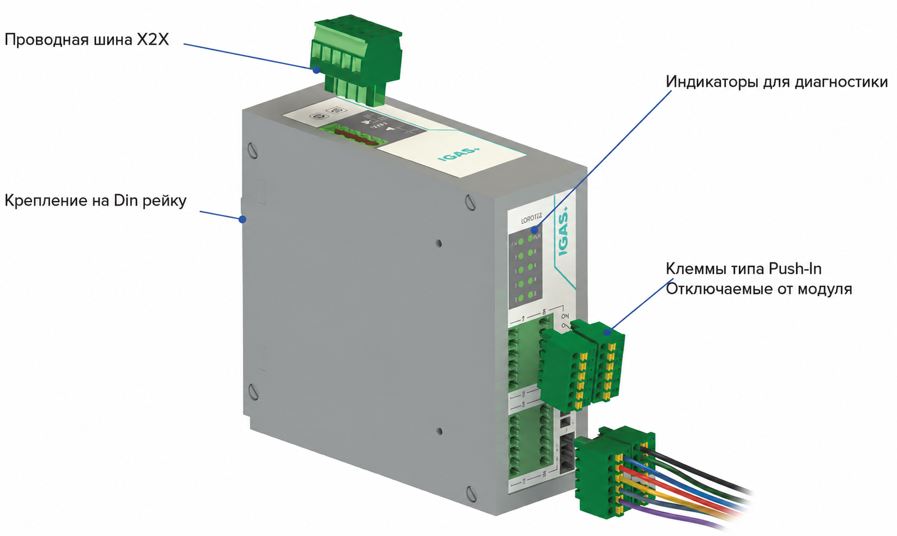
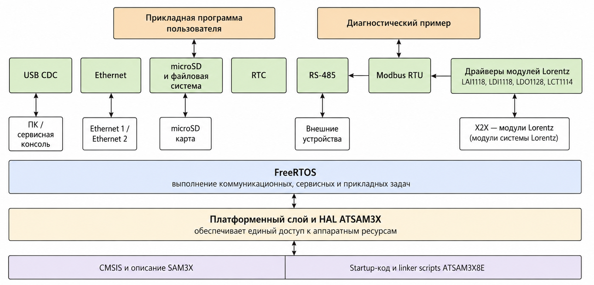

 
   
  
   ---

# Lorentz

**Свободнопрограммируемый контроллер**

## Пояснительная записка

---

# Содержание

| Раздел | Наименование |
|---:|---|
| **1** | Общие положения |
| **2** | Назначение и область применения |
| **3** | Состав системы Lorentz |
| **4** | Общая архитектура системы |
| **5** | Конструктивное исполнение модулей |
| **6** | Процессорный модуль LCP2116 |
| **7** | Функциональные модули |
| **8** | Внутренняя шина X2X |
| **9** | Электропитание |
| **10** | Программная платформа |
| **11** | Функционирование системы |
| **12** | Идентификация и диагностика |
| **13** | Монтаж, экранирование и тепловой режим |
| **14** | Техническое обслуживание и замена модулей |
| **15** | Основные технические решения |
| **16** | Границы документа и связанная документация |
| **17** | Заключение |

---

# 1. Общие положения

Настоящая пояснительная записка содержит общее описание модульной системы свободно программируемых контроллеров Lorentz и поясняет основные технические решения, принятые при ее разработке.

Документ предназначен для первичного ознакомления разработчиков, проектировщиков, специалистов по сборке, наладке и обслуживанию с:

- назначением и составом системы;
- общей аппаратной и программной архитектурой;
- конструкцией процессорного и функциональных модулей;
- принципом работы внутренней шины X2X;
- организацией электропитания;
- порядком монтажа, подключения, диагностики и обслуживания;
- причинами выбора основных конструктивных решений.

Параметры отдельных каналов, электрические характеристики, предельные нагрузки, схемы подключения, состав печатных плат и подробное описание встроенного программного обеспечения приводятся в документации соответствующих модулей и в настоящем документе полностью не повторяются.

> ℹ️ **Информация:** Lorentz является базовой аппаратно-программной системой. Прикладная программа конкретного шкафа, установки или технологического объекта разрабатывается отдельно в соответствии с задачей автоматизации.

# 2. Назначение и область применения

Lorentz предназначена для построения промышленных систем управления, контроля, сбора данных и коммутации внешних цепей. Система формируется из центрального процессорного модуля LCP2116 и требуемого набора адресных функциональных модулей.

Область применения определяется составом оборудования и прикладным программным обеспечением. Lorentz может использоваться в составе:

- электротехнических шкафов управления;
- технологических установок и машин;
- систем сбора и обработки измерительных сигналов;
- локальных и распределенных узлов автоматизации;
- измерительных и испытательных стендов;
- систем диспетчеризации и связи с внешними устройствами.

Система обеспечивает:

- обработку аналоговых и дискретных входных сигналов;
- управление релейными и другими исполнительными цепями;
- подключение датчиков, преобразователей, операторских панелей и внешних систем;
- локальное и распределенное размещение модулей;
- разработку прикладного программного обеспечения на языках C и C++;
- изменение состава системы без изменения общей архитектуры.

Модули имеют степень защиты IP20 и предназначены для установки внутри металлического электротехнического шкафа либо другого корпуса, обеспечивающего необходимую защиту от внешней среды и случайного доступа.

> ⚠️ **Предупреждение:** Lorentz не является сертифицированной системой функциональной безопасности. Если объект требует независимых аварийных блокировок, безопасного останова или иных защитных функций, они должны быть реализованы отдельными средствами в составе проекта оборудования.

# 3. Состав системы Lorentz

В состав разработанной линейки входят следующие модули:

| Обозначение | Функциональная группа | Назначение в системе |
|---|---|---|
| **LCP2116** | Процессорный модуль | Выполнение прикладной программы, управление X2X, обработка данных, связь с внешними устройствами и хранение информации. |
| **LAI1118** | Модуль аналогового ввода | Прием и первичное преобразование аналоговых сигналов, локальная обработка и передача результатов в LCP. |
| **LDI1118** | Модуль дискретного ввода | Прием дискретных сигналов постоянного тока и передача их состояний в LCP. |
| **LDO1128** | Модуль релейного вывода | Коммутация внешних цепей посредством релейных выходов по командам LCP. |
| **LCT1114** | Модуль коммутационного ресурса выключателя | Работа в составе систем контроля коммутационного ресурса выключателя. Подробные функции определяются документацией модуля. |

Каждый функциональный модуль является самостоятельным микропроцессорным устройством. Модуль имеет собственную печатную плату, встроенное программное обеспечение, адрес в сети X2X, локальную индикацию и набор регистров, соответствующий его назначению.

  

<em>Рисунок 1 — Общий вид модулей системы Lorentz.</em>

Подробные характеристики каждого исполнения приведены в его паспорте, техническом описании, руководстве по эксплуатации, электрической схеме и документации встроенного программного обеспечения.

# 4. Общая архитектура системы

Система Lorentz построена по централизованно-распределенному принципу.

Центральный процессорный модуль LCP2116 выполняет прикладную логику, управляет обменом по X2X и обеспечивает связь с внешними устройствами. Функциональные модули выполняют локальный ввод, вывод, измерение или специализированную обработку сигналов и передают данные в LCP.

  

<em>Рисунок 2 — Общая структурная схема системы Lorentz.</em>

Архитектура включает следующие уровни:

| Уровень | Состав | Основные функции |
|---|---|---|
| **Прикладной** | Пользовательская программа LCP | Алгоритмы управления, обработка данных, связь с внешними системами, журналы и сервисные функции. |
| **Системный** | FreeRTOS, HAL, драйверы и библиотеки | Планирование задач, доступ к аппаратным ресурсам, интерфейсам и базовым службам. |
| **Коммуникационный** | X2X, внешние RS-485, Ethernet и USB | Обмен с функциональными модулями, датчиками, панелями и внешними системами. |
| **Полевой** | LAI, LDI, LDO, LCT и подключенные устройства | Получение технологических сигналов и воздействие на исполнительные цепи. |

Модульное построение принято как распространенный принцип организации промышленных систем автоматизации. Разделение центральной логики и локальных функций позволяет формировать состав оборудования под конкретный объект, заменять отдельные узлы и расширять систему без изменения базовой конструкции.

# 5. Конструктивное исполнение модулей

## 5.1. Типовой модуль

Модули выполнены в унифицированном пластиковом корпусе для установки на DIN-рейку. Общая конструктивная модель применяется ко всем модулям линейки и обеспечивает одинаковый способ размещения, подключения, маркировки и обслуживания.

Типовой модуль включает:

- пластиковый корпус и крышку;
- пружинный фиксатор на DIN-рейке;
- печатную плату функционального узла;
- верхнюю и нижнюю шинные панели;
- переднюю панель с обозначением и маркировкой каналов;
- светодиодную индикацию и световоды;
- съемные клеммные разъемы;
- крепежные элементы.

  

<em>Рисунок 3 — Унифицированная конструкция типового модуля Lorentz.</em>

Унификация охватывает корпус, крышку, DIN-фиксатор, световоды, крепеж, шинные панели и серию съемных клеммных разъемов. Количество контактов клеммного блока определяется назначением конкретного модуля.

Такое решение обеспечивает:

- сокращение номенклатуры механических деталей;
- единый внешний вид и способ маркировки;
- повторяемую компоновку модулей в шкафу;
- упрощение сборки и стендовых испытаний;
- единый порядок установки и замены;
- упрощение хранения запасных частей.

Функциональные отличия модулей сосредоточены преимущественно в печатной плате, передней маркировке, количестве клемм и встроенном программном обеспечении.

## 5.2. Съемные клеммные соединения

Съемные клеммные разъемы применены для упрощения производства, испытаний, монтажа и обслуживания. Полевую проводку можно подготовить и проверить отдельно от электронного модуля, а при замене сохранить подключенные проводники в клеммном блоке.

  

<em>Рисунок 4 — Применение съемных клеммных разъемов.</em>

Основные преимущества решения:

- сокращение времени монтажа;
- упрощение стендовой проверки плат и собранных модулей;
- замена электронного блока без повторной разделки каждого проводника;
- снижение вероятности ошибочного повторного подключения;
- возможность раздельной сборки шкафа и электронных модулей.

Корпус является несущим и защитным элементом, но не выполняет функцию электромагнитного экрана или защитного заземления. Экранирование и заземление обеспечиваются конструкцией металлического шкафа и монтажом конкретного объекта.

# 6. Процессорный модуль LCP2116

LCP2116 является центральным вычислительным и коммуникационным модулем системы. Модуль построен на микроконтроллере ATSAM3X8E и предназначен для свободного программирования на языках C и C++.

Прикладной разработчик получает доступ к аппаратным ресурсам через передаваемый базовый проект, аппаратный абстрактный слой HAL и набор драйверов.

## 6.1. Интерфейсы LCP2116

| Интерфейс | Количество | Назначение |
|---|---:|---|
| **RS-485 X2X** | 1 | Внутренняя линия подключения адресных модулей Lorentz. |
| **RS-485 PC** | 1 | По умолчанию — связь с внешним компьютером или системой SCADA; назначение программно не ограничено. |
| **RS-485 HMI** | 1 | По умолчанию — подключение операторской панели; назначение программно не ограничено. |
| **RS-485 S1–S4** | 4 | Подключение датчиков, преобразователей и других периферийных устройств. |
| **Ethernet 10/100Base-T** | 2 | Два независимых порта RJ45 для внешнего сетевого обмена. |
| **USB** | 1 | Сервис, диагностика и обмен данными; базовое программное обеспечение поддерживает USB CDC. |
| **microSD** | 1 | Хранение файлов, журналов и прикладных данных. |
| **RTC** | 1 | Часы реального времени с резервным питанием. |

Обозначения PC и HMI отражают рекомендуемое применение портов и не ограничивают их использование. Все шесть внешних последовательных портов физически выполнены как RS-485.

  

<em>Рисунок 5 — Расположение и назначение интерфейсов LCP2116.</em>

> ℹ️ **Информация:** Порты PC, HMI и S1–S4 не имеют жестко заданной прикладной функции. Их назначение определяется программным обеспечением конкретной системы.

## 6.2. Базовые аппаратные функции

LCP2116 обеспечивает:

- управление светодиодной индикацией состояния;
- работу с аппаратным watchdog;
- контроль резервной батареи RTC;
- работу с последовательными интерфейсами;
- поддержку двух независимых Ethernet-интерфейсов;
- работу с microSD и файловой системой;
- сервисную диагностическую консоль через USB CDC;
- управление внутренней линией X2X.

LCP2116 не содержит универсальной прикладной программы, пригодной для любого объекта. Алгоритмы управления, структура данных, протоколы внешнего обмена и поведение системы определяются программой, разработанной для конкретного применения.

# 7. Функциональные модули

## 7.1. LAI1118

LAI1118 является интеллектуальным модулем аналогового ввода. Он выполняет прием и первичное преобразование аналоговых сигналов, локальную обработку каналов и передачу результатов в LCP по X2X.

Точные диапазоны входов, разрешение, скорость измерения, схемы подключения и диагностические возможности приводятся в документации LAI1118.

## 7.2. LDI1118

LDI1118 является интеллектуальным модулем дискретного ввода. Он принимает дискретные сигналы постоянного тока, определяет состояния входов и передает их в LCP по X2X.

Уровни сигналов, схемы подключения, электрические ограничения и параметры каналов приводятся в документации LDI1118.

## 7.3. LDO1128

LDO1128 является модулем релейного вывода. Он принимает команды от LCP и коммутирует внешние цепи посредством встроенных реле.

Допустимые напряжения и токи, типы контактов, ограничения по нагрузке и рекомендуемые защитные цепи определяются паспортом и схемой LDO1128.

## 7.4. LCT1114

LCT1114 является модулем коммутационного ресурса выключателя. Модуль применяется в составе систем контроля ресурса коммутационных аппаратов и обменивается данными с LCP по X2X.

Подробные алгоритмы, входные сигналы, параметры и схема подключения приводятся в документации LCT1114.

# 8. Внутренняя шина X2X

## 8.1. Назначение и принцип работы

X2X является внутренней кабельной линией системы Lorentz. Физический уровень передачи данных соответствует RS-485, а обмен между LCP и функциональными модулями выполняется по протоколу Modbus RTU.

LCP является ведущим устройством и последовательно опрашивает адресные модули в соответствии с прикладной программой. Каждый функциональный модуль имеет собственный микроконтроллер и отвечает на запросы по установленному адресу.

Адрес модуля задается DIP-переключателями.

## 8.2. Основные параметры

| Параметр | Принятое значение или правило |
|---|---|
| **Состав линии** | +24 V DC, 0 V и дифференциальная пара RS-485. |
| **Протокол обмена** | Modbus RTU. |
| **Адресация** | DIP-переключателями на функциональном модуле. |
| **Количество модулей** | До 32 в базовой конфигурации. |
| **Максимальная длина** | До 100 м при соблюдении требований к кабелю, топологии и терминированию. |
| **Скорость по умолчанию** | 9600 bit/s. |
| **Настраиваемая скорость** | До 115200 bit/s. |
| **Терминирование** | Со стороны LCP предусмотрено штатное согласование; на удаленном конце протяженной линии устанавливается оконечный резистор. |
| **Кабель** | Для удаленных сегментов применяется витая пара. Для коротких соединений внутри одного шкафа допускается стандартная шкафная проводка по утвержденной схеме. |
| **Гальваническая развязка** | Не предусмотрена. Интерфейсные драйверы питаются от общей внутренней цепи питания. |

  

<em>Рисунок 6 — Подключение модулей к кабельной шине X2X.</em>

> ⚠️ **Предупреждение:** Отсутствие гальванического разделения должно учитываться при проектировании протяженных линий, подключении оборудования с различными потенциалами и организации заземления объекта.

## 8.3. Обоснование кабельной архитектуры

Кабельное соединение X2X выбрано с учетом доступности стандартных серийных корпусов, стоимости специализированных шинных оснований и необходимости гибкого размещения модулей.

Применение отдельного backplane потребовало бы более дорогих корпусных и контактных компонентов, усложнило бы номенклатуру и не обеспечило бы соразмерного преимущества для принятой архитектуры. Кабельное соединение позволило:

- использовать доступные унифицированные корпуса;
- сократить стоимость механической части;
- упростить сборку;
- свободно размещать модули внутри шкафа;
- выносить отдельные модули на расстояние от LCP.

## 8.4. Время цикла обмена

Обмен выполняется последовательным опросом модулей. Время полного цикла зависит от:

- количества подключенных устройств;
- установленной скорости линии;
- количества и размера запросов;
- времени обработки запроса функциональным модулем;
- таймаутов и числа повторных запросов;
- периодов коммуникационных задач FreeRTOS.

> ℹ️ **Информация:** Время обновления данных не является одинаковым для всех конфигураций. Разработчик прикладной программы должен учитывать его при выборе скорости, таймаутов, периодов задач и требуемого времени реакции системы.

Состав запросов, карта регистров и алгоритм опроса определяются драйвером конкретного модуля. Универсальная библиотека Modbus RTU обеспечивает транспортный уровень, а драйверы LAI1118, LDI1118, LDO1128 и LCT1114 связывают регистры с прикладными данными.

# 9. Электропитание

Номинальное питание системы — 24 V DC. Питание функциональных модулей и данные X2X передаются через общее шинное подключение.

Напряжение 24 V DC принято как стандартное для промышленной шкафной автоматики. Оно совместимо с распространенными источниками питания, датчиками, реле и другим оборудованием шкафов управления.

На каждой плате установлен самовосстанавливающийся защитный элемент. Локальные напряжения, необходимые для работы электронных узлов, формируются внутри модулей.

При проектировании конкретной системы учитываются:

- суммарное потребление модулей;
- мощность источника питания;
- длина и сечение проводников;
- падение напряжения;
- пусковые режимы;
- питание внешних нагрузок;
- требования к защите отдельных цепей.

Расчет питания конкретного шкафа выполняется по паспортным параметрам установленных модулей и подключенного оборудования. Базовая система не задает единую схему питания внешних нагрузок для всех применений.

# 10. Программная платформа

## 10.1. Общий принцип

LCP2116 является свободно программируемым процессорным модулем и не привязан к закрытой фирменной среде программирования PLC. Прикладное и системное программное обеспечение разрабатывается на языках C и C++.

Передаваемый базовый проект подготовлен для Microchip Studio 7.0.2594 и компилятора ARM GCC. Проект содержит исходные файлы на C и C++, аппаратный абстрактный слой, системные библиотеки, драйверы интерфейсов и пример организации приложения.

  

<em>Рисунок 7 — Используемая редакция Microchip Studio 7.0.2594.</em>

## 10.2. Состав базового программного обеспечения

| Компонент | Назначение |
|---|---|
| **Startup-код и linker scripts ATSAM3X8E** | Запуск микроконтроллера, размещение программы и данных в памяти. |
| **CMSIS и описание SAM3X** | Доступ к ядру Cortex-M3 и периферийным регистрам микроконтроллера. |
| **HAL ATSAM3X** | Работа с GPIO, UART, SPI, RTC, системным временем, watchdog и другими аппаратными ресурсами. |
| **Платформенный слой** | Унифицированные программные интерфейсы работы с портами, временем, SPI и выводом данных. |
| **FreeRTOS** | Разделение коммуникационных, сервисных и прикладных задач. |
| **USB CDC** | Сервисная консоль и обмен с ПК через виртуальный COM-порт. |
| **Ethernet** | Работа с двумя независимыми сетевыми интерфейсами. |
| **microSD и файловая система** | Чтение и запись конфигурационных, диагностических и пользовательских файлов. |
| **RTC** | Работа с часами реального времени и календарем. |
| **RS-485** | Работа с внешними последовательными устройствами. |
| **Modbus RTU** | Базовый мастер и транспорт обмена по X2X и внешним RS-485. |
| **Драйверы модулей Lorentz** | Опрос LAI1118, LDI1118, LDO1128 и LCT1114 и преобразование регистров в прикладные данные. |
| **Диагностический пример** | Проверка RS-485, Ethernet, USB, RTC, батареи, watchdog и microSD. |

  

<em>Рисунок 8 — Общая структура базового программного обеспечения LCP.</em>

FreeRTOS применяется для организации параллельного выполнения коммуникационных, сервисных и прикладных задач. Конкретный состав задач, приоритеты, периоды и механизмы обмена данными определяются разработчиком конечного приложения.

Базовый комплект предоставляет основу для разработки, но не содержит универсальной прикладной программы, пригодной для любого объекта.

## 10.3. Программное обеспечение функциональных модулей

Все функциональные модули содержат собственный микроконтроллер и встроенную прошивку. Прошивка выполняет локальную работу с каналами, обслуживает адрес и параметры модуля, реализует Modbus RTU и предоставляет LCP прикладные и идентификационные данные.

В базовый комплект входят исходные проекты прошивок, карты регистров и драйверы опроса со стороны LCP.

Через X2X доступны следующие идентификационные данные:

- тип модуля;
- версия встроенного программного обеспечения;
- серийный номер;
- аппаратная ревизия.

Подробное описание алгоритмов и регистров каждого модуля приводится в его документации.

# 11. Функционирование системы

После подачи питания LCP выполняет аппаратную и программную инициализацию, запускает системные службы и задачи FreeRTOS, после чего переходит к выполнению прикладной программы.

Типовая последовательность работы включает:

1. Инициализацию GPIO, последовательных портов, Ethernet, USB, RTC, microSD и watchdog.
2. Запуск системных, коммуникационных и прикладных задач FreeRTOS.
3. Инициализацию Modbus RTU и драйверов функциональных модулей.
4. Последовательный опрос адресных модулей X2X.
5. Обновление внутренних данных входов и выходов.
6. Выполнение алгоритмов управления.
7. Обмен с операторскими панелями, датчиками и внешними системами.
8. Ведение журналов и выполнение диагностических функций, предусмотренных приложением.

Периодичность задач и порядок опроса определяются прикладным программным обеспечением. Приоритеты назначаются с учетом требуемого времени реакции, объема сетевого обмена и допустимой загрузки процессора.

# 12. Идентификация и диагностика

Базовая диагностика системы строится на локальной индикации, контроле обмена и обработке ошибок прикладной программой.

LCP обеспечивает:

- контроль наличия ответа функционального модуля;
- обнаружение потери связи по X2X;
- чтение идентификационных данных модуля;
- обработку таймаутов и ошибок Modbus RTU;
- вывод диагностической информации через USB CDC;
- проверку работоспособности RTC, резервной батареи, microSD, Ethernet, RS-485 и watchdog средствами базового проекта.

Светодиодная индикация используется для локального отображения питания, состояния модуля, состояния каналов и активности интерфейсов в объеме, предусмотренном конкретным исполнением.

> ℹ️ **Информация:** Расширенная диагностика отдельных каналов определяется аппаратными возможностями и прошивкой соответствующего модуля. В базовом системном описании она не считается одинаковой для всех исполнений.

# 13. Монтаж, экранирование и тепловой режим

## 13.1. Установка модулей

Модули устанавливаются на DIN-рейку внутри металлического электротехнического шкафа. При компоновке должны обеспечиваться:

- доступ к съемным клеммным разъемам;
- видимость светодиодной индикации;
- возможность установки и снятия модуля;
- допустимые радиусы изгиба кабелей;
- механическая разгрузка кабельных жгутов;
- расстояние от приборов с интенсивным тепловыделением.

Модули не следует устанавливать вплотную к блокам питания, частотным преобразователям и другим устройствам, выделяющим значительное количество тепла.

## 13.2. Прокладка цепей

При монтаже должны раздельно прокладываться:

- силовые цепи;
- релейные выходные цепи;
- аналоговые измерительные цепи;
- дискретные входные цепи;
- Ethernet и другие высокочастотные линии;
- X2X и внешние линии RS-485.

Кабельные жгуты закрепляются на элементах шкафа. Клеммные разъемы модулей не должны использоваться как механическая опора для кабелей.

## 13.3. Экранирование и заземление

Пластиковый корпус модуля не является проводящим экраном и не используется как элемент защитного заземления.

Экранирование и заземление выполняются на уровне шкафа:

- экраны кабелей подключаются к монтажной панели или шине заземления через предназначенные зажимы;
- металлический шкаф и монтажная панель включаются в систему защитного заземления объекта;
- для протяженных линий RS-485 применяется витая пара;
- на удаленном конце линии выполняется оконечное согласование;
- размещение и подключение экранов определяются схемой конкретного шкафа.

  

<em>Рисунок 9 — Принцип монтажа, разделения цепей и подключения экранов.</em>

## 13.4. Охлаждение и условия установки

Модули не содержат вентиляторов и рассчитаны на естественное охлаждение. Тепловой режим определяется потерями внутри модулей, температурой в шкафу, расположением соседнего оборудования и вентиляцией шкафа.

Конструкция разработана с учетом требований к общепромышленному оборудованию и применению на объектах энергетики. Проведены испытания по электромагнитной совместимости, степени защиты и сейсмостойкости. Подробные значения и протоколы приводятся в соответствующей документации и в настоящей записке не дублируются.

# 14. Техническое обслуживание и замена модулей

Функциональный модуль рассматривается как законченный заменяемый блок. Ремонт печатных плат непосредственно на объекте не предусматривается, поскольку такой ремонт требует специализированного оборудования, последующей проверки и не обеспечивает контролируемого качества восстановления в полевых условиях.

При неисправности выполняется замена модуля целиком. Диагностика и ремонт снятого изделия при необходимости проводятся на специализированном рабочем месте.

Съемные клеммные разъемы позволяют сохранить подготовленную полевую проводку и сократить время замены. После установки нового модуля проверяются:

- соответствие типа модуля;
- установленный адрес DIP-переключателей;
- положение и фиксация съемных клемм;
- подключение X2X;
- восстановление обмена с LCP;
- корректность работы подключенных каналов.

> ⚠️ **Предупреждение:** Отключение и подключение функционального модуля не требует обязательной остановки самого LCP. Однако допустимость замены при включенном питании определяется полевыми цепями, управляемыми нагрузками, состоянием технологического процесса и требованиями безопасности. При наличии опасного напряжения, силовых нагрузок или риска непредусмотренного воздействия соответствующие цепи должны быть отключены.

# 15. Основные технические решения

| Техническое решение | Краткое обоснование |
|---|---|
| **Центральный LCP и адресные функциональные модули** | Масштабирование состава и разделение прикладной логики и локальных функций. |
| **Свободное программирование на C и C++** | Отсутствие зависимости от закрытой фирменной среды и возможность изменения системного и прикладного кода. |
| **FreeRTOS** | Разделение коммуникационных, сервисных и прикладных задач. |
| **RS-485 и Modbus RTU для X2X** | Распространенный промышленный интерфейс, доступная элементная база и достаточность для принятого способа последовательного опроса. |
| **Кабельная шина X2X** | Применение доступных корпусов, снижение стоимости механической части и гибкость размещения модулей. |
| **Питание 24 V DC** | Совместимость с типовым промышленным шкафным оборудованием. |
| **Унифицированный корпус и DIN-рейка** | Упрощение производства, монтажа, маркировки и хранения запасных частей. |
| **Съемные клеммные разъемы** | Ускорение сборки, испытаний и замены модулей с сохранением полевой проводки. |
| **Собственный микроконтроллер в каждом модуле** | Локальная обработка каналов и возможность изменения функциональности встроенным программным обеспечением. |
| **Самовосстанавливающаяся защита на каждой плате** | Локальная защита электронного узла от перегрузок в пределах предусмотренных режимов. |
| **Блочная замена** | Быстрое и контролируемое восстановление системы без ремонта платы на объекте. |
| **Естественное охлаждение** | Отсутствие вентиляторов и других обслуживаемых механических узлов. |
| **IP20 и монтаж в металлическом шкафу** | Соответствие принятой конструкции и обеспечение внешней защиты на уровне шкафа. |

# 16. Границы документа и связанная документация

Настоящая пояснительная записка описывает систему Lorentz в целом и не заменяет проектирование конкретного шкафа или технологической установки.

Проектировщик конкретной системы определяет:

- состав и количество модулей;
- мощность источников питания;
- сечения проводников и защиту цепей;
- питание внешних нагрузок;
- топологию и скорость X2X;
- требования к EMC и заземлению;
- тепловой режим шкафа;
- начальные и безопасные состояния исполнительных цепей;
- действия при потере связи и отказе оборудования.

Для детального изучения применяются документы соответствующих модулей:

- паспорт и техническое описание;
- руководство по эксплуатации;
- электрическая принципиальная схема;
- сборочный чертеж и спецификация;
- исходные файлы печатной платы;
- описание встроенного программного обеспечения;
- карта регистров Modbus RTU;
- исходные проекты прошивок;
- библиотека Modbus RTU и драйверы модулей для LCP;
- протоколы и материалы испытаний.

> ℹ️ **Информация:** При наличии различий между настоящей запиской и документацией конкретного модуля определяющими являются данные паспорта, электрической схемы и документации соответствующего исполнения.

# 17. Заключение

Lorentz представляет собой модульную аппаратно-программную систему для разработки промышленных средств управления и сбора данных.

Центральный процессорный модуль LCP2116 обеспечивает свободное программирование на C и C++, работу с внешними интерфейсами и управление функциональными модулями. Модули LAI1118, LDI1118, LDO1128 и LCT1114 выполняют локальные функции ввода, вывода и специализированной обработки и обмениваются с LCP по кабельной линии X2X на базе RS-485 и Modbus RTU.

Унифицированная конструкция, установка на DIN-рейку, съемные клеммные соединения, стандартное питание 24 V DC, блочное обслуживание и открытая программная архитектура обеспечивают возможность применения Lorentz в системах различного назначения и дальнейшей разработки прикладного программного обеспечения на базе передаваемых исходных проектов и библиотек.
