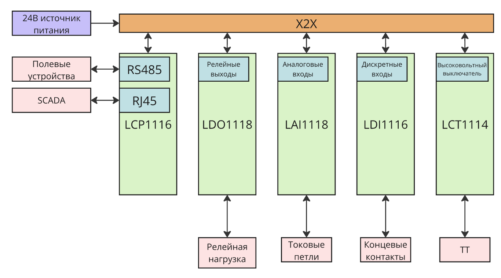
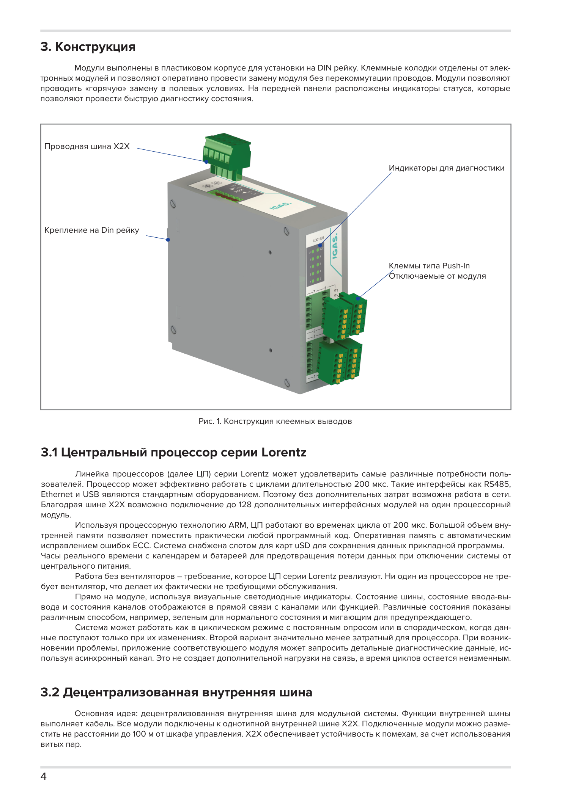

  

 

  

 

---

# Lorentz

**Свободнопрограммируемый контроллер**

## Пояснительная записка по конструкции

---
# Содержание

| **1**  | Общие положения                                       |
|--------|-------------------------------------------------------|
| **2**  | Цель разработки                                       |
| **3**  | Исходные требования и ограничения                     |
| **4**  | Выбор модульной архитектуры                           |
| **5**  | Унифицированная конструкция модулей                   |
| **6**  | Выбор кабельной шины X2X                              |
| **7**  | Выбор структуры электропитания                        |
| **8**  | Съемные клеммные соединения                           |
| **9**  | Программная архитектура                               |
| **10** | Ремонтопригодность и замена модулей                   |
| **11** | Тепловой режим, EMC, степень защиты и сейсмостойкость |
| **12** | Итоговые технические решения                          |
| **13** | Заключение                                            |

# 1. Общие положения

Настоящая пояснительная записка содержит краткое описание основных технических решений, принятых при разработке модульной системы программируемых контроллеров Lorentz. Документ не дублирует паспорта, электрические схемы, сборочные чертежи и документацию отдельных модулей.

> ℹ️ **Информация:** Записка подготовлена как содержательное пояснение конструкции без присвоения формального обозначения и без полного оформления по ЕСКД. При необходимости принимающая сторона может включить текст в собственную систему конструкторской документации и оформить его по действующим внутренним правилам.

# 2. Цель разработки

Разработка Lorentz начата в 2015 году и продолжается по мере расширения аппаратной и программной платформы. Целью являлось создание собственной модульной системы управления, свободно программируемой на языках C и C++ и пригодной для применения в различных промышленных задачах.

- централизация прикладной логики в процессорном модуле;

- подключение требуемого набора специализированных модулей;

- возможность самостоятельной разработки прикладного программного обеспечения;

- использование распространенных промышленных интерфейсов и питания 24 V DC;

- унификация механической конструкции и способов подключения;

- обслуживание системы заменой законченных функциональных блоков.

# 3. Исходные требования и ограничения

| **Требование или ограничение**                  | **Принятое направление решения**                                                                                      |
|-------------------------------------------------|-----------------------------------------------------------------------------------------------------------------------|
| Универсальность применения                      | Аппаратная платформа не привязана к одному технологическому процессу; прикладная функция определяется программой LCP. |
| Свободное программирование                      | Проект на C и C++ в Microchip Studio, доступ к аппаратным ресурсам через HAL и драйверы.                              |
| Модульное расширение                            | Отдельный процессорный модуль и адресные функциональные модули ввода-вывода.                                          |
| Промышленное питание                            | Номинальное питание 24 V DC и локальные преобразователи на платах.                                                    |
| Шкафное исполнение                              | Пластиковые модули IP20 для монтажа на DIN-рейку внутри металлического шкафа.                                         |
| Ограничение стоимости и доступность компонентов | Использование доступного серийного корпуса и кабельного соединения вместо дорогого специализированного backplane.     |
| Полевое обслуживание                            | Съемные клеммы и замена модуля целиком без ремонта платы на объекте.                                                  |

Конкретные электрические параметры, коммутационные нагрузки, диапазоны сигналов и ограничения отдельных каналов определялись для каждого модуля отдельно и приведены в его технической документации.

# 4. Выбор модульной архитектуры

Модульная архитектура выбрана как распространенный и практически оправданный принцип построения промышленной автоматики. Функции разделены между центральным процессорным модулем LCP2116 и специализированными модулями LAI1118, LDI1118, LDO1128 и LCT1114.

Такое разделение позволяет формировать состав системы под конкретный объект, заменять отдельные функциональные узлы и развивать линейку без переработки общей архитектуры. Каждый периферийный модуль имеет собственный микроконтроллер и выполняет локальное обслуживание каналов, а LCP реализует прикладной алгоритм и организует обмен.

Наличие микроконтроллера в каждом модуле уменьшает зависимость центрального процессора от низкоуровневых особенностей каналов и позволяет изменять функциональность модуля посредством его прошивки при сохранении общего интерфейса X2X.

  

<em>Рисунок 1 — Принятая модульная архитектура системы Lorentz.</em>

# 5. Унифицированная конструкция модулей

Для модулей принят единый типоразмер пластикового корпуса с установкой на DIN-рейку. Унификация охватывает корпус, крышку, DIN-фиксатор, световоды, крепеж, шинные панели и серию съемных клеммных разъемов. Количество контактов клеммного блока определяется назначением модуля.

- снижение числа уникальных механических деталей;

- единый внешний вид и способ маркировки;

- повторяемая компоновка шкафа;

- упрощение сборки и стендовых испытаний;

- упрощение хранения запасных частей;

- одинаковый порядок установки и замены модулей.

Функциональные отличия сосредоточены преимущественно в печатной плате, передней маркировке, количестве клемм и встроенном программном обеспечении. Это обеспечивает совместимость модулей по механическому исполнению и общему принципу подключения без требования полной электрической взаимозаменяемости различных типов.

  

<em>Рисунок 2 — Унифицированная конструкция типового модуля Lorentz.</em>

# 6. Выбор кабельной шины X2X

В качестве внутренней линии выбрана кабельная шина X2X на физическом уровне RS-485 с обменом Modbus RTU. Решение принято с учетом доступности серийных корпусов, стоимости специализированных шинных оснований и необходимости гибкого размещения модулей.

Использование отдельного backplane потребовало бы более дорогих корпусных и контактных компонентов, усложнило бы номенклатуру и не обеспечило бы соразмерного преимущества для предполагаемых шкафных конфигураций. Кабельное соединение позволило применить доступные корпуса, сохранить простую сборку и обеспечить возможность вынесения модулей на расстояние.

В базовой конфигурации к одной линии подключается до 32 модулей. Обмен выполняется последовательным опросом, поэтому время цикла зависит от числа модулей, скорости и объема данных. Скорость по умолчанию составляет 9600 bit/s и может быть увеличена программно до 115200 bit/s.

Гальваническое разделение X2X от логики и полевых цепей конструкцией не предусмотрено. Необходимость дополнительного разделения определяется проектом конкретного шкафа или объекта.

  

<em>Рисунок 3 — Кабельное подключение модулей по X2X.</em>

# 7. Выбор структуры электропитания

Номинальное напряжение 24 V DC выбрано как стандартное для промышленной автоматики. Оно совместимо с типовыми шкафными источниками питания, реле, датчиками и преобразователями. Передача питания совместно с X2X сокращает количество отдельных подключений каждого модуля.

На каждой плате установлен самовосстанавливающийся защитный элемент. Локальные напряжения формируются на электронных узлах модулей. Расчет мощности источника, сечения проводников, падения напряжения и питания внешних нагрузок выполняется проектировщиком конкретной системы по паспортным параметрам модулей.

Такое распределение ответственности исключает привязку базовой конструкции к одной конфигурации шкафа и позволяет применять одинаковые модули в системах различного состава.

# 8. Съемные клеммные соединения

Съемные клеммные разъемы выбраны для упрощения производства, испытаний, монтажа и обслуживания. Полевую проводку можно подготовить и проверить отдельно от электронного модуля, а при замене сохранить подключенные проводники в клеммном блоке.

- сокращение времени монтажа;

- упрощение стендовой проверки плат и собранных модулей;

- замена электронного блока без повторной разделки каждого проводника;

- снижение риска ошибочного повторного подключения;

- возможность раздельной сборки шкафа и электронных модулей.

  

<em>Рисунок 4 — Применение съемных клеммных разъемов.</em>

# 9. Программная архитектура

Процессорный модуль выполнен как свободно программируемая платформа на микроконтроллере ATSAM3X. Для разработки применяется смешанный проект на C и C++ в Microchip Studio 7.0.2594. Базовый комплект включает HAL, драйверы аппаратных интерфейсов, FreeRTOS, Modbus RTU, драйверы модулей X2X и диагностический пример.

Выбор исходного проекта вместо закрытой среды программирования позволяет принимающей стороне изменять системные и прикладные функции, разрабатывать собственные протоколы и использовать интерфейсы LCP в соответствии с задачей объекта.

FreeRTOS применяется для разделения коммуникационных, сервисных и прикладных задач. Конкретная структура задач, приоритеты и периоды определяются разработчиком конечного приложения.

  

<em>Рисунок 5 — Общая структура базового программного обеспечения LCP.</em>

# 10. Ремонтопригодность и замена модулей

Конструкция ориентирована на блочное обслуживание. Полевой ремонт печатной платы не предусматривается, поскольку не обеспечивает контролируемое качество восстановления и требует специализированного оборудования и последующих испытаний.

При неисправности модуль заменяется целиком. Съемные клеммы, единый корпус и адресация DIP-переключателями сокращают время восстановления. Ремонт снятого модуля при необходимости выполняется вне объекта на подготовленном рабочем месте.

  

<em>Рисунок 6 — Принцип блочного обслуживания и замены модуля.</em>

> ⚠️ **Предупреждение:** Интерфейс допускает отключение и подключение модуля без обязательного выключения LCP. Возможность замены при включенном питании определяется подключенными полевыми цепями, нагрузками и безопасностью технологического процесса. Для опасных или силовых цепей питание отключается.

# 11. Тепловой режим, EMC, степень защиты и сейсмостойкость

Модули не содержат вентиляторов и рассчитаны на естественное охлаждение. При компоновке шкафа они не должны устанавливаться вплотную к приборам с интенсивным тепловыделением. Требуемые расстояния и вентиляция определяются тепловым расчетом конкретного шкафа.

Пластиковый корпус имеет степень защиты IP20 и предназначен для внутренней установки. Металлический шкаф обеспечивает механическую защиту, экранирование и условия внешней среды, требуемые для объекта.

Конструкция разработана с учетом требований к общепромышленному оборудованию и применению на объектах энергетики. Проведены испытания по электромагнитной совместимости, степени защиты и сейсмостойкости. Подробные режимы, значения и протоколы в настоящей записке не повторяются и приводятся в соответствующей испытательной и модульной документации.

Разделение силовых, релейных, измерительных и коммуникационных цепей, подключение экранов и защитное заземление выполняются на уровне шкафа. Пластиковый корпус модуля не используется как экран или элемент защитного заземления.

  

<em>Рисунок 7 — Реализация экранирования и разделения цепей на уровне шкафа.</em>

# 12. Итоговые технические решения

| **Решение**                            | **Краткое обоснование**                                                                             |
|----------------------------------------|-----------------------------------------------------------------------------------------------------|
| Центральный LCP и адресные модули      | Масштабирование состава и разделение прикладной логики и локальных функций.                         |
| Свободное программирование C/C++       | Отсутствие зависимости от закрытой фирменной среды и возможность развития исходного кода.           |
| FreeRTOS                               | Разделение задач и управляемая организация выполнения коммуникационных и прикладных функций.        |
| RS-485 / Modbus RTU для X2X            | Распространенный интерфейс, доступная элементная база и достаточность для принятого способа опроса. |
| Кабельная шина                         | Снижение стоимости механики, применение доступных корпусов и гибкость размещения.                   |
| 24 V DC                                | Совместимость с промышленным шкафным оборудованием.                                                 |
| Единый корпус и DIN-рейка              | Унификация монтажа, внешнего вида и запасных частей.                                                |
| Съемные клеммы                         | Ускорение сборки, испытаний и замены.                                                               |
| Собственный контроллер в каждом модуле | Локальная обработка каналов и возможность развития прошивок модулей.                                |
| Блочная замена                         | Быстрое и контролируемое восстановление без ремонта платы в полевых условиях.                       |
| Естественное охлаждение                | Отсутствие изнашиваемых вентиляторов и упрощение обслуживания.                                      |
| IP20 и монтаж в металлическом шкафу    | Соответствие принятой конструкции и перенос внешней защиты на уровень шкафа.                        |

# 13. Заключение

Принятые решения сформировали унифицированную модульную платформу, сочетающую собственный свободно программируемый процессорный модуль, интеллектуальные функциональные модули, стандартное промышленное питание и кабельную линию связи.
