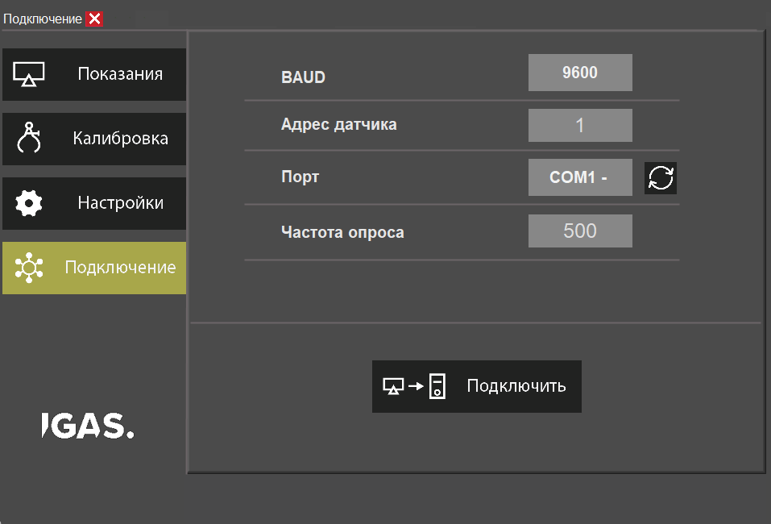
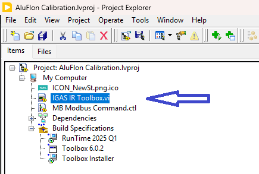
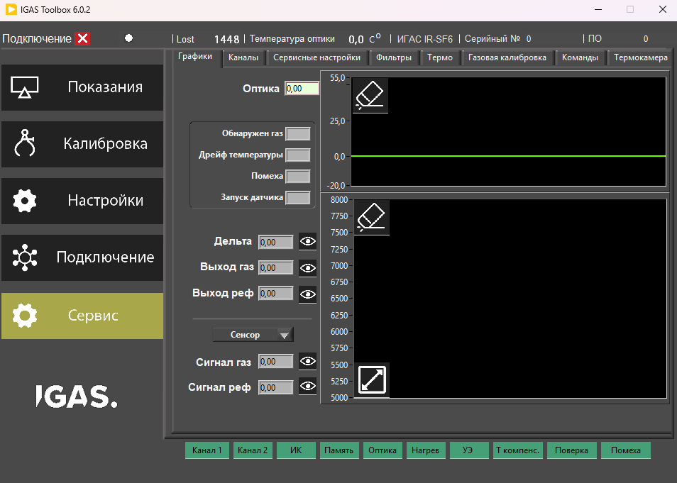
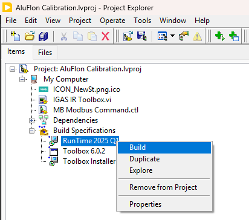
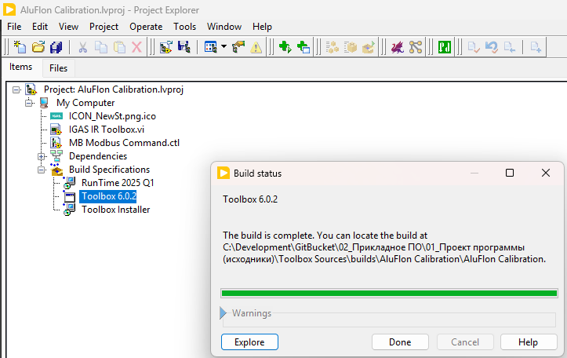
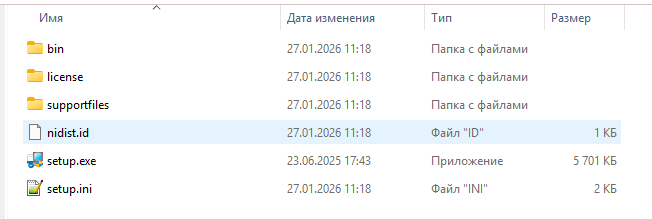
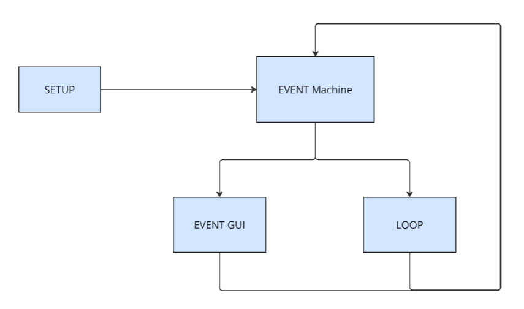

# IGAS Toolbox — Пояснительная записка (по ГОСТ 19.404-79, адаптировано для разработчика)

> 🟦 **Назначение документа**: описать функционирование и организацию программного продукта IGAS Toolbox (LabVIEW) в объёме, достаточном для сопровождения исходного кода (сборка, структура проекта, модель выполнения, точки расширения, диагностика). Физический смысл измерений и назначение регистров Modbus рассматриваются в отдельных документах комплекта и в данную записку не включаются.

---

## Оглавление (финальная версия)

### 1. Введение

Краткие сведения о программном продукте и составе документации: что представляет собой IGAS Toolbox как ПО, какие документы комплекта следует использовать как первичные источники (без дублирования регистров/физики/операторских инструкций).

### 2. Назначение и область применения

Назначение программы и характеристика области применения в терминах ПО: IGAS Toolbox как GUI-клиент Modbus RTU для визуализации, диагностики и выполнения сервисных операций; ограничения и границы ответственности (среда связи RS‑485/COM/VISA).

### 3. Технические характеристики (содержание для сопровождения кода)

Раздел содержит описание функционирования и организации программы, достаточное для поддержки и развития.

3.1 Состав и структура проекта LabVIEW

* структура репозитория и проекта (*.lvproj), точка входа, ключевые VI/модули, правила навигации.

3.2 Зависимости и обеспечение воспроизводимой сборки

* классификация зависимостей (стандартные LabVIEW / локальные SubVI / вендоренные библиотеки);
* правила путей и диагностика missing VIs.

3.3 Модель выполнения (Runtime model)

* верхний уровень: Setup → Main Loop;
* Event Structure: последовательность выполнения, приоритет UI-событий относительно Timeout;
* краткие инварианты архитектуры исполнения.

3.4 Инициализация (Setup)

* инициализация UI и данных;
* инициализация коммуникации;
* поведение при ошибках старта и при отсутствии прибора.

3.5 Обработка UI-событий (Event Engine)

* общий паттерн обработчика события;
* соглашения по именованию/поиску обработчиков;
* управление доступностью UI при операциях обмена;
* Event Catalog как навигационная таблица.

3.6 Циклический опрос (Timeout Scheduler)

* назначение Timeout-case;
* TaskCounter 0..N и разбиение опроса;
* требования к длительности кейсов и влиянию на отзывчивость UI;
* индикация состояния связи.

3.7 Коммуникационный слой (Modbus transport)

* паттерн транзакции чтения/записи;
* таймауты/повторы/обработка ошибок;
* формирование статуса связи и отображение в UI.

3.8 Управление состоянием данных (State management)

* что является состоянием приложения;
* обновление state в Timeout и в UI-событиях;
* кэширование и актуализация по экранам;
* минимальные инварианты уровня данных.

3.9 Логирование и диагностика

* включение/выключение логов;
* формат/расположение и назначение;
* типовые сценарии диагностики.

3.10 Сборка, поставка и установка

* Build Specifications;
* состав артефактов, разделение Runtime и приложения;
* порядок сборки релиза, структура релиза, версионирование.

3.11 Поддержка и типовые доработки

* добавление UI event;
* добавление шага polling;
* добавление транзакции обмена;
* анти‑паттерны и причины деградации.

### 4. Ожидаемые технико‑экономические показатели

Кратко: ожидаемый эффект от применения GUI‑клиента (ускорение диагностики/настройки), а также ограничения по каналу связи и типовые показатели (частоты опроса/время операций) в рамках принятых решений.

### 5. Источники

Перечень стандартов и документов комплекта, использованных при разработке и сопровождении (включая документы с картой регистров/физикой/эксплуатацией).

---

## Приложения

### Приложение А — Event Catalog

Полный перечень UI‑событий/кнопок/вкладок с привязкой к обработчикам и кратким назначением.

### Приложение Б — Индекс ключевых VI

Список ключевых VI (точка входа, диспетчер событий, обёртки Modbus, обработка ошибок, логирование, state‑кластер).

### Приложение В — Схема потоков

Одна диаграмма управления и данных: Setup → Event/Timeout → Transport → State → UI.

## 1. Введение

IGAS Toolbox — прикладное программное обеспечение, разработанное в среде **LabVIEW**, предназначенное для взаимодействия с прибором по **Modbus RTU**. Настоящая пояснительная записка ориентирована на разработчика, принимающего исходный код на сопровождение.

---
🖼️ **Рисунок 1 — Общий вид IGAS Toolbox (главное окно)**

---

> 🟦 **Назначение записки**
>
> Описать устройство и функционирование программного продукта в объёме, достаточном для дальнейшей поддержки и развития: структура проекта, модель выполнения, принятые архитектурные решения, правила сборки и поставки, а также точки расширения.

---

### 1.1 Состав комплекта документации и границы описания

Для исключения дублирования и противоречий, данная записка **не** содержит:

* физические принципы измерения и измерительную модель прибора;
* значения и назначение регистров Modbus, таблицы регистров и протокольные карты;
* методики калибровки/поверки;
* операторские и сервисные инструкции по эксплуатации.

Указанные сведения следует брать из первичных документов комплекта. В репозитории проекта используются, в частности:

* **МЦТР.000031.00.000 РЭ IGAS Toolbox.pdf** — руководство по эксплуатации IGAS Toolbox (пользователь/сервис).
* **02_Описание программы (функциональное)** — функциональное описание на уровне «что делает приложение» без детализации архитектуры исходного кода.
* Документация прибора/прошивки с описанием протокола и картой регистров Modbus.

> 🟨 **Принцип ведения документации**
>
> Изменения, затрагивающие протокол, карту регистров или смысл параметров, должны согласовываться с первичными документами прибора. В IGAS Toolbox отражаются только клиентские изменения (UI/обмен/логирование) и сопровождающие корректировки.

---

### 1.2 Как пользоваться этой запиской при сопровождении

Записка построена так, чтобы разработчик мог последовательно ответить на ключевые вопросы сопровождения:

* **как открыть проект и воспроизвести сборку** (структура проекта, зависимости, Build Specifications);
* **где находится точка входа** и как устроено выполнение (Setup → Main Loop → Event Structure);
* **как устроены обработчики UI и циклический опрос** (Event Engine, Timeout Scheduler);
* **где реализован Modbus transport**, политика таймаутов и обработка ошибок;
* **где хранится состояние (state)** и как выполняется обновление UI;
* **как диагностировать проблемы** (логирование, признаки деградации, типовые доработки).

> 🟦 **Важно**
>
> Данная записка описывает программную архитектуру и принципы сопровождения. Она не заменяет руководство пользователя и не содержит инструкций по выполнению конкретных технологических операций.

---
🖼️ **Рисунок 2 — Навигация в проекте LabVIEW (точка входа и сборка)**

---

## 2. Назначение и область применения

### 2.1 Назначение программы

IGAS Toolbox предназначен для:

* визуализации текущих данных и диагностических статусов прибора;
* выполнения операций чтения/записи параметров через Modbus RTU в рамках предусмотренных сценариев;
* предоставления удобного интерфейса для сервисных действий, требующих регулярного повторения (настройка, проверка, диагностика);
* формирования диагностической информации (включая журналирование обмена и действий) для анализа отказов и устойчивости связи.

Программа не является измерительным алгоритмом и не интерпретирует физический смысл данных сверх отображения и базовой проверочной логики, необходимой для корректной работы интерфейса.

---
🖼️ **Рисунок 4 — Пример диагностического экрана**

---

### 2.2 Характеристика области применения

IGAS Toolbox применяется в составе программно-аппаратного комплекса IGAS IR как клиентское приложение верхнего уровня для доступа к параметрам и статусам прибора по Modbus RTU.

Типовая конфигурация подключения:

* физический уровень: **RS-485**;
* транспорт в ОС: COM-порт (USB-RS485 адаптер, встроенный UART, либо COM, предоставляемый Ethernet–RS485 шлюзом);
* доступ к порту в LabVIEW: через **VISA** (при наличии соответствующих компонентов Runtime).

> 🟨 **Границы ответственности по окружению связи**
>
> IGAS Toolbox предполагает, что среда связи работоспособна (порт доступен, драйвер установлен, параметры COM корректны). Причины уровня ОС (отсутствие порта, ошибки драйвера, ограничения прав доступа, некорректная работа шлюза) относятся к окружению и должны устраняться на уровне конфигурации ПК/адаптера/сети.

---

> 🟦 **Результат для пользователя-разработчика**
>
> В рамках данной области применения IGAS Toolbox рассматривается как удобный графический клиент Modbus RTU, предназначенный для наблюдения, диагностики и выполнения сервисных операций, при этом поддержка проекта сводится к сопровождению архитектуры LabVIEW-клиента (UI, обмен, состояние, логи, сборка и поставка).

Перечень скриншотов (дерево проекта, Build Specs, Destination View) и состав релизной папки.

## 3. Технические характеристики

> 🟦 **Назначение раздела**
>
> Данный раздел является основным для передачи проекта на сопровождение. Здесь описаны: структура проекта LabVIEW и репозитория, зависимости и правила воспроизводимой сборки, модель выполнения (runtime model), принципы обработки UI‑событий и циклического опроса, коммуникационный слой Modbus RTU, управление состоянием (state), логирование/диагностика, сборка и типовые доработки.

---

---
🖼️ ** Дерево проекта `.lvproj`: точка входа, Build Specs, Dependencies**

 

---
🖼️ ** Список Build Specifications (Runtime / EXE / Installer)**

---
🖼️ ** Destination View: состав папки установки/релиза **

---
🖼️ ** Пример релизной папки после установки/сборки (EXE + ini + aliases + ресурсы) **

---

### 3.1 Состав и структура проекта LabVIEW

#### 3.1.1 Состав репозитория и базовые артефакты

В репозитории проекта размещаются исходные файлы LabVIEW и сопутствующие материалы. Минимально ожидаемые элементы:

* файл проекта **`*.lvproj`** (Project Explorer);
* главный VI (top‑level) **`IGAS IR Toolbox.vi`**;
* каталог прикладных SubVI и ресурсов проекта (включая вендоренные библиотеки);
* каталог документации **`docs/`** и иллюстраций **`docs/img/`** (для README и пояснительной записки).

> 🟨 **Правило переносимости**
>
> Всё, что не является штатной поставкой LabVIEW/Runtime, хранится внутри репозитория и подключается из проекта по локальным путям. Это обеспечивает открытие проекта и сборку на «чистой» машине без ручной установки дополнительных библиотек.

---

#### 3.1.2 Точка входа и дерево проекта

Точкой входа приложения является **`IGAS IR Toolbox.vi`**.

Ориентиры в **Project Explorer**:

* **My Computer** → содержит главный VI и прикладные компоненты;
* **Build Specifications** → рецепты сборки EXE и инсталляторов (см. п. 3.10);
* **Dependencies** → зависимости проекта (как штатные VIs LabVIEW, так и подключённые библиотеки).

---

#### 3.1.3 Ключевые узлы навигации для разработчика сопровождения

При анализе и модификации кода рекомендуется начинать с следующих точек:

* **`IGAS IR Toolbox.vi`** — верхний уровень исполнения: Setup → Main Loop → Event Structure.
* **Event Structure (основной диспетчер)** — все UI‑действия и коммуникационные операции инициируются event‑cases.
* **Timeout‑ветка** — планировщик циклического опроса (distributed polling) по счётчику `TaskCounter`.
* **Modbus‑библиотека (вендоренная)** — папка `Modbus Lib` с `NI Modbus.llb` и набором `MB_*` VI.
* **Event Catalog** — таблица навигации «событие → назначение → класс операции», используется как индекс обработчиков.

---

#### 3.1.4 Правила навигации по проекту

* Поиск обработчика UI‑элемента выполняется через переход от контрола на Front Panel к соответствующему **Event Case** (см. п. 3.5).
* Для анализа периодического обмена следует открывать **Timeout‑ветку** и далее кейсы `TaskCounter` (см. п. 3.6).
* При диагностике проблем сборки первым источником является **Dependencies** и список Missing Items (см. п. 3.2).

---

### 3.2 Зависимости и обеспечение воспроизводимой сборки

#### 3.2.1 Классификация зависимостей

В проекте выделяются три класса зависимостей:

* 🟦 **Штатные зависимости LabVIEW** — VIs из `vi.lib`/`instr.lib` и иных системных каталогов. Они обеспечиваются установленным LabVIEW Runtime и в репозиторий не копируются.
* 🟩 **Локальные зависимости проекта** — прикладные SubVI, утилиты и обработчики, находящиеся в составе репозитория.
* 🟧 **Внешние библиотеки, вендоренные в проект** — компоненты, которые не гарантированы штатной установкой среды. Пример: `Modbus Lib` → `NI Modbus.llb` и `MB_*` VI.

---

#### 3.2.2 Политика путей и запрет неявных зависимостей

* Запрещается опираться на библиотеки, «подложенные» в `user.lib` или иные локальные каталоги конкретного ПК.
* В проекте должны использоваться ссылки на файлы внутри репозитория (локальные пути), чтобы перенос проекта между машинами не приводил к разрыву связей.
* При добавлении новой внешней зависимости она должна быть:

  * добавлена в репозиторий,
  * подключена в `.lvproj`,
  * зафиксирована в этом разделе (класс зависимости, расположение, назначение).

> 🟦 **Цель политики**
>
> Разработчик сопровождения должен иметь возможность: клонировать репозиторий → открыть `.lvproj` → собрать EXE без дополнительных ручных установок, кроме установки Runtime.

---

#### 3.2.3 Диагностика Missing VIs (типовой порядок)

Если при открытии проекта LabVIEW показывает отсутствующие VI:

1. Открыть Project Explorer → **Missing Items** (если отображается).
2. Проверить, из какого каталога ожидалась зависимость (системный `vi.lib`/`instr.lib` или путь проекта).
3. Для проблемных VI открыть свойства и проверить **Path** (источник зависимости).
4. В случае внешней библиотеки убедиться, что используется именно вендоренная копия внутри репозитория.
5. После восстановления ссылок выполнить повторную проверку сборки (см. п. 3.10).

> ⚠️ **Типовой риск**
>
> На разных машинах может существовать несколько копий одинаковых библиотек (например, Modbus). Для воспроизводимости необходимо жёстко привязать проект к одной копии — той, что хранится в репозитории.

---

### 3.3 Архитектура выполнения (Runtime model)

#### 3.3.1 Общая модель исполнения

Приложение реализовано в виде одного основного UI‑цикла (single loop) и выполняется по схеме:

* **Setup (one‑shot)** — однократно при запуске;
* **Main Loop** — основной цикл приложения;
* **Event Structure** — центральный диспетчер исполнения внутри Main Loop.

Все действия пользователя и все обмены по Modbus инициируются событиями (event‑cases). Циклический опрос реализован через **Timeout‑событие** Event Structure и выполняется только при отсутствии иных событий.

---
🖼️ **Рисунок 8 — Модель выполнения приложения (Setup → Main Loop → Event Structure)**

---

#### 3.3.2 Сериализация выполнения и приоритеты

* Event Structure выполняет события последовательно: пока активный event‑case не завершён, следующий не запускается.
* При появлении UI‑события в момент ожидания Timeout выполняется **UI‑событие**, а Timeout‑опрос переносится на более поздний момент.
* Данная модель исключает параллельные обращения к одному COM‑порту и снижает риск коллизий обмена.

---

#### 3.3.3 Краткие инварианты исполнения

> 🟦 **Инварианты (обязательные свойства модели)**
>
> 1. Один активный обработчик в момент времени (Event Structure).
> 2. Один активный обмен по порту в момент времени.
> 3. Periodic polling выполняется через Timeout и не имеет приоритета над UI‑событиями.
> 4. Длительные операции допускаются только при управляемом поведении UI (блокировка части элементов/индикация выполнения).

Подробные требования к расширению и недопущению деградации интерфейса приведены в п. 3.11.

---

### 3.4 Инициализация (Setup)

Setup выполняется один раз при запуске и приводит приложение к детерминированному исходному состоянию. На этапе Setup не выполняются функциональные операции прибора и не открываются коммуникационные ресурсы; открытие порта и первые транзакции выполняются в обработчике события подключения (см. п. 3.5 и п. 3.7).

---
🖼️ **Рисунок 9 — Setup (one-shot): инициализация UI и подготовка параметров связи**

---

#### 3.4.1 Инициализация интерфейса (UI init)

На старте задаются исходные состояния доступности и видимости элементов интерфейса:

* стартовая область параметров связи доступна для ввода (порт/скорость/адрес/кнопка Connect);
* остальные вкладки и группы управления приводятся к согласованному исходному состоянию (Disabled/Hidden по принятым правилам).

После действия **Connect** основные разделы интерфейса становятся доступными для навигации независимо от фактического состояния связи. Фактическая доступность прибора и качество обмена отражаются через статусы/индикаторы (например, `ConnectionStatus` и диагностические счётчики).

> 🟨 **Пояснение**
>
> Разделение «доступность UI» и «статус связи» обеспечивает управляемость приложения при неустойчивой линии связи: пользователь может перейти на нужный экран и одновременно видеть диагностические показатели.

---

#### 3.4.2 Инициализация данных (init данных и флагов)

На старте формируются начальные значения кэша данных и флагов состояния, включая:

* статусы и диагностику транспорта (`ConnectionStatus`, счётчики ошибок/потерь);
* значения для отображения до первого успешного чтения (политика «нет данных/неактуально»);
* буферы и параметры графиков (очистка и установка начальных режимов отображения);
* эксплуатационные флаги (режимы доступа, признаки включения/выключения логирования — при наличии).

В текущей реализации допускается использование глобальных переменных/массивов для хранения кэша и флагов при условии сохранения однопоточной модели исполнения (см. п. 3.8).

---

#### 3.4.3 Инициализация коммуникации (подготовка)

На этапе Setup выполняется подготовка параметров связи без установления соединения:

* формирование списка доступных интерфейсов/портов (VISA resource enumeration);
* заполнение контрола выбора порта;
* установка начальных параметров (скорость, Modbus‑адрес, период опроса, таймауты — при наличии соответствующих контролов).

Физическое открытие порта и первичная проверка обмена выполняются только по событию **Connect**.

---

#### 3.4.4 Ошибки старта и отсутствие прибора

* Отсутствие порта в системе не должно приводить к блокировке управления: список портов отображает фактически доступные ресурсы; попытка подключения фиксирует ошибку открытия, UI остаётся управляемым.
* Отсутствие прибора или временная недоступность линии связи обрабатываются как ошибки обмена: отражаются в диагностике, при этом приложение сохраняет работоспособность и позволяет выполнять повторные попытки в рамках polling и/или действий пользователя.

---

### 3.5 Обработка UI‑событий (Event Engine)

#### 3.5.1 Общий принцип

Все действия пользователя (нажатия кнопок, переключение вкладок, изменение параметров) обрабатываются в **Event Structure** как отдельные event‑cases. В проекте принята единая логика: UI‑событие определяет «контекст операции», формирует необходимые запросы, выполняет обмен (при необходимости) и обновляет состояние/интерфейс.

---
🖼️ **Рисунок 10 — Event Structure: общий вид диспетчера событий**

---

#### 3.5.2 Паттерн обработчика UI‑события

Типовой обработчик организуется по последовательности:

1. чтение входных параметров из UI;
2. валидация условий выполнения (например, наличие связи для операций записи);
3. (при необходимости) временная блокировка части UI на время транзакции;
4. выполнение Modbus‑транзакции (read/write) с обработкой `error/status`;
5. обновление кэша данных (state) и визуальных индикаторов;
6. обновление диагностических полей (статус связи/счётчики);
7. снятие блокировок UI.

> ⚠️ **Требование к длительности обработчиков**
>
> Обработчики UI‑событий должны оставаться краткими. Длительные операции допустимы только при управляемом пользовательском поведении (индикатор выполнения/блокировка элементов) и при отсутствии параллельных обращений к порту.

---

#### 3.5.3 Именование и быстрый поиск обработчика

Для сопровождения критично, чтобы соответствие «контрол → событие → обработчик» оставалось прямолинейным.

Быстрый порядок поиска обработчика:

1. открыть Front Panel **`IGAS IR Toolbox.vi`**;
2. выбрать контрол/кнопку;
3. перейти на Block Diagram и найти связанный **Event Case** (переход по контролу/терминалу);
4. анализировать последовательность действий внутри кейса.

---

#### 3.5.4 Роль Event Catalog

Event Catalog используется как индекс обработчиков и фиксирует:

* ID события;
* “Control : Event”;
* экран/контекст;
* назначение;
* класс операции (UI‑only / Read / Comms / Write Config / Service Cmd / Log / File I/O).

> 🟦 **Практический эффект**
>
> Таблица позволяет быстро определить, какие обработчики потенциально меняют параметры прибора или запускают сервисные сценарии, и выделить зоны повышенного риска при сопровождении.

---

### 3.6 Циклический опрос (Timeout Scheduler)

#### 3.6.1 Назначение Timeout‑case

Циклический опрос реализован через **Timeout‑событие** основной Event Structure и выполняется только при отсутствии UI‑событий. При наличии пользовательской активности фактический момент опроса переносится; это является ожидаемым поведением и соответствует приоритету интерактивности интерфейса.

---
🖼️ **Рисунок 11 — Timeout Scheduler: TaskCounter**

---

---

#### 3.6.2 TaskCounter 0..N и распределённый опрос

Опрос реализован как distributed polling:

* на каждом срабатывании Timeout выполняется один шаг,
* шаг выбирается по счётчику `TaskCounter` (0..N),
* после выполнения шага `TaskCounter` инкрементируется и циклически возвращается к 0.

---
🖼️ **Рисунок 12 — Timeout Scheduler:распределённый опрос шаг 1**

---
🖼️ **Рисунок 13 — Timeout Scheduler:распределённый опрос шаг 2**

---

> 🟨 **Эффективная частота обновления**
>
> Если опрос разбит на N шагов, полный цикл обновления всех групп данных занимает примерно **N × PollPeriod**, где PollPeriod задаётся как интервал Timeout.

---

#### 3.6.3 Требования к длительности шагов и устойчивости UI

* Каждый шаг опроса должен быть ограничен по времени и не превращаться в «монолитную» операцию чтения.
* При расширении перечня опрашиваемых данных следует добавлять новые группы через отдельные шаги `TaskCounter`, а не увеличивать длительность существующих кейсов.
* Все транзакции должны выполняться с корректными таймаутами; при ошибках обмена обновляются диагностические показатели, при этом приложение не должно входить в состояние «зависания».

---

#### 3.6.4 Индикация состояния связи

Состояние связи и качество обмена должны отражаться в UI через:

* `ConnectionStatus` (подключено/нет связи/ошибка обмена);
* счётчики потерь/ошибок (например, `Lost`);
* визуальные признаки неактуальности данных (в соответствии с принятой политикой отображения).

---

### 3.7 Коммуникационный слой (Modbus transport)

#### 3.7.1 Используемая библиотека и принцип последовательности

Обмен реализован на базе Modbus‑компонентов, в том числе через вендоренную библиотеку:

* папка **`Modbus Lib`**;
* **`NI Modbus.llb`**;
* набор VI вида **`MB_*`** (включая транзакции Serial Master).

Коммуникация по RS‑485 выполняется последовательно: в момент времени допускается только одна активная транзакция обмена по выбранному порту.

---

#### 3.7.2 Единый паттерн транзакции Read/Write

Для операций чтения/записи используется единая логика:

* сформировать запрос (адрес устройства, функция, адрес/количество регистров);
* выполнить транзакцию по порту с ожиданием ответа;
* обработать результат (успех/timeout/исключение протокола/ошибка CRC — в зависимости от реализации библиотеки);
* обновить состояние связи и диагностические счётчики;
* обновить кэш данных и визуализацию.

---
🖼️ **Рисунок 12 — Типовой паттерн Modbus-транзакции (Read/Write) и обработка статуса**

---

#### 3.7.3 Таймауты, повторы и пограничные случаи

* Таймауты обмена должны быть определены и использоваться во всех транзакциях.
* Ошибка обмена не должна приводить к блокировке управления: фиксируется статус, обновляются диагностические поля, приложение остаётся интерактивным.

> 🟧 **Пограничный случай подтверждения записи**
>
> Возможна ситуация, когда команда записи дошла до прибора, но подтверждение не было получено (потеря пакета). В текущем подходе автоматические повторные попытки подтверждения не выполняются; актуализацию фактического значения рекомендуется выполнять через повторное чтение (refresh) соответствующего экрана/параметра.

---

#### 3.7.4 Отражение ошибок в UI

Коммуникационные ошибки должны иметь однозначное отражение:

* изменение `ConnectionStatus`;
* инкремент счётчиков потерь/ошибок;
* визуальная индикация неактуальности данных;
* запрет выполнения операций записи/сервисных команд при отсутствии устойчивой связи (см. п. 3.8.4).

---

### 3.8 Управление состоянием данных (State management)

#### 3.8.1 Что считается состоянием приложения

Состояние (state) включает четыре группы:

1. **Состояние связи и диагностика транспорта**: `ConnectionStatus`, счётчики ошибок/потерь (`Lost`).

2. **Состояние планировщика polling**: период опроса, `TaskCounter` и связанные управляющие признаки.

3. **Кэш данных**: последние успешно прочитанные значения измерений и статусов, буферы графиков/массивы (если используются).

4. **UI‑состояние и эксплуатационные флаги**: активная вкладка/экран, режим доступа (пользователь/инженер), признаки логирования и параметров сохранения (при наличии).

---

#### 3.8.2 Обновление state: Timeout и UI‑события

* **Timeout‑опрос** обновляет периодические («живые») данные и диагностические показатели.
* **UI‑события** обновляют целевые наборы данных по запросу пользователя (вход на вкладку, кнопка обновления, запись параметров).

Сериализация Event Structure гарантирует отсутствие параллельных обновлений и исключает необходимость синхронизации потоков в рамках текущей архитектуры.

---

#### 3.8.3 Кэширование и актуализация по вкладкам

В проекте принята модель актуализации «по требованию»:

* параметры настройки и сервисные данные не опрашиваются непрерывно;
* чтение выполняется при входе на соответствующую вкладку и/или по явной кнопке обновления.

Такой подход снижает нагрузку на линию связи и сохраняет прогнозируемость поведения UI.

---

#### 3.8.4 Минимальные инварианты уровня данных

> 🟦 **Инварианты уровня данных (обязательные правила)**
>
> 1. Операции записи и сервисные команды выполняются только при установленной связи.
> 2. Данные, полученные при ошибке обмена, не считаются актуальными; диагностика обновляется, а политика отображения должна явно показывать неактуальность.
> 3. Один порт — одна транзакция; запросы не перекрываются и выполняются только после завершения текущего обработчика.
> 4. Длительные операции управляются через блокировку/индикацию, а не через «скрытые задержки» в обработчиках.

---

### 3.9 Логирование и диагностика

#### 3.9.1 Назначение

Логирование используется для:

* диагностики проблем подключения и качества связи (timeout/потеря пакетов/ошибки транзакций);
* воспроизводимости дефектов по последовательности действий;
* подтверждения выполнения операций записи/сервисных команд на уровне клиентского приложения.

В проекте выделяются операции класса **Log / File I/O** (см. Event Catalog), которые относятся к сохранению данных на ПК и журналированию.

---

#### 3.9.2 Рекомендуемое содержание диагностических записей

> 🟨 **Рекомендуемый состав записи**
>
> * отметка времени;
> * тип операции (Connect / Read / Write / Service / Poll step);
> * параметры транспорта (порт/скорость/адрес устройства);
> * параметры запроса (функция, адрес, длина) — без раскрытия физического смысла регистров;
> * результат (OK/timeout/exception) и код ошибки (при наличии);
> * значения ключевых индикаторов состояния (например, `ConnectionStatus`, счётчик `Lost`).

---

#### 3.9.3 Типовые сценарии диагностики

* **Не удаётся подключиться**: проверяются доступность порта, корректность параметров, наличие ответов на базовую транзакцию, динамика `ConnectionStatus`/`Lost`.
* **Нестабильный обмен**: анализируется частота timeouts и рост счётчиков ошибок по шагам polling.
* **Деградация отзывчивости UI**: проверяются длительности event‑cases (особенно операции чтения больших массивов и сервисные сценарии) и наличие корректных блокировок UI.

---

### 3.10 Сборка, поставка и установка

#### 3.10.1 Build Specifications и артефакты

В ветке **Build Specifications** используются (как минимум) следующие рецепты:

* 🧩 **`RunTime 2025 Q1`** — формирование инсталлятора среды исполнения (Runtime prerequisites).

---

* 🧪 **`Toolbox 6.0.2`** — сборка исполняемого файла **`Toolbox.exe`**.

---

* 📦 **`Toolbox Installer`** — компактный инсталлятор приложения (без включения Runtime).

---

Состав папки приложения (минимально):

* `Toolbox.exe`
* `Toolbox.ini`
* `Toolbox.aliases`
* ресурсы интерфейса (иконки/файлы, если используются в данной сборке)

---

#### 3.10.2 Разделение Runtime и приложения

Runtime устанавливается отдельно и используется как общая среда исполнения. Приложение поставляется компактным пакетом и может обновляться независимо.

Используемая среда исполнения:

* **LabVIEW Runtime 2025 Q1 Patch 2 (64‑bit)**;
* дополнительные компоненты (например, **NI‑VISA Runtime**) — согласно составу инсталлятора Runtime.

> ⚠️ **Требование совместимости**
>
> Версия и битность Runtime должны соответствовать релизу приложения. Несоответствие приводит к отказу запуска или отсутствию доступа к ресурсам (например, VISA).

---

#### 3.10.3 Воспроизводимый порядок сборки релиза

Рекомендуемая последовательность:

1. Открыть `.lvproj` на машине с установленной средой разработки.
2. Проверить отсутствие Missing Items и корректность путей зависимостей (см. п. 3.2).
3. Выполнить сборку **`Toolbox 6.0.2`** (EXE).
4. Выполнить сборку **`Toolbox Installer`** и проверить состав артефактов (Destination View).
5. При необходимости сформировать/обновить инсталлятор **`RunTime 2025 Q1`**.
6. Выполнить контрольный запуск на «чистой» машине (где установлены только Runtime и приложение).

---

#### 3.10.4 Версионирование и контроль артефактов

* Версия приложения фиксируется в Build Specification и/или в Version Information EXE.
* В релизе рекомендуется хранить:

  * номер версии;
  * совместимую версию Runtime;
  * контрольный перечень файлов поставки;
  * изменения, затрагивающие UI/обмен/логирование.

---

### 3.11 Поддержка и типовые доработки

#### 3.11.1 Добавление UI‑события

Порядок действий:

1. определить контрол и тип события (обычно `Value Change`);
2. добавить новый Event Case в основную Event Structure;
3. реализовать обработчик по принятому паттерну (см. п. 3.5.2);
4. обеспечить корректную обработку статусов/ошибок и обновление state;
5. обновить **Event Catalog** (ID/назначение/класс операции).

---

#### 3.11.2 Добавление шага polling (TaskCounter)

* новый шаг добавляется как новый Case в логике `TaskCounter`;
* объём опроса распределяется так, чтобы удержать длительность одного Timeout‑кейса в допустимых пределах (см. п. 3.6);
* при необходимости корректируется эффективная частота обновления (N × PollPeriod).

---

#### 3.11.3 Добавление транзакции Modbus (read/write)

* транзакция добавляется в рамках существующего паттерна обмена (см. п. 3.7);
* обязательны таймауты и единообразная обработка ошибок;
* операции записи и сервисные команды должны проверять установленную связь (см. п. 3.8.4).

---

#### 3.11.4 Анти‑паттерны, приводящие к деградации

> 🟥 **Анти‑паттерны (запрещённые практики)**
>
> * длительные блокирующие операции в UI‑обработчиках без явной индикации и блокировок;
> * параллельные циклы обмена по одному COM‑порту без архитектурного переработки (Producer/Consumer, очередь сообщений и т.п.);
> * неявные зависимости от `user.lib`/локальных установок библиотек;
> * увеличение монолитного Timeout‑опроса вместо распределения по шагам;
> * смешение в одном месте логики UI, транспорта и «смысла регистров» (карта регистров должна оставаться в документации прибора).

---

> 🟦 **Рекомендуемые иллюстрации для README (по структуре раздела 3)**
>
> * `docs/img/project_tree.png` — дерево `.lvproj` (точка входа, Build Specs, Dependencies)
> * `docs/img/runtime_setup.png` — Setup‑кадр (инициализация UI/портов)
> * `docs/img/event_structure_overview.png` — общий вид Event Structure
> * `docs/img/timeout_taskcounter.png` — Timeout‑ветка и схема `TaskCounter`
> * `docs/img/build_specs_destination.png` — Destination View инсталлятора

## 4. Ожидаемые технико-экономические показатели

> 🟦 **Назначение раздела**
>
> Зафиксировать ожидаемый практический эффект от применения IGAS Toolbox как GUI-клиента Modbus RTU и типовые показатели работы в рамках принятой архитектуры (однопоточная обработка событий, распределённый опрос, последовательный обмен по RS-485).

---

### 4.1 Ожидаемый эффект от применения GUI-клиента

IGAS Toolbox предназначен для сокращения трудозатрат при типовых сервисных и диагностических операциях за счёт:

* унификации доступа к параметрам прибора через преднастроенный пользовательский интерфейс;
* снижения количества ручных действий по сравнению с использованием терминала/универсального Modbus-мастера;
* наличия непрерывной индикации статусов и диагностических признаков связи;
* возможности журналирования действий и обмена для последующего анализа.

> 🟨 **Практическая интерпретация**
>
> Использование GUI-клиента снижает время «поиска нужного параметра/экрана/операции», уменьшает вероятность ошибок оператора при вводе адресов/функций/длин запросов и ускоряет воспроизводимую диагностику.

---

### 4.2 Типовые показатели и ограничения в рамках принятых решений

#### 4.2.1 Частоты опроса и обновления данных

* Периодическая актуализация данных реализована через **Timeout polling** и распределена по шагам `TaskCounter`.
* Полный цикл обновления всех групп данных занимает время порядка **N × PollPeriod**, где:

  * `PollPeriod` — интервал Timeout,
  * `N` — число шагов опроса.

> 🟦 **Ожидаемое поведение**
>
> Не все индикаторы обновляются одновременно; каждая группа данных обновляется с периодом, кратным базовому интервалу опроса. Это является нормальным следствием распределённого polling.

---

#### 4.2.2 Отзывчивость интерфейса

* В архитектуре используется один диспетчер событий (Event Structure), поэтому обработчики выполняются последовательно.
* При обычной работе ожидается стабильная интерактивность UI: переключение вкладок, управление кнопками и просмотр индикаторов не должны блокироваться.
* В отдельных сценариях допускается временное снижение отзывчивости (на время длительной транзакции/операции), при этом интерфейс должен иметь управляемое поведение (блокировки элементов и/или индикация выполнения).

> ⚠️ **Ограничение модели**
>
> Event Structure не прерывает выполняемый case. Любая операция, занимающая заметное время, напрямую влияет на восприятие UI и должна проектироваться как управляемая (короткие шаги или явное состояние выполнения).

---

#### 4.2.3 Ограничения канала связи и ожидаемое поведение при деградации

* Обмен по RS-485 является последовательным; параллельные транзакции по одному порту не допускаются.
* При снижении качества связи (timeouts/потери) ожидается:

  * рост диагностических счётчиков ошибок/потерь;
  * изменение `ConnectionStatus`;
  * сохранение работоспособности UI (возможность навигации, повторных попыток, корректное отображение неактуальности данных).

> 🟨 **Критерий корректной деградации**
>
> При временной потере связи приложение не должно переходить в состояние «неуправляемого зависания». Деградация выражается в отсутствии обновления данных и в диагностических признаках, но интерфейс остаётся доступным для действий пользователя.

---

## 5. Источники

> 🟦 **Назначение раздела**
>
> Перечень стандартов и документов комплекта, которые используются как нормативные и первичные источники при разработке и сопровождении IGAS Toolbox.

---

### 5.1 Нормативные документы

* **ГОСТ 19.101-77** — Виды программ и программных документов (ЕСПД).
* **ГОСТ 19.404-79** — Пояснительная записка (ЕСПД).

---

### 5.2 Документы комплекта изделия

* **МЦТР.000031.00.000 РЭ IGAS Toolbox.pdf** — руководство по эксплуатации IGAS Toolbox (пользователь/сервис).
* **02_Описание программы (функциональное)** — функциональное описание IGAS Toolbox.
* Документация прибора/прошивки, содержащая:

  * описание протокола обмена;
  * карту регистров Modbus;
  * сопутствующие регламенты калибровки/сервисных операций (если применимо).

---

### 5.3 Примечание по актуализации источников

> 🟨 **Правило актуализации**
>
> При изменении интерфейса, логики обмена или структуры проекта актуализируется данная пояснительная записка. При изменении карты регистров, протокола или смыслов параметров актуализируются первичные документы прибора/прошивки; изменения в IGAS Toolbox выполняются как отражение этих первичных изменений.

## Приложение А — Event Catalog

> 🟦 **Назначение**
>
> Таблица *Event Catalog* фиксирует полный перечень **Event Case** основной *Event Structure* и служит навигационной картой для сопровождения исходного кода. Для каждого события указывается **ID**, источник события (*Control : Event*), экран/контекст, краткое назначение и **класс воздействия (Class / Risk)**.

---

### А.1 Правила применения каталога

* Каталог используется как **индекс**: от UI-элемента и события разработчик быстро переходит к соответствующему обработчику в *Event Structure*.
* Классификация **Class / Risk** позволяет отделять:

  * безопасные операции визуализации;
  * операции чтения;
  * операции записи конфигурации;
  * сервисные сценарии;
  * управление соединением;
  * файловые операции и логирование.

> 🟨 **Правило документа**
>
> Для большинства событий **не требуется** приводить отдельный скриншот каждого event-case. Достаточно фиксировать назначение и класс воздействия. Скриншоты используются точечно — только для сложных или потенциально рискованных участков логики.

---

### А.2 Legend (Class / Risk)

* **UI-only** — операции интерфейса/визуализации без команд прибору и без изменения конфигурации.
* **Read (poll / refresh)** — чтение данных, обновление кэша, опрос (без записи).
* **Comms** — управление соединением, портами, параметрами транспорта.
* **Write Config** — запись параметров/конфигурации (прибор/память/настройки).
* **Service Cmd** — сервисная команда/сценарий (калибровка, перезапуск, управление исполнительными режимами).
* **Log / File I/O** — запись/сохранение данных на ПК (файлы/логи/экспорт).

---

### А.3 Event Catalog — UI Event Structure

Назначение таблицы: каталог всех event-case в основной *Event Structure*. Таблица предназначена для навигации по проекту и первичной оценки уровня воздействия события.

| ID | Event (Control : Event)                                                    | UI / Экран  | Назначение события                                                                | Class / Risk          |
| -- | -------------------------------------------------------------------------- | ----------- | --------------------------------------------------------------------------------- | --------------------- |
| 0  | `Timeout`                                                                  | Global      | Периодический опрос и планировщик задач (distributed polling по TaskCounter 0..3) | Read (poll / refresh) |
| 1  | `DisconnectBtn : Value Change`                                             | Main        | Разрыв соединения с прибором RS485                                                | UI-only               |
| 2  | `CancelPointCal : Value Change`                                            | Calibration | Отмена текущей точечной калибровки                                                | UI-only               |
| 3  | `ConcentrationBTN : Value Change`                                          | Calibration | Поверочная смесь подана на прибор во время калибровки                             | UI-only               |
| 4  | `StableReadingBtn : Value Change`                                          | Calibration | Показания стабилизировались во время переходного процесса калибровки              | UI-only               |
| 5  | `SavePointCal2 : Value Change`                                             | Calibration | Сохранение точки калибровки                                                       | Write Config          |
| 6  | `modeChange : Value Change`                                                | Settings    | Смена режима работы между пользователь и инженер                                  | UI-only               |
| 7  | `ReadCalData : Value Change`                                               | Service     | Чтение калибровочных данных                                                       | Read (poll / refresh) |
| 8  | `Settings485 : Value Change`                                               | Settings    | Переход на экран настроек RS485                                                   | UI-only               |
| 9  | `Config : Value Change`                                                    | Settings    | Переход на экран конфигурации                                                     | UI-only               |
| 10 | `CalibrB : Value Change`                                                   | Main        | Переход на экран калибровки                                                       | UI-only               |
| 11 | `DispB : Value Change`                                                     | Main        | Переход на экран отображения концентрации                                         | UI-only               |
| 12 | `ServiceWin : Value Change`                                                | Main        | Переход на экран «СЕРВИС»                                                         | UI-only               |
| 13 | `Выкл : Value Change`                                                      | Service     | Управление нагревателем                                                           | Service Cmd           |
| 14 | `MagnetWrite : Value Change`                                               | Service     | Активация опции магнитных кнопок                                                  | Write Config          |
| 15 | `Заводские настройки : Value Change`                                       | Service     | Сброс к заводским настройкам                                                      | Write Config          |
| 16 | `DirtCalibr : Value Change`                                                | Calibration | Резерв                                                                            | TBD                   |
| 17 | `Перезагрузка : Value Change`                                              | Service     | Программный перезапуск прибора                                                    | Service Cmd           |
| 18 | `CalibrationBtnStart : Value Change`                                       | Calibration | Старт калибровочного сценария (ноль, диапазон или 1–8 точек)                      | Service Cmd           |
| 19 | `Setfirm : Value Change`                                                   | Service     | Установка версии прошивки                                                         | Write Config          |
| 20 | `SaveToLog? : Value Change`                                                | Settings    | Включение/выключение логирования данных с прибора                                 | Log / File I/O        |
| 21 | `SetSerialN : Value Change`                                                | Service     | Установка серийного номера прибора                                                | Write Config          |
| 22 | `ClearGraph : Value Change`                                                | Service     | Очистка графика                                                                   | UI-only               |
| 23 | `FitRawGraph : Value Change`                                               | UI          | Резерв. Автомасштаб RAW‑графика                                                   | UI-only               |
| 24 | `Visible1 : Value Change`                                                  | Service     | Переключение видимости канала Delta                                               | UI-only               |
| 25 | `Visible2 : Value Change`                                                  | Service     | Переключение видимости канала GAS                                                 | UI-only               |
| 26 | `Visible3 : Value Change`                                                  | Service     | Переключение видимости канала Ref                                                 | UI-only               |
| 27 | `Visible4 : Value Change`                                                  | Service     | Переключение видимости канала RAW 1                                               | UI-only               |
| 28 | `Visible5 : Value Change`                                                  | Service     | Переключение видимости канала RAW 2                                               | UI-only               |
| 29 | `ClearRAWGraph : Value Change`                                             | Service     | Очистка RAW‑графика                                                               | UI-only               |
| 30 | `ZeroShiftSetBtn : Value Change`                                           | Service     | Установка нулевого сдвига показаний датчика                                       | Write Config          |
| 31 | `heatUpLimW : Value Change`                                                | Service     | Установка верхнего лимита нагрева — отключение                                    | Write Config          |
| 32 | `heatLowLimW : Value Change`                                               | Service     | Установка нижнего лимита нагрева — включение                                      | Write Config          |
| 33 | `WirenSetMode : Value Change`                                              | Service     | Установка режима подключения (газоанализатор — мастер, блок реле — ведомый)       | Write Config          |
| 34 | `StartTempCalibr : Value Change`                                           | Calibration | Резерв. Запуск температурной калибровки                                           | Service Cmd           |
| 35 | `Skip : Value Change`                                                      | Calibration | Резерв. Пропуск шага сценария                                                     | Service Cmd           |
| 36 | `IRSetBtn : Value Change`                                                  | Service     | Установка параметров ИК‑источника (время излучения)                               | Write Config          |
| 37 | `TaskSet : Value Change`                                                   | Service     | Установка параметра цикла измерения (время цикла)                                 | Write Config          |
| 38 | `SetGain : Value Change`                                                   | Service     | Включение усиления сигнала с сенсора                                              | Write Config          |
| 39 | `BlockErrorSet : Value Change`                                             | Service     | Блокировка ошибок индивидуально                                                   | Write Config          |
| 40 | `getCorner : Value Change`                                                 | Service     | Запрос данных о текущих стабильных опорных показаниях датчика                     | Read (poll / refresh) |
| 41 | `ContaminSet : Value Change`                                               | Service     | Уставка порога загрязнения                                                        | Write Config          |
| 42 | `stablePirSP_Set : Value Change`                                           | Service     | Уставка допустимого шума при старте газоанализатора                               | Write Config          |
| 43 | `refNoiseSP_set : Value Change`                                            | Service     | Уставка окна допустимых колебаний референсного канала                             | Write Config          |
| 44 | `gasNoise_set : Value Change`                                              | Service     | Уставка порога детектирования газовой смеси                                       | Write Config          |
| 45 | `thermoGradientSP_Set : Value Change`                                      | Service     | Уставка максимального температурного градиента до невалидных показаний            | Write Config          |
| 46 | `Update : Value Change`                                                    | Main        | Обновить список доступных COM‑портов                                              | Comms                 |
| 47 | `Connect : Value Change`                                                   | Main        | Установка соединения с прибором RS485                                             | Comms                 |
| 48 | `LowSignalBtnSet : Value Change`                                           | Service     | Уровень аварийного сигнала приёмника в RAW‑единицах                               | Write Config          |
| 49 | `VerificationBtnSet : Value Change`                                        | Service     | Установка года и месяца последней поверки                                         | Write Config          |
| 50 | `ThermoTableBtnW : Value Change`                                           | Service     | Запись температурной калибровочной таблицы                                        | Write Config          |
| 51 | `DirtKoefBtnW : Value Change`                                              | Service     | Запись коэффициента поправки загрязнения                                          | Write Config          |
| 52 | `RefPulse : Value Change`                                                  | Service     | Установка интенсивности излучения Ref‑канала                                      | Write Config          |
| 53 | `ViseVersa : Value Change`                                                 | Service     | Переключение входов REF и GAS (зависит от модели приёмника)                       | Write Config          |
| 54 | `ReadTermoData : Value Change`                                             | Service     | Чтение температурной калибровочной таблицы                                        | Read (poll / refresh) |
| 55 | `SaveTermo : Value Change`                                                 | Service     | Сохранение температурной таблицы в TXT                                            | Log / File I/O        |
| 56 | `SaveGasCalibr : Value Change`                                             | Service     | Сохранение газовой калибровки в TXT                                               | Log / File I/O        |
| 57 | `WriteCalibrData : Value Change`                                           | Service     | Запись калибровочных данных по газу в прибор                                      | Write Config          |
| 58 | `ChangeSlaveAdress : Value Change`                                         | Settings    | Смена Modbus‑адреса устройства                                                    | Write Config          |
| 59 | `GetSettings / Tab Service / UpdateFilter / ChannelsUpdate : Value Change` | Service     | Обработка обновлений экранов по событиям (кнопка обновления или открытие экрана)  | Read (poll / refresh) |

---

> ⚠️ **Примечание по корректности классификации**
>
> Таблица отражает принятую классификацию Class / Risk. Если в отдельных event-case выполняются дополнительные транзакции обмена (например, чтение/запись параметров при входе на вкладку), класс события должен быть уточнён по фактической реализации обработчика.

