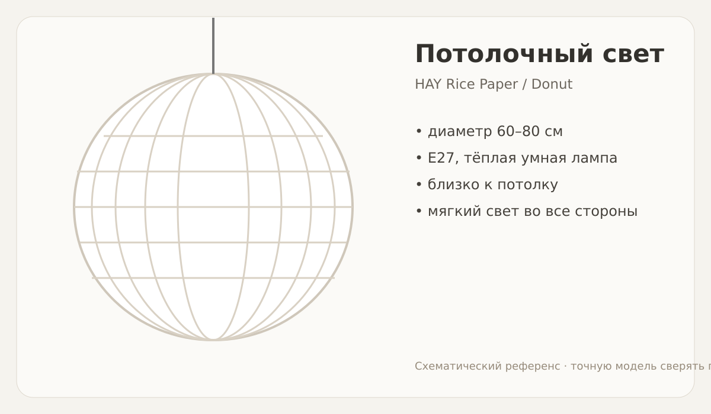
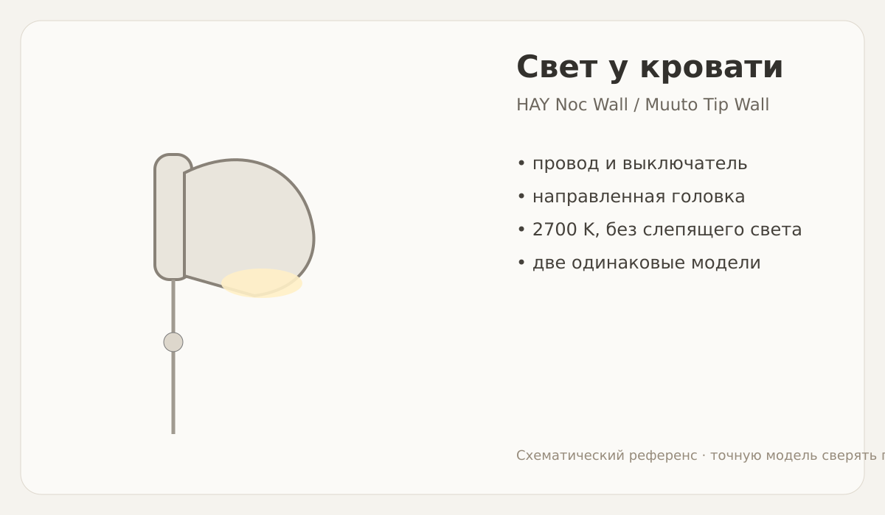
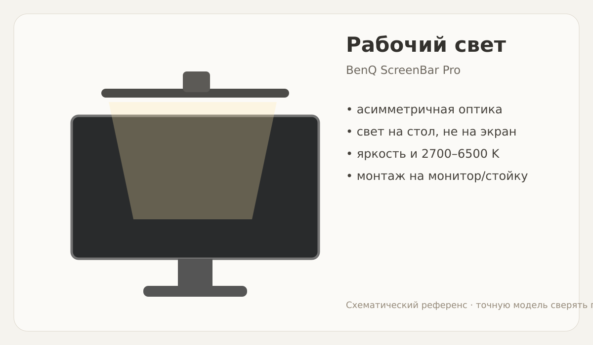
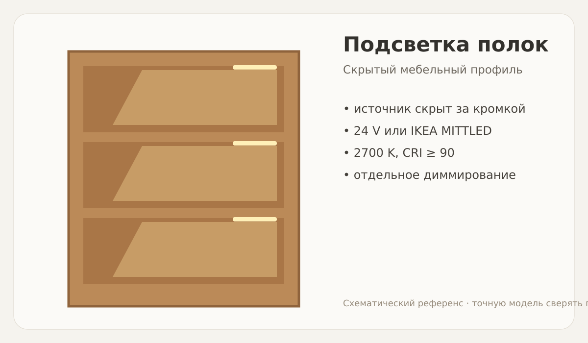
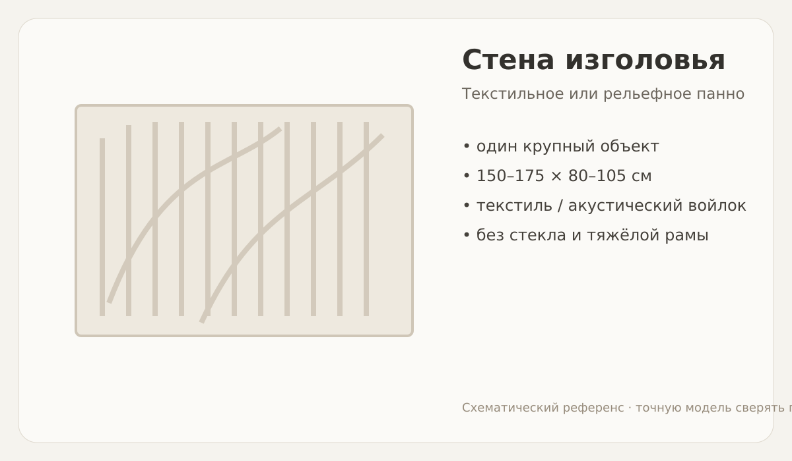
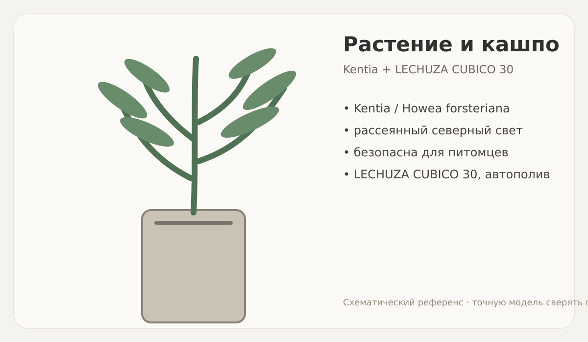

# Дизайн спальни

Проект фиксирует согласованную концепцию спальни площадью около 12,2 м² и служит рабочей спецификацией для закупок и монтажа.

## Что мы сделали

Сохранили реальную геометрию комнаты: существующую деревянную кровать, встроенный белый шкаф с дубовой боковой колонной, письменный стол, окно с белыми шторами и узкий проход около 70 см у стены напротив кровати.

Интерьер собран в направлении **современного скандинавского стиля / мягкого модернизма**:

- светлая спокойная оболочка;
- существующий дуб как основной тёплый материал;
- светлое серо-зелёное покрывало;
- одна выразительная стена у изголовья;
- противоположная стена остаётся визуальной паузой;
- один высокий живой акцент — растение в автополивном кашпо;
- отдельные уровни общего, прикроватного, рабочего и декоративного света;
- никаких открытых LED-лент, RGB-подсветки и светящихся линий ради эффекта.

Решения должны быть серийными и доступными в Германии. Допустима более высокая цена, если предмет качественный, долговечный и не требует изготовления уникальных деталей.

---

## Финальные визуализации

Изображения ниже — согласованные проектные референсы. Они показывают композицию, масштаб и световые сценарии, но не являются строительными чертежами.

<table>
<tr>
<td width="50%"></td>
<td width="50%"></td>
</tr>
<tr>
<td></td>
<td></td>
</tr>
</table>

Показать остальные финальные изображения

<table>
<tr>
<td width="50%"></td>
<td width="50%"></td>
</tr>
<tr>
<td></td>
<td></td>
</tr>
<tr>
<td></td>
<td></td>
</tr>
</table>

---

## Световые сценарии

| Сценарий | Что включено |
|---|---|
| День | Обычно всё выключено. Для работы при необходимости включается только свет над монитором. |
| Работа вечером | Свет над монитором; подсветка полок на 5–15%; потолочный свет выключен или приглушён. |
| Обычный вечер | Потолочный свет 20–40%; одно или два прикроватных бра по необходимости. |
| Чтение | Только соответствующее прикроватное бра. |
| Ночной режим с ребёнком | Одно бра на минимуме или очень слабая подсветка полок; верхний свет выключен. |
| Уборка / полный свет | Потолочный свет на высокой яркости, при необходимости дополнительно рабочий свет. |

Все источники должны иметь тёплый вечерний режим. Полки, потолок, бра и рабочий свет управляются независимо.

---

# Компоненты и рекомендации

## 1. Потолочный светильник

### Функция

Основной мягкий рассеянный свет комнаты и крупный лёгкий объект под потолком.

### Критерии

- диаметр ориентировочно **60–80 см**;
- подвес близко к потолку, чтобы плафон не попадал в поле зрения слишком низко;
- свет должен мягко расходиться вниз, в стороны и частично вверх;
- патрон E27 удобен для замены лампы;
- регулируемая яркость;
- тёплый вечерний диапазон около 2200–2700 K;
- высокий режим яркости для уборки;
- днём светильник остаётся выключенным.

| Вариант | Ориентир по цене | Комментарий |
|---|---:|---|
| [HAY Rice Paper Shade Ø60](https://www.connox.de/kategorien/leuchten/lampenschirme/hay-rice-paper-lampenschirm.html) | около €30–45 без кабеля | Наиболее безопасный масштаб. Лёгкий, нейтральный и не перегружает комнату. |
| [HAY Rice Paper Shade Ø80](https://www.connox.de/kategorien/leuchten/lampenschirme/hay-rice-paper-lampenschirm.html?itm=330341) | около €50–60 без кабеля | Более выразительный вариант. Перед покупкой проверить высоту нижней кромки. |
| [HAY Donut Paper Shade](https://www.connox.de/kategorien/leuchten/lampenschirme/hay-donut-papier-lampenschirm.html) | около €55–90 | Более скульптурная форма, но всё ещё визуально лёгкая. |
| [&Tradition Formakami JH3](https://www.andtradition.com/products/formakami-jh3) | примерно €150–220 | Более законченный дизайнерский объект; заметнее по характеру и дороже. |

**Предварительный выбор:** HAY Rice Paper Ø60 или Ø80 после замера высоты подвеса.

---

## 2. Прикроватные бра

### Функция

Индивидуальный направленный свет для чтения и мягкий локальный вечерний свет без включения потолка.

### Критерии

- две одинаковые модели;
- подключение в розетку, без штробления;
- наружный кабель 2–2,5 м;
- выключатель на корпусе или проводе;
- поворотная головка;
- свет не должен попадать в глаза второго человека;
- компактный корпус без тяжёлой классической формы;
- около 2700 K;
- предпочтительно диммирование либо умная лампа.

| Вариант | Ориентир по цене за штуку | Комментарий |
|---|---:|---|
| [HAY Noc Wall, версия с кабелем](https://www.connox.de/kategorien/leuchten/wandlampen/hay-noc-wall-wandleuchte.html) | около €150–170 | Практичный, живой и достаточно компактный вариант. Штатный провод и выключатель. |
| [Muuto Tip Wall Lamp](https://www.muuto.com/product/Tip-Wall-Lamp--p2207/) | около €130–180 | Более чистая и техническая форма, встроенная регулировка света. |
| [DCW éditions Mantis BS2 Mini](https://www.dcw-editions.fr/en/models/mantis-bs2-mini/) | около €300–400 | Дорогой выразительный вариант; использовать только если его пластика действительно нравится. |

**Предварительный выбор:** HAY Noc Wall в спокойном светлом оттенке.

---

## 3. Рабочий свет над монитором

### Функция

Освещать клавиатуру, мышь и рабочую часть столешницы, не занимая место на столе.

### Критерии

- асимметричная оптика;
- прямой свет не попадает на экран и в глаза;
- регулировка яркости;
- диапазон белой температуры, желательно 2700–6500 K;
- CRI не ниже 90, предпочтительно 95;
- отсутствие заметного мерцания;
- крепление на монитор либо аккуратно на существующую вертикальную стойку;
- питание и кабель уходят по существующей кабельной трассе;
- светильник должен оставаться серийным изделием, без уникальной заказной механики.

| Вариант | Ориентир по цене | Комментарий |
|---|---:|---|
| [BenQ ScreenBar Pro](https://www.benq.eu/de-de/lighting/monitor-light/screenbar-pro.html) | около €139 | Основной кандидат: широкое рабочее пятно, хорошая цветопередача, асимметричный свет. |
| [BenQ ScreenBar Halo 2](https://www.benq.eu/de-de/lighting/monitor-light/screenbar-halo-2.html) | около €180 | Добавляет задний свет на стену. Для этой комнаты не обязателен: белую стену лучше оставить спокойной. |
| [Xiaomi Mi Computer Monitor Light Bar](https://www.mi.com/global/product/mi-computer-monitor-light-bar/) | около €45–70 | Бюджетный вариант. Перед покупкой проверить качество диммирования и совместимость с монитором. |

**Предварительный выбор:** BenQ ScreenBar Pro. Монитор остаётся по центру или немного правее, как в реальности.

---

## 4. Скрытая подсветка открытых дубовых полок

### Функция

Подчеркнуть глубину полок и фактуру дуба, создать очень мягкий вечерний фон.

### Критерии

- сам источник не виден с кровати;
- профиль утоплен в верхнюю плоскость или спрятан за передней кромкой;
- свет сверху вниз, а не вертикальная светящаяся линия;
- 2700 K;
- CRI ≥ 90;
- матовый рассеиватель;
- отдельное диммирование;
- минимальная яркость должна быть действительно слабой;
- никакого RGB.

| Вариант | Ориентир по цене | Комментарий |
|---|---:|---|
| [IKEA MITTLED](https://www.ikea.com/de/de/p/mittled-led-lichtleiste-fuer-arbeitsplatte-dimmbar-aluminiumfarben-30528571/) | около €22 за 60 см + драйвер и кабели | Доступная законченная система: 2700 K, CRI > 90, диммирование. Нужно грамотно спрятать корпус. |
| [Häfele Loox5 24 V](https://www.haefele.de/de/de/info/licht-im-moebel/loox5/152502/) | примерно €120–250 за комплект | Профессиональная модульная система с большим выбором профилей, драйверов и датчиков. |
| [Hera LED](https://www.hera-online.de/en/products/led-lighting/) | примерно €120–250 за комплект | Качественная мебельная система; удобна, если требуется единый готовый комплект. |

**Предварительный выбор:** профессиональный 24 V профиль либо MITTLED, если его можно полностью скрыть. Видим только отражённый свет на дереве.

---

## 5. Панно над изголовьем

### Функция

Главный художественный и тактильный акцент спальни.

### Критерии

- один объект, а не набор мелких рамок;
- ориентировочно 150–175 см шириной и 80–105 см высотой;
- без стекла;
- без тяжёлой массивной рамы;
- текстиль, шерсть, лён, войлок либо спокойный неглубокий рельеф;
- молочная или сложная светлая гамма;
- объект не должен выглядеть как стандартное гостиничное панно.

| Вариант | Ориентир по цене | Комментарий |
|---|---:|---|
| [Kave Home Klis 80 × 100](https://kavehome.com/de/de/p/bild-klis-aus-leinen-mit-geometrischen-formen-weiss-80-x-100-cm) | около €135 | Хороший серийный референс по фактуре, но одного элемента мало по масштабу. |
| [Kave Home Klis 120 × 200](https://kavehome.com/de/de/c/klis) | около €405 | Ближе к нужному масштабу, но 200 см может оказаться чрезмерной шириной. |
| [Arturel — акустические арт-панели](https://arturel.com/) | от нескольких сотен евро | Качественный готовый дизайнерский путь, одновременно улучшает акустику. |
| Заказное текстильное панно | ориентировочно €400–1 000+ | Лучший способ попасть точно в размер, фактуру и оттенок. |

**Предварительный выбор:** одно заказное панно примерно 160 × 90 см. Перед заказом сделать бумажный шаблон на стене.

---

## 6. Растение и автополивное кашпо

### Функция

Единственный вертикальный живой акцент на преимущественно пустой стене напротив кровати.

### Условия

- северное окно;
- яркий рассеянный свет, но почти без прямого солнца;
- комната несколько прохладнее остальных;
- мало места;
- собака не должна иметь доступ к грунту;
- кашпо должно быть устойчивым;
- встроенный резервуар и индикатор воды предпочтительны.

### Растение

| Вариант | Ориентир по цене | Комментарий |
|---|---:|---|
| [Kentia / Howea forsteriana, Pflanzen-Kölle](https://www.pflanzen-koelle.de/kentiapalme-topf-oe-19-cm-hoehe-ca-90-cm-0222300063/) | около €25–40 | Основной кандидат: воздушная, подходит для рассеянного света, считается нетоксичной для собак и кошек. |
| [Kentia в гидрокультуре, Dehner](https://www.dehner.de/product/kentiapalme-howea-forsteriana-hydrokultur-M200014208) | около €130 | Более дорогой, но законченный и удобный вариант с индикатором уровня воды. |
| Chamaedorea elegans | около €20–60 | Более терпима к слабому свету, но выглядит менее архитектурно. |
| Aspidistra elatior | около €25–70 | Самый выносливый вариант, но формирует плотный куст, а не воздушную вертикаль. |

### Кашпо

| Вариант | Ориентир по цене | Комментарий |
|---|---:|---|
| [LECHUZA CUBICO Color 30](https://www.lechuza.de/cubico-color-30-schiefergrau/13138.html) | около €60 | 29,5 × 29,5 × 56,5 см, резервуар и индикатор воды. Лучший баланс размера и устойчивости. |
| [LECHUZA DELTA 30](https://www.lechuza.de/delta-30/) | около €70–100 | Более мягкая округлая форма, но визуально чуть более формальная. |
| Гидрокультурное растение в высоком кашпо | около €150–300 комплектом | Минимум контроля полива, но нужно внимательно выбрать внешний контейнер. |

**Предварительный выбор:** Kentia + LECHUZA CUBICO Color 30 в спокойном матовом оттенке. Отдельная подсветка растения не нужна.

---

## 7. Металлические полки H&M около кровати

Полки уже выбраны и используются вместо тумбочек.

### Требования к монтажу

- верхняя рабочая поверхность примерно в зоне руки лежащего человека;
- не выступать в узкий проход;
- оставить место для телефона, очков и книги;
- зарядный кабель фиксировать по стене тонкими клипсами;
- не загружать полки тяжёлым декором;
- на финальном монтаже проверить, чтобы бра не конфликтовали с полками и изголовьем.

---

## 8. Управление светом

### Минимальный вариант

- потолок: умная E27-лампа с регулировкой яркости и белой температуры;
- бра: собственные выключатели либо совместимые умные лампы;
- полки: отдельный 24 V диммируемый драйвер;
- ScreenBar: собственное управление.

### Варианты систем

| Система | Ориентир по цене | Комментарий |
|---|---:|---|
| [IKEA Home smart](https://www.ikea.com/de/de/cat/smarte-beleuchtung-36812/) | примерно €20–100 | Доступные лампы, пульты и хаб DIRIGERA при необходимости. |
| [Philips Hue White Ambiance](https://www.philips-hue.com/de-de/products/smart-light-bulbs) | примерно €45–150 | Более дорогая, развитая и стабильная экосистема. |
| Обычные локальные диммеры | зависит от драйверов | Наиболее независимый и ремонтопригодный вариант для мебельной подсветки. |

Не обязательно объединять всё в одну систему. Оптика и качество света важнее единого приложения.

---

# Предварительный бюджет

Цены ориентировочные и требуют проверки перед заказом.

| Категория | Диапазон |
|---|---:|
| Потолочный плафон, кабель и умная лампа | €60–220 |
| Два прикроватных бра | €300–800 |
| Свет над монитором | €50–180 |
| Подсветка полок с драйвером и управлением | €100–250 |
| Панно | €135–1 000+ |
| Растение и автополивное кашпо | €85–250 |
| Управление и мелкие монтажные материалы | €30–150 |
| **Итого без уже имеющихся полок H&M и без монтажных работ** | **примерно €760–2 850** |

Рациональный комплект среднего уровня — ориентировочно **€1 100–1 700**. Наибольший разброс создают панно и прикроватные бра.

---

# Что проверить перед покупкой

1. Высоту потолка и желаемую нижнюю отметку бумажного плафона.
2. Точный свободный размер над изголовьем.
3. Положение полок H&M и бра относительно матраса.
4. Толщину монитора и конфигурацию с одним или двумя экранами.
5. Возможность крепления ScreenBar на мониторную стойку без уникальных деталей.
6. Размеры каждой ячейки дубовой полочной колонны.
7. Место для драйвера подсветки и маршрут проводов.
8. Реальную освещённость угла с растением в течение нескольких дней.
9. Устойчивость кашпо при наличии собаки и детей.
10. Возможность вернуть товар после примерки по масштабу и цвету.

---

## Структура папок

- `Исходники/` — исходные панорамы и очищенные опорные изображения.
- `ФИнальные версии/` — согласованные визуализации.
- `IMG/` — схемы и референсы компонентов для этого README.

> Схемы в `IMG` не являются точными чертежами или фотографиями конкретной модели. Названия, размеры и ссылки в таблицах имеют приоритет. Цены проверялись ориентировочно для Германии в августе 2026 года и могут меняться.